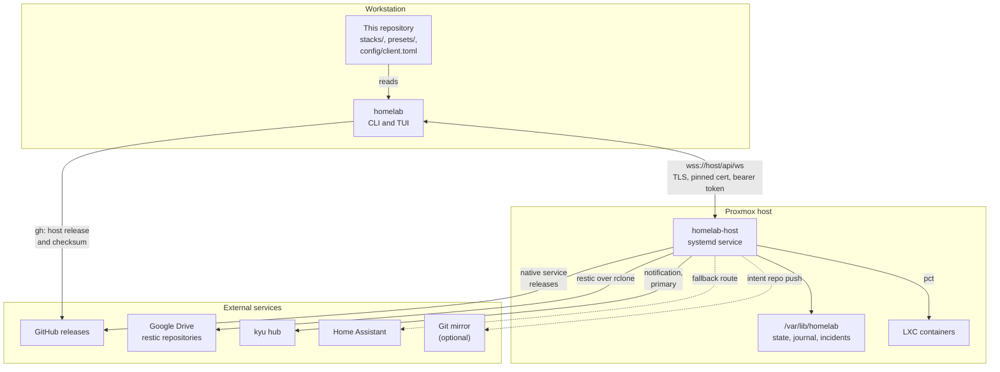
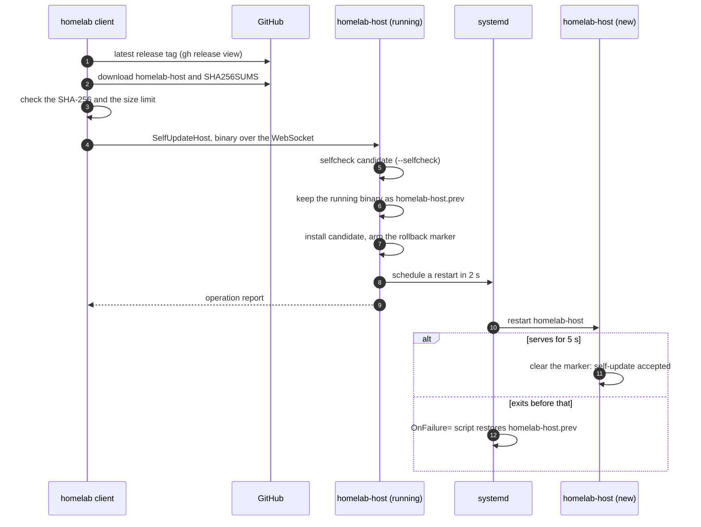

# homelab

A Rust orchestrator for a Proxmox homelab, built as two programs:

- **`homelab`**, the client (crate `homelab-client`, in `client/`): a command
  line and a terminal interface, run on a workstation.
- **`homelab-host`**, the daemon (crate `homelab-host`, in `host/`): runs on
  the Proxmox host, does the work, and runs a nightly schedule on its own.

They talk over one WebSocket connection, `wss://<host>/api/ws`, secured with
TLS and a bearer token. The daemon acts on containers with Proxmox's own `pct`
command; the workspace builds no program that runs inside a container. What
the fleet should look like is written as plain files in this repository:
stacks in `stacks/`, the app catalog in `presets/`.

`Cargo.toml` says version **3.58.10**. Which version the host runs is not
something a file here can know: `homelab ping` asks the daemon and prints its
answer. `homelab apply`, `homelab wipe` and the removals described under
[Stack lifecycle](#stack-lifecycle) were committed after the v3.58.10 tag
(commit `ad03664`); a host built before that does not have them.

## Contents

- [How it fits together](#how-it-fits-together)
- [Getting started](#getting-started)
- [Where the client finds the host](#where-the-client-finds-the-host)
- [Commands](#commands)
- [Stacks and presets](#stacks-and-presets)
- [Safety rails](#safety-rails)
- [The host daemon](#the-host-daemon)
- [What the daemon cannot start without](#what-the-daemon-cannot-start-without)
- [Documentation](#documentation)
- [Repository layout](#repository-layout)
- [Development](#development)

## How it fits together

The client on the workstation is the only thing you touch; everything else is
reached by the daemon on the Proxmox host, over the one pinned link.



<sub>Source: `client/src/main.rs` (connect), `client/src/release.rs`, `core/src/ops/backup.rs` (`restic_base`), `core/src/ops/native.rs` (release check), `notify_raw` and `spawn_mirror_push` in `host/src/main.rs`.</sub>

- **Domain logic lives in `core/`.** Every side effect goes through one
  `Executor` trait (`core/src/executor.rs`), so an operation can be tested
  against a scripted mock (`MockExecutor`) instead of a real Proxmox host.
- **Wire types live in `proto/`**, shared by both programs.
- **One operation at a time.** Every mutating operation on the host takes the
  same lock (`run_mutating_op` in `host/src/main.rs`).
- **Operations are journaled.** Each operation is a sequence of named steps,
  and a journal record is written before each step runs
  (`core/src/runner.rs`). At start-up the daemon reads
  `/var/lib/homelab/journal.jsonl` and names any operation a previous run left
  unfinished.
- **The client checks the daemon's version before it sends anything.** A
  command that changes something is refused when the daemon is older than the
  client, because a daemon that predates a field silently ignores it
  (`client/src/version.rs`). The message ends by naming the fix,
  `homelab release-update`. Read-only commands (`ping`, `status`, `doctor`,
  `incidents`) and the host update itself stay allowed.

## Getting started

### 1. Install the client

From the repository root:

```bash
make install
```

This runs `cargo install --path client` (the binary lands in `~/.cargo/bin`),
creates `~/.config/homelab/`, and copies a repository `.env` to
`~/.config/homelab/env` with mode 0600 if the latter does not exist yet
(`Makefile`, target `install`).

### 2. Give it the token

The client reads `HOMELAB_TOKEN` from the environment, then from
`~/.config/homelab/env`, then from `./.env`. Both files are `KEY=value`; every
`HOMELAB_*` key is read, quotes are stripped, and a value already in the
environment wins (`load_config_env` in `client/src/main.rs`). The token has to
be the one the daemon was given (see [The host daemon](#the-host-daemon)).

Without it, every verb that talks to the host stops before connecting:

```
error: HOMELAB_TOKEN is not set — put HOMELAB_TOKEN=<token> in ~/.config/homelab/env (or export it); it is the token in the daemon's host.toml
```

### 3. Check the link

```bash
homelab ping
```

On success this prints the daemon's version and protocol, and, for `ping`
only, which address was used and where that address came from.

### 4. A first local command

Some verbs never contact the host. `plan` validates a stack with the same
validator the deploy uses. Real output from this tree (colours removed):

```
$ homelab plan stacks/syncthing
✓ valid — syncthing would deploy vmid 108: 1 file(s), 0 env(s)
```

And the preset catalog, read from `presets/` in the current directory:

```
$ homelab presets
actual           512 MiB  Envelope budgeting  [actual]
jellyfin        4096 MiB  Media server (VAAPI)  [jellyfin]
kyu              512 MiB  kyu — durable message hub for your own apps  [kyu]
mealie           512 MiB  Recipes + meal planning  [mealie]
metrics         1024 MiB  Prometheus + cadvisor + pve-exporter  [cadvisor, prometheus, pve-exporter]
recyclarr        512 MiB  Quality profiles for Sonarr and Radarr from the TRaSH guides  [recyclarr]
rust-service    1024 MiB  Your own Rust service + RabbitMQ (template — edit the image first)  [myservice, rabbitmq]
syncthing        512 MiB  Obsidian vault peer  [syncthing]
custom          1024 MiB  Empty stack — add apps later  [no apps]
```

Local verbs read `stacks/`, `presets/` and `docs/` relative to the current
directory, so run them from the repository root.

### 5. Or look around without a host

```bash
homelab tui --offline
```

`--offline` (or `--demo`) runs the terminal interface against a built-in fake
host that serves a made-up fleet and plays a scripted deploy
(`DemoBackend` in `client/src/tui/backend.rs`). No token is needed for it.

## Where the client finds the host

**Address**, first match wins (`client/src/repo_config.rs`):

| Order | Source | Example |
|---|---|---|
| 1 | `HOMELAB_HOST` already in the environment when the command starts | `HOMELAB_HOST=pve:8443 homelab ping` |
| 2 | `host` in `config/client.toml`, searched upward from the current directory the way git finds its root | this repository's copy |
| 3 | `HOMELAB_HOST` from `~/.config/homelab/env` or `./.env` | |
| 4 | the built-in default, `pve:8443` | |

A `config/client.toml` that exists but does not parse is an error, never a
silent fall-through to the next source. Its only keys are `host` and `pin`.

**Certificate pin.** The daemon's certificate is self-signed; trust comes from
its SHA-256 fingerprint. Since fix-149 the client is built with the fleet's
pin, read from `config/client.toml` at compile time (`client/build.rs`), and
trusts that certificate only, on a machine's first connection too: nothing
is trusted on first use and no token goes to a certificate it was not built
for. A machine pin (`~/.config/homelab/pin`) or a repository `pin` that
disagrees with the built-in one is refused with the remedy. A client built
from a tree without a pin behaves as the table below:

| Machine pin | `pin` in `config/client.toml` | Result |
|---|---|---|
| none | set | the repository's pin is saved to the machine and used |
| set | set, equal | used |
| set | set, different | refused before connecting; the message says to check the fingerprint the host printed at boot, or delete `~/.config/homelab/pin` to take the repository's |
| set | none | the machine pin is used |
| none | none | trust on first use: the fingerprint seen is saved, and the client asks you to compare it with the one the daemon printed at boot |

A certificate that does not match the pin ends the connection with
`certificate fingerprint mismatch` and both fingerprints
(`client/src/tls.rs`).

## Commands

`homelab --help` (or `-h` anywhere on the line, or no arguments) prints the
grouped list and does nothing else; `homelab <verb> --help` prints that
verb with one example. That holds for every verb: the check runs before any
argument is read (`wants_help` in `client/src/version.rs`, the text in
`client/src/cli_help.rs`). A mistyped verb exits 2 and names the nearest one.

Every verb exits 1 on failure. A verb that talks to the daemon exits 0 only
when the daemon reports success.

### Verbs that need no token

`help`, `plan`, `runbook`, `update-policy`, `presets`, `export`, `import`,
`new`, `testplan`, `self-install` and `tui --offline`. Everything else stops with
`HOMELAB_TOKEN is not set` and where to put it when there is no token
(`needs_token` in `client/src/main.rs`).

"No token" does not always mean "no network". `plan` and `export` build the
full deploy input, so for a stack with `latch_secrets` they run `latch cat`,
and for a stack with `natives` they fetch each service's release through `gh`
(`build_spec` in `client/src/spec.rs`).

| Command | What it does |
|---|---|
| `homelab plan stacks/<name>` | validate a stack locally and print what a deploy would send |
| `homelab presets` | list the preset catalog |
| `homelab runbook [out.md]` | write the disaster-recovery runbook from `stacks/` (default `docs/DR_RUNBOOK.md`) |
| `homelab update-policy [doc.md]` | regenerate the policy table in `docs/deployment/UPDATE_POLICY.md` from the stack files (default `docs/deployment/UPDATE_POLICY.md`) |
| `homelab export stacks/<name> [out.yml]` | write the stack definition as one YAML bundle; `.env` files are never in it |
| `homelab import <bundle.yml> <new-name> <vmid>` | write a bundle back as a new stack under `stacks/`, renaming its identity, then validate it |

### Stack lifecycle

| Command | What it does |
|---|---|
| `homelab new <name> --preset <p> --vmid <n>` | scaffold `stacks/<name>` from a preset; optional `--ram`, `--cores`, `--disk`, `--swap`, repeatable `--no-data <path>` |
| `homelab deploy stacks/<name>` | validate, then create or reconcile the container, and remove what the stack's files no longer declare (files, units, native services, mounts, an old route); data stays |
| `homelab apply [stacks/] [--dry-run] [--yes] [--no-backup]` | show the per-file plan, ask once, then deploy every stack whose files differ from what the host last applied; a stack still on the host whose directory is gone is destroyed only after you type its name; an `ephemeral: true` stack is left out |
| `homelab backup stacks/<name>` | restic snapshot of the stack |
| `homelab restore stacks/<name> [snapshot]` | restore, `latest` by default |
| `homelab update stacks/<name> [app]` | pull and recreate one app or all, with rollback |
| `homelab resize stacks/<name>` | apply the manifest's memory, cores and disk to the running container |
| `homelab enable <stack>` / `homelab disable <stack>` | take a stack in or out of the nightly schedule; disabling also clears start-on-boot; neither starts nor stops a container (`core/src/ops/enable.rs`) |
| `homelab prune-orphans stacks/<name>` | remove files the repository no longer has, without a deploy; asks you to type the stack name. A deploy already does this |
| `homelab destroy stacks/<name> [--no-backup]` | back up, then destroy; asks you to type the stack name. Works from the manifest the host recorded when the directory is gone |
| `homelab forget <stack>` | for a stack whose container is already gone: drop its record and everything registered for it; touches no container |
| `homelab wipe <stack>[/<app>]` | delete the backups, `/appdata` directories and vault copies a destroyed stack, or a removed app or service, kept; shows the list and asks you to type the name |

What leaves the files leaves the machine, except data: a destroy, a forget or
a removed app keeps its backups, `/appdata` and vault copies, and
`homelab check` lists them as `noted` until `homelab wipe` deletes them
(`core/src/ops/retired.rs`). The full list of what a stack registers and
what removes it is
[docs/deployment/REGISTRATION_SURFACE.md](docs/deployment/REGISTRATION_SURFACE.md).

`backup`, `restore` and `update` read only `lxc-compose.yml`: they need no
secrets on the workstation.

### Native services (own programs run as systemd units instead of container images)

| Command | What it does |
|---|---|
| `homelab adopt stacks/<name>` | take over a hand-built container described by its `service.yml` |
| `homelab install-native stacks/<name>[/<unit>] [<tag> \| --file <path>]` | install a service's binary from its release, or from a local file |
| `homelab backup-native <stack>` / `homelab update-native <stack>` | back up or update an adopted service |
| `homelab release-update-native <stack>` | install the latest release of each service in the stack |

### Fleet and host

| Command | What it does |
|---|---|
| `homelab status` / `homelab doctor` / `homelab incidents` | read-only: the fleet, the host's self-diagnosis, and the incident bundles failed operations left behind |
| `homelab check [stacks/]` | compare the stack files with what runs; says so loudly when it found no stack files and checked only the host's half |
| `homelab checks` / `homelab checks answer <id> ok\|nok [note]` | list, or answer, the checks only a person can do |
| `homelab patch` | apt update and dist-upgrade every managed container, one at a time |
| `homelab guards <vmid>` | apply the runaway guards to a container: log caps, journald limits, logrotate, a weekly prune |
| `homelab exec <vmid> <command...>` | run a command in a container; refused unless `exec_enabled = true` in host.toml |
| `homelab config` | show the nightly hour, notification target and retention tiers |
| `homelab zfs-replicate` | run the ZFS snapshot and replication jobs now |
| `homelab backup-host-meta` | snapshot the daemon's own state now (see [below](#what-the-daemon-cannot-start-without)) |
| `homelab backup-devices` | fetch each configured device's own configuration now |
| `homelab templates` / `homelab template-build [vmid] [ver] [--privileged] [--base <vztmpl>]` | list, or build, golden container templates |
| `homelab release-update [tag]` | download the daemon's release through `gh`, verify its checksum, and ship it to the host |
| `homelab self-update <path>` | ship a locally built `homelab-host` binary to the host |
| `homelab testplan [out.md]` | regenerate `docs/deployment/TEST_PLAN.md` from the test suites |
| `homelab tui` | the terminal interface |

When an operation on the host stops to ask a question, the command line cannot
answer it: it prints the question and the operation times out as unattended.
Run it from the TUI to decide.

### Worked example: a new stack

```bash
cd ~/Projects/homelab
homelab presets                                   # pick one
homelab new notes --preset custom --vmid <free vmid>
homelab plan stacks/notes                         # read the files first, then validate
homelab deploy stacks/notes
```

`new` refuses without `--preset` and `--vmid`, and ends by telling you to read
the generated compose files before running `plan`. The container's hostname is
always `<vmid>-app-<stack>`; the daemon refuses any other.

## Stacks and presets

A stack is a directory under `stacks/`:

| File | Role |
|---|---|
| `lxc-compose.yml` | the intent: vmid, hostname, network, resources, storage, apps. Unknown keys are refused, so a typo cannot silently drop a setting |
| `<app>/docker-compose.yml` and other files | shipped into the container |
| `<app>/checks.yml` | what "healthy" means for that app; stays with the orchestrator |
| `<app>/.env` | the app's secrets; ignored by git (`*.env` in `.gitignore`), never in an export |
| `traefik-routes.yml` | the route written to the gateway, when `gateway_route` is set |
| `service.yml` | a native service: unit, binary, data directories, release repository |

**Secrets from latch.** An app listed under `latch_secrets:` gets its `.env`
from `latch cat <path> --env $HOMELAB_LATCH_ENV --expand`, in memory. A local
`<app>/.env` wins over latch, and every deploy prints where each app's secrets
came from (`client/src/spec.rs`).

**Presets** in `presets/<name>/` are data, not code: a `preset.yml` plus app
directories. [docs/PRESET_GUIDE.md](docs/PRESET_GUIDE.md) explains how to add
one.

## Safety rails

All of these are code; the file named is where each one lives.

- **No-touch list.** VMs and containers 100, 101, 102 and 103 are never
  managed (`DEFAULT_NO_TOUCH` in `core/src/safety.rs`). `no_touch` in
  host.toml can only add to it (`load_config` in `host/src/main.rs`). A deploy
  onto a listed vmid fails with `vmid <n> is on the no-touch list`.
- **Hostname guard.** A deploy is refused when the manifest's hostname is not
  `<vmid>-app-<stack>`, when the vmid is a QEMU VM, or when an existing
  container on that vmid has a different hostname (`core/src/safety.rs`).
- **Typed confirmation.** `destroy`, each destroy inside `apply`, `wipe` and
  `prune-orphans` ask for the name and stop on a mismatch
  (`client/src/main.rs`); the host checks the name again
  (`core/src/ops/destroy.rs`, `core/src/ops/retired.rs`).
- **Nothing automatic deletes kept data.** The restic repositories,
  `/appdata` directories and vault copies of anything removed are deleted
  only by `homelab wipe`, never by a deploy, `apply` or the nightly round
  (`core/src/ops/retired.rs`).
- **Backup before destroy.** Unless `--no-backup` is given, which is announced
  in the transcript (`core/src/ops/destroy.rs`).
- **Remote exec is off by default** and never allowed on a no-touch vmid.
- **Release checks.** `release-update` accepts the daemon's release only when
  its `SHA256SUMS` lists the downloaded binary. The daemon's releases carry no
  signature; that gap is stated in `client/src/release.rs`. Native services
  are stricter: their `SHA256SUMS` must carry a minisign signature from the
  ecosystem release key (`core/src/release_sig.rs`), and an unsigned release
  is refused.
- **Message size.** One message is at most 256 MiB, and the client refuses a
  larger payload before sending it instead of letting the link reset
  (`MAX_WS_FRAME` in `client/src/version.rs`).

## The host daemon

Configuration comes from `/etc/homelab/host.toml` (or the file named by
`HOMELAB_CONFIG`). A missing file is allowed; a file that does not parse stops
the daemon; a key the daemon does not read is warned about by name
(`load_config` in `host/src/main.rs`).

| Setting | Source | Default |
|---|---|---|
| API token | `HOMELAB_TOKEN`, else `token` in host.toml | none: shorter than 16 characters stops the daemon |
| Listen address | `HOMELAB_LISTEN`, else `listen` | `0.0.0.0:8443` |
| State directory | `HOMELAB_STATE_DIR`, else `state_dir` | `/var/lib/homelab` |
| Remote exec | `exec_enabled` | off |
| Backup target | `restic_base` | `rclone:gdrive:homelab-backups` |
| restic password file | `restic_password_file` | `/var/lib/homelab/secrets/restic.pw` |

Besides `/api/ws` it serves `/api/health` and `/api/version`. It tells systemd
when it is ready and feeds the systemd watchdog every 10 seconds. At boot it
sends a `host-online` notification naming any interrupted operation.

**Nightly schedule.** Every 20 minutes the daemon checks the clock. In the
hour set as `backup_hour`, it backs up and auto-updates each enabled stack
whose last backup is more than 20 hours old, snapshots its own state
(host-meta), runs the ZFS jobs and device-config fetches when configured, and
rehearses one restore when a drill is due (`nightly_plan` in
`host/src/main.rs`). A stack whose nightly backup or update fails is disabled so it does
not fail every night; re-enable it with `homelab enable <stack>`. A deferred
backup does not count as a failure.

**Updating the daemon.** `homelab release-update` and `homelab self-update`
both end in the same host operation (`core/src/ops/selfupdate.rs`): the new
binary must answer `--selfcheck`, the running one is kept as
`/usr/local/bin/homelab-host.prev`, a rollback marker is armed, and the
service restarts. The new binary clears the marker only after five seconds of
serving; if it never gets there, systemd's `OnFailure=` script restores the
previous binary.

The whole `homelab release-update` path, from the GitHub release to an
accepted or rolled-back daemon:



<sub>Source: `client/src/release.rs:14-60`, `self_update` (`core/src/ops/selfupdate.rs:51-125`), marker clearing (`host/src/main.rs:1882-1891`); the `OnFailure=` unit lives on the host, not in this repository.</sub>

## What the daemon cannot start without

| Item | Loaded from | If it is gone | Copies the code keeps |
|---|---|---|---|
| API token | host.toml `token` or `HOMELAB_TOKEN` | the daemon exits at start | host.toml is in every host-meta snapshot; the client holds the same value in `~/.config/homelab/env` or `./.env` |
| TLS certificate and key | `/var/lib/homelab/tls-cert.pem`, `tls-key.pem` | the daemon makes a new pair at start without a warning, so the fingerprint changes and every pinned client refuses it | in every host-meta snapshot |
| restic password | `/var/lib/homelab/secrets/restic.pw` | no backup or restore can run | inside the host-meta snapshot, which is encrypted with this same password, so a copy kept off the host is the only way back |

The host-meta snapshot (`backup_host_meta` in `core/src/ops/backup.rs`) holds
`/var/lib/homelab/secrets`, `state.json`, both TLS files, the intent repository
`/var/lib/homelab/repo`, `/etc/homelab/host.toml`, and the SMART collector
files when they exist. It goes to the restic
repository `<restic_base>/host-meta-config`, every night and on
`homelab backup-host-meta`.

To put a lost TLS pair back so pinned clients keep working (Proxmox host,
root; the restic password file must be in place first; use host.toml's
`restic_base` if it overrides the default):

```bash
export RESTIC_REPOSITORY=rclone:gdrive:homelab-backups/host-meta-config
export RESTIC_PASSWORD_FILE=/var/lib/homelab/secrets/restic.pw
restic snapshots
restic restore latest --target / \
  --include /var/lib/homelab/tls-cert.pem --include /var/lib/homelab/tls-key.pem
systemctl restart homelab-host
```

The daemon only generates a pair when either file is missing
(`host/src/tls.rs`), so after the restore it serves the old certificate again.
The full recovery procedures, including the restic password, are in
[docs/OPERATIONS_RUNBOOK.md](docs/OPERATIONS_RUNBOOK.md) and
[docs/DR_RUNBOOK.md](docs/DR_RUNBOOK.md).

## Documentation

| Document | Answers |
|---|---|
| [docs/USER_GUIDE.md](docs/USER_GUIDE.md) | how do I use each feature? (keyed to feature IDs) |
| [docs/OPERATIONS_RUNBOOK.md](docs/OPERATIONS_RUNBOOK.md) | what is the recurring work, and where are the credentials? |
| [docs/DEBUGGING_GUIDE.md](docs/DEBUGGING_GUIDE.md) | something failed; now what? |
| [docs/DR_RUNBOOK.md](docs/DR_RUNBOOK.md) | everything is down; generated by `homelab runbook` |
| [docs/PRESET_GUIDE.md](docs/PRESET_GUIDE.md) | how do I add an app to the catalog? |
| [docs/LLM_COMPOSE_CONVERSION.md](docs/LLM_COMPOSE_CONVERSION.md) | instructions for converting a vendor compose file into a preset |
| [docs/LLM_SERVICE_ADOPTION.md](docs/LLM_SERVICE_ADOPTION.md) | instructions for adopting a hand-built service |
| [docs/TEST_PLAN.md](docs/TEST_PLAN.md) | per-feature test steps, offline and live |
| [docs/ARCHITECTURE_REFERENCE.md](docs/ARCHITECTURE_REFERENCE.md) | how it is built, for a maintainer |
| [docs/DEVELOPMENT.md](docs/DEVELOPMENT.md) | gates, hooks, releases |

Design record: [docs/SCOPE.md](docs/SCOPE.md),
[docs/FEATURES.md](docs/FEATURES.md) (feature IDs),
[docs/ARCHITECTURE_DECISIONS.md](docs/ARCHITECTURE_DECISIONS.md),
[docs/REALIZATION_PLAN.md](docs/REALIZATION_PLAN.md),
[docs/RETROSPECTIVE.md](docs/RETROSPECTIVE.md).

**The deployment project**, which brings the existing containers under the
orchestrator one at a time, keeps its own documents in `docs/deployment/`.
Start at [docs/deployment/RESUME.md](docs/deployment/RESUME.md); every
decision and finding is numbered in
[docs/deployment/REGISTER.md](docs/deployment/REGISTER.md).

Finished and pre-rewrite documents: [docs/legacy/README.md](docs/legacy/README.md).

## Repository layout

```
core/         domain logic; every side effect through the Executor trait
proto/        wire types for the client-daemon connection
host/         the daemon: config, TLS, WebSocket server, nightly schedule
client/       the homelab CLI and TUI
tui-preview/  a standalone TUI mockup on simulated data (see its README)
stacks/       stack definitions (app .env files are not committed)
presets/      the app catalog
templates/    rust-service: building your own Rust service as a homelab app
config/       client.toml: the daemon's address and certificate pin
scripts/      drills and helper scripts
docs/         see Documentation
```

## Development

Once per clone, wire the git hooks. `core.hooksPath` is local git config, so a
clone never carries it:

```bash
make hooks        # git config core.hooksPath .githooks
```

With the hooks wired, `pre-commit` refuses a commit when the secret check or
the gates fail: formatting, clippy with warnings denied, and the test suite.
The suite is skipped when no `*.rs`, `Cargo.toml` or `Cargo.lock` changed
since its last green run on this machine, except on the first commit of the
day (`.githooks/gate-cache.sh`). `commit-msg` refuses a message without an ID
in brackets such as `[meta]`. `git commit --no-verify` bypasses
both on purpose.

```bash
make gate                    # cargo fmt --check, clippy -D warnings, cargo test
make release VERSION=x.y.z   # gate, stamp the version, commit, tag, push
make release VERSION=x.y.z DRY=1   # the pre-flight checks only, nothing tagged or pushed
homelab release-update       # afterwards: roll the published release out to the host
```

`make release` refuses a dirty tree, a branch other than `main` and an
existing tag, then runs `cargo deny` (advisories), gitleaks (the whole
history) and the MSRV check. `DRY=1` stops there, before the gate runs.
Otherwise it runs the full gate, tags, builds `homelab-host`, `homelab`,
`homelab-admin` and `SHA256SUMS` in `rust:1-bookworm` on this machine,
pushes and publishes the GitHub Release. GitHub Actions runs nothing for
this repository (Kenny, 2026-09-29); `make check` gives the verdict CI used
to give. The toolchain is pinned in
`rust-toolchain.toml`.

More in [docs/DEVELOPMENT.md](docs/DEVELOPMENT.md).

## License

MIT OR Apache-2.0 (`LICENSE-MIT`, `LICENSE-APACHE`).
