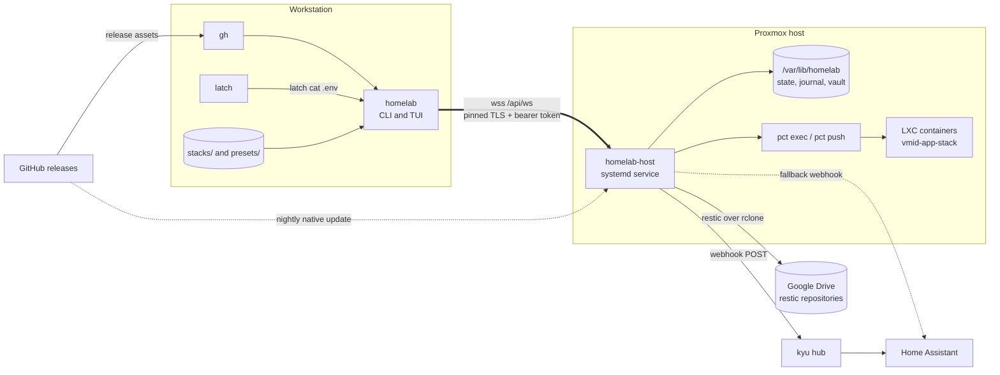
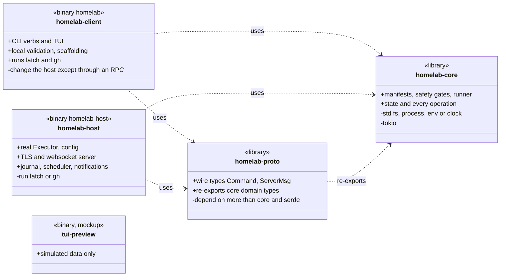
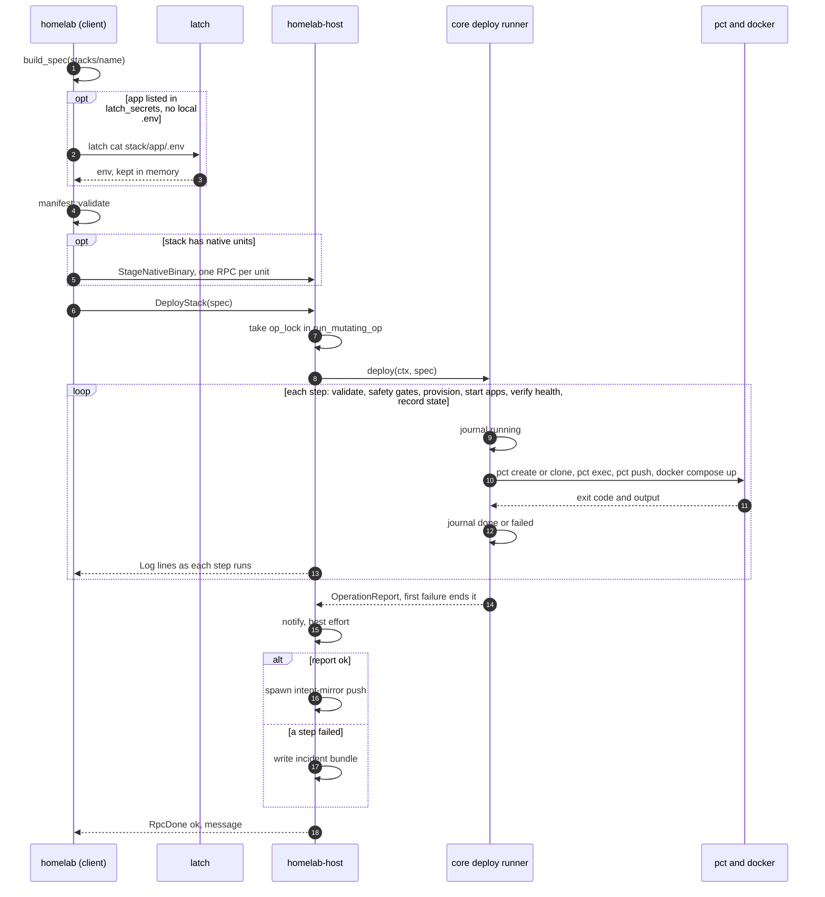
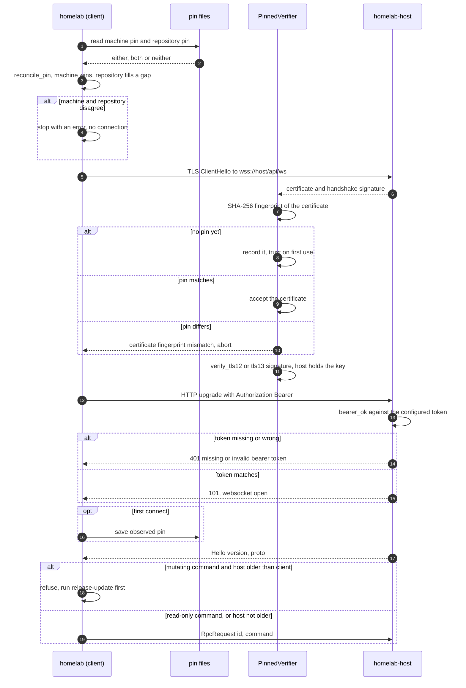
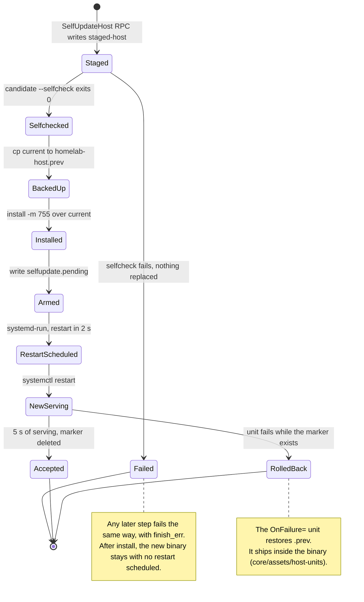

# Architecture reference

For the maintainer who comes back after months. Every statement names the
file and line that makes it true; the reasons live in
[ARCHITECTURE_DECISIONS.md](ARCHITECTURE_DECISIONS.md) (AR1 to AR19). Read at
v3.58.2 (`Cargo.toml:6`) on 2026-09-27; the commands behind the numbers are at
the end. The paragraph "Declarative registration" in section 3 and the rows
that mention `apply`, `wipe` or retired data were added at commit `ad03664`
(after v3.58.10) and cite that commit.

## 1. Shape

```
workstation                                         Proxmox host
homelab (crate client) --- wss://<host>/api/ws ---> homelab-host (crate host, systemd)
  reads stacks/, runs latch and gh                    runs pct, restic, git, curl
  pins the TLS cert, sends a bearer token             state under /var/lib/homelab
```

The same shape with everything the two binaries talk to: one line between
them, and each side reaches its own services; arrows follow the data.


<sub>Source: `client/src/main.rs`, `client/src/spec.rs`, `client/src/release.rs`, `host/src/main.rs`, `core/src/ops/backup.rs`, `core/src/ops/native.rs`.</sub>

- Five workspace members (`Cargo.toml:3`); the release builds only
  `homelab-host` and `homelab` (`.github/workflows/release.yml:26`).
  `tui-preview` is a mockup on simulated data (`tui-preview/Cargo.toml:5`).
- Containers are reached only through `pct exec` (`core/src/executor.rs:161-174`)
  and `pct push` of a staged file (`core/src/ops/util.rs:99-107`).
- Frames are bare JSON: the host opens with `ServerMsg::Hello`
  (`host/src/main.rs:2707-2716`), the client answers with an `RpcRequest`
  (`client/src/main.rs:1160`). The `Envelope {v, topic, id, payload}` in
  `proto/src/lib.rs:370-377` is defined and used by neither binary.
- Version skew: the client refuses a mutating command to a host older than
  itself and tells you to run `homelab release-update` first
  (`client/src/main.rs:1203-1212`).

## 2. Crates: what each may and may not do

| Crate | May | May not |
|---|---|---|
| `core` | decide everything: manifests, safety gates, runner, state, operations (`core/src/lib.rs:1-7`) | touch the world itself. Dependencies: serde, thiserror, async-trait, sha2, minisign-verify (`core/Cargo.toml:8-15`); no `std::fs`, `std::process`, `std::env`, `SystemTime` or `tokio::` in `core/src`. Time arrives as `OpCtx.now_unix` (`core/src/ops/mod.rs:98-99`) |
| `proto` | wire types, re-exporting core's domain types (`proto/src/lib.rs:11-16`) | depend on more than core and serde (`proto/Cargo.toml:8-11`) |
| `host` | the real `Executor` (`host/src/main.rs:1518-1585`), config, TLS and websocket server, journal, scheduler, notifications | run `latch` or `gh` (neither occurs in `host/src`) |
| `client` | CLI verbs, TUI, local validation, scaffolding; the only crate that runs `latch` (`client/src/spec.rs:375`) and `gh` (`client/src/release.rs:15`) | change the host except through an RPC |

The dependency arrows point one way, towards `core`; `+` is what a crate
may do and `-` what it may not.


<sub>Source: `core/Cargo.toml`, `proto/Cargo.toml`, `host/Cargo.toml`, `client/Cargo.toml`, `tui-preview/Cargo.toml`.</sub>

Not every decision sits in core: the nightly plan is a pure function in the
host (`nightly_plan`, `host/src/main.rs:1967`), tested there (`:1237`).

## 3. Load-bearing patterns

**Executor (AR2).** `run`, `write_file`, `read_file`, `sleep_ms`
(`core/src/executor.rs:58-73`); `run` is `Ok` on a non-zero exit and the
caller decides (`:60-63`). `MockExecutor` records calls and timeouts and
models `pct push`, `pct set/create/clone`, `docker compose up/down` and
`sha256sum` read-back (`:181-459`). `TracingExecutor` emits `[run ]` lines
and cuts output lines at 300 bytes (`:79-145`). 313 test attributes sit in
the 18 files that name `MockExecutor`.

**Runner and `step!` (AR3).** `Runner::step` journals `running` before the
body and `done` or `failed` after (`core/src/runner.rs:76-106`).
`step_verified` re-reads the world after a `Changed` step and fails with "the
step reported success but the change is not there" (`:123-157`). Each op
file has its own `step!` that returns `finish_err` on the first failure (e.g.
`core/src/ops/selfupdate.rs:16-23`); deploy's also marks the stack
half-deployed (`core/src/ops/deploy.rs:20-31`). `CoreError::Deferred` is
reported as deferred, not failed (`core/src/runner.rs:170-189`).

**Serial mutations (AR12).** One `op_lock` (`host/src/main.rs:1667`), taken
in `run_mutating_op` (`:2944`); the nightly round takes it once and runs its
backups side by side inside it (`:2155`).

A deploy puts these patterns in order: the client assembles the spec, the
host serialises it behind the lock, and core's runner drives `pct` one
journalled step at a time.


<sub>Source: `client/src/main.rs` (verb `deploy`), `client/src/spec.rs`, `host/src/main.rs` (`run_mutating_op`, `run_op_locked`), `core/src/ops/deploy.rs`, `core/src/runner.rs`.</sub>

**Failure capture (AR13, AR14, AR16).** A failed op writes
`<state_dir>/incidents/<ts>-<op>/`: `report.json`, `events.jsonl`,
`commands.sh`, `state-at-failure.json`, the last 200 journal lines,
`versions.txt` (`core/src/incidents.rs:56-110`, called at
`host/src/main.rs:3041`). At boot every op whose last journal record is
`running` is logged as interrupted (`core/src/incidents.rs:117-137`,
`host/src/main.rs:1780-1790`).

**Safety gates (A1, A2, A6).**
- No-touch: compiled `DEFAULT_NO_TOUCH = [100, 101, 102, 103]`
  (`core/src/safety.rs:21`); `host.toml` can add vmids, never remove them
  (`host/src/main.rs:444-456`, test at `:838`).
- Hostname: a target must be `<vmid>-app-<stack>` live. Deploy checks before
  creating and refuses any QEMU VM on the id (`core/src/safety.rs:42-89`);
  backup, update, enable and the native ops call `guard_target`
  (`core/src/ops/mod.rs:42-77`); destroy and resize repeat both checks
  (`core/src/ops/destroy.rs:70-98`, `core/src/ops/resize.rs:53-74`).
- Remote exec is off unless `exec_enabled = true` (`host/src/main.rs:430`,
  `core/src/safety.rs:114-131`); each call is appended to
  `<state_dir>/audit.log` first, best effort (`host/src/main.rs:3933-3947`).
  The exec path checks the daemon's configured list (`exec_allowed`,
  fix-36), so vmids `host.toml` added are refused too; it has no hostname
  guard, because it names a vmid rather than a stack. `homelab patch` and
  requested guards run the hostname guard since gap-33.
- Host policy (fix-120): a deploy refuses a privileged container on a vmid
  not in `privileged_vmids`, and a `data_mounts:` path outside
  `data_mount_roots` (whole path components; a `.` or `..` component is
  refused). Both live in `host.toml`, which no RPC changes; without the keys
  the daemon uses what the fleet ran on 2026-09-27, `[105, 106]` and the four
  data-mount directories (`core/src/safety.rs`, `check_host_policy`).
- The token: compared as SHA-256 digests (constant time). Every refusal is a
  `warn` line `401 on <path> from <peer>`, counted since start and shown by
  `homelab doctor` as `refused connections` (fix-120).

**State (AR4).** `state.json` has `schema_version` (`core/src/state.rs:12`).
Missing file: empty fleet. Unparseable: copied to `state.json.corrupt` and
refused. Newer schema: refused (`:198-223`). The real `write_file` writes
`<path>.tmp` (created with its final mode since fix-37), fsyncs, sets the
mode, renames (`host/src/main.rs`, `write_file`);
the mode comes after the content, so a 0600 file briefly has the default
mode. The TLS key avoids that by creating with 0600 (`host/src/tls.rs:32-43`).

**Fail direction.** Operations fail closed: the first failed step ends them.
Notification and the intent-mirror push run after the op and cannot fail it
(`host/src/main.rs:3002-3004`, `:2754-2765`). A `host.toml` that does not
parse stops the daemon; unknown keys are warned about by name (`:369-396`).

**Declarative registration (step-21, step-22, ask-8, ask-9).** What the
files declare is added; what leaves them is removed; data is kept until a
person wipes it. Three mechanisms carry that, and a new registration has to
join all three:

- *A deploy knows what left.* It reads the stack's previous record
  (`prior`, `core/src/ops/deploy.rs:276-297`) and the intent repo's copy of
  the files before overwriting it, and removes the difference: `rootfs/`
  files and dropped native units (step `retire dropped`, `:1044-1189`),
  repo files (`:1195-1220`), an old route file (`:1937-1986`), orphan files
  under `/opt/<stack>/` (`:2104-2143`, with `generated_dirs` keeping the
  gateway's generated directories out, `:146-158`), undeclared mounts
  (`:782-848`).
- *Destroy and forget share one `unregister`* (`core/src/ops/destroy.rs:207-332`):
  metrics target, dashboard, route, state record and manual checks, then the
  fleet-wide files rendered again from what remains
  (`core/src/ops/fleetfiles.rs:236-271`). `destroy_recorded` (`:414-446`)
  runs the ordinary destroy from the manifest in state, so `homelab apply`
  (`client/src/apply.rs`, `client/src/main.rs:704-827`) can remove a stack
  whose directory is gone with every gate intact.
- *Data is recorded, not deleted.* `HostState.retired`
  (`core/src/state.rs:158-204`) names each retired stack, app or unit's
  repositories, `/appdata` paths and vault paths; the fleet check shows each
  as `Noted` (`core/src/ops/retired.rs:190-219`); only `wipe`
  (`:363-468`), behind a typed name and path checks (`wipe_plan`,
  `:260-355`), deletes them. `DestroyRecorded` and `WipeRetired` are
  command-line only (`CLI_ONLY` in `client/tests/tui_snapshot_tests.rs`).

The Uptime Kuma seeder follows the same rule outside the Rust code: it
removes every monitor no file declares, with a refusal when more than a
quarter would go at once (`plan_owned`, `stacks/uptime/kuma-seeder/seed.py:241-264`).
The full surface, one row per registration, is
[deployment/REGISTRATION_SURFACE.md](deployment/REGISTRATION_SURFACE.md).

**Presets are data.** `presets/<name>/` holds `preset.yml` and app
directories (10 presets). The scaffolder derives the manifest's `storage:`
from every `/appdata/` bind in the compose files, so a data path is written
in one place (`client/src/scaffold.rs:473-500`). Default swap is
`clamp(RAM / 4, 512, 2048)` MB (`:79-81`, `:91-93`).

## 4. Trust and secrets

**The line.** The daemon generates a self-signed certificate once into
`<state_dir>/tls-cert.pem` and `tls-key.pem` and prints its fingerprint at
every boot (`host/src/tls.rs:16-54`, `host/src/main.rs:1837-1843`). The CLI
pins: `~/.config/homelab/pin` wins, the `pin` in the repository's
`config/client.toml` fills an empty machine, a disagreement stops with an
error, and with neither the first certificate seen is trusted and saved
(`client/src/repo_config.rs:139-167`, `client/src/main.rs:1100-1120`). The
TUI uses the machine pin only (`client/src/tui/backend.rs:66`). Every
websocket upgrade needs `Authorization: Bearer <token>`
(`host/src/main.rs:2684-2690`).

The pin compares the certificate the server presents, and since v3.58.3
(fix-34) `verify_tls12_signature` and `verify_tls13_signature` check the
handshake signature with rustls' own verifiers over the aws-lc-rs
algorithms (`client/src/tls.rs`), so the server must hold the certificate's
key. Before that fix both returned valid without checking, and an impostor
replaying the public certificate passed the pin.
`client/tests/tls_pin_tests.rs` runs a real handshake against such an
impostor.

Three checks stand between the CLI and a command reaching the host: the pin,
the handshake signature, and the bearer token; the version check after
`Hello` decides whether a mutating command is sent at all.


<sub>Source: `client/src/repo_config.rs` (`reconcile_pin`), `client/src/tls.rs`, `client/src/main.rs` (connect and `Hello` arm), `host/src/main.rs` (`ws_upgrade`, `bearer_ok`, `ws_session`).</sub>

**What the host trusts.** `homelab self-update` and `homelab install-native`
send a base64 binary, and all verification is the client's:
`homelab release-update` checks the host binary against `SHA256SUMS` only,
and says so (`client/src/release.rs:57-62`; `release.yml:32` publishes no
signature); `install-native` from a release also requires
`SHA256SUMS.minisig` signed with the ecosystem key
(`client/src/release.rs:79-169`, `core/src/release_sig.rs:10-40`);
`install-native --file` checks nothing (`client/src/main.rs:243-250`). The
host only runs the candidate with `--selfcheck`
(`core/src/ops/selfupdate.rs:60-73`), which prints the version and exits
(`host/src/main.rs:1753-1756`). Whoever holds the token can install a root
binary on the host. The host's own check is the nightly native update: it
skips an unsigned release and verifies a signed one
(`core/src/ops/native.rs:982-1030`).

**Stack secrets.** The client fills each app's env from a local `.env` or
from `latch cat <stack>/<app>/.env --env $HOMELAB_LATCH_ENV --expand`, in
memory, and prints where each came from (`client/src/spec.rs:316-414`). The
deploy pushes it to `/opt/<stack>/<app>/.env` (mode 600) and keeps a vault
copy at `<state_dir>/secrets/<stack>/<app>.env` (0600; a native unit's file
at `<stack>/<parent dir>/<name>` since fix-37); an app the client
sent nothing for gets the vault copy back
(`core/src/ops/deploy.rs:1443-1480`). The intent repo gets files, not env
(`:1192-1224`). Vault copies outlive the app, unit or stack they belong to
until `homelab wipe` (`core/src/ops/retired.rs:1-15`). The `pct push` staging file is 0600 and removed after the push
(`core/src/ops/util.rs:99-122`).

**Credentials in argv.** `/proc/<pid>/cmdline` is world-readable. The device
backup gives curl its credential file with `-K`
(`core/src/ops/devicebackup.rs:44-56,148-153`); the Grafana read pipes it to
`curl -K -` (`core/src/ops/facts.rs:189-196`); a registry token goes to
`--password-stdin` (`core/src/ops/deploy.rs:1196-1200`). The guard,
`core/tests/argv_secret_tests.rs` (fix-32), scans `core/src`, `host/src`,
`client/src`, `stacks` and `presets` for one shape: `curl -u "$..."` or
`--user "$..."`. The notification bearer goes through a 0600 header file
read with `curl -H @<file>` since v3.58.3 (fix-35,
`homelab_core::notify::curl_args`, tested in
`core/tests/notify_argv_tests.rs`); before that it was in curl's argv.

**If a credential is gone.**

| Credential | Read from | Copies the code makes | When it is gone |
|---|---|---|---|
| API token | `token` in `/etc/homelab/host.toml` or `HOMELAB_TOKEN` (`host/src/main.rs:371,404-407`); client: environment, `~/.config/homelab/env`, `./.env` (`client/src/main.rs:49-88`) | `host.toml` is in the host-meta snapshot (`core/src/ops/backup.rs:989,1056-1063`) | the daemon exits with "FATAL: token must be set (>=16 chars) via ... or HOMELAB_TOKEN" (`host/src/main.rs:408-414`); any string of 16 or more characters, set on both sides, works |
| TLS cert and key | `<state_dir>/tls-*.pem` | host-meta snapshot (`backup.rs:973-974`) | a new pair is generated at start without a warning (`host/src/tls.rs:21`); pinned clients refuse with "certificate fingerprint mismatch" (`client/src/tls.rs:58-61`) |
| restic password | `restic_password_file`, default `/var/lib/homelab/secrets/restic.pw` (`backup.rs:128`) | only inside the host-meta snapshot, encrypted with this same password (`backup.rs:971,1056-1066`) | no backup or restore runs, and no copy the code makes can open itself. The out-of-band copy is an operations matter: OPERATIONS_RUNBOOK.md asks for an offline copy of `restic.pw` |
| stack `.env` | latch or a local file on the workstation | container `.env`, host vault (kept after the app or stack is gone, until `homelab wipe`), host-meta snapshot | a redeploy re-seals from the client or restores from the vault (`deploy.rs:1443-1480`) |

**Precondition for any future key-escrow step (gap-15).** The latch project
reported that a separate `LATCH_HOME` does not isolate the OS keyring:
`latch key backup` under a scratch home still swept the real credential out
of the shared keyring into the scratch escrow (REGISTER F238, gap-15). An
escrow step on the host must refuse to run on a machine that holds other
latch keys until latch decides otherwise. No such step exists: the only
latch call in the workspace is the client's `latch cat`
(`client/src/spec.rs:375`).

## 5. Self-preservation

- **Self-update (H5).** Steps `selfcheck candidate`, `backup current` (to
  `/usr/local/bin/homelab-host.prev`), `install candidate`,
  `arm rollback marker` (`/var/lib/homelab/selfupdate.pending`),
  `schedule restart` via `systemd-run` two seconds later
  (`core/src/ops/selfupdate.rs:39-121`). The new daemon deletes the marker
  after five seconds of running (`host/src/main.rs:1851-1859`).
- **Rollback.** Putting `.prev` back while the marker exists is the job of a
  systemd `OnFailure=` unit (`selfupdate.rs:4-7`). That unit and
  `homelab-host.service` are in neither this repository nor the host-meta
  snapshot (`backup.rs:1001-1005,1056-1063`).

The update as states: the marker is what separates an accepted binary
from one the `OnFailure=` unit puts back.


<sub>Source: `core/src/ops/selfupdate.rs`, `host/src/main.rs` (`Rpc::SelfUpdateHost`, marker cleared after 5 s).</sub>
- **Watchdog (B7).** `READY=1`, then `WATCHDOG=1` every 10 seconds
  (`host/src/main.rs:1862-1868`); nothing is sent when `NOTIFY_SOCKET` is
  unset (`:1734-1747`). Whether systemd enforces it depends on the unit on
  the host.
- **Boot.** Three seconds after start a `host-online` notification carries
  the version and any interrupted operations (`host/src/main.rs:1792-1812`).

## 6. Native services and signed releases

A native service is a bare binary under systemd in its own container,
described by `service.yml` (`core/src/native.rs:1-6,24-60`). Install steps:
`guard target`, `preserve previous binary` (to `<binary>.homelab-prev`; the
install refuses when the copy fails), `stage binary` beside the target, a
glibc check, the unit file, `activate`. A service not active after five
checks is rolled back to the preserved binary, or left stopped on a first
install (`core/src/ops/native.rs:265-450`). A deploy installs a binary where
there is none and never replaces one (fix-28,
`core/src/ops/deploy.rs:2138-2150`). `update_policy` defaults to `manual`;
`auto` lets the nightly round install new releases (`core/src/native.rs:10-23`).
Verification: `SHA256SUMS.minisig` over `SHA256SUMS` with the compiled
`RELEASE_PUBKEY`, then the binary against `SHA256SUMS`
(`core/src/release_sig.rs:10-40`).

## 7. Decisions, and where the code stands

| AR | Decision | In the code |
|---|---|---|
| AR1 | crates proto, core, host, client | section 2 |
| AR2 | Executor trait | `core/src/executor.rs:58-73` |
| AR3 | step pipelines, one runner | `core/src/runner.rs` |
| AR4 | typed JSON, schema version, atomic writes | `core/src/state.rs`, `host/src/main.rs:1549-1570` |
| AR5 | envelope `{v, topic, id, payload}` | type defined, not used on the wire (section 1) |
| AR6 | Elm-style TUI over `Backend` | `client/src/tui/backend.rs:33,40,173`; `update` at `client/src/tui/model.rs:389` |
| AR7 | `OperatorError` what, why, remedy | `core/src/error.rs:41-45` |
| AR8 | templates via minijinja | no crate depends on minijinja |
| AR9 | hard CI gates | `ci.yml:29-42`: fmt, clippy `-D warnings`, tests |
| AR10 | tagged releases with sha256 | `release.yml:1-40`, no signature |
| AR11 | TOML config, YAML manifests | `host/src/main.rs:369-396`; `client/src/spec.rs:54-56` |
| AR12 | serial mutations | `host/src/main.rs:1667,2944` |
| AR13 | journal names interrupted ops | `core/src/incidents.rs:117-137` |
| AR14 | incident bundle per failure | `core/src/incidents.rs:56-110` |
| AR15 | journald plus a JSONL ring | stderr only (`host/src/main.rs:1758-1763`); no ring found |
| AR16 | frame capture, `commands.sh` replay | replay yes (`core/src/incidents.rs:39-52`); no frame-capture toggle found |
| AR17 | dependency policy | a process rule |
| AR18 | MSRV 1.88 with its own CI job | `Cargo.toml:7` says 1.88; builds use 1.97 (`rust-toolchain.toml:13`); `ci.yml` has one job, `check` (`:17`), while its comment says branch protection requires an `msrv` context (`:6-9`) |
| AR19 | MIT OR Apache-2.0 | `Cargo.toml:8`, both license files |

Looks wrong, is deliberate:
- **RAM past 100 %.** The main gauge is RAM in use; the sum of limits is
  context and is expected to exceed physical RAM
  (`client/src/tui/view/dashboard.rs:52-63`).
- **Bootstrap runs over golden-template clones.** The bootstrap is the source
  of truth; a template only makes it do nothing (`core/src/ops/template.rs:1-5`).
- **The shell tab is not a PTY.** It is a REPL over the audited exec
  (`client/src/tui/model.rs:267`).
- **Devices apply at create only.** GPU and TUN are set in the create path
  (`core/src/ops/deploy.rs:662-677`); an existing container gets its mounts
  reconciled, not its devices (`:681-700`).
- **`exec_enabled` is not remote.** The client can change backup hour,
  webhook and retention (`proto/src/lib.rs:239-246`); `exec_enabled`,
  `privileged_vmids` and `data_mount_roots` are edited in `host.toml`.

## 8. Where to add things

| You want | Touch |
|---|---|
| an operation | `core/src/ops/<name>.rs` (Runner, guards), a `Command` variant (`proto/src/lib.rs:22`), a host arm through `run_mutating_op` if it mutates, a client verb, `MockExecutor` tests |
| a registration outside the container (a file on another machine, a list entry) | the deploy step that adds it, its removal in `unregister` (`core/src/ops/destroy.rs:207`), a removal in the deploy when the stack file can drop it, a row in `docs/deployment/REGISTRATION_SURFACE.md`, a test in `core/tests/declarative_cleanup_tests.rs` |
| data a removal must keep | a path in the `RetiredRecord` (`core/src/state.rs:183-204`), filled in `core/src/ops/retired.rs`, so `wipe` can find it |
| a catalog app | `presets/<name>/` only |
| a host setting | `FileConfig` and `KNOWN_TOP` in `host/src/main.rs` (`:274`), or the daemon warns it is unknown |
| a safety rule | `core/src/safety.rs` and a test that proves the refusal |

## Numbers

Measured 2026-09-27 in the repository root on a clean tree at commit b7bf57b:
- 562 tests: `cargo test --workspace --offline -- --list | grep -c ': test$'`.
- 313 test attributes in 18 files: `grep -rlE MockExecutor core host client --include=*.rs | grep -v core/src/executor.rs | xargs grep -hoE '#\[(tokio::)?test' | wc -l`.
- 5 workspace members (`Cargo.toml:3`); 10 presets (`ls presets | wc -l`).
- 41 verb names in the dispatch `match` of `client/src/main.rs` (from line
  152): the arm patterns `^        "[a-z0-9-]+"( \| "[a-z0-9-]+")*`, names
  extracted, `sort -u | wc -l`. The same count at `ad03664` is 43: `apply`
  and `wipe` were added.
