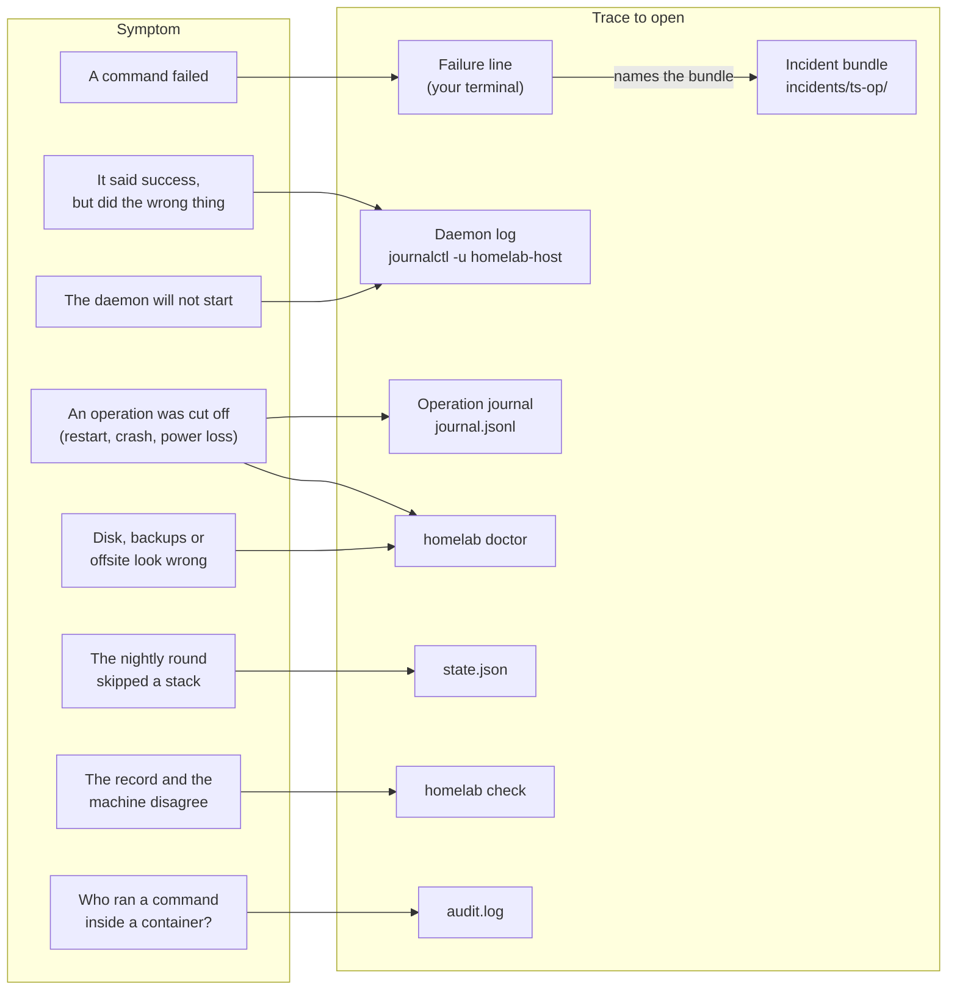
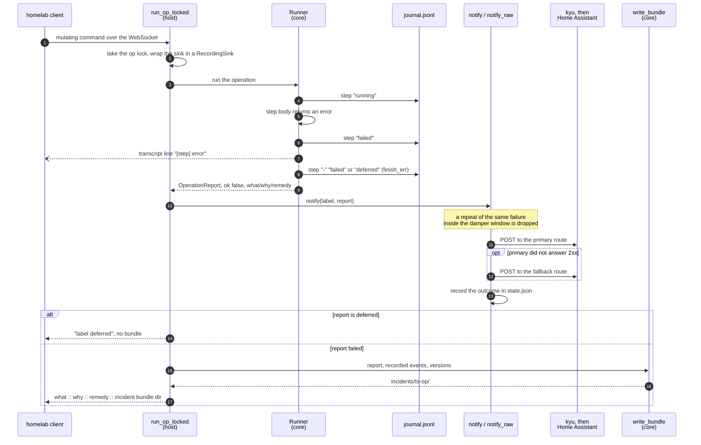
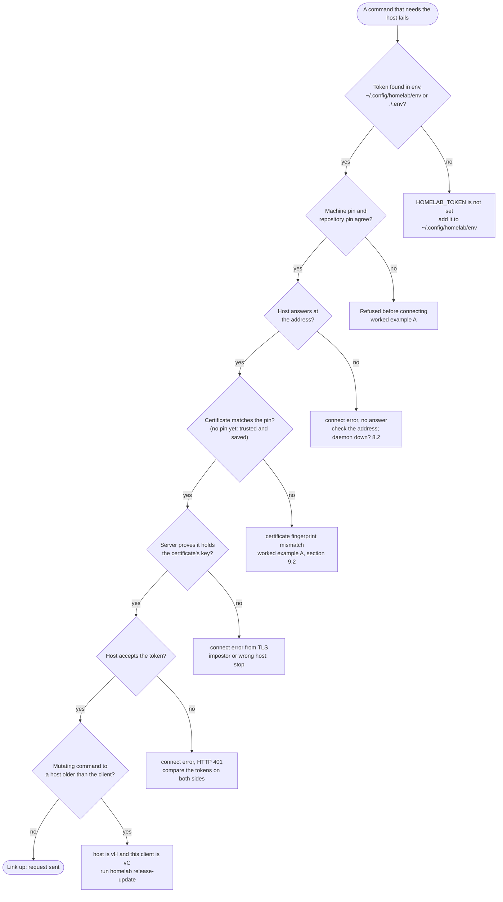

# Debugging guide

This guide is for the moment something went wrong. It has two halves:

- **The evidence trail** (sections 1 to 7): every place the orchestrator
  leaves a trace, what writes it, when, and what question it answers.
- **Symptom → cause tables** (section 8): the message you are looking at,
  what produces it, and what to do first.

Section 9 covers the case where the daemon cannot start at all because a key
is missing. Section 10 is the escalation ladder. A host that is gone
altogether is [DR_RUNBOOK.md](DR_RUNBOOK.md); routine procedures are in
[OPERATIONS_RUNBOOK.md](OPERATIONS_RUNBOOK.md).

Every statement here cites the code or test that makes it true, as
`file:line`. Messages in the symptom columns are quoted verbatim from the
source and were checked against it by script (appendix A). Two conventions
in those quotes: `<name>` stands for a value filled in at run time, and ` … `
marks source text left out of the quote.

## 0. Where things run, and which paths

| Word used here | Machine | What runs there |
|---|---|---|
| workstation | the desktop where you type `homelab` | the client (`client/src/main.rs`) |
| Proxmox host | the machine that runs the `homelab-host` daemon | the daemon (`host/src/main.rs`) |

Every command block below starts with a comment naming its machine. The
client needs no shell setup: it reads `HOMELAB_*` keys from
`~/.config/homelab/env`, then from `./.env`, and an environment variable that
is already set wins over both (`client/src/main.rs:45-87`). The host address
and the certificate pin come from `config/client.toml`, found by walking up
from the working directory the way git finds its root
(`client/src/repo_config.rs:63-73`). The token is the only per-machine fact;
the address and pin are per-repository (`client/src/repo_config.rs:1-16`).

Paths on the Proxmox host in this guide assume the defaults:

- configuration file `/etc/homelab/host.toml`, unless `HOMELAB_CONFIG` names
  another (`host/src/main.rs:370-373`);
- state directory `/var/lib/homelab`, unless `HOMELAB_STATE_DIR` or
  `state_dir` in host.toml says otherwise (`host/src/main.rs:426-429`).

A few paths are fixed to `/var/lib/homelab` whatever `state_dir` says: the
self-update staging file and marker (`core/src/ops/selfupdate.rs:42-45`), the
push staging files (`core/src/ops/util.rs:48`), the restic cache
(`core/src/ops/backup.rs:32`) and the default restic password file
(`core/src/ops/backup.rs:128`). On a host with a non-default `state_dir`,
look for those under `/var/lib/homelab` anyway.

The daemon's systemd unit, its `OnFailure=` rollback unit and script ship
inside the binary (`core/assets/host-units/`, `core/src/hostunits.rs`).
Every self-update puts them in place before the restart, and
`homelab doctor` has a `host units` line that names any file on the
Proxmox host that differs from the binary's copy.

## 1. The evidence map

Start from what you see and open the trace it points to; the table under the
diagram says what writes each trace and when.



<sub>Source: `write_bundle` (`core/src/incidents.rs:56`), `FileJournal` and `BroadcastSink` (`host/src/main.rs:1622-1681`), `StateStore` (`core/src/state.rs:198-231`), the exec audit (`host/src/main.rs:3994`).</sub>

| Trace | Where | Written by | When | Answers |
|---|---|---|---|---|
| failure line | your terminal | client prints the host's reply (`client/src/main.rs:1267-1270`) | every failed command | what failed, why, what to do, where the bundle is |
| incident bundle | `/var/lib/homelab/incidents/<unix-ts>-<op>/` | `core/src/incidents.rs:56-110`, called from `host/src/main.rs:3066` | a mutating operation fails (not when it is deferred) | the full context of one failure; root only (0700 directories, 0600 files, fix-125) |
| operation journal | `/var/lib/homelab/journal.jsonl` | `host/src/main.rs:1659-1681` | before and after every step of every mutating operation | which step an operation was in, including one that never finished |
| daemon log | stderr of `homelab-host` (`host/src/main.rs:1780-1785`) | `tracing` calls throughout `host/src/main.rs` | always | startup faults, scheduler decisions, notification delivery, and every transcript line (below) |
| live transcript | streamed to every connected client | `host/src/main.rs:1611-1655` | while an operation runs | the exact commands and the first lines of their output |
| state record | `/var/lib/homelab/state.json` | `core/src/state.rs:198-231` | after operations, the scheduler, notifications | what the orchestrator believes about each stack |
| fleet check | `homelab check` output; daemon log each night | `core/src/ops/fleetcheck.rs:510-715`, `host/src/main.rs:2629-2682` | on demand, and after every nightly tick in the night window | where the record and reality disagree |
| doctor | `homelab doctor` output | `core/src/doctor.rs:45-188`, probes at `host/src/main.rs:4275-4385` | on demand | host disk, state file, backups, offsite, mirror, interrupted operations; refused connections, exposure, file modes, privileged containers, host-meta, restore drill, password file, Drive space (fix-120, fix-130) |
| exec audit | `/var/lib/homelab/audit.log` | `host/src/main.rs:3955-3969` | every `homelab exec` that passed its guard | who ran what inside which container; 0600, the command masked (fix-124, fix-125) |
| intent history | `/var/lib/homelab/repo` (git) | deploy step `commit intent` (`core/src/ops/deploy.rs:894-960`) | every deploy | which files each deploy applied |
| notification | the configured webhook | `host/src/main.rs:2822-2925` | after every mutating operation, at boot, on auto-disable, on nightly findings | the same verdict, off the machine |

Which operations leave which traces:

- **Mutating operations** go through `run_mutating_op` or `run_op_locked`
  (`host/src/main.rs:2955-3089`). They get journal records, a notification,
  and an incident bundle when they fail. The labels are: adopt,
  apply-guards, backup, backup-native, deploy, destroy, device-backup,
  forget, host-meta-backup, install-native, patch, release-update-native,
  resize, restore, self-update, set-enabled, template-build, update,
  update-native, wipe, zfs-replicate, and the scheduler's scheduled-backup,
  scheduled-backup-native, scheduled-update, scheduled-update-native and
  scheduled-release-update (`host/src/main.rs:2187-4120`). `forget` and
  `wipe` joined the list on 2026-09-27 (`host/src/main.rs:3638-3706`); a
  destroy from the recorded manifest (`homelab apply`, or `homelab destroy`
  without the stack directory) runs under the label destroy.
- **Everything else** (ping, status, doctor, incidents, check, checks,
  config, exec, prune-orphans, and the list `homelab wipe` shows before it
  asks) answers directly from `handle_rpc` (`host/src/main.rs:3207-4267`).
  No journal record, no bundle, no notification. `exec` alone leaves a line
  in `audit.log`.

## 2. Reading the failure line

A failed mutating operation ends with one line, built by the host
(`host/src/main.rs:3079-3086`) and printed by the client after a `✗`
(`client/src/main.rs:1268-1270`). The client then exits 1
(`client/src/main.rs:1056-1059`).

The shape is `<what> :: <why> :: remedy: <remedy> :: incident bundle <dir>`.

### Worked example: a deploy whose container will not start

This is real output. It comes from running the scenario of test
`ar14_failed_deploy_writes_replayable_bundle`
(`core/tests/failure_model_tests.rs:67-117`) through the real core code: the
test's scripted executor makes `docker compose up -d` fail with
`image not found`. A recording journal was added so the journal lines below
are real too. It did not run against the live host.

```text
step 'start apps' failed :: image not found :: remedy: See the transcript in the incident bundle for the exact command and output; re-run after fixing the cause. :: incident bundle /var/lib/homelab/incidents/1760000000-deploy-syncthing
```

Read it left to right:

1. `step 'start apps' failed`: the step name, from `core/src/error.rs:90`.
   Deploy step names are listed in section 8.4.
2. `image not found`: the why. For a command failure this is the command's
   stderr, not the command itself (`core/src/error.rs:69-70`,
   `core/src/ops/deploy.rs:1340-1344`).
3. `remedy: …`: fixed per error class, see the table below.
4. `incident bundle …`: the directory is
   `<state_dir>/incidents/<unix-ts>-<op>` (`core/src/incidents.rs:64`). The
   op is `deploy-<stack>`, not the bare verb (`core/src/ops/deploy.rs:176`).

If writing the bundle itself failed, the last part reads
`(bundle write failed: <e>)` instead (`host/src/main.rs:3077`).

### Recognising the error class by its remedy

The why carries only the inner message. The class shows in the remedy text,
which is fixed per class (`core/src/error.rs:48-94`):

| Remedy text begins with (verbatim) | Class | What it means |
|---|---|---|
| `This gate exists to protect unmanaged guests.` | safety refusal | a guard refused before anything changed; the stack file is wrong or the target is protected |
| `Fix the manifest or compose file and re-run` | validation | the stack file does not validate |
| `Check host load and network, then re-run the operation` | timeout | the why reads `no result within <n>s` (`core/src/error.rs:64`) |
| `See the transcript in the incident bundle for the exact` | command failed | a command exited non-zero; the why is its stderr |
| `Run doctor (F6) to compare recorded state with reality.` | state error | state.json or another state file could not be read or written |
| `Nothing is broken and nothing was changed.` | deferred | the operation stood aside on purpose (section 8.5) |
| `See transcript for context.` | other | anything else |

The live transcript (section 5) shows the same error with its class prefix,
for example `SAFETY ABORT: <reason>`, because the runner logs
`[<step>] <error>` at error level (`core/src/runner.rs:101-102`,
`core/src/error.rs:10`).

## 3. Incident bundles

One failed mutating operation takes this path from the failing step to the
notification, the bundle and the failure line; a deferred operation takes the
upper branch and leaves no bundle.



<sub>Source: `run_op_locked` (`host/src/main.rs:2991-3101`), `notify`, `notify_raw` and `record_notify_outcome` (`host/src/main.rs:2834-2962`), `Runner::step` and `finish_err` (`core/src/runner.rs:76-190`), `write_bundle` (`core/src/incidents.rs:56-110`).</sub>

### What is in one

| File | Content | Source |
|---|---|---|
| `report.json` | the steps that completed, each with `changed`; `ok`; the what/why/remedy error; `deferred` | `core/src/incidents.rs:66-69`, shape at `core/src/runner.rs:21-38` |
| `events.jsonl` | every event the operation emitted: step start/finish, log lines, transcript lines, byte counters | `core/src/incidents.rs:71-78` |
| `commands.sh` | the `[run ]` transcript lines as a shell script | `core/src/incidents.rs:39-52`, `80-85` |
| `state-at-failure.json` | a copy of state.json, if it could be read | `core/src/incidents.rs:87-90` |
| `journal-tail.jsonl` | the last 200 lines of the operation journal, if it could be read | `core/src/incidents.rs:91-105` |
| `versions.txt` | `host=<version>` and `proto=<version>` | `core/src/incidents.rs:107`, content at `host/src/main.rs:3065` |

Four things about these files that are easy to get wrong:

1. **`report.json` lists only the steps that finished.** The failing step is
   not in `steps`; it is named in `error.what`. In the worked example the
   list ends at `push files` and the error names `start apps`.
2. **The transcript is capped.** Each command's output contributes at most
   20 lines (`core/src/executor.rs:129`), and a line longer than 300 bytes is
   cut and marked `truncated in the transcript`
   (`core/src/executor.rs:92-109`). Only commands run through the tracing
   executor appear at all (`core/src/executor.rs:75-145`).
3. **`commands.sh` keeps the quoting since v3.58.3 (fix-38).** Every
   argument that is not a plain word is single-quoted (`Cmd::shell_line` in
   `core/src/executor.rs`). Bundles written before that version joined
   arguments with single spaces; read the next subsection before running a
   line from one of those.
4. **Nothing prunes bundles.** No code in this repository removes
   directories under `incidents/` or trims `journal.jsonl`; they grow until
   someone removes them.

### Worked example: reading the bundle from section 2

`homelab incidents` lists bundle names only, sorted
(`host/src/main.rs:4244-4266`); there is no verb that returns their contents.
Reading them takes a shell on the Proxmox host.

```bash
# workstation
homelab incidents
```

```bash
# Proxmox host, as root
B=/var/lib/homelab/incidents/1760000000-deploy-syncthing
cat "$B/report.json"
tail -n 5 "$B/journal-tail.jsonl"
grep -n '"level":"error"\|"level":"warn"' "$B/events.jsonl"
```

The journal tail from the same run (real output, excerpt):

```text
{"op":"deploy-syncthing","status":"done","step":"push files","ts":1760000030}
{"op":"deploy-syncthing","status":"running","step":"start apps","ts":1760000031}
{"op":"deploy-syncthing","status":"failed","step":"start apps","ts":1760000032}
{"op":"deploy-syncthing","status":"failed","step":"-","ts":1760000033}
```

The last events (real output, excerpt):

```text
{"Line":{"level":"debug","source":"HOST","msg":"[run ] pct exec 110 -- sh -c cd '/opt/syncthing/app' && docker compose pull -q"}}
{"Line":{"level":"debug","source":"HOST","msg":"[run ] pct exec 110 -- sh -c cd '/opt/syncthing/app' && docker compose up -d --remove-orphans"}}
{"Line":{"level":"debug","source":"HOST","msg":"  image not found"}}
{"Line":{"level":"error","source":"HOST","msg":"[start apps] command failed: compose up app: image not found"}}
```

What this tells you: the pull ran, the `up` failed, and its only output was
`image not found`. The line after these is a warning that the stack was
recorded as incomplete at `start apps` (`core/src/ops/deploy.rs:108-116`),
and `state-at-failure.json` indeed carries `"incomplete_step": "start apps"`
for the stack, because that record is written before the bundle
(`core/src/ops/deploy.rs:20-29`).

### Reproducing a command safely

`pct exec <vmid> -- sh -c <script>` is how every in-container command runs.
Since v3.58.3 (fix-38) the transcript, `events.jsonl` and `commands.sh`
quote the script as one argument:

```text
pct exec 110 -- sh -c 'cd '\''/opt/syncthing/app'\'' && docker compose up -d --remove-orphans'
```

which a shell reads back as exactly the arguments that ran (the test
`fix_38_a_replayed_command_keeps_its_script_argument_whole` has `sh` do so).
A bundle from an older version shows the same line unquoted:

```text
pct exec 110 -- sh -c cd '/opt/syncthing/app' && docker compose up -d --remove-orphans
```

Run as written, that hands the container only `cd` and runs
`docker compose up -d --remove-orphans` **on the Proxmox host itself**,
because the host shell reads the `&&`. Put everything after `sh -c ` back
into one argument before running it:

```bash
# Proxmox host, as root
pct exec 110 -- sh -c "cd '/opt/syncthing/app' && docker compose up -d --remove-orphans"
```

Either way, treat `commands.sh` as a record of what ran first and a script
second; its own header says to review it before executing
(`core/src/incidents.rs:41`).

## 4. The operation journal

Each record is one JSON line with `ts`, `op`, `step` and `status`
(`host/src/main.rs:1669`). The statuses, and who writes them:

| status | Written | Source |
|---|---|---|
| `running` | before a step's body starts | `core/src/runner.rs:81` |
| `done` | the step returned success | `core/src/runner.rs:83-93` |
| `failed` | the step returned an error; also with step `-` when the operation ends in failure | `core/src/runner.rs:101`, `170-178` |
| `unverified` | the step said it succeeded but its own check found the change missing | `core/src/runner.rs:145` |
| `complete` | with step `-`, the operation finished | `core/src/runner.rs:160` |
| `deferred` | with step `-`, the operation stood aside | `core/src/runner.rs:175` |

Writes are best effort: a journal that cannot be opened is skipped without
an error (`host/src/main.rs:1670-1679`).

### Interrupted operations

An operation whose **last** record is `running` was cut off mid-step (power
cut, crash, restart). Records are grouped by `op`, and only the newest record
per op counts (`core/src/incidents.rs:117-137`). So a later run of the same
operation that completes clears it, and `deploy-media` interrupted twice is
reported once.

Worked example, from test `ar13_interrupted_op_detected_from_journal`
(`core/tests/failure_model_tests.rs:147-162`):

```text
{"ts":1,"op":"deploy-media","step":"validate","status":"running"}
{"ts":2,"op":"deploy-media","step":"validate","status":"done"}
{"ts":3,"op":"deploy-media","step":"compose up","status":"running"}
```

This yields `deploy-media` at `compose up`. The same journal ending in a
`complete` record yields nothing (`core/tests/failure_model_tests.rs:165-175`).

Three places report it, none of which needs a shell on the host:

1. At daemon start, one warning per interrupted operation in the daemon log
   (`host/src/main.rs:1802-1812`).
2. The boot notification, three seconds after start: op `host-online`,
   label `boot`, `ok` false, and an error text of `interrupted: ` followed by
   `<op> @ <step>` entries joined by `; ` (`host/src/main.rs:1817-1835`).
3. `homelab doctor`, as a warning named `interrupted operations`
   (`host/src/main.rs:4356-4363`, `core/src/doctor.rs:178-185`).

The remedy the code gives is to re-run the operation; the operations are
written to be idempotent (`core/src/doctor.rs:183`).

## 5. The daemon log and the live transcript

The daemon writes its log to stderr through `tracing`, filtered by
`RUST_LOG`, default `info` (`host/src/main.rs:1780-1785`). Under systemd
that normally lands in the journal of the `homelab-host` unit; the unit name
is the one self-update restarts (`core/src/ops/selfupdate.rs:46`).

```bash
# Proxmox host, as root
journalctl -u homelab-host -n 100 --no-pager
journalctl -u homelab-host --since "-1h" --no-pager
```

**The transcript is in the daemon log too.** Every log line an operation
emits is also written with `tracing::info!`, whatever its level
(`host/src/main.rs:1618-1625`). That includes every `[run ] <command>` line
and the output lines under it. A successful operation leaves no bundle, so
for "it said success but did the wrong thing" the daemon log is where the
commands are. Step start and finish markers are sent to clients only, as
`[sync][run ] <op> :: <step>` and `[sync][exit] <op> :: <step> :: <outcome>`
(`host/src/main.rs:1626-1640`).

**Every connected client sees every operation.** Log lines go to one
broadcast channel (`host/src/main.rs:1653`) and each client session
subscribes to it (`host/src/main.rs:2739`). A `homelab deploy` started while
the nightly round runs prints the round's lines too.

**Verbosity.** `RUST_LOG=homelab_host=trace` adds a line for every command
the daemon runs, including ones outside an operation (`host/src/main.rs:1549`).
The notification POST is one of those, and its arguments end with the
webhook URL (`core/src/notify.rs:204-231`), so at trace level the webhook id
is written into the journal. The notification bearer token is not: it
reaches curl through a mode-600 header file,
`<state_dir>/secrets/notify-route-<n>.header`, named in argv only by its path
(`core/src/notify.rs:187-195`, `host/src/main.rs:2882-2899`).

### Log lines worth knowing (verbatim)

| Log line | Level | Meaning | Source |
|---|---|---|---|
| `homelab-host v<v> listening on <addr> (TLS)` | info | started and bound | `host/src/main.rs:1861-1864` |
| `TLS fingerprint SHA256:<fp>` | info | the fingerprint clients must pin; compare with `config/client.toml` | `host/src/main.rs:1865` |
| `interrupted operation '<op>' at step '<step>'` | warn | see section 4 | `host/src/main.rs:1805-1809` |
| `scheduler armed: daily backup + auto-updates at <hh>:00` | info | nightly round configured | `host/src/main.rs:1844-1847` |
| `scheduler idle (backup_hour not set)` | info | no nightly round at all | `host/src/main.rs:1848` |
| `self-update accepted` | info | a new binary answered its first authenticated request and cleared the rollback marker (fix-121) | `host/src/main.rs:1871-1880` |
| `<label> failed: <what>` | error | a mutating operation failed; a bundle was written | `host/src/main.rs:3064` |
| `<label> stood aside: <why>` | info | deferred, no bundle | `host/src/main.rs:3048` |
| `unparseable request dropped :: <e> :: <text>` | error | the host could not parse a client frame; the client waits forever for a reply | `host/src/main.rs:2755-2765` |
| `scheduler: cannot determine local hour ('date' failed)` | error | this 20-minute tick did nothing | `host/src/main.rs:2263-2270` |
| `scheduler: state unreadable` | error | the nightly round skipped this tick; see section 6 | `host/src/main.rs:2274-2280` |
| `scheduler: nightly update for <stack> FAILED` | warn | the stack's automatic updates were parked; its backups continue (H8, fix-59) | `park_after_night` in `host/src/main.rs` |
| `scheduler: stack <name> is disabled` | info | a parked stack was skipped | `host/src/main.rs:2358` |
| `scheduler: stack <name> has no stored manifest` | warn | nothing to back up or update from | `host/src/main.rs:2447` |
| `scheduler: backup for <stack> stood aside` | info | a nightly backup deferred | `host/src/main.rs:2216` |
| `fleet check: repo and reality agree` | info | the nightly check found nothing alarming | `host/src/main.rs:2648-2655` |
| `fleet check: <n> finding(s)` | warn | the nightly check found something; it also went out as a notification | `host/src/main.rs:2657-2679` |
| `notification route <scheme>://<host:port>/<path withheld> failed: <why>` | warn | one webhook route did not answer 2xx; the path (a Home Assistant webhook id) is withheld since fix-123, the full URL is `notify_webhook` or `notify_fallback_webhook` in `host.toml` | `host/src/main.rs`, `notify_raw` |
| `a client lagged: <n> message(s) to it dropped` | warn | a connected client read slower than the host wrote; it was told so and sent every open question again (fix-127) | `host/src/main.rs`, `serve_ws` |
| `401 on <path> from <address>: missing or wrong bearer token (<n> refused since this daemon started)` | warn | a connection without the right token; `homelab doctor` counts them under `refused connections` (fix-120) | `host/src/main.rs`, `log_refused` |
| `notification took the fallback route: the primary said <why>` | warn | primary failed, fallback delivered | `host/src/main.rs:2909-2914` |
| `mirror push failed (will retry): <e>` | warn | the intent repo did not reach its mirror; retried every tick | `host/src/main.rs:2781-2785`, `2250` |
| `A6 exec vmid=<n> cmd=<cmd>` | info | a `homelab exec` ran | `host/src/main.rs:3969` |

### Logs in Loki

Every managed container ships its logs to Loki on CT 104
(`http://10.10.10.4:3100`) through Grafana Alloy, from a config the deploy
renders (`core/src/ops/logshipper.rs`). Grafana's Explore view reads the same
data. Three jobs arrive, with these labels:

| `job` | What | Labels |
|---|---|---|
| `docker` | every container's stdout and stderr | `stack`, `host`, `container_name`, `stream` (`stdout`/`stderr`), `filename` |
| `systemd-journal` | the journal of each container; on the native stacks (kyu, almanac) this IS the service log | `stack`, `host`, `unit` |
| `syslog` | devices that send syslog to the gateway (OPNsense; measured 2026-09-27: the only sender), and `/var/log/syslog` on a container that has one | `stack`, `host`, `app`, `level`, `facility` |

Five queries that answer most questions (paste into Grafana → Explore → Loki):

```logql
{stack="media", container_name="jellyfin"}                  # one container
{job="docker", stream="stderr"} |~ "(?i)error|panic|fatal"   # errors, fleet-wide
{stack="kyu", unit="kyu.service"}                            # a native service
sum by (stack) (count_over_time({job="docker"}[1h]))         # who is logging at all
{job="syslog", host="opnsense"}                              # the router
```

The fourth one is the health question. On 2026-09-27 it answered with no
stack at all: from 2026-09-03 no container line reached Loki, because Alloy
could not read docker's log directory (fix-44). Measured after the fix the
same evening, the same query over one hour: gateway 42,282 lines, uptime
17,907, metrics 8,789.

**Is Alloy shipping on a container?** On that container:

```sh
systemctl status alloy
curl -s 127.0.0.1:12345/metrics | grep -E '^loki_write_(sent|dropped)_bytes_total'
grep CapAmb /proc/$(systemctl show -p MainPID --value alloy)/status   # 0000000000000004 = may read docker's logs
cat /etc/systemd/system/alloy.service.d/homelab-read.conf
```

Sent bytes growing and dropped bytes at zero means Loki accepts what Alloy
sends. A deploy asks the same questions and says `[logs] Alloy on <host>
cannot read /var/lib/docker/containers` when the answer is no
(`core/src/ops/deploy.rs`, log shipper step), and `homelab check` reports a
stack whose labelled lines stopped arriving (`core/src/ops/facts.rs`,
coverage). A redeploy of the stack puts Alloy's config and its read access
back.

## 6. state.json

The orchestrator's belief about each stack. `homelab status` prints the host's
`pct list` followed by the raw state.json (`host/src/main.rs:3216-3228`).

Fields to look at when debugging (`core/src/state.rs:14-62`, `108-158`):

| Field | Debugging meaning |
|---|---|
| `vmid`, `hostname` (per stack) | what every guard compares the live container against |
| `enabled` (per stack) | `false` = parked: no nightly backup, no update (H8) |
| `last_backup` (per stack) | unix time of the last recorded backup; 0 = never |
| `applied_hash` (per stack) | fingerprint of the intent last applied |
| `incomplete_step` (per stack) | the step a deploy stopped at; absent when the last deploy finished |
| `manifest` (per stack) | the manifest the scheduler works from without a client |
| `last_notify_ok`, `last_notify_failed`, `last_notify_error` | whether notifications arrive, and the last failure's reason |
| `last_restore_drill`, `last_restore_drill_error` | whether the last restore drill proved anything |
| `manual_checks` | the questions only a person can answer, and their answers |
| `retired` | what a destroyed or forgotten stack, or an app or native unit that left its stack, still keeps: kind, vmid, date, repositories, `/appdata` paths, vault paths; keyed `<stack>` or `<stack>/<name>`. Only `homelab wipe` removes an entry, or a deploy that brings it back (`core/src/state.rs:158-204`, `core/src/ops/retired.rs:175-180`) |

How it loads (`core/src/state.rs:198-223`):

- **Missing file**: treated as a fresh install, an empty fleet.
- **Does not parse**: the content is copied to `state.json.corrupt` and the
  load returns a state error; the original is left in place. The scheduler
  skips its tick on that error (`host/src/main.rs:2274-2280`), but a few
  read-only views fall back to an empty state instead, for example
  `homelab checks` (`host/src/main.rs:3839`), so an empty answer there is not
  proof that nothing is recorded.
- **Written by a newer binary**: refused rather than touched.

Writes are atomic: a temporary file is written, synced and renamed over the
original (`host/src/main.rs:1571-1596`).

## 7. Fleet check and doctor

### `homelab check`

Holds the record against the machine. The client sends the vmid each stack
directory claims (`client/src/main.rs:310-338`); the host adds what it can
see and evaluates (`host/src/main.rs:3717-3750`). Each finding prints as
`[broken]`, `[drift]` or `[noted]`, a subject, what is wrong, and a
`remedy:` line (`host/src/main.rs:3178-3198`).

- The command exits 1 when there is a `broken` or `drift` finding; `noted`
  ones are printed but do not fail it since v3.58.5 (gap-32,
  `fleetcheck::check_passes`). The nightly run uses the same rule: only
  non-`noted` findings raise a warning and a notification (`host/src/main.rs:2646-2679`, `core/src/ops/fleetcheck.rs:501-507`).
- Run it from the repository root, or pass the stacks path. From anywhere
  else the client finds no stack files, says so, and checks only the host's
  half (`client/src/main.rs:311-327`). That half cannot see a deleted stack
  directory: the `drift` finding for a stack in state without a stack file
  needs the stack files (`core/src/ops/fleetcheck.rs:678-716`), and the
  nightly check never has them (`host/src/main.rs:2646`).
- Every retired stack, app or unit is one `noted` line that names what it
  keeps and the `homelab wipe` command (`core/src/ops/retired.rs:190-219`).
  It is the reminder that data is being kept on purpose, not a fault.

### `homelab doctor`

Checks host disk, state file, each stack's container and backup age, the
offsite remote, mirror lag and interrupted operations (`core/src/doctor.rs:45-188`).
Each check prints its health in brackets, its name, a detail, and a remedy
line under it when there is one (`host/src/main.rs:4139-4145`). The command
exits 1 only when a check is `Fail`; a warning still exits 0
(`host/src/main.rs:4148`, `client/src/main.rs:1267-1275`).

One per-stack check to know, and one limit:

- `stack <name> env` fails when a secret file on the container (a compose
  app's `/opt/<stack>/<app>/.env`, a native unit's env file) has no copy in
  the host's vault; the remedy is a redeploy, which takes the copy. Until
  v3.58.7 the host reported every stack as sealed, so this check never fired
  (gap-27, `unsealed_secret_files` in `core/src/ops/facts.rs`).
- The offsite check only runs when `rclone listremotes` shows a remote
  named exactly `gdrive:` (`host/src/main.rs:4310-4332`).

## 8. Symptom → cause tables

### 8.1 On the workstation, before or while connecting

The client's own refusals print as `error: <message>` and exit 1
(`client/src/main.rs:37-40`).

| Symptom (verbatim) | Cause | First action | Source |
|---|---|---|---|
| `HOMELAB_TOKEN is not set` | no token in the environment, in `~/.config/homelab/env`, or in `./.env` | add a `HOMELAB_TOKEN=` line to `~/.config/homelab/env`; no sourcing needed | `client/src/main.rs:140-150` |
| `<path> does not parse: <e> :: it is TOML` | `config/client.toml` is not valid TOML or has a key other than `host` and `pin` | fix the file; a parse error is never replaced by a default | `client/src/repo_config.rs:80-95` |
| `the host certificate pinned on this machine (~/.config/homelab/pin: <m>) is not the` … | this machine pinned a different fingerprint than `config/client.toml` names | see worked example A | `client/src/repo_config.rs:143-153` |
| `certificate fingerprint mismatch` | the daemon presented a certificate other than the pinned one | see worked example A | `client/src/tls.rs:59-65` |
| `connect <url>: <e>` | TLS or network failure; the host answered 401 because the token did not match; or the server could not prove it holds the key of the pinned certificate (the handshake signature is checked, `client/src/tls.rs:69-90`, test `fix_34_an_impostor_replaying_the_pinned_certificate_is_refused` at `client/tests/tls_pin_tests.rs:146`) | check the address with `homelab ping`; compare tokens on both sides | `client/src/main.rs:1127-1141`, `host/src/main.rs:2706-2712` |
| `host is v<h> and this client is v<c> :: a host that predates a field ignores it silently` | the client refuses to send a mutating command to an older host | update the host first; read-only verbs (ping, status, doctor, incidents) and the self-update itself still work | `client/src/main.rs:1203-1213`, `client/src/version.rs:15-30` |
| `connection closed before RPC completed` | the link closed before the host answered; the operation may or may not have finished | look in the daemon log for the operation's outcome before re-running | `client/src/main.rs:1284-1288` |
| `payload is <n> MiB and the link carries at most <m> MiB` | the message is bigger than the 256 MiB frame limit | not a network fault; the payload has to shrink | `client/src/version.rs:59`, `73-84`, `client/src/main.rs:1076-1081` |
| `staging the binary of <unit> failed` | a native binary could not be staged; the deploy never started | read the line above it, which is the host's reason | `client/src/main.rs:729-744` |
| `validation failed: <e>` | `homelab plan` or `homelab deploy` found the stack file invalid before connecting | fix the stack file; `homelab plan` repeats the check offline | `client/src/main.rs:673-700` |
| `latch_secrets is set but HOMELAB_LATCH_ENV is not` | the stack reads secrets from latch but no latch environment is named | add `HOMELAB_LATCH_ENV=` to `~/.config/homelab/env` | `client/src/spec.rs:356-360` |
| `cannot run latch for app '<app>': <e>` | the `latch` binary is not on PATH | install latch | `client/src/spec.rs:375-385` |
| `latch returned empty content for app '<app>' (<rel> in env '<env>')` | latch has no content for that file in that environment | commit and push the env file in latch | `client/src/spec.rs:402-407` |
| `name mismatch` | the typed confirmation for destroy, prune-orphans or wipe did not match the name | nothing was sent to the host (for wipe: the list was fetched, nothing deleted) | `client/src/main.rs:854`, `1052`, `1087`, `1122` |
| `no stacks directory at '<dir>'` | `homelab apply` found no stacks directory at the given or default path | run it from the repository root or pass the path | `client/src/main.rs:715-721` |
| `could not read the host's state — nothing applied` | `homelab apply` did not get the host's state back | check the link with `homelab ping` | `client/src/main.rs:723-727` |
| `<stack>: validation failed: <e> — nothing applied` | one stack under `stacks/` does not validate; apply builds every stack before sending anything | fix that stack file, or run `homelab plan stacks/<stack>` for the detail | `client/src/main.rs:739-749` |
| `deploy of <stack> failed — apply stopped here` | a deploy inside `homelab apply` failed; later stacks were not deployed and nothing was destroyed | read that deploy's failure line; re-run apply after the fix | `client/src/main.rs:781-791` |
| `is waiting for a decision` | a step asked a question the command line cannot answer | see worked example B | `client/src/main.rs:1173-1182` |

When the client cannot reach the host, walk its checks in the order it makes
them; the first one that fails is the fault.



<sub>Source: `client/src/main.rs:149` (token), `1103-1143` (pin, connect), `1205-1213` (version); `PinnedVerifier` (`client/src/tls.rs:49-90`); `bearer_ok` (`host/src/main.rs:2717-2723`).</sub>

#### Worked example A: pin disagreement

Real output, produced locally with a scratch `HOME` holding pin `AA:…:AA`
and a scratch `config/client.toml` naming `BB:…:BB`. The client refused
before opening any connection, because the pin decision comes before the
connect (`client/src/main.rs:1101-1127`). Excerpt, fingerprints shortened:

```text
error: the host certificate pinned on this machine (~/.config/homelab/pin: AA:AA:…:AA) is not the one config/client.toml names (BB:BB:…:BB) :: either the daemon's certificate changed …
```

How the two pins interact (`client/src/repo_config.rs:143-167`, tested in
`a_repo_pin_fills_an_empty_machine_and_never_overrides_a_different_one`,
`client/tests/repo_config_tests.rs:135-154`):

| Machine pin | Repository pin | Result |
|---|---|---|
| none | none | trust on first use: the first certificate seen is saved |
| none | present | the repository pin is adopted and saved to `~/.config/homelab/pin` |
| present | same or none | the machine pin is used |
| present | different | refused, the message above |

The decision tree:

1. Read the fingerprint the daemon printed at start: the
   `TLS fingerprint SHA256:` line in the daemon log (section 5).
2. If it equals the **repository** pin, this machine pinned a stale one:
   delete `~/.config/homelab/pin`. The next command adopts the repository's.
3. If it equals **neither**, the daemon's certificate changed (section 9.2
   says when that happens). Update `pin` in `config/client.toml`, then delete
   `~/.config/homelab/pin` on every workstation. Deleting only the machine
   pin is not enough: the client would adopt the old repository pin again
   and fail with `certificate fingerprint mismatch`.
4. If you did not expect the certificate to change, stop and find out why
   before trusting it.

#### Worked example B: a question nobody can answer from the command line

During a deploy, the `service checks` step compares readings taken before and
after. When one went down it asks instead of deciding
(`core/src/ops/deploy.rs:2565-2589`). The command line prints the question
and cannot answer it (`client/src/main.rs:1173-1182`). Because the CLI
session is connected, the host waits the full `ask_timeout_s`, default 120 s
(`host/src/main.rs:669-671`, `1739-1748`), then treats it as unattended and
fails the step with the reason `nobody answered within 120s`
(`core/src/ops/deploy.rs:2599-2610`). To decide instead, run the operation
from `homelab tui`. When no client is connected at all, as in the nightly
round, the answer is immediately unattended
(`host/src/main.rs:1720-1722`).

### 8.2 On the Proxmox host: the daemon does not start or keeps restarting

| Symptom (verbatim) | Cause | First action | Source |
|---|---|---|---|
| `FATAL: <path> does not parse as TOML: <e>` | host.toml has a syntax error; the daemon exits 1 | fix the file | `host/src/main.rs:384-390` |
| `FATAL: <path> is not a valid host config: <e>` | a key has the wrong type | fix the value | `host/src/main.rs:399-405` |
| `FATAL: token must be set (>=16 chars) via <path> or HOMELAB_TOKEN` | no token, or one shorter than 16 characters | section 9.1 | `host/src/main.rs:409-419` |
| `listen must be host:port` | `listen` or `HOMELAB_LISTEN` is not an address; the daemon panics | fix the value | `host/src/main.rs:420-425` |
| `tls cert` | the certificate could not be created. One way to get here: `tls-cert.pem` is missing while `tls-key.pem` is present, because the key file is created with create-new and refuses to overwrite. The new certificate was already written by then, so the next start finds a certificate that does not belong to the key | fix both files together, section 9.2 | `host/src/main.rs:1859-1860`, `host/src/tls.rs:21-43` |
| `load tls` | the certificate or key file exists but could not be loaded | restore both files together, section 9.2 | `host/src/main.rs:1866-1869` |
| `is not a setting this daemon reads and is being ignored.` | a key the daemon does not know; usually a key written below a `[table]` header, which makes it part of that table | move the key above the first header | `host/src/main.rs:391-398`, test `misplaced_keys_are_reported_not_swallowed` at `host/src/main.rs:883` |

The last one is a warning, not a fatal error: the daemon starts, without the
setting.

After a self-update, the new binary deletes the rollback marker when it has
answered its first authenticated request (fix-121; `homelab release-update`
sends that request, and so does any client that connects). Until then the
marker
stays for the unit's `OnFailure=` handler, which lives outside this
repository (section 0).

### 8.3 Safety refusals

All of these stop the operation before anything changes. The failure line's
remedy starts `This gate exists to protect unmanaged guests.`

| Symptom (verbatim) | Cause | First action | Source |
|---|---|---|---|
| `vmid <n> is on the no-touch list` | the stack file names a protected guest. The compiled list is 100, 101, 102, 103; host.toml can add to it, never remove | the stack file's vmid is wrong | `core/src/safety.rs:21`, `48-51`, `host/src/main.rs:446-460` |
| `hostname '<h>' does not match canonical '<c>'` | the manifest's hostname is not `<vmid>-app-<stack>` | fix the manifest | `core/src/safety.rs:53-58` |
| `vmid <n> is a QEMU VM` | a VM, not a container, has that id | pick another vmid | `core/src/safety.rs:63-69` |
| `vmid <n> exists with hostname '<h>', expected '<e>'` | deploy: a container with that id belongs to something else | the stack file points at someone else's container | `core/src/safety.rs:82-86` |
| `vmid <n> is '<h>', expected '<e>'` | backup, restore, update and other operations on an existing stack: the live hostname differs from the record | re-adopt or redeploy so the record matches; `homelab check` reports the same | `core/src/ops/mod.rs:70-75`, `core/src/ops/fleetcheck.rs:575-583` |
| `vmid <n> does not exist` | the container is gone | redeploy, or `homelab forget <stack>` if it is gone on purpose | `core/src/ops/mod.rs:61-63` |
| `template <t> is <p>, but stack '<s>' asks for <q>` | privileged vs unprivileged mismatch between template and stack; a clone always inherits the template's | use the matching template | `core/src/ops/deploy.rs:499-507` |
| `remote exec is disabled (set exec_enabled = true in host.toml to allow it)` | `homelab exec` is off by default | enable it in host.toml if you need it | `core/src/safety.rs:118-123`, `host/src/main.rs:435` |
| `vmid <n> is on the no-touch list` … `exec refused regardless of config` | `homelab exec` into a protected guest; the configured list counts, including host.toml additions | none | `core/src/safety.rs:124-128`, `host/src/main.rs:2853-2855` |
| `vmid <n> is on the no-touch list :: this list is the one thing that is never worked around` | `homelab guards` on a protected guest | none | `host/src/main.rs:3679-3689` |
| `has no manifest recorded in host state (an adopted service)` | destroy from the record (`homelab apply`, or `homelab destroy` without the stack directory) on a stack the host never deployed | remove the container by hand, then `homelab forget <stack>` | `core/src/ops/destroy.rs:432-437` |
| `holds a manifest for '<m>' — refusing to guess which one is meant` | the state record and the manifest in it name different stacks | look at `state.json` (section 6) | `core/src/ops/destroy.rs:439-443` |
| `still names a live container` | `homelab forget` on a record whose container still exists | destroy it instead, or rename it first | `core/src/ops/destroy.rs:383-386` |

### 8.4 Deploy failures by step

The deploy's steps, in order: validate, safety gates, baseline,
registry cache, hardware readiness, host storage, auto-restore check,
metrics discovery, provision container, wait for systemd, bootstrap docker,
runaway guards, log rotation, retire dropped, commit intent, push files,
start apps, storage ownership, verify health, then the optional gateway
route, retire gateway route, grafana dashboard, homepage services and uptime
monitors, then orphan files, garbage collect, log shipper, native units,
record state, reconcile and service checks (`core/src/ops/deploy.rs:265-2808`).

A deploy that fails at any step except validate, safety gates, registry
cache and hardware readiness (the four that run before anything changes) is
recorded in state.json with `incomplete_step` set
(`core/src/ops/deploy.rs:55-117`), and
`homelab check` reports it as `its last deploy stopped at "<step>" and never finished`
(`core/src/ops/fleetcheck.rs:1012-1030`).

| Symptom (verbatim) | Step | Cause | First action | Source |
|---|---|---|---|---|
| `container never reached running/degraded` | wait for systemd | systemd in the container did not reach running or degraded within 30 polls, 4 s apart | enter the container and look at its network and boot | `core/src/ops/deploy.rs:811-834` |
| `no running services` | verify health | an app has no running compose service 5 s after start; the why includes `docker compose ps -a` and the last 20 log lines | read those lines in the failure line | `core/src/ops/deploy.rs:1534-1569` |
| `intent commit failed` | commit intent | git commit in `/var/lib/homelab/repo` failed | the why carries git's output | `core/src/ops/deploy.rs:945-959` |
| `the step reported success but the change is not there: <why>` | any verified step | the command succeeded but reading back showed no change | treat as a real fault in that step | `core/src/runner.rs:123-157` |
| `the deploy reported success but the container does not match` | reconcile | the live container differs from the stack file | the why lists the differences | `core/src/ops/deploy.rs:2466-2479` |
| `stopped by the operator` | service checks | you answered stop | nothing | `core/src/ops/deploy.rs:2605` |
| `nobody answered within <n>s` | service checks | see worked example B | run it from the TUI | `host/src/main.rs:1744-1747` |
| `stack declares native unit '<u>' but <u>/<u>.service is not in the stack` | native units | the unit file is missing from the stack directory | add it | `core/src/ops/deploy.rs:2094-2101` |
| `could not place <path> on the container (<e>)` | native units | moving the binary into place failed; nothing was replaced | the why carries the shell's stderr | `core/src/ops/deploy.rs:2173-2180` |

Not errors, but surprises since 2026-09-27: a deploy **removes** what the
stack files no longer declare, and says so per item. If something vanished
after a deploy, search its transcript (section 5) or incident bundle for
these lines:

| Transcript line (verbatim) | What was removed | Source |
|---|---|---|
| `[orphans] removed <path> — no longer in the stack's files` | a file under `/opt/<stack>/` the stack no longer sends | `core/src/ops/deploy.rs:2137-2140` |
| `[orphans] removed <path> — the stack no longer places it` | a `rootfs/` file; a unit or timer was `systemctl disable --now` first | `core/src/ops/deploy.rs:1101-1104` |
| `[native] <unit> left the stack file — stopped and disabled` | a native unit dropped from `natives:`; its data and repository are kept | `core/src/ops/deploy.rs:1162-1165` |
| `is no longer declared — detached; the directory` | a mount point; the host directory is kept | `core/src/ops/deploy.rs:844-848` |
| `[route] <path> removed — the stack file no longer declares it` | the old route file after `gateway_route:` was dropped or the vmid changed | `core/src/ops/deploy.rs:1973-1976` |
| `app '<app>' removed (config dirs kept)` | an app dropped from `apps:` | `core/src/ops/deploy.rs:2179` |

To get a removed file back, put it back in the stack's files and deploy; the
intent repository on the host has the last version that was deployed
(`git -C /var/lib/homelab/repo log -- stacks/<stack>/`, section 1). Data is
never among these removals: `/appdata`, repositories and vault copies stay
until `homelab wipe` (section 8.10).

Also not an error: a deploy of a native stack does not
upgrade a binary that is already installed. The transcript says
`already installed, not shipped` for it; upgrades go through
`homelab release-update-native` or the nightly updater
(`core/src/ops/deploy.rs:2138-2162`).

### 8.5 Backup, restore and update

| Symptom (verbatim) | Cause | First action | Source |
|---|---|---|---|
| `<label> deferred` followed by `is in use, so nothing was stopped and no snapshot was taken: <reason>` | an app was in use, so the backup stood aside. The client still prints `✗` and exits 1, but no bundle is written and nothing changed | nothing; it runs next night. If it keeps standing aside, the backup-age finding in `homelab check` says so | `core/src/ops/backup.rs:397-415`, `host/src/main.rs:3043-3054` |
| `stack '<s>' would back up into the repository '<o>-config', which stack '<b>'` … | two stacks name the same owning app, so they would share one restic repository | rename the app in the newer stack's file | `core/src/ops/backup.rs:327-363` |
| `<app> unhealthy after update` … `ROLLED BACK to previous image, now healthy.` | the new image failed its health check and the previous one was restored. This is still reported as a failure | the app runs on the old image; check the new image's release notes | `core/src/ops/update.rs:229-260` |
| `<app> unhealthy after update AND after rollback` | the rollback did not bring it back either | hands on the container now | `core/src/ops/update.rs:262-265` |
| `<app> unhealthy after update and no captured image to roll back to` | there was nothing to roll back to | hands on the container now | `core/src/ops/update.rs:235-240` |
| `app '<a>' is not part of stack <s>` | `homelab update stacks/<name> <app>` named an app the stack does not have | check the app name | `core/src/ops/update.rs:103-112` |

Two things the update's transcript will not tell you directly:

- A pull that fails inside the container leaves that app as it was and logs
  `[update] <app> NOT updated: docker compose pull failed (…)`; the run
  itself stays ok, so the stack is not parked (gap-25, v3.58.4). A failed
  `up` is logged as `docker compose up for <app> exited <n>` and left to the
  verify step, which rolls back (`core/src/ops/update.rs`). Stop-first
  ignores its exit status on purpose (`; true`).
- In a scheduled update only apps whose policy is `auto` are touched;
  others are logged as skipped (`core/src/ops/update.rs:126-143`).

### 8.6 Native services and releases

| Symptom (verbatim) | Cause | First action | Source |
|---|---|---|---|
| `unit <u> is not active ('<state>')` | adopt refuses a unit that is not running; adoption never starts anything | start it yourself, then re-run adopt | `core/src/ops/native.rs:59-64` |
| `stack '<s>' already exists on vmid <n>` | adopt would re-point an existing record | check which vmid is right | `core/src/ops/native.rs:190-193` |
| `cannot preserve the running <binary>` | install refuses to replace a binary it cannot back up | the transcript shows why the copy failed | `core/src/ops/native.rs:328-331` |
| `the installed <u> did not come up healthy` | a new binary failed to start and the previous one was put back | read the service's own log in the container | `core/src/ops/native.rs:440-448` |
| `<u> did not come up and there is no previous binary to return to` | a first install failed; there is nothing to roll back to | the why includes the last log lines | `core/src/ops/native.rs:424-431` |
| `SHA256SUMS does not carry the ecosystem signature (<e>)` | the release's checksum file is unsigned or changed after signing; nothing installed | wait for the signed release | `core/src/release_sig.rs:33-39` |
| `SHA256SUMS.minisig is not a minisign signature (<e>)` | the signature asset is malformed or missing | same | `core/src/release_sig.rs:27-32` |
| `CHECKSUM MISMATCH for <asset> in <repo> <tag>` | the downloaded binary does not match its checksum; nothing installed | retry; if it repeats, do not install | `core/src/ops/native.rs:1078-1083` |
| `no release found (gh authenticated? release exists?)` | on the workstation, `gh` could not name the newest release for `homelab release-update` | check `gh auth status` | `client/src/main.rs:812-816` |
| `staged binary failed selfcheck (exit <n>): <e>` | a host binary for self-update could not run `--selfcheck`; nothing was replaced | wrong architecture or a truncated upload | `core/src/ops/selfupdate.rs:60-73`, `host/src/main.rs:1775-1778` |

### 8.7 The nightly round

The scheduler looks a minute after start, then every 20 minutes. It only
works in the night window, `backup_hour` and the hour after it (fix-129),
and a stack is due when its last backup is at least 20 hours
old (`host/src/main.rs:2246-2273`, `1941-1943`). Parked stacks are left out
(`host/src/main.rs:1997-2002`).

| Symptom | Cause | First action | Source |
|---|---|---|---|
| a stack is `disabled` in `homelab check` and was not backed up | a nightly run failed and the stack was parked (H8); the daemon log has the `FAILED` line and a notification went out once | fix the cause, then `homelab enable <stack>` | `host/src/main.rs:2472-2500`, `core/src/ops/fleetcheck.rs:587-597` |
| a backup that stood aside did not park the stack | by design: a deferred backup is not a failed night | none | `core/src/ops/backup.rs:67-74` |
| a rolled-back update parked the stack's updates | a rolled-back update is a failure (section 8.5), and a failed update parks the automatic updates (backups continue, fix-59) | fix or pin the image, then `homelab enable` | `park_after_night` in `host/src/main.rs` |
| a CLI command started while the nightly backups run prints the round's lines and does not start | the backup phase holds the operation lock for the whole batch; your operation waits for it | wait, or use `homelab status` which does not take the lock | `host/src/main.rs:2177`, `2969` |
| nothing ran at all | `backup_hour` is not set, or `date` failed, or state.json did not load | check the daemon log for the lines in section 5 | `host/src/main.rs:2255`, `2267-2280` |

### 8.8 Notifications

Each notification is one JSON body with `source`, `op`, `label`, `ok`,
`error` and `version` (`core/src/notify.rs:15-25`). Only an HTTP 2xx counts
as delivered (`core/src/notify.rs:149-159`). The primary route is tried
first, the fallback only when it fails (`core/src/notify.rs:174-185`,
`host/src/main.rs:2865-2925`).

| Symptom | Cause | First action | Source |
|---|---|---|---|
| `homelab check` reports `no route accepted the last notification` | every route failed on the last attempt; the reason is kept in state | the finding quotes the reason; check the webhook targets in host.toml | `core/src/ops/fleetcheck.rs:899-933`, `host/src/main.rs:2933-2950` |
| the same failure did not notify a second time | identical failures of the same operation are suppressed for 20 hours; a changed error text passes; successes always pass | expected. The counter lives in memory, so a daemon restart resets it | `host/src/main.rs:1796-1798`, `core/src/notify.rs:27-58` |
| `cannot write the header file <path>: <e>` as the recorded reason | a route that needs a bearer token was skipped because its header file could not be written under `secrets/` | check that the state directory's `secrets/` is writable by the daemon | `host/src/main.rs:2884-2895` |
| no notifications at all, and no failure recorded | no webhook is configured: with neither route set nothing is sent and nothing is recorded | `homelab config` shows the webhook setting | `host/src/main.rs:2868-2871` |

`homelab config` prints the webhook URL in full (`client/src/main.rs:1246-1250`).
That URL carries the webhook id; keep the output out of anything shared.

### 8.9 Fleet-check findings

A selection. Every finding carries its own remedy line.

| Finding (verbatim) | Meaning | Source |
|---|---|---|
| `recorded on vmid <n>, which does not exist` | the container was removed outside the orchestrator | `core/src/ops/fleetcheck.rs:569-574` |
| `recorded as '<h>' but vmid <n> is really '<l>'` | every operation on this stack will fail the hostname guard | `core/src/ops/fleetcheck.rs:575-583` |
| `disabled` … `the nightly run skips it entirely` | parked by H8 or by hand | `core/src/ops/fleetcheck.rs:587-597` |
| `has never been backed up` | no backup was ever recorded | `core/src/ops/fleetcheck.rs:633-639` |
| `last backup was <n> hours ago` | older than 48 hours | `core/src/ops/fleetcheck.rs:640-647`, `489` |
| `clones template <n>, which does not exist on the hypervisor` | a rebuild of this stack would fail | `core/src/ops/fleetcheck.rs:550-564` |
| `claims vmid <n>, which is a live container this orchestrator does not manage` | a stack file points at someone else's container | `core/src/ops/fleetcheck.rs:652-666` |
| `routes to <target>, where nothing answers` | a gateway route leads nowhere | `core/src/ops/fleetcheck.rs:695-700` |
| `rootfs is <n>% full` | disk pressure inside a container | `core/src/ops/fleetcheck.rs:727-741` |
| `has no runaway guards: no journald cap, no docker log cap, or both` | run `homelab guards <vmid>` | `core/src/ops/fleetcheck.rs:794-800` |
| `its last deploy stopped at "<step>" and never finished` | see section 8.4 | `core/src/ops/fleetcheck.rs:1018-1026` |
| `the last drill did not prove a restore: <e>` | the last restore drill failed | `core/src/ops/restoredrill.rs:136` |
| `<n> check(s) only a person can answer are open, e.g. <examples>` | run `homelab checks` | `core/src/ops/manualchecks.rs:164-168` |
| `but has no stack file in the repository` | `drift`: the stack runs and is in state, but `stacks/<stack>/` is gone. `homelab apply` destroys it after its name is typed; put the directory back to keep it | `core/src/ops/fleetcheck.rs:700-714` |
| `retired <date> (<kind>, vmid <n>) — kept: restic <repos>; /appdata <dirs>; vault <paths>` | `noted`: data a retired stack, app or unit keeps on purpose; `homelab wipe <key>` deletes it | `core/src/ops/retired.rs:199-216` |
| `monitor(s) watch a stack the fleet no longer has` | `drift`: the Uptime Kuma seeder left undeclared monitors in place because removing them all would have taken more than a quarter of the monitors at once; `refused` in `last-seed.json` says why | `core/src/ops/fleetcheck.rs:1045-1059` |

### 8.10 Removal, apply and wipe

| Symptom (verbatim) | Cause | First action | Source |
|---|---|---|---|
| `nothing retired is recorded as '<name>'` | `homelab wipe` for a key with no retired record | the keys are the subjects of the `noted` lines in `homelab check`: `<stack>` or `<stack>/<app>` | `core/src/ops/retired.rs:269` |
| `is a managed stack, not a retired one` | `homelab wipe` named a stack that runs | nothing; a running stack is never wiped | `core/src/ops/retired.rs:262-267` |
| `is managed again — its record is stale; deploy it once to clear it` | the stack came back without a deploy clearing its retired record | `homelab deploy stacks/<stack>` | `core/src/ops/retired.rs:272-277` |
| `is back in stack '<s>' — refusing to delete what it uses` | the app or unit is listed in its stack again | nothing to wipe while it is used | `core/src/ops/retired.rs:278-291` |
| `is not an rclone remote — only those can be wiped from` | `restic_base` is not `rclone:...`, so the repositories cannot be purged from here; nothing was deleted | remove them by hand with that backend's own tool | `core/src/ops/retired.rs:413-419` |
| `typed name '<t>' does not match '<k>' — nothing deleted` | the host's own check of the wipe confirmation | type the key exactly | `core/src/ops/retired.rs:378-383` |
| `KEPT (a managed stack still uses it)` in the wipe list | a repository or `/appdata` directory in the record is used by a stack that runs (an app moved stacks, D25) | nothing; it is left alone | `core/src/ops/retired.rs:251-253`, `:293-338` |

A wipe that fails part-way stops at that step and keeps the retired record
(`core/src/ops/retired.rs:357-362`); what was already deleted stays deleted,
and running `homelab wipe <key>` again lists what is left. The operation
runs as label `wipe` (section 1), so a failure leaves an incident bundle.

The Uptime Kuma seeder prints its own lines in the log of the `kuma-seeder`
container of the uptime stack, vmid 107 (`stacks/uptime/lxc-compose.yml:11`),
one run per hour (`SEED_INTERVAL_SECONDS=3600` in its compose file):

```sh
# Proxmox host
pct exec 107 -- docker logs --tail 50 kuma-seeder
```


| Seeder line (verbatim) | Meaning | Source |
|---|---|---|
| `(no file declares it)` | a monitor no file declares was removed | `stacks/uptime/kuma-seeder/seed.py:331` |
| `now points at` | a monitor's URL or hostname was corrected to the file's | `stacks/uptime/kuma-seeder/seed.py:326` |
| `the desired list looks truncated, so nothing is removed` | more than `max(3, a quarter of all monitors)` would have gone; nothing was removed | `stacks/uptime/kuma-seeder/seed.py:260-263` |
| `no generated host-monitor list, so nothing is judged` | `host-monitors.json` is missing or unreadable; nothing was removed | `stacks/uptime/kuma-seeder/seed.py:257-258` |

## 9. When the daemon cannot start: its keys and their other copies

Two pieces of secret material decide whether the daemon starts and whether
anything can talk to it: the API token and the TLS key. This section says
where each is read, where its other copies are, and how to put one back.

### 9.1 The API token

- **Read from**: `HOMELAB_TOKEN` in the daemon's environment first, else
  `token` in host.toml. Fewer than 16 characters stops the daemon with the
  `FATAL: token must be set` line (`host/src/main.rs:409-419`). If the unit
  sets `HOMELAB_TOKEN`, that value wins and editing host.toml changes
  nothing; `systemctl show homelab-host -p Environment` shows it (and prints
  the value).
- **Copy on every workstation**: the client sends its token as a bearer
  header and the host accepts only an exact match
  (`client/src/main.rs:1093-1096`, `host/src/main.rs:2128-2132`, test
  `h12_bearer_check` at `host/src/main.rs:1438-1449`). So
  `~/.config/homelab/env` or the repository's `.env` on any working
  workstation holds the same value (`client/src/main.rs:45-54`).
- **Copy in the host-meta backup**: the host-meta snapshot includes
  `/etc/homelab/host.toml` (`core/src/ops/backup.rs:989`, `1056-1064`). It
  survives the loss of the host disk, but only holds the token if the token
  was in host.toml rather than in the unit's environment. It is encrypted
  with the restic password (9.3).

Recipe 1, the workstation still has it. Abort-safe: the old file is kept
until the new one is in place.

1. On the workstation, show the value (it is a secret; do not paste it into
   anything shared):

   ```bash
   # workstation
   grep 'HOMELAB_TOKEN=' ~/.config/homelab/env
   ```

   The client accepts an `export ` prefix and strips surrounding quotes
   (`client/src/main.rs:67`, `82`); copy the bare value.

2. On the Proxmox host, write it as the first line of host.toml, above any
   `[table]` header (a key below a header belongs to that table,
   `host/src/main.rs:391-398`). `read -rs` keeps it off the screen:

   ```bash
   # Proxmox host, as root
   read -rs TOKEN
   cp -a /etc/homelab/host.toml /etc/homelab/host.toml.bak
   { printf 'token = "%s"\n' "$TOKEN"; grep -v '^token *=' /etc/homelab/host.toml.bak; } > /etc/homelab/host.toml.new
   chmod 600 /etc/homelab/host.toml.new
   mv /etc/homelab/host.toml.new /etc/homelab/host.toml
   unset TOKEN
   systemctl restart homelab-host
   journalctl -u homelab-host -n 20 --no-pager
   ```

   The file is kept at mode 600 because the daemon itself writes it that way
   when it saves settings (`host/src/main.rs:702-723`).

3. On the workstation, `homelab ping` must answer. If it does not, restore
   `/etc/homelab/host.toml.bak`.

Recipe 2, host.toml is gone and no workstation has the token: restore
host.toml from the host-meta snapshot. The repository is
`<restic_base>/host-meta-config`, and `restic_base` defaults to
`rclone:gdrive:homelab-backups` (`core/src/ops/backup.rs:89-105`, `127`). It
needs the restic password file (9.3) and a working rclone remote on the host.

```bash
# Proxmox host, as root
export RESTIC_REPOSITORY=rclone:gdrive:homelab-backups/host-meta-config
export RESTIC_PASSWORD_FILE=/var/lib/homelab/secrets/restic.pw
restic snapshots
restic restore latest --target /root/host-meta-restore --include /etc/homelab/host.toml
ls -l /root/host-meta-restore/etc/homelab/host.toml
install -m 600 /root/host-meta-restore/etc/homelab/host.toml /etc/homelab/host.toml
systemctl restart homelab-host
```

Restoring into a separate directory first means nothing live is touched
until you have seen the file.

Recipe 3, no copy anywhere: make a new token and put it on both sides. The
code keeps no other copy of it.

```bash
# Proxmox host, as root: print a new 64-character token
openssl rand -hex 32
```

Write it into host.toml as in recipe 1 step 2, then set `HOMELAB_TOKEN=` to
the same value in `~/.config/homelab/env` on every workstation.

### 9.2 The TLS certificate and key

- **Read from**: `tls-cert.pem` and `tls-key.pem` in the state directory
  (`host/src/tls.rs:16-19`).
- **When either is missing**, the daemon generates a new pair at start
  (`host/src/tls.rs:21-44`). The new certificate has a new fingerprint, so
  every client refuses it with `certificate fingerprint mismatch`
  (`client/src/tls.rs:59-65`). When only the certificate is missing and the
  key is present, generation fails on the existing key file and the daemon
  panics with `tls cert` (8.2).
- **Copy in the host-meta backup**: both files are in the snapshot
  (`core/src/ops/backup.rs:973-974`, `1056-1062`).
- **Clients hold only the fingerprint**, in `config/client.toml` and
  `~/.config/homelab/pin`, never the key (`client/src/lib.rs:15-34`).

Recipe 1, restore both from host-meta, so existing pins keep working:

```bash
# Proxmox host, as root
export RESTIC_REPOSITORY=rclone:gdrive:homelab-backups/host-meta-config
export RESTIC_PASSWORD_FILE=/var/lib/homelab/secrets/restic.pw
restic restore latest --target /root/host-meta-restore --include /var/lib/homelab/tls-cert.pem --include /var/lib/homelab/tls-key.pem
install -m 644 /root/host-meta-restore/var/lib/homelab/tls-cert.pem /var/lib/homelab/tls-cert.pem
install -m 600 /root/host-meta-restore/var/lib/homelab/tls-key.pem /var/lib/homelab/tls-key.pem
systemctl restart homelab-host
journalctl -u homelab-host -n 20 --no-pager | grep 'TLS fingerprint'
```

The fingerprint in that last line must equal `pin` in `config/client.toml`.

Recipe 2, no copy: let the daemon make a new pair and re-pin every client.

1. Move both files aside together, so the panic case cannot happen:
   `mv /var/lib/homelab/tls-cert.pem /var/lib/homelab/tls-key.pem /root/`
   (Proxmox host, as root).
2. `systemctl restart homelab-host`, then read the new
   `TLS fingerprint SHA256:` line from the daemon log.
3. Put that fingerprint in `pin` in `config/client.toml` and commit it.
4. On every workstation, delete `~/.config/homelab/pin`; the next command
   adopts the repository's pin (worked example A).
5. Take a new host-meta snapshot so the backup holds the new pair:
   `homelab backup-host-meta`.

### 9.3 The restic password

The daemon starts without it; backups, restores and the host-meta snapshot
fail. It lives at `/var/lib/homelab/secrets/restic.pw` unless host.toml says
otherwise (`core/src/ops/backup.rs:128`, `host/src/main.rs:479`). The
host-meta snapshot contains the `secrets/` directory
(`core/src/ops/backup.rs:971`, `1058`), but that snapshot is encrypted with
the same password (`core/src/ops/backup.rs:1010-1021`), so it cannot give the
password back. This repository's code knows of no other copy. An offline
copy is an operator matter; [OPERATIONS_RUNBOOK.md](OPERATIONS_RUNBOOK.md)
covers keeping one.

## 10. Escalation ladder

1. **Read the failure line** and its remedy (section 2).
2. **Re-run the operation.** Interrupted operations are meant to be re-run
   (`core/src/doctor.rs:183`); a deferred backup runs by itself next night.
3. **Look at the whole picture from the workstation**: `homelab doctor`,
   then `homelab check` from the repository root, then `homelab status`.
4. **Open the incident bundle** on the Proxmox host (section 3). Start with
   `report.json`, then the error and warn lines in `events.jsonl`.
5. **Read the daemon log** around the time of the failure (section 5). For
   an operation that succeeded but did the wrong thing, the transcript is
   only there.
6. **Reproduce one command by hand**, with its quoting restored (section 3).
7. **Roll back.** For an app image, `homelab update` already rolls back on a
   failed health check (8.5). For the daemon, self-update keeps the previous
   binary as `/usr/local/bin/homelab-host.prev` (`core/src/ops/selfupdate.rs:42-45`,
   `75-78`).
8. **The host is gone**: [DR_RUNBOOK.md](DR_RUNBOOK.md).

## Appendix A. How the quoted messages were checked

In every table row whose first cell starts with a backtick span, every
backtick span in that first cell is a verbatim fragment of the source in
`client/src`, `core/src` or `host/src`, or of the Uptime Kuma seeder
`stacks/uptime/kuma-seeder/seed.py`: a message, a file name or a field
name. This script checks them. It joins Rust's `\`-continued string lines,
unescapes `\"`, turns each `<name>` into "any format placeholder", splits
on ` … `, and looks every fragment up in the source. Run it from the
repository root; it prints the document lines that no longer match and
exits 1 if there are any.

```python
import re, pathlib, sys
src = ""
for d in ("client/src", "core/src", "host/src"):
    for p in pathlib.Path(d).rglob("*.rs"):
        src += p.read_text() + "\n"
src += pathlib.Path("stacks/uptime/kuma-seeder/seed.py").read_text() + "\n"
src = re.sub(r"\\\n\s*", "", src).replace('\\"', '"')
bad = 0
for n, line in enumerate(pathlib.Path("docs/DEBUGGING_GUIDE.md").read_text().splitlines(), 1):
    if not line.startswith("| `"):
        continue
    first = line.split(" | ")[0]
    for quote in re.findall(r"`([^`]+)`", first):
        for frag in quote.split(" … "):
            rx = "".join(r"\{[^{}]*\}" if p.startswith("<") else re.escape(p)
                         for p in re.split(r"(<[^<>]+>)", frag.strip()))
            if not re.search(rx, src):
                bad += 1
                print(f"{n}: {frag}")
sys.exit(1 if bad else 0)
```
