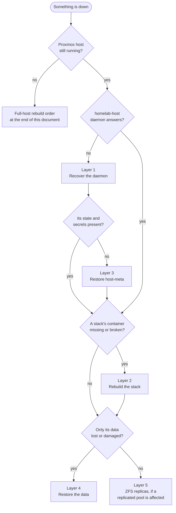

# Disaster-recovery runbook

*Generated by `homelab runbook` from the stack files under `stacks/`, `config/client.toml` and the code named in each section. Do not edit by hand: regenerate after changing a stack file or the backup code, and a test fails until you do.*

Written for the worst case: the TUI is unavailable, the `homelab-host` daemon is down, and the Proxmox host may be a fresh install. Every step is a shell command run as root on the Proxmox host unless it says otherwise. A step that uses the `homelab` client says *needs the daemon*, and has a shell equivalent beside it.

Placeholders: `<vmid>`, `<stack>`, `<app>` and `<unit>` are filled in from the Stacks section near the end.

Which layer to open depends on what still works:



## Layer 0: What runs where

- **The daemon.** `homelab-host`, a systemd service on the Proxmox host. Program `/usr/local/bin/homelab-host`; the one before the last self-update is kept at `/usr/local/bin/homelab-host.prev`. Configuration `/etc/homelab/host.toml` (the `HOMELAB_CONFIG` variable overrides the path). State directory `/var/lib/homelab` (the `state_dir` setting overrides it). Listens on port 8443 over TLS.
- **Clients** reach the daemon at `10.10.10.250:8443`. The address and the certificate pin are in `config/client.toml` in the repository; each machine's token is `HOMELAB_TOKEN` in `~/.config/homelab/env`.
- **The state directory** holds `state.json` (what is deployed where), `repo/` (a git history of every file each deploy sent), `secrets/` (the vault, below), `tls-cert.pem` and `tls-key.pem` (the daemon's certificate), `journal.jsonl` and `incidents/` (operation records) and `restic-cache/`.
- **The vault** `/var/lib/homelab/secrets`: `restic.pw` (the one password for every repository), `<stack>/<app>.env` for each compose app that has an `.env`, and `<stack>/<dir>/<file>` for each env or credential file a native unit reads, where `<dir>` is the directory that file sits in (two units may both read a `token.env`).
- **Backups** are restic repositories behind `rclone:gdrive:homelab-backups`. The name is `<owner>-config`: one per owning app for a compose stack, one per unit for a native stack, `host-meta-config` for the daemon's own state, and `<name>-config` for each `[[device_backups]]` entry in `/etc/homelab/host.toml`. Every repository opens with the same password file `/var/lib/homelab/secrets/restic.pw`. (`BackupCfg::default()` in core/src/ops/backup.rs; `restic_base` and `restic_password_file` in `/etc/homelab/host.toml` override both.)
- **App data** lives on the host under `/appdata/<stack>/<app>-config` and is bind-mounted into the container at the same path, so a container can be rebuilt without touching it.
- **ZFS pools** referenced by the stack files: `HDD12TB` (mounted by downloader, media), `HDD18TB` (mounted by downloader, media), `HDD2TB` (mounted by gateway), `HDD4TB` (mounted by media). Replication jobs are the `[[zfs_jobs]]` entries in `/etc/homelab/host.toml` (Layer 5).
- **Guests this suite never touches**, whatever a stack file says: vmid 100, 101, 102, 103 (`DEFAULT_NO_TOUCH` in core/src/safety.rs; a `no_touch` list in `/etc/homelab/host.toml` can only add to it). They come back from Proxmox's own backups, not from this runbook.

## Layer 1: Recover the host daemon

Is it running, and if not, why:

```sh
systemctl status homelab-host
journalctl -u homelab-host -n 50 --no-pager
curl -sk https://127.0.0.1:8443/api/health     # answers: ok
curl -sk https://127.0.0.1:8443/api/version
```

The daemon refuses to start, and says so in the journal, when `/etc/homelab/host.toml` does not parse as TOML, when it is not a valid host config, or when the token is shorter than 16 characters. A key it does not know is a `WARNING` line, not a refusal.

**A self-update that never came up.** A self-update copies the running program to `/usr/local/bin/homelab-host.prev`, installs the new one, and writes `/var/lib/homelab/selfupdate.pending`; the new program deletes the marker once it has served for a few seconds. A marker that is still there means the update was never accepted. Put the previous program back:

```sh
ls -l /usr/local/bin/homelab-host /usr/local/bin/homelab-host.prev /var/lib/homelab/selfupdate.pending
/usr/local/bin/homelab-host.prev --selfcheck                 # prints its version when it can run
install -m 755 /usr/local/bin/homelab-host.prev /usr/local/bin/homelab-host
rm -f /var/lib/homelab/selfupdate.pending
systemctl restart homelab-host
```

**No usable program at all.** Fetch the released one on a workstation with an authenticated `gh` (the release carries `homelab-host` and `SHA256SUMS`), check it, copy it over, and install it on the host:

```sh
# workstation
gh release download --repo kennypassenier/homelab --pattern homelab-host --pattern SHA256SUMS
sha256sum -c --ignore-missing SHA256SUMS
scp homelab-host root@<proxmox-host>:/usr/local/bin/homelab-host.new
# Proxmox host
/usr/local/bin/homelab-host.new --selfcheck && install -m 755 /usr/local/bin/homelab-host.new /usr/local/bin/homelab-host
systemctl restart homelab-host
```

To build it instead, `make host-binary` in the repository builds it against Debian 12 in docker and leaves it at `target-debian/release/homelab-host`.

**The units.** The daemon runs under these files; the binary carries them and every self-update puts them in place, and `homelab doctor` names any that differ. On a rebuilt host, write them before the first start, then `systemctl daemon-reload && systemctl enable --now homelab-host`.

`/etc/systemd/system/homelab-host.service` (mode 644):

```ini
[Unit]
Description=Homelab HOST daemon (v2)
After=network-online.target pve-cluster.service
Wants=network-online.target
OnFailure=homelab-host-rollback.service
StartLimitIntervalSec=60
StartLimitBurst=5

[Service]
Type=notify
WatchdogSec=30
Environment=HOMELAB_CONFIG=/etc/homelab/host.toml
ExecStart=/usr/local/bin/homelab-host
Restart=always
RestartSec=2

[Install]
WantedBy=multi-user.target
```

`/etc/systemd/system/homelab-host-rollback.service` (mode 644):

```ini
[Unit]
Description=Homelab HOST self-update rollback (H5)

[Service]
Type=oneshot
ExecStart=/usr/local/lib/homelab-rollback.sh
```

`/usr/local/lib/homelab-rollback.sh` (mode 755):

```sh
#!/bin/sh
# Runs when homelab-host enters the failed state (systemd OnFailure).
# Two jobs, both outside the daemon (it is dead at this point):
#  1. If a self-update marker is present: the new binary never came up
#     healthy - restore the previous binary and restart (H5 rollback).
#  2. Notify Home Assistant either way (F3) - the daemon cannot report
#     its own death.

WEBHOOK=$(grep "^notify_webhook" /etc/homelab/host.toml 2>/dev/null | cut -d\" -f2)

notify() {
  # $1 = op, $2 = error text
  [ -n "$WEBHOOK" ] || return 0
  curl -m 5 -s -o /dev/null -X POST -H "Content-Type: application/json" \
    -d "{\"source\":\"homelab-host\",\"op\":\"$1\",\"label\":\"systemd\",\"ok\":false,\"error\":\"$2\"}" \
    "$WEBHOOK" || true
}

if [ -f /var/lib/homelab/selfupdate.pending ]; then
  logger -t homelab-rollback "self-update failed - restoring previous binary"
  cp -a /usr/local/bin/homelab-host.prev /usr/local/bin/homelab-host
  rm -f /var/lib/homelab/selfupdate.pending
  notify "self-update-rollback" "new binary never came up healthy - previous binary restored and restarted"
  systemctl reset-failed homelab-host
  systemctl restart homelab-host
else
  logger -t homelab-rollback "daemon entered failed state (no self-update pending)"
  notify "daemon-failed" "homelab-host crashed repeatedly and systemd gave up - manual intervention needed (journalctl -u homelab-host)"
fi
```

**The certificate pin.** The daemon's certificate is `/var/lib/homelab/tls-cert.pem` with `/var/lib/homelab/tls-key.pem`; when either is missing at start it makes a new pair (host/src/tls.rs). Clients refuse a certificate whose SHA-256 fingerprint differs from the `pin` in `config/client.toml`, and from the copy each machine keeps in `~/.config/homelab/pin`. Compare:

```sh
journalctl -u homelab-host | grep 'TLS fingerprint' | tail -1
openssl x509 -in /var/lib/homelab/tls-cert.pem -noout -fingerprint -sha256
```

with `pin` in `config/client.toml` on a workstation. If they differ because the pair was regenerated, either restore both files from `host-meta-config` (Layer 3) and restart, or accept the new certificate: write the new fingerprint into `pin` in `config/client.toml`, and delete `~/.config/homelab/pin` on every client machine (a machine pin that disagrees with the repository pin is refused, not replaced).

**The token** is `token` in `/etc/homelab/host.toml` (or `HOMELAB_TOKEN` in the daemon's environment). A new token means updating `HOMELAB_TOKEN` in `~/.config/homelab/env` on every client machine.

## Layer 2: Recover a stack without the daemon

Every stack is one LXC container. Start it and look:

```sh
pct list
pct start <vmid>
```

**A compose stack.** The deploy puts each app's files in `/opt/<stack>/<app>/` inside the container and starts the apps in the order the stack file lists them. By hand:

```sh
pct exec <vmid> -- sh -c 'cd /opt/<stack>/<app> && docker compose up -d'
pct exec <vmid> -- sh -c 'cd /opt/<stack>/<app> && docker compose ps'
```

If the files are gone from the container, the last deployed copy of every file is in the daemon's git history at `/var/lib/homelab/repo/stacks/<stack>/`, one commit per deploy. A file under `rootfs/` belongs at the same absolute path in the container (`rootfs/etc/x` goes to `/etc/x`); every other file goes to `/opt/<stack>/`. The app's `.env` is not in that history; when the app has one, its copy is in the vault:

```sh
git -C /var/lib/homelab/repo log --oneline -- stacks/<stack>
pct exec <vmid> -- mkdir -p /opt/<stack>/<app>
pct push <vmid> /var/lib/homelab/repo/stacks/<stack>/<app>/docker-compose.yml /opt/<stack>/<app>/docker-compose.yml
pct push <vmid> /var/lib/homelab/secrets/<stack>/<app>.env /opt/<stack>/<app>/.env --perms 600
```

When the daemon is up, `homelab deploy stacks/<stack>` does all of this from the repository, and recreates the container first when it is missing.

**A native stack** runs systemd units and no docker. By hand:

```sh
pct exec <vmid> -- systemctl status <unit>
pct exec <vmid> -- journalctl -u <unit> -n 50 --no-pager
```

A unit starts only when its program, its account and the files named by `EnvironmentFile=` and `LoadCredential=` exist. The deploy prepares them in this order before it starts anything; by hand it is the same order:

```sh
pct push <vmid> /var/lib/homelab/repo/stacks/<stack>/<unit>/<unit>.service /etc/systemd/system/<unit>.service
pct exec <vmid> -- useradd --system --no-create-home --shell /usr/sbin/nologin <user>   # User= in the unit
pct push <vmid> /var/lib/homelab/secrets/<stack>/<dir>/<file> <path-the-unit-reads> --perms 600
pct push <vmid> ./<asset> <program-path> --perms 755   # the verified release binary, see below
pct exec <vmid> -- systemctl daemon-reload
pct exec <vmid> -- systemctl enable --now <unit>
```

The program comes from the unit's GitHub release (named per unit in the Stacks section). On a workstation: `gh release download --repo <release_repo> --pattern <asset> --pattern SHA256SUMS`, then `sha256sum -c --ignore-missing SHA256SUMS`, then copy it to the host.

When the daemon is up, `homelab deploy stacks/<stack>` rebuilds a native stack too: it creates the container, writes each `<unit>/<unit>.service`, creates the unit's account, places the program from the unit's release where none exists (it never replaces one), puts back env and credential files from the vault, and starts a unit only when all of that is present. A unit left unstarted is named in the output; a missing program is installed with `homelab install-native stacks/<stack>/<unit>` (or `stacks/<stack>` for the unit whose `service.yml` sits at the top).

## Layer 3: Restore the daemon's own state (host-meta)

Do this first when the host itself was lost: every later step needs the vault it brings back. The repository is `rclone:gdrive:homelab-backups/host-meta-config`, written nightly and by `homelab backup-host-meta` (`backup_host_meta` in core/src/ops/backup.rs). A snapshot holds:

```sh
/var/lib/homelab/secrets        # the vault, including restic.pw
/var/lib/homelab/state.json     # what is deployed where
/var/lib/homelab/tls-cert.pem   # the certificate the clients pin
/var/lib/homelab/tls-key.pem
/var/lib/homelab/repo           # the git history of every deployed file
/etc/homelab/host.toml     # token, webhooks, zfs_jobs and every other setting
/usr/local/bin/smart-textfile-collector.py     # these three only when present
/etc/systemd/system/smart-collector.service
/etc/systemd/system/smart-collector.timer
```

Not in it: the `homelab-host` program and its unit file (Layer 1), rclone's own configuration, `journal.jsonl`, `incidents/` and `restic-cache/`.

**The password is inside the thing it opens.** `restic.pw` is in this repository, and the same password opens every repository, so an offline copy of it is the one thing this whole runbook cannot do without. The code keeps no second copy. The offline copy is in Kenny's Bitwarden: the one statement in this document that no code can confirm.

**rclone first.** restic reaches Google Drive through rclone's remote `gdrive`, whose configuration is in no backup. On a fresh host install `restic` and `rclone`, run `rclone config` to create the remote `gdrive` again, then:

```sh
rclone lsd gdrive:homelab-backups          # the remote works and the folder is there
install -d -m 700 /var/lib/homelab/secrets
# write the offline copy of the password to /var/lib/homelab/secrets/restic.pw, mode 600
export RESTIC_REPOSITORY=rclone:gdrive:homelab-backups/host-meta-config
export RESTIC_PASSWORD_FILE=/var/lib/homelab/secrets/restic.pw
export RESTIC_CACHE_DIR=/var/lib/homelab/restic-cache
restic snapshots
restic ls latest | head -50
restic restore latest --target /
```

The snapshot stores absolute paths, so `--target /` puts every file back where it was. Then start the daemon (Layer 1, when its program is not there yet) and do Layer 1's pin check: the restored certificate keeps the fingerprint the clients already pin.

## Layer 4: Restore a stack's data

Repositories are named per owning app (or per native unit), not per stack: `rclone:gdrive:homelab-backups/<app>-config`. The exact names are in the Stacks section. Set once per shell:

```sh
export RESTIC_PASSWORD_FILE=/var/lib/homelab/secrets/restic.pw
export RESTIC_CACHE_DIR=/var/lib/homelab/restic-cache
```

**A compose stack.** When the daemon is up, `homelab restore stacks/<stack> [snapshot]` does the following, and by hand it is the same (`restore` in core/src/ops/backup.rs). It asks for the stack name first (`--yes` for scripts) and, with the stack down, copies the current data to `/var/lib/homelab/pre-restore/<stack>-<unix time>/` before restic writes over it (fix-64; `--no-safety-copy` skips that copy):

```sh
pct exec <vmid> -- sh -c 'cd /opt/<stack>/<app> && docker compose down'   # every app
export RESTIC_REPOSITORY=rclone:gdrive:homelab-backups/<app>-config                   # every repository of the stack
restic snapshots
restic restore latest --target /
pct exec <vmid> -- sh -c 'cd /opt/<stack>/<app> && docker compose up -d'  # every app, in order
```

The snapshots store the absolute host paths (`/appdata/<stack>/<app>-config`), so `--target /` puts the files back in place with the owners they had. The code starts the apps again even when the restore failed, and so should you. A rebuild does not need this step: `homelab deploy` restores each data directory it finds empty from that path's latest snapshot before the apps start, and when that fails it continues with the directory EMPTY and prints `AUTO-RESTORE FAILED` for it.

**A native stack.** The nightly backup of a native unit is not a directory snapshot: it streams `tar` out of the container into restic, stored as one file `/<unit>-data.tar` (`backup_native` in core/src/ops/native.rs). Unpack it back inside the container, so file owners stay the container's own:

```sh
export RESTIC_REPOSITORY=rclone:gdrive:homelab-backups/<unit>-config
restic snapshots --path /<unit>-data.tar
pct exec <vmid> -- systemctl stop <unit>
restic dump --path /<unit>-data.tar latest /<unit>-data.tar | pct exec <vmid> -- tar -xf - -C /
pct exec <vmid> -- systemctl start <unit>
```

`homelab restore` refuses a native stack (gap-28): the compose route's `restic restore latest --target /` would write the archive itself to `/<unit>-data.tar` on the host and unpack nothing. For the same reason a rebuild's automatic restore finds no snapshot for a native unit's directory and leaves it empty: its data always comes back by the commands above.

**A restore brings back what was retired after the snapshot** (gap-16). almanac retires a source by renaming its profile to `*.toml.retired` in `/appdata/almanac/almanac-config/profiles/`, at runtime and without a deploy. A snapshot taken before that rename still holds the live `*.toml`, so restoring it makes almanac load the retired source again. After restoring almanac, compare `ls /appdata/almanac/almanac-config/profiles/` with the list of retired sources before starting the service.

## Layer 5: ZFS replicas

The daemon replicates the datasets named in `[[zfs_jobs]]` (`source`, `target`) in `/etc/homelab/host.toml` every night, and on `homelab zfs-replicate` (core/src/ops/zfs.rs). Each run takes `zfs snapshot -r <source>@homelab-YYYYMMDD-HHMM`, sends the difference from the newest snapshot both sides share with `zfs send -RI ... | zfs receive -F -x mountpoint <target>`, and prunes only snapshots whose name starts with `homelab-`, on both sides. A target with no snapshots at all gets a full send.

`-x mountpoint` keeps a replica from arriving with its source's mountpoint, which would put the copy at the live path (F177, a replica claiming the live path of what it copies). A replica received before that change can still carry it, so check before mounting anything:

```sh
grep -A2 zfs_jobs /etc/homelab/host.toml
zpool import                                   # pools a fresh install can see
zfs list -r -o name,mountpoint,canmount,mounted <target>
zfs list -H -t snapshot -o name -s creation -r <source> | tail -3
```

A replica is a copy for reading. Never give it a mountpoint a stack uses.

When a source and its target share no snapshot and the target already holds snapshots, the job stops rather than re-seeding, because a re-seed destroys that history. The choice is a person's: find out why the chain broke, or wipe the target with `zfs destroy -r <target>` and run the job again for a fresh full send.

## Stacks

One section per directory under `stacks/`, read from its `lxc-compose.yml` and, for a native stack, each unit's `service.yml` and `.service` file. Repository names use the default base `rclone:gdrive:homelab-backups`.

### almanac (vmid 112)

- Container: hostname `112-app-almanac`, ip `10.10.10.12/24` on `vmbr0` VLAN 10, 1 core(s), 512 MiB RAM, 0 MiB swap, 4 GiB disk on `local-lvm`, unprivileged, template `clone:998`, boot order 50.
- Runs no docker: native systemd services only.
- Unit `almanac`:
  - program `/opt/almanac/bin/almanac`, from the GitHub release `kennypassenier/almanac` (asset `almanac`); update policy self.
  - unit file `stacks/almanac/almanac/almanac.service` in the repository; the container's copy is `/etc/systemd/system/almanac.service`.
  - data: repository `rclone:gdrive:homelab-backups/almanac-config`, archive `/almanac-data.tar` holding a tar of `/appdata/almanac/almanac-config`.
  - vault copy of almanac (`/appdata/almanac/almanac-config/latch.env`): `/var/lib/homelab/secrets/almanac/almanac-config/latch.env`.
  - re-register a running unit after the daemon lost its state (needs the daemon): `homelab adopt stacks/almanac`. Adoption only records a service that is already active; it never starts one.
- Rebuild: the native route in Layer 2, then this stack's data by Layer 4 (native services).

### downloader (vmid 105)

- Container: hostname `105-app-downloader`, ip `10.10.10.5/24` on `vmbr0` VLAN 10, 2 core(s), 2048 MiB RAM, 0 MiB swap, 10 GiB disk on `local-lvm`, privileged, template `clone:997`, boot order 90.
- Apps (docker compose, started in this order): qbittorrent. Files in the container under `/opt/downloader/<app>/`.
- Rebuild (needs the daemon): `homelab deploy stacks/downloader`, which also refills every empty data directory from its latest snapshot before the apps start. Without the daemon: Layer 2.
- Data, one restic repository per owning app:
  - `rclone:gdrive:homelab-backups/qbittorrent-config`: `/appdata/downloader/qbittorrent-config`
- Host directory mounted in, never created or backed up by this suite: `/HDD18TB/subvol-103-disk-0` at `/mnt/data/18TB` (CT 103's dataset; holds downloads/ and the 18 TB library).
- Host directory mounted in, never created or backed up by this suite: `/HDD12TB/subvol-103-disk-0` at `/mnt/data/12TB` (CT 103's dataset; unused by this stack today, carried for parity).

### drill (vmid 119)

- Container: hostname `119-app-drill`, ip `10.10.10.19/24` on `vmbr0` VLAN 10, 1 core(s), 256 MiB RAM, 0 MiB swap, 4 GiB disk on `local-lvm`, unprivileged, template `clone:998`, boot order unset.
- Runs no docker: native systemd services only.
- Unit `drillsvc`:
  - program `/opt/drillsvc/bin/drillsvc`, no release_repo, so no recorded source for the binary; update policy manual.
  - unit file `stacks/drill/drillsvc/drillsvc.service` in the repository; the container's copy is `/etc/systemd/system/drillsvc.service`.
  - data: none, declared stateless, so no repository.
  - re-register a running unit after the daemon lost its state (needs the daemon): `homelab adopt stacks/drill/drillsvc`. Adoption only records a service that is already active; it never starts one.
- Rebuild: the native route in Layer 2, then this stack's data by Layer 4 (native services).

### gateway (vmid 104)

- Container: hostname `104-app-gateway`, ip `10.10.10.4/24` on `vmbr0` VLAN 10, 4 core(s), 5120 MiB RAM, 0 MiB swap, 30 GiB disk on `local-lvm`, unprivileged, template `clone:998`, boot order 5.
- Apps (docker compose, started in this order): traefik, cloudflared, crowdsec, grafana, loki, goaccess. Files in the container under `/opt/gateway/<app>/`.
- Rebuild (needs the daemon): `homelab deploy stacks/gateway`, which also refills every empty data directory from its latest snapshot before the apps start. Without the daemon: Layer 2.
- Data, one restic repository per owning app:
  - `rclone:gdrive:homelab-backups/traefik-config`: `/appdata/gateway/traefik-config`
  - `rclone:gdrive:homelab-backups/crowdsec-config`: `/appdata/gateway/crowdsec-config`
  - `rclone:gdrive:homelab-backups/grafana-config`: `/appdata/gateway/grafana-config`
  - `rclone:gdrive:homelab-backups/goaccess-config`: `/appdata/gateway/goaccess-config`
- Holds nothing by declaration (`no_data`), so no repository: `/appdata/gateway/cloudflared-config`.
- NOT backed up, on purpose: `/appdata/gateway/loki-config`. The stack file's reason: Loki log chunks and index; not restored, configuration is in the repository.
- Host directory mounted in, never created or backed up by this suite: `/HDD2TB/logs/traefik` at `/mnt/traefik-logs` (Traefik access + rotated logs. Regenerable, deliberately outside the backup).

### home (vmid 115)

- Container: hostname `115-app-home`, ip `10.10.10.15/24` on `vmbr0` VLAN 10, 2 core(s), 1024 MiB RAM, 0 MiB swap, 8 GiB disk on `local-lvm`, unprivileged, template `clone:998`, boot order 80.
- Apps (docker compose, started in this order): homepage. Files in the container under `/opt/home/<app>/`.
- Rebuild (needs the daemon): `homelab deploy stacks/home`, which also refills every empty data directory from its latest snapshot before the apps start. Without the daemon: Layer 2.
- Data, one restic repository per owning app:
  - `rclone:gdrive:homelab-backups/homepage-config`: `/appdata/home/homepage-config`

### kp-soft (vmid 116)

- Container: hostname `116-app-kp-soft`, ip `10.10.10.16/24` on `vmbr0` VLAN 10, 2 core(s), 2048 MiB RAM, 0 MiB swap, 16 GiB disk on `local-lvm`, unprivileged, template `clone:998`, boot order 75.
- Apps (docker compose, started in this order): kp-soft, jobtracker. Files in the container under `/opt/kp-soft/<app>/`.
- Rebuild (needs the daemon): `homelab deploy stacks/kp-soft`, which also refills every empty data directory from its latest snapshot before the apps start. Without the daemon: Layer 2.
- Data, one restic repository per owning app:
  - `rclone:gdrive:homelab-backups/kp-soft-config`: `/appdata/kp-soft/kp-soft-config`
  - `rclone:gdrive:homelab-backups/jobtracker-config`: `/appdata/kp-soft/jobtracker-config`

### kyu (vmid 109)

- Container: hostname `109-app-kyu`, ip `10.10.10.9/24` on `vmbr0` VLAN 10, 1 core(s), 256 MiB RAM, 0 MiB swap, 4 GiB disk on `local-lvm`, unprivileged, template `clone:998`, boot order 50.
- Runs no docker: native systemd services only.
- Unit `http-switchboard`:
  - program `/opt/http-switchboard/bin/http-switchboard`, from the GitHub release `kennypassenier/http-switchboard` (asset `http-switchboard`); update policy manual.
  - unit file `stacks/kyu/http-switchboard/http-switchboard.service` in the repository; the container's copy is `/etc/systemd/system/http-switchboard.service`.
  - data: repository `rclone:gdrive:homelab-backups/http-switchboard-config`, archive `/http-switchboard-data.tar` holding a tar of `/appdata/kyu/http-switchboard-config`.
  - vault copy of http-switchboard (`/appdata/kyu/http-switchboard-config/token.env`): `/var/lib/homelab/secrets/kyu/http-switchboard-config/token.env`.
  - re-register a running unit after the daemon lost its state (needs the daemon): `homelab adopt stacks/kyu/http-switchboard`. Adoption only records a service that is already active; it never starts one.
- Unit `kyu`:
  - program `/opt/kyu/bin/kyu`, from the GitHub release `kennypassenier/kyu` (asset `kyu`); update policy auto.
  - unit file `stacks/kyu/kyu/kyu.service` in the repository; the container's copy is `/etc/systemd/system/kyu.service`.
  - data: repository `rclone:gdrive:homelab-backups/kyu-config`, archive `/kyu-data.tar` holding the newest file matching `/appdata/kyu/kyu-config/kyu.backup-*.db` (the service's own verified copy, refused when older than 26 h), not the live directory. That copy is a complete database: put it back as the live file and delete any `-wal`/`-shm` beside it (the comment above `backup_from_newest` in `stacks/kyu/service.yml` names the file).
  - vault copy of kyu (`/appdata/kyu/kyu-config/kyu.env`): `/var/lib/homelab/secrets/kyu/kyu-config/kyu.env`.
  - re-register a running unit after the daemon lost its state (needs the daemon): `homelab adopt stacks/kyu`. Adoption only records a service that is already active; it never starts one.
- Unit `kyu-runner`:
  - program `/opt/kyu-runner/bin/kyu-runner`, from the GitHub release `kennypassenier/kyu-runner` (asset `kyu-runner`); update policy auto.
  - unit file `stacks/kyu/kyu-runner/kyu-runner.service` in the repository; the container's copy is `/etc/systemd/system/kyu-runner.service`.
  - data: repository `rclone:gdrive:homelab-backups/kyu-runner-config`, archive `/kyu-runner-data.tar` holding a tar of `/appdata/kyu/kyu-runner-config`.
  - vault copy of kyu-runner (`/appdata/kyu/kyu-runner-config/token.env`): `/var/lib/homelab/secrets/kyu/kyu-runner-config/token.env`.
  - re-register a running unit after the daemon lost its state (needs the daemon): `homelab adopt stacks/kyu/kyu-runner`. Adoption only records a service that is already active; it never starts one.
- Rebuild: the native route in Layer 2, then this stack's data by Layer 4 (native services).

### media (vmid 106)

- Container: hostname `106-app-media`, ip `10.10.10.6/24` on `vmbr0` VLAN 10, 6 core(s), 8192 MiB RAM, 0 MiB swap, 80 GiB disk on `local-lvm`, privileged, template `clone:997`, boot order 95.
- Apps (docker compose, started in this order): jellyfin, sonarr, radarr, prowlarr, bazarr, seerr, flaresolverr, recyclarr. Files in the container under `/opt/media/<app>/`.
- Rebuild (needs the daemon): `homelab deploy stacks/media`, which also refills every empty data directory from its latest snapshot before the apps start. Without the daemon: Layer 2.
- Data, one restic repository per owning app:
  - `rclone:gdrive:homelab-backups/jellyfin-config`: `/appdata/media/jellyfin-config`
  - `rclone:gdrive:homelab-backups/sonarr-config`: `/appdata/media/sonarr-config`
  - `rclone:gdrive:homelab-backups/radarr-config`: `/appdata/media/radarr-config`
  - `rclone:gdrive:homelab-backups/prowlarr-config`: `/appdata/media/prowlarr-config`
  - `rclone:gdrive:homelab-backups/bazarr-config`: `/appdata/media/bazarr-config`
  - `rclone:gdrive:homelab-backups/seerr-config`: `/appdata/media/seerr-config`
- Host directory mounted in, never created or backed up by this suite: `/HDD18TB/subvol-103-disk-0` at `/mnt/data/18TB` (CT 103's dataset; the 18 TB library and the downloads tree).
- Host directory mounted in, never created or backed up by this suite: `/HDD12TB/subvol-103-disk-0` at `/mnt/data/12TB` (CT 103's dataset; the 12 TB library).
- Host directory mounted in, never created or backed up by this suite: `/HDD4TB/jellyfin-metadata` at `/mnt/jellyfin-metadata` (Jellyfin's artwork — regenerable, deliberately outside the backup (Kenny, M1)).

### metrics (vmid 113)

- Container: hostname `113-app-metrics`, ip `10.10.10.13/24` on `vmbr0` VLAN 10, 2 core(s), 1024 MiB RAM, 0 MiB swap, 16 GiB disk on `local-lvm`, unprivileged, template `clone:998`, boot order 60.
- Apps (docker compose, started in this order): prometheus, alertmanager, pve-exporter. Files in the container under `/opt/metrics/<app>/`.
- Rebuild (needs the daemon): `homelab deploy stacks/metrics`, which also refills every empty data directory from its latest snapshot before the apps start. Without the daemon: Layer 2.
- Data, one restic repository per owning app:
  - `rclone:gdrive:homelab-backups/alertmanager-config`: `/appdata/metrics/alertmanager-config`
- NOT backed up, on purpose: `/appdata/metrics/prometheus-config`. The stack file's reason: Prometheus TSDB and generated scrape targets; regenerable, configuration is in the repository.

### paperwork (vmid 114)

- Container: hostname `114-app-paperwork`, ip `10.10.10.14/24` on `vmbr0` VLAN 10, 4 core(s), 4096 MiB RAM, 0 MiB swap, 32 GiB disk on `local-lvm`, unprivileged, template `clone:998`, boot order 70.
- Apps (docker compose, started in this order): actual, stirling, paperless-db, paperless. Files in the container under `/opt/paperwork/<app>/`.
- Rebuild (needs the daemon): `homelab deploy stacks/paperwork`, which also refills every empty data directory from its latest snapshot before the apps start. Without the daemon: Layer 2.
- Data, one restic repository per owning app:
  - `rclone:gdrive:homelab-backups/actual-config`: `/appdata/paperwork/actual-config`
  - `rclone:gdrive:homelab-backups/stirling-config`: `/appdata/paperwork/stirling-config`
  - `rclone:gdrive:homelab-backups/paperless-config`: `/appdata/paperwork/paperless-config`
  - `rclone:gdrive:homelab-backups/paperless-db-config`: `/appdata/paperwork/paperless-db-config`

### productivity (vmid 111)

- Container: hostname `111-app-productivity`, ip `10.10.10.11/24` on `vmbr0` VLAN 10, 2 core(s), 2048 MiB RAM, 0 MiB swap, 8 GiB disk on `local-lvm`, unprivileged, template `clone:998`, boot order 70.
- Apps (docker compose, started in this order): supersync-db, supersync. Files in the container under `/opt/productivity/<app>/`.
- Rebuild (needs the daemon): `homelab deploy stacks/productivity`, which also refills every empty data directory from its latest snapshot before the apps start. Without the daemon: Layer 2.
- Data, one restic repository per owning app:
  - `rclone:gdrive:homelab-backups/supersync-db-config`: `/appdata/productivity/supersync-db-config`

### registry (vmid 117)

- Container: hostname `117-app-registry`, ip `10.10.10.17/24` on `vmbr0` VLAN 10, 2 core(s), 1024 MiB RAM, 0 MiB swap, 32 GiB disk on `local-lvm`, unprivileged, template `clone:998`, boot order 10.
- Apps (docker compose, started in this order): registry. Files in the container under `/opt/registry/<app>/`.
- Rebuild (needs the daemon): `homelab deploy stacks/registry`, which also refills every empty data directory from its latest snapshot before the apps start. Without the daemon: Layer 2.
- Data: no backed-up paths, so nothing to restore.
- NOT backed up, on purpose: `/appdata/registry/registry-config`. The stack file's reason: a pull-through cache: every layer is re-downloadable from its upstream registry, so a lost cache costs one slow pull and nothing else. Measured 2026-09-02: backing it up cost 1381 MB and 457 s per night, a fifth of the whole round, for data that protects nothing.

### syncthing (vmid 108)

- Container: hostname `108-app-syncthing`, ip `10.10.10.8/24` on `vmbr0` VLAN 10, 2 core(s), 1024 MiB RAM, 0 MiB swap, 4 GiB disk on `local-lvm`, unprivileged, template `clone:998`, boot order 50.
- Apps (docker compose, started in this order): syncthing. Files in the container under `/opt/syncthing/<app>/`.
- Rebuild (needs the daemon): `homelab deploy stacks/syncthing`, which also refills every empty data directory from its latest snapshot before the apps start. Without the daemon: Layer 2.
- Data, one restic repository per owning app:
  - `rclone:gdrive:homelab-backups/syncthing-config`: `/appdata/syncthing/syncthing-config`

### uptime (vmid 107)

- Container: hostname `107-app-uptime`, ip `10.10.10.7/24` on `vmbr0` VLAN 10, 1 core(s), 1024 MiB RAM, 0 MiB swap, 8 GiB disk on `local-lvm`, unprivileged, template `clone:998`, boot order 20.
- Apps (docker compose, started in this order): uptime-kuma, kuma-seeder. Files in the container under `/opt/uptime/<app>/`.
- Rebuild (needs the daemon): `homelab deploy stacks/uptime`, which also refills every empty data directory from its latest snapshot before the apps start. Without the daemon: Layer 2.
- Data, one restic repository per owning app:
  - `rclone:gdrive:homelab-backups/uptime-kuma-config`: `/appdata/uptime/uptime-kuma-config`
  - `rclone:gdrive:homelab-backups/kuma-seeder-config`: `/appdata/uptime/kuma-seeder-config`

## Adopted services without a container file

These directories hold a `service.yml` and no `lxc-compose.yml`: the service was adopted into a container this suite did not build, so nothing here can rebuild the container. Once adopted, its data is backed up nightly like any native unit's (Layer 4).

- **inbox** (vmid 118, hostname `118-app-inbox`): unit `inbox`, program `/opt/inbox/bin/inbox`; data in `rclone:gdrive:homelab-backups/inbox-config` as `/inbox-data.tar`, a tar of `/var/lib/inbox`; re-register with `homelab adopt stacks/inbox` (needs the daemon).

## Full-host rebuild order

1. Install Proxmox and recreate the networks the stack files use: `vmbr0` VLAN 10 (gateway `10.10.10.1`). Clients expect the daemon at `10.10.10.250:8443`.
2. Import the ZFS pools the stack files mount from (`HDD12TB` (mounted by downloader, media), `HDD18TB` (mounted by downloader, media), `HDD2TB` (mounted by gateway), `HDD4TB` (mounted by media)), and any pool named in `[[zfs_jobs]]`. Check replica mountpoints before anything mounts (Layer 5).
3. Install `restic` and `rclone`, recreate the rclone remote `gdrive`, write `/var/lib/homelab/secrets/restic.pw` from the offline copy, and restore `host-meta-config` (Layer 3).
4. Put back the `homelab-host` program and its unit file, start it, and check the certificate fingerprint against the pin (Layer 1).
5. Restore the guests this suite never touches (vmid 100, 101, 102, 103) from Proxmox's own backups: `qmrestore` for a VM, `pct restore` for a container.
6. Rebuild the templates the stacks clone: `clone:997` (privileged), `clone:998` (unprivileged). `homelab template-build <vmid> <version>` builds an unprivileged one at that vmid, and `homelab template-build <vmid> <version> --privileged` a privileged one.
7. Rebuild every stack (Layer 2; with the daemon, `homelab deploy stacks/<stack>`), in boot order: gateway (104), registry (117), uptime (107), syncthing (108), kyu (109), almanac (112), metrics (113), productivity (111), paperwork (114), kp-soft (116), home (115), downloader (105), media (106), drill (119). A compose stack refills its empty data directories from restic while it deploys; a native stack's data comes back by Layer 4 afterwards.
