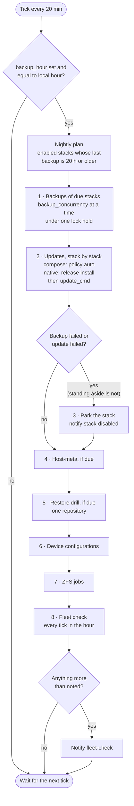
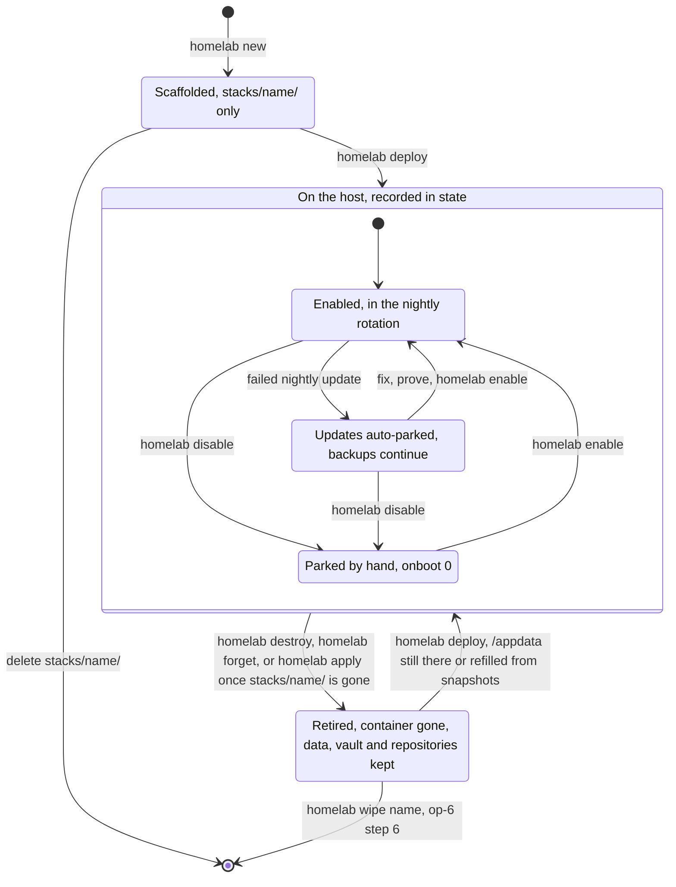
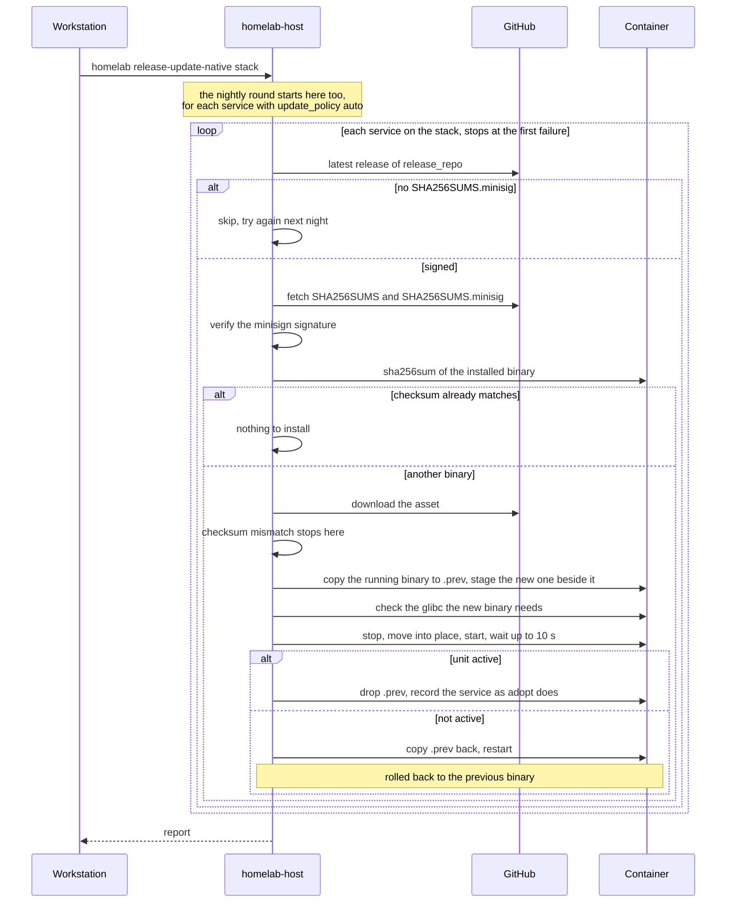
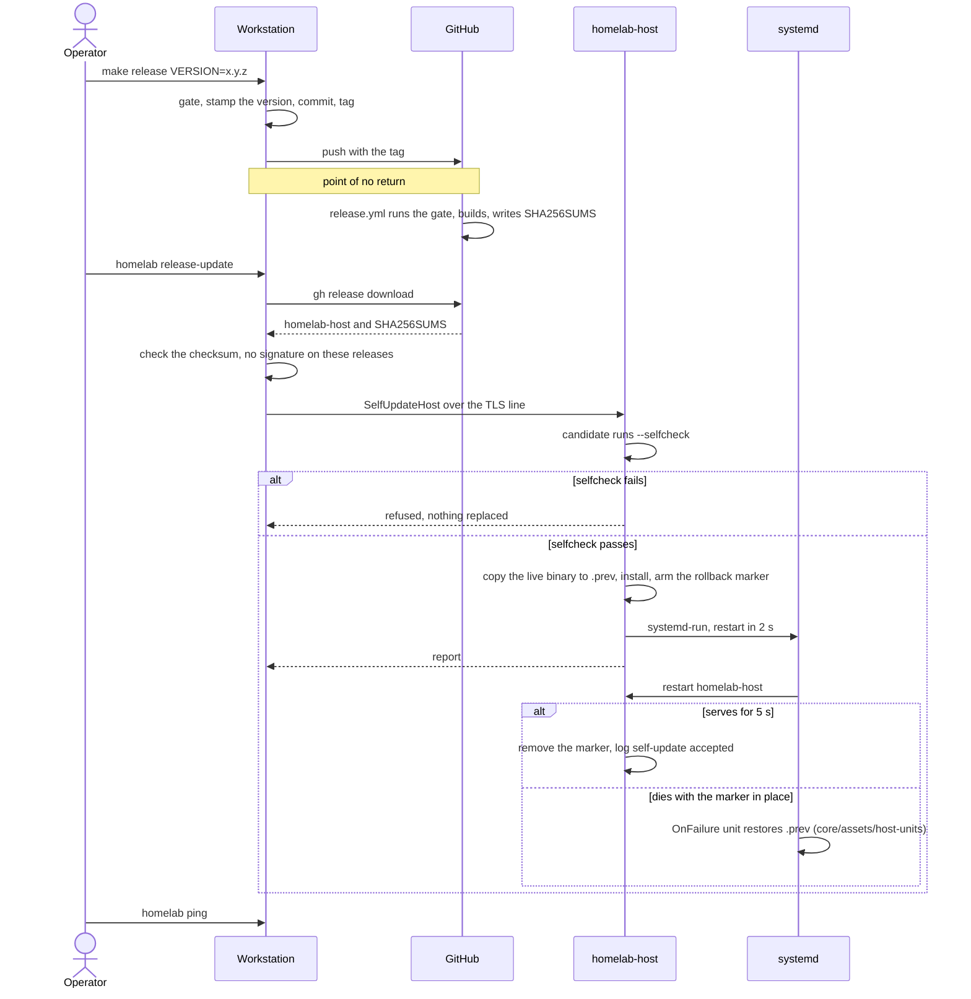
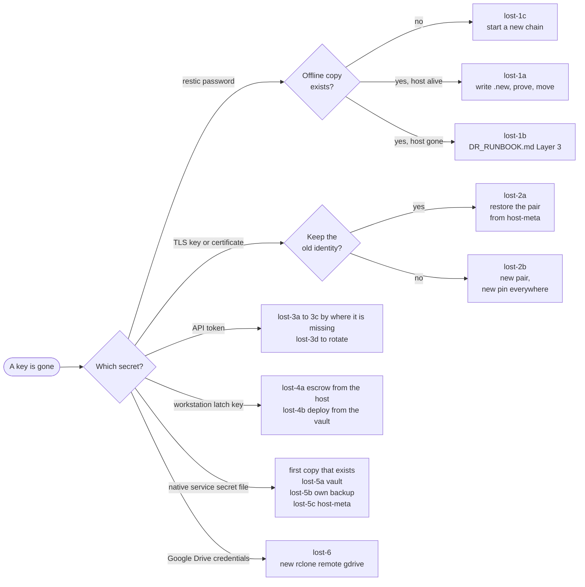
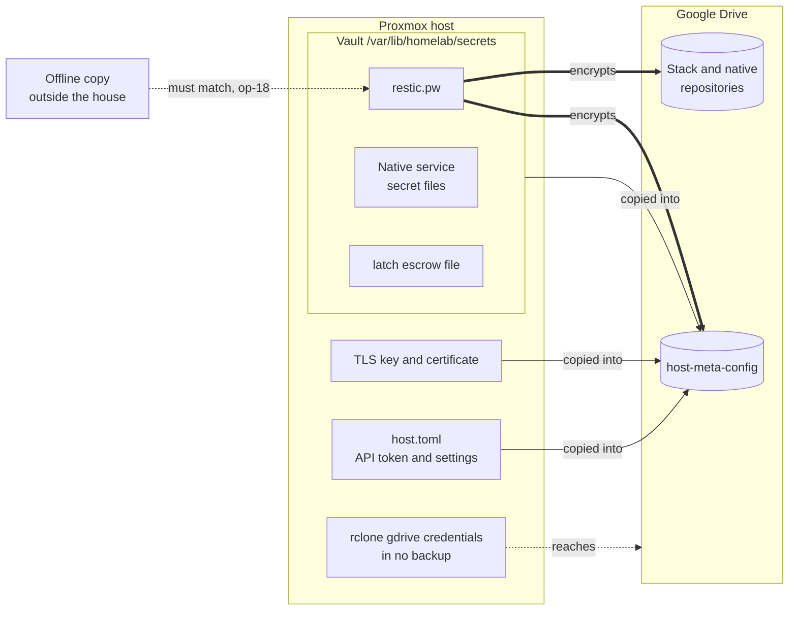

# Operations runbook

The recurring work on the homelab orchestrator, as numbered procedures.
Every procedure says which terminal each step runs in, where its point of
no return is, and how to check the result. Behaviour is cited as
`file:line` against the release commit of v3.58.3 on `main` (`5bebcf6`,
`Cargo.toml:6`), so a changed line leads straight to the paragraph that
depends on it. The parts that describe the declarative cleanup of
2026-09-27 (op-2 step 1, op-4, op-5's diagram, op-6, op-7's last part, the
retired rows in op-17 and op-19) cite commit `ad03664` instead; that code
is newer than the v3.58.10 release, so the host needs a build that contains
it before `homelab apply`, `homelab wipe` and the removals below exist
there.

Not in this document:

- losing the whole Proxmox host: [DR_RUNBOOK.md](DR_RUNBOOK.md), generated
  by `homelab runbook`;
- diagnosing a fault: [DEBUGGING_GUIDE.md](DEBUGGING_GUIDE.md);
- what each feature does: [USER_GUIDE.md](USER_GUIDE.md);
- changing the code, gates and hooks: [DEVELOPMENT.md](DEVELOPMENT.md);
- writing a preset: [PRESET_GUIDE.md](PRESET_GUIDE.md).

Quoted messages are written as `"..."` and are exact substrings of the
source; `<...>` marks a value the program fills in.

| # | Procedure |
|---|---|
| op-0 | Conventions: terminals, credentials, one operation at a time |
| op-1 | The nightly round: what runs, in which order |
| op-2 | The morning check |
| op-3 | Add a compose stack |
| op-4 | Change a compose stack: redeploy, update, patch, resize |
| op-5 | Park and unpark a stack |
| op-6 | Remove a stack, and wipe what it kept |
| op-7 | Add a native service |
| op-8 | Update a native service |
| op-9 | Release the orchestrator and roll it out |
| op-10 | Back up and restore a compose stack on demand |
| op-11 | Restore a native service's data (by hand) |
| op-12 | The host's own backup (host-meta) |
| op-13 | ZFS snapshots and replication |
| op-14 | Golden templates |
| op-15 | After a power cut |
| op-16 | Credentials: inventory and renewal |
| op-17 | A key is gone: every copy, and how to put one back |
| op-18 | Prove the offline restic password |
| op-19 | Known discrepancies between messages and behaviour |

---

## op-0 · Conventions

**Two terminals.**

- *Workstation* (bash): the machine with this repository and the `homelab`
  client. Run `homelab` from the repository root. `new`, `presets`,
  `runbook` and `check` read `stacks/` and `presets/` relative to the
  working directory (`client/src/main.rs:311`, `:585`, `:650`, `:906`), and
  the host address and certificate pin come from `config/client.toml`,
  found by walking up from the working directory
  (`client/src/repo_config.rs:62-73`, `:103-120`).
- *Host* (root shell on Proxmox): `restic`, `rclone`, `pct`, `systemctl`,
  `journalctl`. The daemon is the systemd unit `homelab-host`
  (`core/src/ops/selfupdate.rs:46`), its config `/etc/homelab/host.toml`
  (`host/src/main.rs:372`), its state directory `/var/lib/homelab`
  (`host/src/main.rs:426-429`). `<proxmox-host>` below is that machine; the
  client reaches it at the `host` in `config/client.toml`
  (`config/client.toml:15`).

**The client's token.** Read from `HOMELAB_TOKEN` in the environment, then
`~/.config/homelab/env`, then `./.env`; the first place that sets a key wins
(`client/src/main.rs:45-87`). Every verb except `help`, `plan`, `runbook`,
`dashboard`, `presets`, `export`, `import` and `tui --offline` stops with
`"HOMELAB_TOKEN is not set"` when there is none
(`client/src/main.rs:144-150`).

**One operation at a time.** Every mutating operation takes the host's one
lock (`host/src/main.rs:2980`); the nightly backup phase holds it for its
whole batch (`host/src/main.rs:2188`). A command typed during the backup
hour waits for the batch.

**Client newer than host.** A mutating command against an older host is
refused and the message ends in `"run 'homelab release-update' first"`
(`client/src/main.rs:1203-1213`). `release-update` itself is exempt
(`client/src/version.rs:15-30`).

**Questions.** A step that must ask (for example, an app is in use) cannot
be answered from the command line: the CLI prints the question and the host
answers `Unattended` after `ask_timeout_s`, default 120 s
(`client/src/main.rs:1173-1182`, `host/src/main.rs:669-671`, `:1750-1759`).
In the TUI the question takes the keyboard: `a` allows, `s` stops
(`client/src/tui/model.rs:624-633`).

**Abort-safety.** Each procedure marks its point of no return. The host
journals every step to `/var/lib/homelab/journal.jsonl` before it runs; an
operation cut off half way is logged at the next start with
`"re-running it is safe (idempotent)"` (`host/src/main.rs:1668-1692`,
`:1812-1823`) and shown by `homelab doctor` under "interrupted operations"
(`core/src/doctor.rs:178-185`).

**Branch.** Commits go to `main`.

---

## op-1 · The nightly round

Nothing to do by hand. This is what runs, so the morning can be read.

**When.** The scheduler wakes every 20 minutes (`host/src/main.rs:2260`)
and does nothing unless `backup_hour` is set and the host's local hour
(`date +%H`) equals it (`host/src/main.rs:2262-2284`). Without a
`backup_hour` the daemon logs `"scheduler idle (backup_hour not set)"` at
start (`host/src/main.rs:1854-1860`). `homelab config` prints the hour as
`nightly run : HH:00`, or `off` (`client/src/main.rs:1242-1246`).

To change the hour: TUI, Settings tab (key `5`), first row, Left/Right,
then `S` to save. The host writes it to `host.toml` and uses it from the
next tick, no restart (`client/src/tui/model.rs:945-1010`,
`host/src/main.rs:4064-4102`).

**Which stacks.** A stack is due when it is enabled and its last backup is
at least 20 hours old (`host/src/main.rs:1952-1954`, `:2008-2013`).

**In order, inside the backup hour:**

1. **Backups** of every due stack, `backup_concurrency` at a time (default
   3, `host/src/main.rs:675-677`), under one hold of the lock
   (`host/src/main.rs:2334-2363`).
   - Compose stack: containers labelled `com.homelab.backup.pause=true`
     are stopped, each owning app's paths go into its own repository
     `<restic_base>/<app>-config`, the stopped containers are started again
     whether or not the snapshot worked, then retention
     (`core/src/ops/backup.rs:296-708`).
   - Native service: a `tar` stream of its data straight into
     `restic --stdin`, repository `<unit>-config`
     (`core/src/ops/native.rs:591-627`).
   - An app in use makes the whole stack stand aside: nothing stopped, no
     snapshot, no timestamp, not a failure (`core/src/ops/backup.rs:397-415`,
     `:34-74`).
   - The phase ends with `"scheduler: backup phase took <time> for <n>
     stack(s), <k> at a time"` (`core/src/ops/backup.rs:250-267`).
2. **Updates**, one stack at a time (`host/src/main.rs:2365-2512`).
   - Compose: apps labelled `com.homelab.update.policy=auto` are pulled and
     recreated, with rollback (`host/src/main.rs:2476-2482`,
     `core/src/ops/update.rs:84-87`, `:126`).
   - Native: the orchestrator's release install for every service
     with `update_policy: auto` (`host/src/main.rs:2395-2408`), and the
     service's own `update_cmd` under supervision for every service with
     `update_policy: self` (`host/src/main.rs:2409-2418`; fix-148: one
     mechanism per policy). See op-8.
3. **Parking.** A stack whose backup failed, or whose update failed, is set
   to disabled and one notification goes out (`host/src/main.rs:2483-2511`,
   `core/src/ops/backup.rs:66-69`). See op-5.
4. **Host-meta**, the host's own backup, when due
   (`host/src/main.rs:2518-2539`). See op-12.
5. **Restore drill**: one repository per night (`restore_drill_interval_s`
   defaults to 20 hours since fix-62; it was 90 days), the one drilled
   longest ago first, over the stack and native repositories, `host-meta`
   and the device configurations. Every `.tar` that comes back must list
   with `tar -tf`. Each repository keeps its own record
   (`HostState.restore_drills`), so a failure stands until that repository
   passes (`core/src/ops/restoredrill.rs`, `run_restore_drill` in
   `host/src/main.rs`).
6. **Device configurations** from `device_backups` in `host.toml`, one GET
   per device into restic (`host/src/main.rs:2588-2609`).
7. **ZFS** snapshots and replication, when `zfs_jobs` is set
   (`host/src/main.rs:2612-2626`). See op-13.
8. **Fleet check**: the stored record held against the machine. It runs on
   every tick inside the backup hour, also when nothing was due, and sends
   a `fleet-check` notification when anything is more than "noted"
   (`host/src/main.rs:2628-2693`, `core/src/ops/fleetcheck.rs:501-507`).
   The hour has up to three ticks and this path does not go through the
   repeat damper (`host/src/main.rs:2679`), so the same findings can arrive
   more than once in one night.

The same round as one picture, from the scheduler's tick to the fleet check:



<sub>Source: `host/src/main.rs:2000-2035` (`nightly_plan`), `:2257-2695` (`scheduler_loop`), `core/src/ops/backup.rs:66-69` (`parks_the_stack`).</sub>

**Where results go.** Each operation posts to `notify_webhook` and falls
back to `notify_fallback_webhook` (`host/src/main.rs:2876-2936`). An
identical failure repeated inside 20 hours is damped; a success always goes
out (`host/src/main.rs:1807-1809`, `:2847-2855`, `core/src/notify.rs:45-57`). A failed operation writes an
incident bundle under `/var/lib/homelab/incidents`
(`host/src/main.rs:3077-3085`), listed by `homelab incidents`
(`host/src/main.rs:4255-4277`).

---

## op-2 · The morning check

Workstation, repository root. Read-only: stop at any step.

`homelab today` asks steps 1 to 4 in one go (fix-68): one list, most
severe first, one remedy per line, ending in `Nothing needs you` or
`N things need you`, exit 1 when something does. An incident bundle is on
that list while nothing on its stack has succeeded since
(`core/src/ops/today.rs`). The TUI shows the same list in its TODAY panel.
It needs a host that knows the verb; against an older one it refuses and
names `homelab release-update`. The steps below are the parts it merges.

1. `homelab check`. Prints `"fleet check: repo and reality agree"` or one
   block per finding with a `remedy:` line; exits 1 when there is a
   `broken` or `drift` finding (`noted` ones do not fail it since gap-32) (`host/src/main.rs:3189-3209`, `:3755-3760`). Run from the
   repository root: without stack files it checks only the host's half and
   says so (`client/src/main.rs:317-336`). Two findings to expect since
   2026-09-27: a `drift` line
   `"is in host state (vmid <n>) but has no stack file in the repository"`
   for a stack whose directory you deleted (op-6 route A;
   `core/src/ops/fleetcheck.rs:678-716`), and one `noted` line per retired
   stack, app or unit, naming the repositories, `/appdata` and vault paths
   still kept and the `homelab wipe` command for them
   (`core/src/ops/retired.rs:190-219`). `noted` needs nothing today; it is
   there so kept data is never forgotten (op-6 step 6).
2. `homelab doctor`. Host disk, state file, backup age per stack, the Drive
   remote, mirror lag, interrupted operations (`core/src/doctor.rs:45-188`).
3. `homelab incidents`. One directory per failed operation.
4. `homelab checks`. The questions only a person can answer; record one
   with `homelab checks answer <id> ok|nok [note]`, or accept a deliberate
   `nok` for a while with `homelab checks answer <id> accept <days> <reason>`
   (fix-65; `client/src/main.rs`).
5. Host, only when one of the above points there:

   ```sh
   journalctl -u homelab-host --since today --no-pager | grep -E 'scheduler|restore drill|fleet check|self-update'
   ```

**Worked example.** `homelab check` reports a broken `restore drill`
finding whose remedy reads `"check the repository and the password file"`
(`core/src/ops/restoredrill.rs:123-141`). The drill restores into a scratch
directory and judges by the largest file that came back
(`host/src/main.rs:2040-2083`), so this means a repository did not give
back real data. First prove the password (op-18), then look at that one
repository with `restic snapshots` on the host (op-10).

---

## op-3 · Add a compose stack

Workstation, repository root, unless stated.

1. **Pick a preset.** `homelab presets` lists the catalogue, local, no
   network (`client/src/main.rs:648-669`). Three lines of the real output
   on 2026-09-27:

   ```text
   mealie           512 MiB  Recipes + meal planning  [mealie]
   syncthing        512 MiB  Obsidian vault peer  [syncthing]
   uptime-kuma      512 MiB  Uptime monitoring  [uptime-kuma]
   ```

2. **Scaffold.**
   `homelab new <name> --preset <preset> --vmid <n>` with optional
   `--ram`, `--cores`, `--disk`, `--swap` and repeatable
   `--no-data <path>`, or TUI key `n` on the Dashboard or Stacks tab
   (`client/src/main.rs:556-647`, `client/src/tui/model.rs:852-872`). The
   vmid determines address and hostname (`client/src/main.rs:598-600`).
   Only `stacks/<name>/` is written.

   Worked example (name and vmid are illustrative; pick a vmid no stack
   uses):

   ```sh
   homelab new recipes --preset mealie --vmid 120
   ```

3. **Secrets.** Two ways, reported on every deploy:
   - latch: list the app under `latch_secrets:` in
     `stacks/<name>/lxc-compose.yml` and keep its `.env` in latch at
     `<name>/<app>/.env`. The latch project is rooted at `stacks/`; at
     deploy time the client runs
     `latch cat <stack>/<app>/.env --env $HOMELAB_LATCH_ENV --expand`
     (`client/src/spec.rs:303-412`). Without `HOMELAB_LATCH_ENV` the deploy
     stops with `"latch_secrets is set but HOMELAB_LATCH_ENV is not"`
     (`client/src/spec.rs:356-360`).
   - a plain `stacks/<name>/<app>/.env`, which git ignores (`.gitignore:1`).

   A local file wins over latch. Each deploy prints one line per app, for
   example `[env] mealie <- latch` or `"local .env (latch skipped)"`
   (`client/src/spec.rs:316-332`, `client/tests/latch_secrets_tests.rs:241-260`).
4. **Validate locally.** `homelab plan stacks/<name>`: needs no token and
   no connection to the host (`client/src/main.rs:142-147`), same validator
   as the deploy. Success prints
   `"✓ valid"` and `"would deploy vmid <n>: <k> file(s), <m> env(s)"`
   (`client/src/main.rs:673-691`).
5. **Deploy.** `homelab deploy stacks/<name>`, or in the TUI select the
   stack and press `p` (preview, Enter runs it) or `D` (runs now)
   (`client/src/tui/model.rs:669-689`, `:793`, `:851`).
   **Point of no return:** the container is created. Every empty `/appdata`
   directory is first refilled from its own latest snapshot if one exists
   (`core/src/ops/deploy.rs:355-452`); for a new app there is none and the
   log says `"is empty and has no snapshot"`.
6. **First backup.** `homelab backup stacks/<name>`. Creates the
   repositories (`restic init` answers "config file already exists" for an
   existing one, which the backup treats as normal; any other failure stops
   it, `init_repository` in `core/src/ops/backup.rs`) and records the time
   (`host/src/main.rs:3334-3350`). An app name that another stack already
   uses owns the same repository; the stack recorded later is refused
   (`core/src/ops/backup.rs:315-373`).
7. **Manual checks.** `homelab checks` lists what the deploy registered for
   a person to confirm (`core/src/state.rs:121-134`).
8. **Regenerate the DR runbook.** `homelab runbook` rewrites
   `docs/DR_RUNBOOK.md` from `stacks/` (`client/src/main.rs:899-913`).
9. Commit `stacks/<name>/` and `docs/DR_RUNBOOK.md` on `main`.

**Undo.** Before step 5, delete `stacks/<name>/`. After step 5, op-6.

---

## op-4 · Change a compose stack

Workstation, repository root.

| Change | Command | What it does |
|---|---|---|
| Edited compose files or `lxc-compose.yml` | `homelab deploy stacks/<name>` | Re-applies, and removes what the files no longer declare: files under `/opt/<name>/` (one `rm -f` each, never a directory, never `.env`), `rootfs/` units and timers (disabled first), native units dropped from `natives:` (data kept), mounts no longer declared (host directory kept), an old route file (`core/src/ops/deploy.rs:1044-1189`, `:782-848`, `:1937-1986`, `:2104-2143`). |
| Every changed stack at once | `homelab apply` | Deploys each stack whose files differ from what the host applied; one that fails stops the rest (`client/src/main.rs:704-791`). A stack whose directory is gone is offered for destruction (op-6 route A). |
| Delete what the repository dropped, without a deploy | `homelab prune-orphans stacks/<name>` | Asks for the stack name; removes the same files a deploy would, `rm -f` one by one. After any deploy since `ad03664` it finds nothing (`client/src/main.rs:1031-1063`, `host/src/main.rs:3557-3633`). |
| Remove an app | delete it from `apps:`, `homelab deploy stacks/<name>` | Its containers stop and `/opt/<name>/<app>` goes; its `/appdata`, repository and vault copy are kept and recorded as retired `<name>/<app>` (`core/src/ops/deploy.rs:2145-2182`, `:2630-2644`). Wipe them with op-6 step 6. |
| New image versions now | `homelab update stacks/<name> [app]`, TUI `U` | Every named app, whatever its policy; rollback when unhealthy; an app in use is skipped (`core/src/ops/update.rs:84-87`, `:157-170`). |
| New image versions nightly | label `com.homelab.update.policy=auto` | Only those apps (`core/src/ops/update.rs:126`). |
| OS packages in every managed container | `homelab patch` | `apt-get dist-upgrade` one container at a time; the first failure stops the run (`core/src/ops/patch.rs:22-73`); targets are the stacks in state (`host/src/main.rs:3371-3385`). |
| More RAM, cores or disk | edit `resources:`, then `homelab resize stacks/<name>` | Grows a running container; shrinking a running one is refused (`core/src/ops/resize.rs:1-4`). |
| Runaway guards on a container this suite did not build | `homelab guards <vmid>` | Log caps, journald limits, logrotate, weekly prune; refused on the no-touch list (`host/src/main.rs:3687-3727`). |

In the TUI, `U` updates the selected stack; lowercase `u` is the host
update (`client/src/tui/model.rs:780-800`).

---

## op-5 · Park and unpark a stack

The argument is the stack **name**, not a path
(`client/src/main.rs:422-436`).

Where parking sits in a stack's life, from scaffold to removal:



<sub>Source: `core/src/ops/enable.rs:24-104` (`set_enabled`, `AUTO_PARK_NOTICE`), `core/src/ops/deploy.rs:2596-2689` (a new record starts enabled, a redeploy keeps the flag), `host/src/main.rs:2428-2455`, `:2487-2511` (automatic park), `core/src/ops/destroy.rs:293-321` (the record goes, a retired record comes), `:345-403` (`forget`), `client/src/apply.rs` (`apply`), `core/src/ops/retired.rs:363-468` (`wipe`).</sub>

- **Park:** `homelab disable <stack>`, or `e` on the selected stack in the
  TUI (a toggle, `client/src/tui/model.rs:837-850`). The nightly round
  skips it and `onboot` is set to 0; no container is started or stopped
  (`core/src/ops/enable.rs:1-6`, `:56-65`). Transcript:
  `"nightly runs skip it, onboot off; containers left as they are"`
  (`core/src/ops/enable.rs:89`).
- **Unpark:** `homelab enable <stack>`. Back in the rotation; `onboot`
  returns to the manifest's `boot.onboot` (`core/src/ops/enable.rs:46-47`,
  `:56-65`).
- Parked stacks show `[OFF]` in the TUI
  (`client/src/tui/view/dashboard.rs:208`, `client/src/tui/view/stacks.rs:63`).

**Automatic park.** Since fix-59 (2026-09-27) a failed nightly update parks
the stack's automatic updates only (`HostState.updates_parked`,
`core/src/ops/enable.rs` `after_night`); the stack stays enabled and keeps its
nightly backup, and `onboot` and the running containers are left alone. A
failed backup parks nothing. Before fix-59 the park set `enabled = false`,
which stopped the backups too.
The notification is named `stack-disabled-<stack>`
(`host/src/main.rs:2812-2828`). Its text is `AUTO_PARK_NOTICE`
(`core/src/ops/enable.rs`): the nightly backup still runs, updates wait
until `homelab enable`, onboot and the running containers left as they were.
Before
v3.58.4 it said "no onboot until re-enabled", which the automatic park never
did (gap-22).

After an automatic park:

1. Workstation: `homelab incidents`; host:
   `journalctl -u homelab-host --no-pager | grep FAILED`.
2. Fix the cause.
3. Prove it: `homelab backup stacks/<name>` (compose) or
   `homelab backup-native <name>` (native).
4. `homelab enable <name>`.

A backup, failed or stood aside, never parks a stack (fix-59,
`core/src/ops/enable.rs` `after_night`).

---

## op-6 · Remove a stack, and wipe what it kept

Two routes to the same destroy. Both ask for the stack name, back the stack
up first, and keep its data (step 5). Pick A when the repository should
say what runs, B when you want to remove one stack by its path.

**Route A: delete the directory, then apply.**

1. Workstation, repository root: `git rm -r stacks/<name>`, commit on
   `main`. Nothing changes on the host yet. `homelab check` now reports
   `"but has no stack file in the repository"` for it (op-2).
2. `homelab apply`. It builds every remaining stack first and stops with
   `"nothing applied"` if one does not build (a missing latch key does
   that, op-17 lost-4) (`client/src/main.rs:733-756`). It deploys what
   changed, then lists the stack as
   `✗ <name> — in host state, no <dir>/<name>/` (`<dir>` is `stacks`) and asks
   `Type the stack name '<name>' to destroy it:`. Enter keeps it and says
   `"nothing destroyed"` (`client/src/main.rs:792-827`). Go to step 3.

**Route B: destroy by path.**

1. Workstation, repository root: `homelab destroy stacks/<name>`. It asks
   `Type the stack name '<name>' to confirm destroy:`; anything else stops
   it with `"name mismatch"` and nothing happens
   (`client/src/main.rs:1065-1135`). With the directory present it builds
   the full deploy spec, so a stack with `latch_secrets` needs a working
   latch key here (`client/src/main.rs:1100`, `client/src/spec.rs:86-117`).
   When the directory is already gone it destroys from the manifest the host
   recorded and needs no latch (`client/src/main.rs:1070-1099`).

**Then, either route:**

3. The host checks the name, the no-touch list and the live hostname,
   and **backs the stack up first**. If that backup fails it refuses with
   `"refusing to destroy"`; `--no-backup` skips the backup and the message
   calls that `"a decision, not a retry"`
   (`core/src/ops/destroy.rs:58-159`). A stack recorded without a manifest
   (adopted, never deployed) cannot be destroyed from the record: the host
   answers `"has no manifest recorded in host state"`
   (`core/src/ops/destroy.rs:432-437`); remove its container by hand, then
   `homelab forget <name>`.
4. **Point of no return:** `pct destroy --purge`. Then the metrics target,
   the Grafana dashboard, the gateway route, the state record and its manual
   checks go, and the front page and the Uptime Kuma host list are
   rewritten without it; the seeder removes the host monitor within its hour
   (`core/src/ops/destroy.rs:176-332`, `core/src/ops/fleetfiles.rs:236-271`,
   `stacks/uptime/kuma-seeder/docker-compose.yml`).
5. What survives: `/appdata/<name>/`, the vault
   `/var/lib/homelab/secrets/<name>/`, the restic repositories and the
   intent repo history. The destroy records them in state as retired
   (`core/src/ops/destroy.rs:299-316`, `core/src/ops/retired.rs:59-102`),
   and every `homelab check` names them in a `noted` line until step 6. A
   redeploy of the same stack uses them and clears the record
   (`core/src/ops/retired.rs:175-180`).
6. **Wipe, only when sure. Irreversible.** Workstation:
   `homelab wipe <name>`. It prints the list first and deletes nothing:

   ```text
   wipe '<name>' deletes, permanently:
     restic repository  <owner>-config
     /appdata directory /appdata/<name>/<owner>-config
     vault copy         /var/lib/homelab/secrets/<name>
   ```

   then asks `Type '<name>' to delete all of the above, permanently:`
   (`client/src/main.rs:831-865`, `core/src/ops/retired.rs:237-255`).
   Anything a managed stack still uses is listed as `KEPT` and left. The
   host purges each repository with `rclone purge`, removes the directories
   with `rm -rf --`, and drops the record last; a failure keeps the record,
   so running it again continues (`core/src/ops/retired.rs:363-468`). An
   app or native unit that left a stack still running is wiped the same way
   as `homelab wipe <name>/<app>`.

   Only when the wipe refuses with `"is not an rclone remote"` (a
   `restic_base` other than `rclone:...`), remove the repositories by hand
   on the host with the tool for that backend, then run the wipe again for
   the rest.

   Older host-meta snapshots keep a copy of the vault directory until their
   retention forgets them (op-12).
7. Workstation: `homelab runbook`, commit on `main` (route B: also
   `git rm -r stacks/<name>`).

**A record whose container is already gone:** `homelab forget <stack>`.
Refused with `"still names a live container"` while any container carries
the recorded hostname; touches no container. Otherwise it runs step 4
without the `pct destroy` and records the stack as retired, so step 6
applies (`core/src/ops/destroy.rs:334-403`, `host/src/main.rs:3638-3644`).

**Worked example: route A for the drill stack.** `git rm -r stacks/drill`,
commit, `homelab apply`, type `drill`. The drill stack declares no storage,
so step 3 logs
`"declares no storage, so there is nothing to back up from the host"`
instead of taking a backup (`core/src/ops/destroy.rs:128-143`). Its only
service is stateless (`stacks/drill/drillsvc/service.yml:11`), so the retired
record names no repository and no `/appdata`, only the vault;
`homelab wipe drill` then deletes `/var/lib/homelab/secrets/drill` and the record.

---

## op-7 · Add a native service

A native service is a binary under systemd in its own container, no
docker. Worked example throughout: `stacks/almanac`.

**Files** (workstation):

- `stacks/<stack>/lxc-compose.yml` with `native_only: true`, `apps: []`,
  `natives: [<unit>]` and one `storage:` entry per service with
  `app: <unit>` (`stacks/almanac/lxc-compose.yml:23`, `:73-87`).
- `stacks/<stack>/service.yml` for one service, or
  `stacks/<stack>/<unit>/service.yml` when several share the container
  (`client/src/spec.rs:189-198`; `stacks/kyu` has both shapes). Rules:
  hostname `<vmid>-app-<stack>`, `data_dirs` or `stateless: true`,
  `release_repo` as `owner/name`, and `update_policy: auto` only with a
  `release_repo` (`core/src/native.rs:101-187`).
- `stacks/<stack>/<unit>/<unit>.service`, the unit file. The deploy refuses
  a native unit without it (`core/src/ops/deploy.rs:2126-2137`).

**Steps:**

1. `homelab plan stacks/<stack>`. For a unit with `release_repo` this also
   fetches and verifies the newest release through `gh`, because it builds
   the full spec (`client/src/spec.rs:162`, `:187-237`).
2. `homelab deploy stacks/<stack>`. **Point of no return:** the container
   is created. The deploy writes the unit, creates its `User=`, installs
   the binary only where none exists, and starts the unit only when every
   `EnvironmentFile=`/`LoadCredential=` file and the binary are present;
   otherwise the log says `"NOT started"` and names what is missing
   (`core/src/ops/deploy.rs:2097-2291`). Binaries come from signed
   releases only (`client/src/release.rs:75-77`).
3. A first install has no env file anywhere yet; it cannot be invented
   (`core/src/ops/deploy.rs:2284-2287`). Host, with the path from the
   unit's `EnvironmentFile=` and the user from its `User=`:

   ```sh
   pct push <vmid> ./<file> <EnvironmentFile path> --perms 600
   pct exec <vmid> -- chown <user>:<user> <EnvironmentFile path>
   ```

4. `homelab deploy stacks/<stack>` again: the log says the unit is not
   running and starts it (`core/src/ops/deploy.rs:2323-2350`).
5. `homelab adopt stacks/<stack>` (or `stacks/<stack>/<unit>` per service).
   Refuses unless the unit is active; records the service so the nightly
   round backs it up and updates it from tonight
   (`core/src/ops/native.rs:31-240`). A deploy keeps registered services
   but never registers new ones (`core/src/ops/deploy.rs:2368-2378`).
6. `homelab deploy stacks/<stack>` a third time. Only a deploy that finds
   the unit **active** copies its env and credential files into the vault,
   under the file's parent directory and name, for example
   `/var/lib/homelab/secrets/kyu/kyu-runner-config/token.env`
   (`core/src/ops/deploy.rs:164-180`, `:2297-2318`). Until this run the env
   file exists in one place.
7. `homelab backup-native <stack>`, `homelab runbook`, commit on `main`.

Instead of steps 2 to 5 for the binary, `homelab install-native
stacks/<stack>[/<unit>] [<tag>]` installs binary and unit into an existing
container, keeps the previous binary, rolls back when the new one does not
come up, and adopts at the end (`client/src/main.rs:192-287`,
`core/src/ops/native.rs:265-507`).

**Remove one native service from a stack that stays** (workstation,
repository root):

1. Delete the unit from `natives:` in `stacks/<stack>/lxc-compose.yml`, and
   its directory `stacks/<stack>/<unit>/`.
2. `homelab deploy stacks/<stack>`. **Point of no return:** step
   `retire dropped` runs `systemctl disable --now <unit>`, removes
   `/etc/systemd/system/<unit>.service` and the program, and reloads
   systemd; the log says `"left the stack file — stopped and disabled"` and
   `"data directories and its restic repository are kept"`. The unit leaves
   the stack's record, so the nightly round stops backing it up and
   updating it (`core/src/ops/deploy.rs:1107-1189`, `:2611-2629`).
3. Its data inside the container, its `<unit>-config` repository and its
   vault copies are kept and recorded as retired `<stack>/<unit>`
   (`core/src/ops/retired.rs:147-172`). `homelab check` names them; delete
   them only when sure with `homelab wipe <stack>/<unit>` (op-6 step 6).

Only a unit an earlier version of the stack file listed in `natives:` is
retired this way. One that `homelab adopt` registered and no stack file ever
named is left running (`core/src/ops/deploy.rs:285-297`, test
`an_adopted_unit_the_stack_never_declared_is_not_retired`).

---

## op-8 · Update a native service

| Route | What runs | Which services |
|---|---|---|
| Nightly release install | Host asks the GitHub API for the latest release, requires `SHA256SUMS.minisig` signed with key 1C88AB06D43C0B16, compares the checksum with the installed binary, installs under an armed rollback (`core/src/ops/native.rs:919-1131`, `core/src/release_sig.rs:10-40`) | only `update_policy: auto` (`host/src/main.rs:2395-2399`) |
| Nightly self-update | the service's own `update_cmd`; binary preserved, restart only when it changed, 20 s to come up then a settle window that also watches `NRestarts`, rollback from outside (`core/src/ops/native.rs:701-720`, `:1174-1333`) | services with an `update_cmd` and `update_policy: self` only; never `auto` (fix-148) or `manual` (fix-58, `NativeServiceManifest::nightly_updates`) |
| `homelab release-update-native <stack>` | the release install, now | every service on the stack, policy not consulted (`host/src/main.rs:3521-3555`) |
| `homelab install-native stacks/<stack>/<unit> [<tag>]` | one service, latest or a named tag, downloaded and verified on the workstation with `gh` (`client/src/release.rs:75-173`) | the one named |
| `homelab update-native <stack>` | every `update_cmd`, now | every service on the stack |

Today `kyu` and `kyu-runner` are `auto`, `http-switchboard` and `almanac`
are `manual` (`stacks/kyu/service.yml:52`,
`stacks/kyu/kyu-runner/service.yml:39`,
`stacks/kyu/http-switchboard/service.yml:39`, `stacks/almanac/service.yml:73`).

**Signatures.** An unsigned release is skipped by the nightly round with
`"is not signed yet"` and tried again the next night
(`core/src/ops/native.rs:982-993`); the workstation refuses one with
`"is not signed (no <asset>)"` (`client/src/release.rs:145-156`), where
the asset is `SHA256SUMS.minisig` (`core/src/release_sig.rs:15`).

The release install, as `homelab release-update-native` and the nightly round run it for each service:



<sub>Source: `core/src/ops/native.rs:935-1135` (`release_update`), `:265-507` (`install_native`), `core/src/release_sig.rs:19-40` (`verify_sums`), `host/src/main.rs:3522-3548`, `:2395-2408`.</sub>

**A deploy never upgrades.** An installed binary is left in place and the
log says `"already installed, not shipped"`
(`core/src/ops/deploy.rs:2175-2197`).

**Outcomes to recognise:** `"rolled back to the previous binary"` with
either `"service restored and active"` or `"ROLLBACK ALSO FAILED"`
(`core/src/ops/native.rs:432-448`, `:1270-1282`).

**Worked example: hold one service on an older release.**

1. Workstation: `homelab install-native stacks/kyu/http-switchboard <signed-tag>`.
2. Its `update_cmd` still runs every night and is the service's own
   updater. To keep the older version, remove `update_cmd` from
   `stacks/kyu/http-switchboard/service.yml`, then refresh the host's copy
   with `homelab adopt stacks/kyu/http-switchboard`. The nightly log then
   says `"the manifest the host has"` and that it carries no `update_cmd`
   (`core/src/ops/native.rs:1186-1209`).
3. Do not use `homelab release-update-native kyu` meanwhile: it installs
   the latest release of every service on the stack, this one included.

---

## op-9 · Release the orchestrator and roll it out

Workstation, repository root, on `main`, after `make hooks` once per clone
(`Makefile:25-29`).

1. **Rehearse.** `make release VERSION=x.y.z DRY=1`. Checks the version
   format, a clean tree, that the tag is new, and the CI verdict on `HEAD`;
   ends with `"version and tag checks passed; the gate (fmt, clippy, tests)
   was NOT run; nothing tagged or pushed"` (`Makefile`; it said "every check
   passed" until gap-29, while the gate never ran). Refusals: `"working tree not clean"`,
   `"already exists"`, `"refusing: CI on HEAD says"`.
2. **Release.** `make release VERSION=x.y.z`. Runs `make gate`, stamps the
   version, commits `release: vx.y.z [meta]`, tags and pushes
   (`Makefile:105-118`). **Point of no return:** the push. The tag starts
   `.github/workflows/release.yml`, which runs the gate again and
   publishes `homelab-host`, `homelab` and `SHA256SUMS`
   (`.github/workflows/release.yml:6-40`). Watch with `gh run watch`.
3. **Roll out to the host.** `homelab release-update` (newest) or
   `homelab release-update vx.y.z`; or TUI key `u` when the dashboard shows
   `"HOST UPDATE <tag> available"` (`client/src/main.rs:808-834`,
   `client/src/tui/model.rs:780-792`, `client/src/tui/view/mod.rs:601-605`).
   The client downloads with `gh`, checks the checksum, and ships the
   binary over the line. There is no signature on the orchestrator's own
   releases, only the checksum (`client/src/release.rs:55-62`).
4. On the host: the candidate must pass `--selfcheck` before anything is
   replaced; then the live binary is copied to
   `/usr/local/bin/homelab-host.prev`, the new one installed, a rollback
   marker armed and a restart scheduled 2 s later
   (`core/src/ops/selfupdate.rs:39-131`). The new daemon removes the marker
   after 5 s of serving and logs `"self-update accepted"`
   (`host/src/main.rs:1882-1891`).
5. **Verify.** `homelab ping` prints the host version and `"link up"`
   (`client/src/main.rs:1183-1194`).
6. **New client** on every workstation, from the verified release asset:

   ```sh
   cd "$(mktemp -d)"
   gh release download vx.y.z --repo kennypassenier/homelab -p homelab -p SHA256SUMS   # repo: client/src/release.rs:10
   sha256sum -c --ignore-missing SHA256SUMS
   install -m 755 homelab ~/.cargo/bin/homelab
   homelab help | head -1
   ```

   or from the tagged tree with `make install` (`Makefile:131-138`).

The same path as a sequence, including the rollback the host arms:



<sub>Source: `Makefile:51-119` (`release`), `.github/workflows/release.yml:6-40`, `client/src/main.rs:808-834`, `client/src/release.rs:55-62`, `core/src/ops/selfupdate.rs:51-131`, `host/src/main.rs:1882-1891`.</sub>

**Rollback.** `core/src/ops/selfupdate.rs:1-7` describes an `OnFailure=`
unit on the host that restores `.prev` while the marker is still there.
The unit and its script ship inside the binary (`core/assets/host-units/`)
and every self-update puts them in place; `homelab doctor` reports a
`host units` line when they differ. Check it is wired:

```sh
systemctl show homelab-host -p OnFailure
```

By hand, host:

```sh
install -m 755 /usr/local/bin/homelab-host.prev /usr/local/bin/homelab-host
systemctl restart homelab-host
```

**Without GitHub.** Workstation: `make host-binary` (Debian 12 build in
docker, `Makefile:45-49`), then
`homelab self-update target-debian/release/homelab-host`
(`client/src/main.rs:835-855`).

---

## op-10 · Back up and restore a compose stack on demand

**Backup.** `homelab backup stacks/<name>`, or TUI `B`. Sends the manifest
only; no secrets and no latch key needed (`client/src/main.rs:749-757`,
`client/src/spec.rs:68-84`).

**Restore to latest.** `homelab restore stacks/<name>`, or TUI `R`; both ask
for the stack name first, `--yes` answers it for scripts, and the host
refuses a request without it (fix-64, `restore_confirmed` in
`core/src/ops/backup.rs`). The host checks every owning app's repository
holds a snapshot and that there is room for a copy of the current data,
stops every app (`docker compose down`), copies the current data to
`/var/lib/homelab/pre-restore/<stack>-<unix time>/` (kept; delete it by hand
once the restore is proven; `--no-safety-copy` skips it), then
(**point of no return**) runs
`restic restore latest --target /` per repository, starts every app again
even when the restore failed, and verifies they run
(`core/src/ops/backup.rs:803-962`).

**Restore to a named snapshot.** `homelab restore stacks/<name> <id>`. The
id must exist in **every** owning app's repository, otherwise the restore
stops before anything is stopped with `"is not in the repository for"`
(`core/src/ops/backup.rs:836-880`). A restic snapshot id belongs to one
repository, so on a stack with more than one owning app only `latest`
passes. One app to an older snapshot, by hand, on the host:

```sh
export RESTIC_REPOSITORY=rclone:gdrive:homelab-backups/<app>-config
export RESTIC_PASSWORD_FILE=/var/lib/homelab/secrets/restic.pw
export RESTIC_CACHE_DIR=/var/lib/homelab/restic-cache
restic snapshots                                        # read-only: pick <id>
pct exec <vmid> -- sh -c 'cd /opt/<stack>/<app> && docker compose down'
restic restore <id> --target / --include <host_path of that app>
pct exec <vmid> -- sh -c 'cd /opt/<stack>/<app> && docker compose up -d'
```

The repository layout, password file and cache directory are the ones the
backup uses (`core/src/ops/backup.rs:32`, `:88-105`, `:124-134`).

---

## op-11 · Restore a native service's data (by hand)

The procedure is DR_RUNBOOK.md Layer 4, "A native stack"
(`client/src/spec.rs:1127-1142`). In short, and why:

- `homelab restore` refuses a native stack (gap-28, since v3.58.4). The
  nightly snapshot of a native service is one tar stream stored as
  `/<unit>-data.tar` (`core/src/ops/native.rs:611-615`); the compose route's
  `restic restore <snapshot> --target /` would write that tar file to the
  host's `/` and unpack nothing, which is what it did before the refusal. Where
  restic stores a stdin snapshot was checked with restic 0.19.1 on the
  workstation: `restic ls --json` reports the path `/almanac-data.tar`; the host's
  restic version may differ.
- The archive holds paths without the leading `/`
  (`appdata/almanac/almanac-config/...`): GNU tar strips it from the
  absolute paths the backup passes (`core/src/ops/native.rs:611-613`).
  Unpack it inside the container so owners stay the container's own.
- Since fix-63 (2026-09-27) the nightly backup refuses a native service whose
  data directories hold no files while its repository has snapshots, and the
  refusal names this procedure. That is what a rebuilt container looks like
  before this procedure has run; before the guard, one night was enough to
  make the empty state the latest snapshot. The deploy still starts the unit
  on empty directories, so the service runs empty until this is done.

Worked example, host, almanac on CT 112:

```sh
export RESTIC_REPOSITORY=rclone:gdrive:homelab-backups/almanac-config
export RESTIC_PASSWORD_FILE=/var/lib/homelab/secrets/restic.pw
export RESTIC_CACHE_DIR=/var/lib/homelab/restic-cache
restic snapshots --path /almanac-data.tar
restic dump --path /almanac-data.tar latest /almanac-data.tar | tar -tvf - | head   # read-only look
pct exec 112 -- systemctl stop almanac                                              # point of no return
restic dump --path /almanac-data.tar latest /almanac-data.tar | pct exec 112 -- tar -xf - -C /
pct exec 112 -- systemctl start almanac
```

- **almanac:** after a restore, compare
  `ls /appdata/almanac/almanac-config/profiles/` with the sources retired
  since the snapshot (DR_RUNBOOK.md Layer 4, `client/src/spec.rs:1143-1149`).
- **kyu:** its snapshot is the newest of kyu's own nightly copies, not the
  live database (`stacks/kyu/service.yml:37-48`). Put the copy back as
  `/appdata/kyu/kyu-config/kyu.db` and delete any `kyu.db-wal` and
  `kyu.db-shm` beside it (`stacks/kyu/service.yml:43-47`). `kyu.env` is not
  in that snapshot (op-17, lost-5).

No test in this repository exercises this procedure.

---

## op-12 · The host's own backup (host-meta)

**What it holds** (`core/src/ops/backup.rs:964-1087`):

| Path | What it is |
|---|---|
| `/var/lib/homelab/secrets` | `restic.pw`, the per-stack vault, anything else put there |
| `/var/lib/homelab/state.json` | what is deployed where |
| `/var/lib/homelab/tls-cert.pem`, `tls-key.pem` | the daemon's TLS identity |
| `/var/lib/homelab/repo` | the intent repo with its history |
| `/etc/homelab/host.toml` | token and every setting |
| three SMART collector files | only those present |

**Repository:** `rclone:gdrive:homelab-backups/host-meta-config`
(`core/src/ops/backup.rs:94`, `:1010-1021`). It is encrypted with the
`restic.pw` it contains; see op-17.

**Not in it:** the rclone configuration that holds the Google Drive
credentials, the `homelab-host` binary, and the systemd units. Nothing in
the list above names them (`core/src/ops/backup.rs:1056-1065`).

**When:** nightly when due (op-1 step 4), and on demand with
`homelab backup-host-meta` (`host/src/main.rs:3392-3416`).

**Nobody watches it.** No fleet-check finding and no doctor line reads its
age: `last_host_meta` is written by the scheduler and by
`homelab backup-host-meta`, and read only by the nightly plan
(`core/src/state.rs:113-117`, `host/src/main.rs:2014-2023`, `:2531`,
`:3408`). Since fix-62 the nightly restore drill takes `host-meta` in its
turn like any other repository (`all_drill_repos` in
`core/src/ops/restoredrill.rs`). A failure logs
`"scheduler: host-meta backup FAILED"` and sends the operation's
notification (`host/src/main.rs:2534-2538`, `:3038`).

**R12a · Check its age** (host, read-only):

```sh
export RESTIC_REPOSITORY=rclone:gdrive:homelab-backups/host-meta-config
export RESTIC_PASSWORD_FILE=/var/lib/homelab/secrets/restic.pw
export RESTIC_CACHE_DIR=/var/lib/homelab/restic-cache
restic snapshots --latest 1
restic ls latest /var/lib/homelab/secrets
```

**R12b · Drill it** (host; writes only to a scratch directory):

```sh
restic restore latest --target /root/hm-drill \
  --include /var/lib/homelab/secrets --include /etc/homelab/host.toml \
  --include /var/lib/homelab/tls-cert.pem --include /var/lib/homelab/tls-key.pem
diff -r /root/hm-drill/var/lib/homelab/secrets /var/lib/homelab/secrets && echo vault-same
cmp /root/hm-drill/etc/homelab/host.toml /etc/homelab/host.toml && echo config-same
cmp /root/hm-drill/var/lib/homelab/tls-key.pem /var/lib/homelab/tls-key.pem && echo key-same
rm -rf /root/hm-drill
```

A difference is expected only for files changed since the snapshot's time.

---

## op-13 · ZFS snapshots and replication

**Declared** in `host.toml`, one table per job; nothing is discovered
(`core/src/ops/zfs.rs:1-16`, `:34-40`). The file that was live on
2026-09-02, kept as a test fixture (`host/src/main.rs:878-890`):

```toml
[[zfs_jobs]]
source = "HDD2TB"
target = "HDD18TB/replica/HDD2TB"
```

Put `[[zfs_jobs]]` tables after every top-level key: a key written below a
`[table]` header belongs to that table, and the daemon warns
`"is not a setting this daemon reads and is being ignored"`
(`host/src/main.rs:257-273`, `:391-398`).

**Runs** nightly (op-1 step 7) and on demand with `homelab zfs-replicate`
(`host/src/main.rs:3789-3808`). Per job: `zfs snapshot -r
<source>@homelab-YYYYMMDD-HHMM`, then an incremental send from the newest
snapshot both sides share, or a full seed when the target holds no
snapshots at all; received with `-x mountpoint` so a replica never claims
its source's live mountpoint; then retention on both sides with the same
tiers as restic, destroying only snapshots with the `homelab-` prefix
(`core/src/ops/zfs.rs:161-353`).

**When it refuses.** `"<source> and <target> share no snapshot, but
<target> already holds <n> snapshot(s) (subtree included). Re-seeding would
destroy that history, so this job stops here."`
(`core/src/ops/zfs.rs:281-291`). The incremental chain broke. Host:

1. Read-only look at both sides:

   ```sh
   zfs list -H -t snapshot -o name,creation -s creation -r <source> | tail
   zfs list -H -t snapshot -o name,creation -s creation -r <target> | tail
   ```

2. Find why the chain broke. A fresh seed is Kenny's decision, because it
   destroys the replica's history.
3. Only then: `zfs destroy -r <target>` (**point of no return**), and
   `homelab zfs-replicate` from the workstation.

`"no zfs jobs configured (zfs_jobs in host.toml)"` means `homelab
zfs-replicate` ran with no jobs (`core/src/ops/zfs.rs:171-176`).

---

## op-14 · Golden templates

1. `homelab templates` lists clonable template containers and OS tarballs
   (`host/src/main.rs:3899-3934`).
2. `homelab template-build <temp-vmid> <version> [--privileged] --base <vztmpl>`
   (`client/src/main.rs:505-543`). Always pass both numbers: a missing or
   unreadable one falls back to vmid 999 and version 1
   (`client/src/main.rs:507-508`). Always pass `--base`: the default base
   is a Debian 12 tarball (`core/src/ops/template.rs:47-51`). The temp vmid
   must be free and off the no-touch list (`core/src/ops/template.rs:113`).
3. The container at that vmid becomes the template, named
   `<os>-homelab-v<version>` with `-priv` for `--privileged`
   (`core/src/ops/template.rs:92-97`, `:291`). Stacks use it with
   `template: clone:<vmid>` (`core/src/ops/template.rs:317`). Build one
   unprivileged and one `--privileged`: a clone cannot change its privilege
   level (`core/src/ops/template.rs:40-44`).

---

## op-15 · After a power cut

Nothing to do in the normal case.

- Containers start per the `boot:` block of their stack file, `onboot` and
  `order` (example `stacks/almanac/lxc-compose.yml:56-58`), unless parked
  with `homelab disable` (op-5).
- The daemon logs each interrupted operation with
  `"re-running it is safe (idempotent)"` and, 3 s after start, sends a
  `host-online` notification carrying its version and anything left
  mid-flight (`host/src/main.rs:1812-1846`).
- Re-run whatever that notification or `homelab doctor` lists under
  "interrupted operations".

If the daemon does not come back: DEBUGGING_GUIDE.md, and DR_RUNBOOK.md
Layer 1.

---

## op-16 · Credentials: inventory and renewal

| Credential | Lives (code) | Renew or rotate |
|---|---|---|
| API bearer token | host: `token` in `host.toml`, or `HOMELAB_TOKEN` in the daemon's environment, which wins (`host/src/main.rs:409-419`); every workstation: `HOMELAB_TOKEN`, `~/.config/homelab/env` or `./.env` (`client/src/main.rs:45-87`) | op-17 lost-3d |
| TLS key and certificate | host: `/var/lib/homelab/tls-key.pem`, `tls-cert.pem`, made once, never renewed by the code (`host/src/tls.rs:14-54`) | op-17 lost-2 |
| TLS pin (public) | `pin` in `config/client.toml` (committed) and `~/.config/homelab/pin` per machine (`client/src/repo_config.rs:27-40`, `client/src/lib.rs:15-34`) | op-17 lost-2b |
| restic password | host: `/var/lib/homelab/secrets/restic.pw`, or `restic_password_file` in `host.toml` (`core/src/ops/backup.rs:124-134`, `host/src/main.rs:479`); one password for every repository (`core/src/ops/backup.rs:88-105`) | none in code; see op-17 lost-1 |
| Google Drive (rclone remote `gdrive`) | rclone's own configuration on the host; the backup target is `rclone:gdrive:homelab-backups` (`core/src/ops/backup.rs:127`) | `rclone config reconnect gdrive:`; `homelab doctor` shows `offsite (Drive)` as `token invalid/expired` when the listing fails (`core/src/doctor.rs:141-157`) |
| Notification bearers | `notify_auth_bearer`, `notify_fallback_auth_bearer` in `host.toml`, not editable from the TUI (`host/src/main.rs:65-85`, `:178-183`); written for each send to `/var/lib/homelab/secrets/notify-route-<n>.header` (`core/src/notify.rs:188-190`) | edit `host.toml`, restart (lost-3d step 2 shows the edit-then-restart pattern) |
| Device backup credential and pin | `cred_file` (curl `-K` format) and `pin` (`sha256//<base64>`) per `[[device_backups]]` (`core/src/ops/devicebackup.rs:37-73`) | see below |
| Stack app secrets | latch, or a local `stacks/<stack>/<app>/.env`; copy on the host in the vault (`client/src/spec.rs:303-412`, `core/src/ops/deploy.rs:1443-1449`), kept after the app or stack is removed until `homelab wipe` (op-6 step 6) | change in latch, then `homelab deploy stacks/<stack>` |
| Native service env and credential files | the path in the unit's `EnvironmentFile=`/`LoadCredential=`; copy in the vault (`core/src/ops/deploy.rs:2533-2554`), kept after the unit or stack is removed until `homelab wipe` | op-17 lost-5 |
| Workstation latch key | latch's credential store; this repository only calls `latch cat` (`client/src/spec.rs:374-378`) | op-17 lost-4 |
| GitHub CLI on the workstation | `gh` auth, used by `release-update`, `install-native` and native deploys (`client/src/release.rs:12-26`, `:92-117`) | `gh auth login` |

**Device pin after the device's certificate changes.** The pin is the
certificate's public-key hash, so a renewed certificate breaks it
(`core/src/ops/devicebackup.rs:59-72`). Host, with the address from that
device's `url`:

```sh
openssl s_client -connect <device-ip>:443 </dev/null 2>/dev/null \
  | openssl x509 -pubkey -noout | openssl pkey -pubin -outform der \
  | openssl dgst -sha256 -binary | base64
```

Set `pin = "sha256//<that value>"` in the `[[device_backups]]` table,
`systemctl restart homelab-host` straight after the edit (lost-3d explains
why), then `homelab backup-devices` from the workstation.

---

## op-17 · A key is gone: every copy, and how to put one back

The question this section answers for every secret the orchestrator
depends on: where are its other copies, what does each survive, and which
commands put one back. Losing the whole host is DR_RUNBOOK.md; this is one
key missing while the rest stands.

Which recipe applies, by the secret that is gone and what is still there:



<sub>Source: the recipes below; each cites its own code.</sub>

### Every copy the code knows of

| Secret | Copy | Survives | Does not survive |
|---|---|---|---|
| restic password | `/var/lib/homelab/secrets/restic.pw` (`core/src/ops/backup.rs:128`) | container loss | host root disk loss |
| | inside every `host-meta-config` snapshot (`core/src/ops/backup.rs:971`, `:1056-1064`) | host loss | cannot be opened without the password itself |
| | offline copy "in Kenny's Bitwarden": stated in the generated DR runbook, Layer 3 (`client/src/spec.rs:1071-1075`); no code reads or checks it | everything the house loses | nothing proves it matches until op-18 is run |
| TLS key and certificate | `/var/lib/homelab/tls-key.pem`, `tls-cert.pem` (`host/src/tls.rs:18-19`) | daemon reinstall | host root disk loss |
| | `host-meta-config` (`core/src/ops/backup.rs:973-974`) | host loss | loss of the restic password |
| TLS pin (public) | `config/client.toml` in git; `~/.config/homelab/pin` per machine; the daemon logs it at every start as `"TLS fingerprint SHA256:"` (`host/src/main.rs:1876`) | anything, via git | nothing to protect |
| API token | `host.toml` (`host/src/main.rs:409-412`) | daemon restart | host root disk loss |
| | the running daemon's memory, written back by a TUI settings save (`host/src/main.rs:524-652`, `:702-723`; test `settings_render_keeps_every_config_field`, `host/src/main.rs:963-1069`) | loss of the file while the daemon runs | a daemon restart |
| | `host-meta-config` (`core/src/ops/backup.rs:989`) | host loss | loss of the restic password |
| | every workstation's `~/.config/homelab/env` or `./.env` | host loss | reinstall of that machine |
| Workstation latch key | latch's credential store on the workstation; not handled by this repository | see latch's runbook | see latch's runbook |
| | an escrow file in `/var/lib/homelab/secrets/`: recorded in `docs/deployment/REGISTER.md` D105 (2026-09-02), not created by any code here; carried by `host-meta-config` because the whole directory is (`core/src/ops/backup.rs:971`) | host loss | loss of the restic password; useless without the escrow passphrase, which Kenny holds |
| Native service secrets (e.g. `latch.env`, `kyu.env`, `token.env`) | the live file under `/appdata/<stack>/<unit>-config/` on the host (bind mount) | container loss | host root disk loss |
| | vault `/var/lib/homelab/secrets/<stack>/<unit>-config/<file>` (`core/src/ops/deploy.rs:164-180`, `:2297-2318`); a flat `<stack>/<file>` from before fix-37 is still read when no two units share the name (`core/src/ops/deploy.rs:2244-2254`) | container loss | host root disk loss |
| | the service's own restic repository, when the file lies in `data_dirs` and the service has no `backup_from_newest` (`core/src/ops/native.rs:591-600`): yes for almanac, kyu-runner, http-switchboard; **no for kyu** (`stacks/kyu/service.yml:48`) | host loss | loss of the restic password |
| | `host-meta-config`, through the vault | host loss | loss of the restic password |
| Google Drive credentials (rclone) | rclone's configuration on the host only | container loss | host root disk loss: **in no backup this code makes** (`core/src/ops/backup.rs:1056-1065`) |
| Secrets of a retired stack, app or native unit | the vault paths in its retired record: the whole `/var/lib/homelab/secrets/<stack>` for a stack, the app's `.env` or the unit's files for an app or unit (`core/src/ops/retired.rs:59-172`); for a stack also its `/appdata` directories, where a native service's live env file sits, and its repositories | destroy, forget, and the deploy that dropped it: all keep them (`core/src/ops/retired.rs:1-15`) | `homelab wipe <key>`: every recorded vault path, `/appdata` directory and repository goes in one operation (`core/src/ops/retired.rs:408-449`); after that only older `host-meta-config` snapshots still hold the vault copy |

A wipe is the one command that removes several copies of a secret at once
on purpose. Before `homelab wipe` of a stack whose service might come back,
check the list it prints (op-6 step 6): a vault copy on it is the copy lost-5a
restores from, and after the wipe lost-5c (host-meta) is the only way back.

Everything offsite hangs on one password. Nothing in the code checks that
the password file exists: `homelab doctor` has no probe for it
(`core/src/doctor.rs:45-188`, `host/src/main.rs:4286-4396`).

The same dependency as a picture: the password sits inside the host-meta copy it encrypts, so the offline copy is the only way back in:



<sub>Source: `core/src/ops/backup.rs` (`backup_host_meta`, from line 1058; `BackupCfg` defaults at `:193-194`), `client/src/spec.rs:1094-1100`, `docs/deployment/REGISTER.md` D105 (escrow).</sub>

### lost-1 · The restic password is gone

**What breaks.** Every backup stops its paused containers, fails at the
snapshot, starts them again (`core/src/ops/backup.rs:545-645`), and the
night parks each due stack (op-5). Host-meta and the restore drill fail. The
dangerous one: a deploy onto an empty `/appdata` directory treats "no
readable snapshot" as a new app and starts it empty, logging
`"is empty and has no snapshot"` (`core/src/ops/deploy.rs:393-406`).
**Until lost-1 is done, deploy nothing whose `/appdata` is empty.**

**Never generate a new password over it.** Every repository that does not
exist yet would be created under the new password while all existing ones
stay locked under the old. Since v3.58.4 (gap-24) the backup reads what
`restic init` answers, and a repository created under a password that does
not open `host-meta-config` stops the run with a message naming it
(`same_password_as_host_meta` in `core/src/ops/backup.rs`); before that it
happened silently.

**lost-1a · Host alive, offline copy available.** Host, root, bash:

1. Which file is in use:

   ```sh
   grep -n '^restic_password_file' /etc/homelab/host.toml   # nothing = /var/lib/homelab/secrets/restic.pw
   ls -l /var/lib/homelab/secrets/restic.pw
   ```

2. Write the offline copy to a new file, never over the old path:

   ```sh
   install -d -m 700 /var/lib/homelab/secrets
   ( umask 077; read -rs PW; printf '%s' "$PW" > /var/lib/homelab/secrets/restic.pw.new; unset PW )
   ```

3. Prove it opens the key repository and one stack repository. Read-only:

   ```sh
   export RESTIC_PASSWORD_FILE=/var/lib/homelab/secrets/restic.pw.new
   export RESTIC_CACHE_DIR=/var/lib/homelab/restic-cache
   RESTIC_REPOSITORY=rclone:gdrive:homelab-backups/host-meta-config restic snapshots --latest 1
   RESTIC_REPOSITORY=rclone:gdrive:homelab-backups/<app>-config restic snapshots --latest 1
   ```

   restic answers `Fatal: wrong password or no key found` (exit 12,
   checked with restic 0.19.1) when the copy is wrong: stop here, the old
   state is untouched.
4. **Point of no return**, only after step 3 listed snapshots:

   ```sh
   mv /var/lib/homelab/secrets/restic.pw.new /var/lib/homelab/secrets/restic.pw
   chmod 600 /var/lib/homelab/secrets/restic.pw
   unset RESTIC_PASSWORD_FILE
   ```

5. Workstation: `homelab backup-host-meta`, then `homelab enable <stack>`
   for every stack the TUI shows `[OFF]` since the password went missing,
   then `homelab check`.

**lost-1b · Host gone.** DR_RUNBOOK.md Layer 3, after two things it assumes:
the offline password written to `/var/lib/homelab/secrets/restic.pw` as in
lost-1a step 2 (without `.new`), and an rclone remote named exactly `gdrive`
(lost-6), because the Drive credentials are in no backup.

**lost-1c · No copy anywhere.** Nothing written under that password can be
read, by anyone. There is no way to put it back. What remains is to start a
new chain: a new password file and a new `restic_base` in `host.toml`
(`host/src/main.rs:119-124`, `:475-486`), so new repositories do not
collide with the locked ones, then `systemctl restart homelab-host`, a
backup of every stack and `homelab backup-host-meta`.

### lost-2 · The TLS key or certificate is gone

**What happens.** The daemon makes a new pair whenever either file is
missing (`host/src/tls.rs:21`), at start and also whenever a client asks
for the fleet state, which the TUI does on refresh with `r`
(`host/src/main.rs:4196`, `client/src/tui/model.rs:779`). The next start serves it; every workstation then
refuses with `"certificate fingerprint mismatch"`
(`client/src/tls.rs:49-67`).

**Restore or remove the pair together.** With the certificate missing and
the key present, generation overwrites the certificate, then fails to
create the key file (`host/src/tls.rs:31-43`), and the daemon stops at
start (`host/src/main.rs:1870-1871`). From then on both files exist and do
not belong together, and nothing regenerates them.

**lost-2a · Put the old identity back** (every pin stays valid). Host; needs
the restic password (lost-1):

1. Stop the daemon so nothing regenerates while you work (not during the
   backup hour):

   ```sh
   systemctl stop homelab-host
   ```

2. Restore into a scratch directory; nothing live changes:

   ```sh
   export RESTIC_REPOSITORY=rclone:gdrive:homelab-backups/host-meta-config
   export RESTIC_PASSWORD_FILE=/var/lib/homelab/secrets/restic.pw
   export RESTIC_CACHE_DIR=/var/lib/homelab/restic-cache
   restic restore latest --target /root/tls-restore \
     --include /var/lib/homelab/tls-cert.pem --include /var/lib/homelab/tls-key.pem
   ls -l /root/tls-restore/var/lib/homelab/
   ```

3. **Point of no return**, install both:

   ```sh
   install -m 644 /root/tls-restore/var/lib/homelab/tls-cert.pem /var/lib/homelab/tls-cert.pem
   install -m 600 /root/tls-restore/var/lib/homelab/tls-key.pem /var/lib/homelab/tls-key.pem
   systemctl start homelab-host
   journalctl -u homelab-host -n 30 --no-pager | grep 'TLS fingerprint'
   rm -rf /root/tls-restore
   ```

4. Workstation: `grep '^pin' config/client.toml` shows the same
   fingerprint; `homelab ping` connects.

**lost-2b · Accept a new identity.**

1. Host:

   ```sh
   systemctl stop homelab-host
   rm -f /var/lib/homelab/tls-cert.pem /var/lib/homelab/tls-key.pem
   systemctl start homelab-host
   journalctl -u homelab-host -n 30 --no-pager | grep 'TLS fingerprint'
   openssl x509 -in /var/lib/homelab/tls-cert.pem -noout -fingerprint -sha256
   ```

   Both lines show the same colon-separated SHA-256 of the certificate
   (`host/src/tls.rs:56-68`).
2. Workstation, repository root: set `pin` in `config/client.toml` to that
   value, commit on `main`, push.
3. Every workstation, in this order: `git pull` in the repository, then
   `rm ~/.config/homelab/pin`, then `homelab ping` from the repository. It
   prints `"pinned host certificate SHA256:<fp> from <file>"`, the file
   being `config/client.toml` (`client/src/main.rs:1101-1117`,
   `client/src/repo_config.rs:29`). Deleting the pin before pulling adopts
   the old pin from the old file, and the next command then refuses with
   `"the host certificate pinned on this machine"`
   (`client/src/repo_config.rs:140-167`): delete it again after the pull.
4. Workstation: `homelab backup-host-meta`, so the offsite copy holds the
   new pair.

**Only a workstation's pin file is gone.** Nothing to do: the next command
run inside the repository takes the pin from `config/client.toml`
(`client/src/repo_config.rs:158-161`). Outside the repository it trusts
the first certificate it sees and says `"verify this matches the
fingerprint the host printed at boot"` (`client/src/main.rs:1143-1155`).

### lost-3 · The API token is gone

**lost-3a · Gone from one workstation.** Workstation (bash). The first line
that sets a key wins (`client/src/main.rs:79-81`), so remove a stale one
before adding:

```sh
sed -i '/^HOMELAB_TOKEN=/d' ~/.config/homelab/env 2>/dev/null
( umask 077; ssh root@<proxmox-host> "sed -n 's/^token *= *\"\(.*\)\"/HOMELAB_TOKEN=\1/p' /etc/homelab/host.toml" >> ~/.config/homelab/env )
homelab ping
```

If that adds nothing, the host may take its token from the environment:
`systemctl show homelab-host -p Environment` on the host.

**lost-3b · `host.toml` gone, daemon still running.** The daemon holds the
whole configuration in memory and a settings save writes all of it back,
token included (`host/src/main.rs:524-652`, `:702-723`; guarded by the test
`settings_render_keeps_every_config_field`, `host/src/main.rs:963-1069`).
Nothing needs the restic password.

1. Host: `mkdir -p /etc/homelab`.
2. TUI: Settings tab (`5`), `S`. Expect `"settings saved and applied"`
   (`host/src/main.rs:4084-4094`).
3. Host: `grep -c '^token' /etc/homelab/host.toml` prints 1.
4. Workstation: `homelab backup-host-meta`.

**lost-3c · `host.toml` gone and the daemon restarted.** It will not start:
`"FATAL: token must be set (>=16 chars) via <path> or HOMELAB_TOKEN"`
(`host/src/main.rs:409-419`). Restore it from host-meta. Host; needs the
restic password:

```sh
export RESTIC_REPOSITORY=rclone:gdrive:homelab-backups/host-meta-config
export RESTIC_PASSWORD_FILE=/var/lib/homelab/secrets/restic.pw
export RESTIC_CACHE_DIR=/var/lib/homelab/restic-cache
restic restore latest --target /root/hm --include /etc/homelab/host.toml
install -m 600 /root/hm/etc/homelab/host.toml /etc/homelab/host.toml   # point of no return
systemctl restart homelab-host
rm -rf /root/hm
```

Settings changed after that snapshot are lost; read them back with
`homelab config`.

**lost-3d · Rotate** (leaked, or no copy left). Host, bash:

1. Check the environment does not override the file:
   `systemctl show homelab-host -p Environment | grep -c HOMELAB_TOKEN`
   prints 0.
2. Edit and restart in one line. A TUI settings save in between would write
   the old in-memory token back (`host/src/main.rs:609`, `:702-723`):

   ```sh
   NEW=$(openssl rand -hex 32) && sed -i "s/^token *= *\".*\"/token = \"$NEW\"/" /etc/homelab/host.toml && systemctl restart homelab-host; unset NEW
   ```

   The token must be at least 16 characters (`host/src/main.rs:413`).
3. Every workstation: lost-3a.
4. Workstation: `homelab backup-host-meta`.

### lost-4 · The workstation latch key is gone

This repository neither stores nor loads it: its only latch call is
`latch cat` from the workstation at deploy time
(`client/src/spec.rs:374-378`). Its own copies and recovery belong to
latch: `~/Projects/latch-rs/docs/OPERATIONS_RUNBOOK.md` op-6 (key backup),
op-14 (escrow) and op-15 (recover after losing every key). latch restores an
escrow with `latch key restore <file>`
(`~/Projects/latch-rs/crates/cli/src/main.rs:243-246`).

**What still works without it.** `backup`, `restore` and `update` send the
manifest only (`client/src/main.rs:749-807`, `client/src/spec.rs:68-84`).
`deploy`, `destroy`, `resize`, `prune-orphans` and `plan` build the full
spec, which calls latch for every app listed under `latch_secrets` that has
no local `.env`, and stop when latch cannot answer
(`client/src/main.rs:487`, `:678`, `:696`, `:923`, `:953`).

**lost-4a · Get the escrow from the host** (REGISTER D105 records it there;
the file name is not in code). Host: `ls -l /var/lib/homelab/secrets/`.
Workstation:

```sh
scp root@<proxmox-host>:/var/lib/homelab/secrets/<escrow file> ~/latch-escrow.tmp
latch key restore ~/latch-escrow.tmp        # asks for the escrow passphrase
shred -u ~/latch-escrow.tmp
homelab plan stacks/<stack with latch_secrets>   # prints [env] <app> <- latch
```

If the host lost it too, restore `/var/lib/homelab/secrets` from
host-meta first (R12b shows the restore into a scratch directory).

**lost-4b · Deploy meanwhile, without the key and without copying a secret off
the host.** For an app whose env the client does not send, the deploy puts
back the vault copy (`core/src/ops/deploy.rs:1140-1152`), and with no
`latch_secrets` the client never calls latch (`client/src/spec.rs:340-342`).
Workstation:

1. Delete the `latch_secrets:` line from `stacks/<stack>/lxc-compose.yml`.
   Do not commit this.
2. `homelab deploy stacks/<stack>`; the log shows
   `"restored from vault"` per app (`core/src/ops/deploy.rs:1150`).
3. `git checkout -- stacks/<stack>/lxc-compose.yml`.

This only works for an app that has been deployed before, so the vault has
its env.

### lost-5 · A native service's secret file is gone

For example almanac's `latch.env`, which is how latch inside CT 112 gets
its key (`stacks/almanac/service.yml:20`, `:43-47`,
`stacks/almanac/almanac/almanac.service:23`).

**lost-5a · The vault has it** (the service was deployed while running, op-7
step 6). Workstation: `homelab deploy stacks/<stack>`. Before starting the
unit, the deploy puts the vault copy back when the file is missing or
empty and logs `"restored from the vault"`
(`core/src/ops/deploy.rs:2223-2263`). Check on the host first:
`ls -lR /var/lib/homelab/secrets/<stack>/`.

**lost-5b · Vault missing too, file in the service's own backup** (almanac,
kyu-runner, http-switchboard). op-11, extracting only that file:

```sh
restic dump --path /<unit>-data.tar latest /<unit>-data.tar | tar -xOf - appdata/<stack>/<unit>-config/<file> > /root/<file>
```

then place it with `pct push` as in op-7 step 3, and `homelab deploy
stacks/<stack>` twice (op-7 steps 4 and 6) so the vault has it again.

**lost-5c · Only in host-meta** (kyu's `kyu.env`). Restore
`/var/lib/homelab/secrets/<stack>` from host-meta into a scratch directory
as in R12b, copy the file back to the same place under
`/var/lib/homelab/secrets/<stack>/`, then lost-5a.

### lost-6 · The Google Drive credentials are gone

Host. The remote must be called `gdrive`: the backup target is
`rclone:gdrive:homelab-backups` (`core/src/ops/backup.rs:127`) and
`homelab doctor` looks for exactly that name (`host/src/main.rs:4321-4326`).

```sh
rclone config                          # new remote "gdrive", type drive, OAuth in a browser
rclone lsd gdrive:homelab-backups --max-depth 1    # the doctor's own probe
```

The probe is `host/src/main.rs:4327-4343`.

Expired rather than gone: `rclone config reconnect gdrive:`. Then
`homelab doctor` on the workstation shows `offsite (Drive)` as ok.

---

## op-18 · Prove the offline restic password

Nothing in the code checks that the offline copy is the password in use,
and every offsite backup depends on it (op-17). Host, root, bash, read-only.
Run it after any change to the password and on a fixed rhythm:

```sh
read -rs RESTIC_PASSWORD && export RESTIC_PASSWORD      # paste the offline copy
env -u RESTIC_PASSWORD_FILE RESTIC_REPOSITORY=rclone:gdrive:homelab-backups/host-meta-config \
  RESTIC_CACHE_DIR=/var/lib/homelab/restic-cache restic snapshots --latest 1
unset RESTIC_PASSWORD
```

A snapshot listed and exit 0: the offline copy opens the key repository.
`Fatal: wrong password or no key found` (exit 12, restic 0.19.1 on the
workstation): the offline copy is not the password in use. Find out which
is right before anything else happens to either.

---

## op-19 · Known discrepancies between messages and behaviour

Found while writing this runbook. Each line says what to believe.

| Where | Says | Code does |
|---|---|---|
| Automatic park notification | fixed in v3.58.4 (gap-22) | the text now says onboot is left alone |
| `Makefile:8`, `:23` | fixed in v3.58.4 (gap-21) | both say `u` now |
| Doctor remedy for Drive | fixed in v3.58.4 (gap-27) | says no backup can be written until the token is refreshed |
| `stacks/almanac/lxc-compose.yml` | fixed in v3.58.4 (gap-28) | points at op-11; `homelab restore` refuses a native stack |
| Doc comment in `core/src/ops/native.rs` | fixed in v3.58.4 | says `<unit>-config` |
| Module docstring of `stacks/uptime/kuma-seeder/seed.py:22-26` | "Nothing here ever deletes a monitor" | since `0ffae9c` the seeder removes every monitor no file declares (`seed.py:327-331`); believe the code |
| Comment at `seed.py:304-305` | "a hand-made one is only ever reported" | a hand-made monitor that no file declares is removed like any other (`plan_owned`, `seed.py:259`; test `step_21_the_seeder_keeps_uptime_kuma_equal_to_the_files`) |
| Comment in `stacks/uptime/kuma-seeder/docker-compose.yml` | "a monitor whose name exists is left exactly as it is" | the seeder corrects its URL or hostname when the file says otherwise (`seed.py:250-256`, `:321-326`) |
| Manual checks after a deploy | "Questions that disappeared from the stack files are dropped" (`core/src/ops/manualchecks.rs:48-49`) | only while the stack still has a `manual:` line; with none left the deploy skips the registration and the old questions stay until destroy or forget (`core/src/ops/deploy.rs:2944`) |
