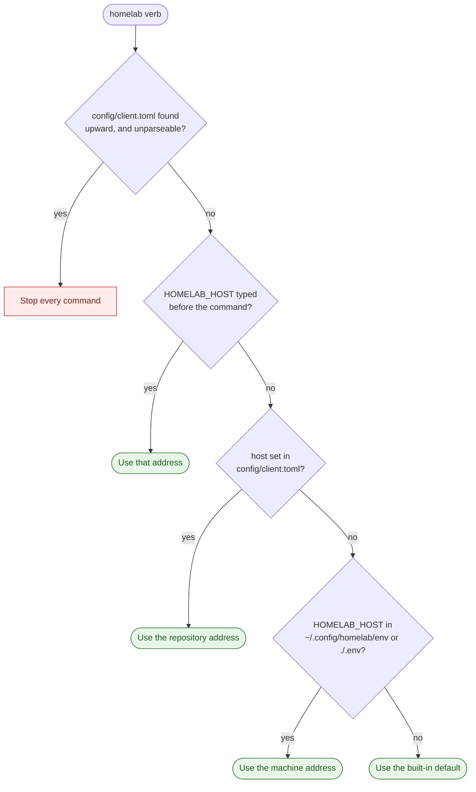
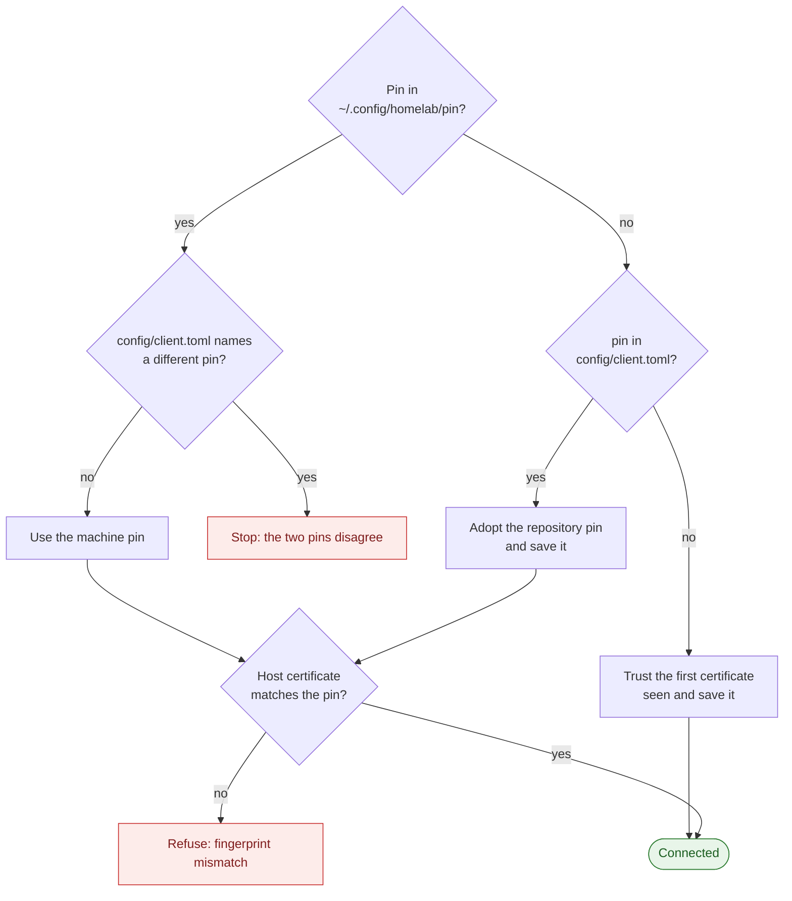
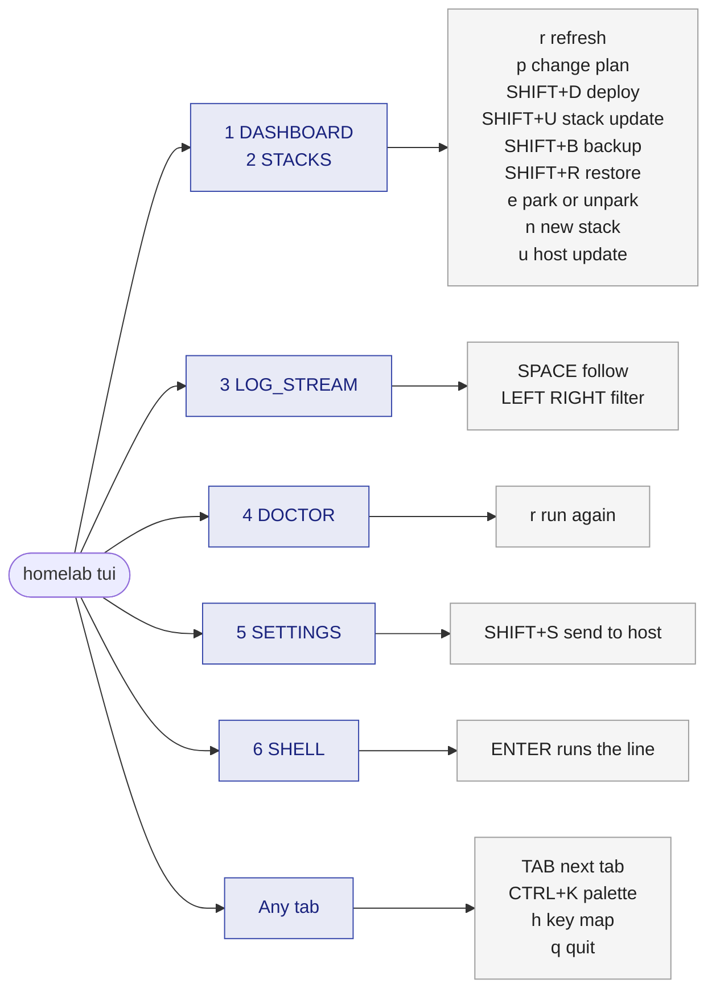
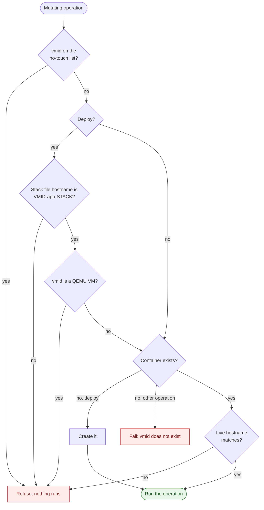
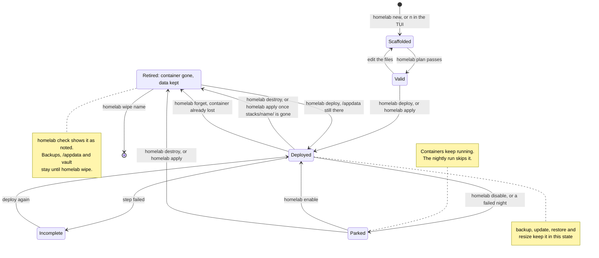
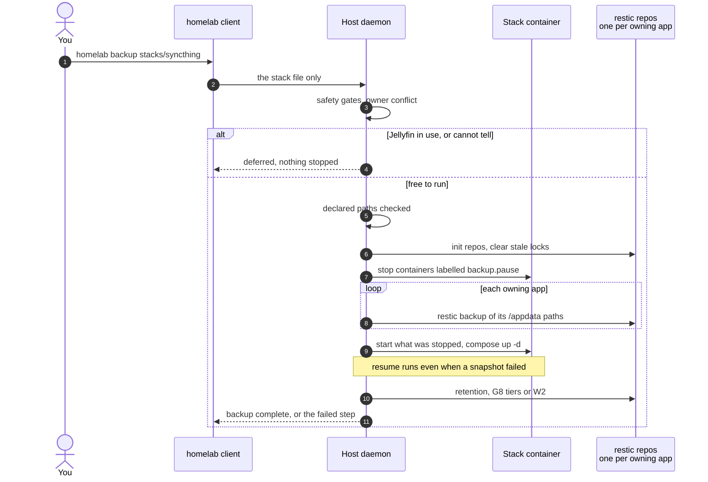
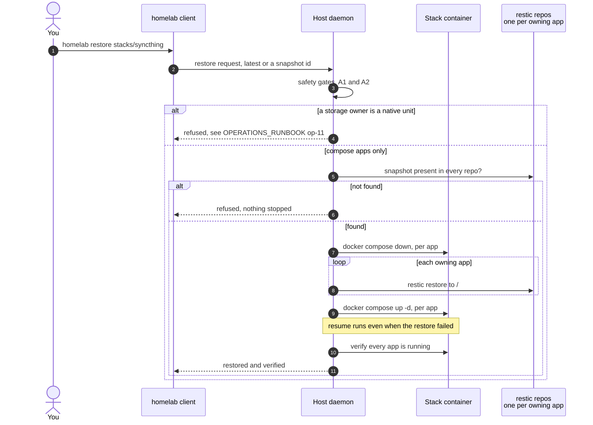

# User guide

What every feature does and how you use it, organised by the feature IDs in
[FEATURES.md](FEATURES.md) (A1 to H8, plus W1 to W3). Test steps live in
[TEST_PLAN.md](TEST_PLAN.md); failure analysis in
[DEBUGGING_GUIDE.md](DEBUGGING_GUIDE.md); host procedures in
[OPERATIONS_RUNBOOK.md](OPERATIONS_RUNBOOK.md).

This repository is public. Documentation below names a machine instead of
its real internal address (`pve`, `the router`, `CT 109`, `the dashboard
(CT 120)`, `the workstation`, ...). Where the literal shape of an address is
the point of an example (a CIDR validator, a trusted-proxy range, a DR
container spec), it is written in the RFC 5737 documentation range
(`192.0.2.0/24` or `198.51.100.0/24`) instead of a real one, consistently
across the docs. The actual addresses live only in `stacks/**` and in code,
which this repository's commit hook guards against ever gaining a real
internal address in `docs/**`, `README.md`, `CLAUDE.md` or `captured/**`.

How to read this guide:

- **Feature IDs** (A1, D12, H7, ...) come from `docs/FEATURES.md`. A decision
  from the deployment project is always written as **deployment decision X**
  (for example deployment decision D25 or deployment decision B1), with the
  file it lives in, so it cannot be mistaken for the feature with the same
  letter.
- **Status** opens every feature: *Built*, *Built, narrower than
  FEATURES.md* (the difference is named), *Not built*, *Won't* or *Removed*.
- **Sources** in parentheses point at the code or test that makes each
  statement true, as `path:line`. Paths are relative to the repository root.
- **Output** shown in this guide is the text the code prints, copied from
  the source. Parts the program fills in are shown as `<...>`. No command was
  run to produce this guide, so no number in it is a measurement.
- Messages quoted from the program keep their own punctuation, including
  the long dashes the source uses. The guide's own prose uses none.

---

## 0 · Before you start

### 0.1 Where the client finds the host, the token and the certificate

`make install` puts the client at `~/.cargo/bin/homelab`. It needs three
things, and each has its own home:

| What | Where it comes from, first match wins | Source |
|---|---|---|
| Host address | `HOMELAB_HOST` typed before the command; else `host` in `config/client.toml`, searched upward from the current directory the way git finds its root; else `HOMELAB_HOST` from `~/.config/homelab/env` or `./.env`; else the built-in `pve:8443` | `client/src/main.rs:127-137`, `client/src/repo_config.rs:25,63,103` |
| Token | `HOMELAB_TOKEN` in the environment; else `~/.config/homelab/env`; else `./.env` | `client/src/main.rs:49-88,140` |
| Certificate pin | the pin built into the client from `config/client.toml` at compile time (fix-149), the only certificate trusted; a machine pin or repository pin that disagrees is refused. A client built without one: `~/.config/homelab/pin`; if that is empty, the `pin` in `config/client.toml` is adopted and saved; if both are empty, the first certificate seen is trusted and saved | `client/src/lib.rs:16-18`, `client/src/repo_config.rs:143`, `client/src/main.rs:1101-1155` |

Only keys that start with `HOMELAB_` are read from the two env files, and a
key already in the environment is never overwritten (`client/src/main.rs:76-81`).
`config/client.toml` accepts exactly two keys, `host` and `pin`; a file that
does not parse stops every command rather than falling back to a default
(`client/src/repo_config.rs:75-90`).

The client settles the host address in this order, after first refusing a `config/client.toml` that does not parse:



Drawn from `client/src/main.rs` (`main`) and `client/src/repo_config.rs` (`load`, `resolve_host`).

**Worked example: which door did I knock on?** `homelab ping` is the one verb
that prints where its address came from (`client/src/main.rs:1190-1194`):

```text
● HOST v<version> (<host build>) · proto <n> — link up
  client v<version> (<client build>)
  via <host:port> (<source>)
✓ pong
```

A build is `git describe --tags --dirty` of the tree the binary was
compiled from (`v3.60.0` for a release, `v3.60.0-3-g1a2b3c4-dirty` for a
hand build with uncommitted changes; fix-141). `homelab status` prints the
same two lines. A host from before that change says `build not reported`.

`<source>` is one of `HOMELAB_HOST in the environment`, the path of
`config/client.toml`, `~/.config/homelab/env` or `built-in default`
(`client/src/repo_config.rs:48-55`). To try another address once, type it
before the command:

```bash
HOMELAB_HOST=pve:8443 homelab ping
```

**When the certificate does not match.** If this machine pinned one
fingerprint and `config/client.toml` names another, every command stops with
a message that starts `the host certificate pinned on this machine`
(`client/src/repo_config.rs:143-152`). If the host presents a certificate
that differs from the pin, the connection is refused with
`certificate fingerprint mismatch` (`client/src/tls.rs:63`). Both messages
say what to delete; do that only after checking the fingerprint the host
logs at start (`host/src/main.rs:1876`).

The certificate pin is decided per connection like this, for a client built
without a pin; the released client carries the fleet's pin (fix-149), trusts
that certificate only, first connection included, and refuses a machine or
repository pin that disagrees with it:



Drawn from `client/src/repo_config.rs` (`reconcile_pin`), `client/src/main.rs` and `client/src/tls.rs`.

### 0.2 Which verbs need a token, and which read the working directory

Every verb needs `HOMELAB_TOKEN` except `help`, `plan`, `runbook`,
`dashboard`, `presets`, `export`, `import`, `new`, `testplan`, `self-install`
and `tui --offline` (`client/src/main.rs:144-150`; `new` and `testplan` since
fix-110). Without it the refusal names the file: `HOMELAB_TOKEN is not set —
put HOMELAB_TOKEN=<token> in ~/.config/homelab/env (or export it)`.
`template-build` refuses an argument it cannot read instead of falling back
to vmid 999 or version 1.

These verbs read or write paths in **the repository**: the directory above
the working directory that holds `config/client.toml`, or, from anywhere
else, the directory `HOMELAB_REPO` names (put `HOMELAB_REPO=~/Projects/homelab`
in `~/.config/homelab/env` once). With neither, they fall back to the current
directory (fix-101):

| Verb | Reads / writes in the repository | Source |
|---|---|---|
| `homelab presets` | reads `presets/` | `client/src/main.rs:650` |
| `homelab new` | reads `presets/`, writes `stacks/<name>/` | `client/src/main.rs:585,624-628` |
| `homelab import` | writes `stacks/<name>/` | `client/src/main.rs:466` |
| `homelab runbook` | reads `stacks/`, writes `docs/DR_RUNBOOK.md` unless an output path is given | `client/src/main.rs:902-906` |
| `homelab testplan` | reads `core/tests`, `client/tests`, `docs/deployment/REALIZATION_PLAN.md`; writes `docs/deployment/TEST_PLAN.md` unless an output path is given | `client/src/main.rs:883-891` |
| `homelab check` | reads `stacks/` unless a path is given | `client/src/main.rs:311` |
| `homelab apply` | reads `stacks/` unless a path is given | `client/src/main.rs:709-713` |
| `homelab export` | writes `<name>-bundle.yml` here unless an output path is given | `client/src/main.rs:446-449` |
| `homelab tui` | reads `stacks/` and `presets/` at start | `client/src/tui/mod.rs:47-48` |

A stack can be named the same way for every verb: `almanac`, `almanac/`,
`stacks/almanac` and a full path all name the same stack. The verbs that read
a stack directory (`deploy`, `plan`, `backup`, ...) take the path as typed
when it is a stack directory from here, and otherwise the stack of that name
in the repository.

### 0.3 The version gate

When the host is older than the client, the command line refuses to send any
command except `ping`, `status`, `doctor`, `incidents`, a state request and a
host update (`client/src/version.rs:15-30`, `client/src/main.rs:1203-1213`).
Read-only verbs such as `homelab check` and `homelab config` are refused too.
The message ends with `run 'homelab release-update' first`. The reason is in
the message: a host that predates a field ignores it, and the operation
quietly does less than asked. The TUI holds the same gate since fix-67.

The other direction holds too (fix-105): when this client is older than the
host, the same set of commands is refused with
`... — run 'homelab self-install' first`, and the ones let through print
`this client is v<x> and the host is v<y> — 'homelab self-install' updates it`
first. `homelab self-install [tag]` downloads the release's `homelab`
(newest when no tag is given), checks the release's minisign signature over
`SHA256SUMS` (`SHA256SUMS.minisig`, the ecosystem key 1C88AB06D43C0B16) and
the binary against that list, and puts it where the running client lives; an
unsigned release is refused. It needs `gh`, not the token. The TUI header shows `client v<x> · host v<y>`, yellow when the
client is the older one.

### 0.4 Reading an answer

Output is coloured only when it goes to a terminal and `NO_COLOR` is unset
or empty; piped into a file, `grep` or a log it is plain text (fix-109).

Every host operation streams its log lines and ends with one line:
`✓ <message>` and exit code 0, or `✗ <message>` and exit code 1
(`client/src/main.rs:1056-1059,1267-1277`). A successful operation says
`<label> complete — <n> step(s), <m> changed`. A failed one says
`<what> :: <why> :: remedy: <remedy> :: incident bundle <dir>`
(`host/src/main.rs:3043-3098`). An operation that deliberately did not run
says `<label> deferred — <reason>` and leaves no incident
(`host/src/main.rs:3054-3065`).

Arguments are positional. `--help` or `-h` anywhere on the line prints help
instead of running anything (`client/src/version.rs:98-100`): after a verb,
that verb's line with one example (`homelab deploy --help`); otherwise the
whole list, grouped as Daily, Change a stack, Native services, Host and
fleet, Local, and Rare and destructive (`client/src/cli_help.rs`). A verb
the client does not know is refused with exit code 2 and the nearest verb:
`unknown command 'stauts'; did you mean 'status'?` (fix-108).

---

## 1 · The control deck (TUI)

```bash
homelab tui             # against the host
homelab tui --offline   # against a built-in fake host, no token needed
```

`--demo` is accepted as a synonym of `--offline` (`client/src/main.rs:141`).
Start the TUI from the repository root: it looks for `stacks/` and `presets/`
in the current directory when it starts (`client/src/tui/mod.rs:47-48`), and
see the warning in 1.3 for what happens when it finds none.

### 1.1 Tabs and global keys

Keys are case-exact: `u` and `U` are different actions. The footer shows a
capital letter as `SHIFT+<letter>` (`client/src/tui/view/mod.rs:670-718`).

| Tab | Select with | What is on it |
|---|---|---|
| DASHBOARD | `1` or `&` | host mesh, CAPACITY (C6), DATA_TRANSFERS (G6) |
| STACKS | `2` or `é` | STACK_REGISTRY: per-stack detail, drift and parked badges |
| LOG_STREAM | `3` or `"` | the live operation feed (F2) |
| DOCTOR | `4` or `'` | SELF_DIAGNOSIS (F6) |
| SHELL | `5` or `(` | line-based remote commands (G4) |

Source: `client/src/tui/model.rs:36-45,751-761`.

There is no SETTINGS tab (removed, Kenny 2026-10-01, fix-110): host
settings — nightly hour, retention tiers, webhook — are edited on the
admin dashboard's host settings page or in `config/host.toml`, applied
with `homelab host apply`. See G8 below.

| Key | Anywhere outside a modal | Source |
|---|---|---|
| `TAB` / `SHIFT+TAB` | next / previous tab | `client/src/tui/model.rs:726-733` |
| `CTRL+K` or `CTRL+P` | command palette (G3) | `client/src/tui/model.rs:716-720` |
| `F2` | cycle effects `FX:OFF` → `FX:SUBTLE` → `FX:FULL`; the choice is kept for the next launch (fix-106) | `client/src/tui/model.rs:721-724`, `client/src/tui/fx.rs:26-39` |
| `h` | key map; `ESC`, `h` or `ENTER` closes it | `client/src/tui/model.rs:652-657,725` |
| `q` | quit; asks `y` first when settings are unsaved or an operation sent to the background still runs (fix-102) | `client/src/tui/model.rs:714` |

On the SHELL tab, typing owns the keyboard: only `TAB`, `SHIFT+TAB`, `F2`,
`CTRL+K` and `CTRL+P` pass through (`client/src/tui/model.rs:699-710`).

The main keys per tab at a glance; the tables in 1.1, 1.2 and 1.4 are the complete list:



Drawn from `client/src/tui/model.rs` (key handling per tab).

### 1.2 Keys on DASHBOARD and STACKS

All of these act on the stack under the cursor.

| Key | Action | Source |
|---|---|---|
| `UP`/`k`, `DOWN`/`j` | move the cursor | `client/src/tui/model.rs:767-778` |
| `r` | refresh fleet state | `client/src/tui/model.rs:779` |
| `p` | change plan for the stack (D6); `ENTER` runs it, `ESC` cancels | `client/src/tui/model.rs:669-688,851` |
| `SHIFT+D` | deploy the stack (D1) without a plan | `client/src/tui/model.rs:793` |
| `SHIFT+B` | back it up (E1) | `client/src/tui/model.rs:799` |
| `SHIFT+U` | update its apps (D9) | `client/src/tui/model.rs:800` |
| `SHIFT+R` | restore it from the latest snapshot (E2), after typing the stack name | `client/src/tui/model.rs:801-817` |
| `g` | apply the runaway guards (B2) | `client/src/tui/model.rs:818` |
| `SHIFT+A` | adopt its native services (C7) | `client/src/tui/model.rs:823` |
| `SHIFT+I` | install its native services from their releases (C7) | `client/src/tui/model.rs:824` |
| `c` | fleet check over `stacks/` | `client/src/tui/model.rs:825` |
| `i` | list incident bundles | `client/src/tui/model.rs:826-836` |
| `e` | park or unpark for the nightly run (H8), after a `y` to a question that says what parking costs (fix-102) | `client/src/tui/model.rs:837-850` |
| `n` | new-stack wizard (G2) | `client/src/tui/model.rs:852-872` |

`SHIFT+A` and `SHIFT+I` work but are not listed in the `h` key map
(`client/src/tui/view/mod.rs:774-794`); the palette lists them as
`adopt: native services of selected stack` and
`install-native: binaries of selected stack` (`client/src/tui/model.rs:1156-1163`).

The host update is palette-only (`host update, when a newer release is
offered (asks first)`, Ctrl+K): fix-102 pulled it off the bare `u` key it
used to sit on, one Shift from `SHIFT+U`'s native self-update, because it
too starts the daemon replacing itself. It still asks `y`/N before it acts
(`client/src/tui/keys.rs`, `client/src/tui/model.rs`).

On a native-only stack, `SHIFT+B` runs the native backup and `SHIFT+U` the
supervised self-update; `SHIFT+R` is refused with
`restore is not wired for native stacks — restore by hand as docs/OPERATIONS_RUNBOOK.md op-11 describes`
(`client/src/tui/model.rs`). `homelab restore` refuses a native stack too
(gap-28): its backup is one tar stream, which a restic restore would drop on
the host unpacked.

The placeholders before the first state (`awaiting state… [r] refresh` on STACKS, `press r or ENTER to re-run` on DOCTOR) name lowercase `r` since v3.58.4 (gap-21; they said `R`, which is restore on STACKS). Refresh is `r`. On STACKS, `SHIFT+R` opens
the restore prompt; it restores nothing unless you then type the stack name.

### 1.3 Warning: the TUI and a missing `stacks/` directory

For every per-stack action the TUI looks for `stacks/<name>/` in the
directory it was started from. When it finds none, it builds a **synthetic
manifest** from the fleet view, with default resources and **no storage
entries** (`client/src/tui/model.rs`, `resolve_spec`). Read what that means
before starting the TUI anywhere else:

- `SHIFT+B` and `SHIFT+R` refuse (gap-19): the status line says the stack
  needs `stacks/<name>/`, and nothing is sent. Before v3.58.4 a backup with
  the synthetic manifest wrote nothing while the host recorded a backup time,
  and a restore stopped and restarted every app and restored nothing.
- Drift badges are only computed for stacks found locally
  (`client/src/tui/model.rs:490-509`).

### 1.4 Keys on the other tabs

| Tab | Key | Action | Source |
|---|---|---|---|
| LOG_STREAM | `SPACE` | toggle follow | `client/src/tui/model.rs:876-881` |
| LOG_STREAM | `UP`/`k`, `DOWN`/`j` | scroll | `client/src/tui/model.rs:882-891` |
| LOG_STREAM | `LEFT`/`RIGHT` | source filter: `ALL`, then each stack name | `client/src/tui/model.rs:892-899`, `client/src/tui/view/logs.rs:13-30` |
| LOG_STREAM | `SHIFT+G` or `END` | jump to the tail and follow | `client/src/tui/model.rs:900-903` |
| DOCTOR | `r` or `ENTER` | run the doctor again | `client/src/tui/model.rs:906-910` |
| SETTINGS | `UP`/`DOWN` | pick a row | `client/src/tui/model.rs:946-947` |
| SETTINGS | `LEFT`/`RIGHT` | change the value | `client/src/tui/model.rs:948-978` |
| SETTINGS | `a` / `d` | add / delete a retention tier (`d` asks `y` first, fix-102) | `client/src/tui/model.rs:979-1002` |
| SETTINGS | `ENTER` on the webhook row | edit it; `ENTER` keeps, `ESC` cancels | `client/src/tui/model.rs:1003-1005,1076-1097` |
| SETTINGS | `SHIFT+S` | send the settings to the host | `client/src/tui/model.rs:1006-1010` |
| SETTINGS | `r` | reload from the host | `client/src/tui/model.rs:1011` |
| SHELL | type, `ENTER` | run the line in the target container | `client/src/tui/model.rs:1047-1071` |
| SHELL | `LEFT`/`RIGHT` with an empty line | change the target stack | `client/src/tui/model.rs:1026-1033` |
| SHELL | `UP` | recall the last command; `ESC` clears the line | `client/src/tui/model.rs:1034-1046` |

### 1.5 Windows that take over the keyboard

- **Progress window** (every operation): `UP`/`DOWN` scroll; `ESC` hides it
  while the operation keeps running (`deploy keeps running — feed in LOG_STREAM`);
  `ENTER` closes it once done (`client/src/tui/model.rs:634-651`).
- **A question from the host**: when a deploy's service checks see a value go
  down, the host pauses and asks. Only `a` (allow) and `s` (stop) do anything
  until it is answered (`client/src/tui/model.rs:620-633`). The window
  shows `[a] allow` and `[s] stop` (`client/src/tui/view/focus.rs:138-142`).
  Unanswered, it times out after `ask_timeout_s` seconds, 120 by default, and
  counts as a stop (`host/src/main.rs:146-152,669-671`,
  `core/src/ops/deploy.rs:2617-2659`). On the command line the question is
  printed and cannot be answered there (`client/src/main.rs:1173-1182`).
- **Typed confirmation** (restore): type the stack name and `ENTER`. Anything
  else answers `typed name does not match '<stack>' — nothing was done`
  (`client/src/tui/model.rs:1364-1392`).

---

## 2 · Features by ID

### A · Security

#### A1 · Whitelist-only management and the no-touch list

**Status:** Built.

The host only acts on stacks you send it, and four guests can never be acted
on at all: vmids 100, 101, 102 and 103 (`core/src/safety.rs:21`). The list is
compiled in. `no_touch = [...]` in `/etc/homelab/host.toml` adds vmids to it
and can never remove one (`host/src/main.rs:446-460`, test
`host/src/main.rs:843`). A vmid that belongs to a QEMU VM is refused too,
whether or not it is on the list (`core/src/safety.rs:61-70`).

Every operation that changes a container checks the list before its first
command: deploy (`core/src/safety.rs:40-52`), backup, restore, update,
enable/disable and adoption (`core/src/ops/mod.rs:42-53`), destroy
(`core/src/ops/destroy.rs`, step `no-touch check`), resize, patch, template
build and guards (`host/src/main.rs:3687-3700`), and remote exec
(`host/src/main.rs:2861-2866`, test `host/src/main.rs:864`).

**Worked example.** A stack file that names `vmid: 101` validates (the
allowed range is 100 to 354, `core/src/manifest.rs:623-625`), so
`homelab plan` accepts it. `homelab deploy` then stops in the host's
`safety gates` step with `vmid <vmid> is on the no-touch list`, here with
101 filled in (`core/src/safety.rs:47-52`), and no command reaches the machine: the test
`core/tests/deploy_tests.rs:327` asserts zero commands ran. No incomplete
state is recorded either (`core/src/ops/deploy.rs:67-75`).

#### A2 · Hostname guard

**Status:** Built.

A managed container is always called `<vmid>-app-<stack>`. The validator
refuses a stack file whose `hostname` is anything else
(`core/src/manifest.rs:631-637`), and before touching an existing container
the host reads its live hostname and refuses a mismatch with
`vmid <n> exists with hostname '<live>', expected '<expected>' — refusing`
(`core/src/safety.rs:72-87`). The same live check guards backup, restore,
update, enable/disable, adoption, native updates and orphan pruning
(`core/src/ops/mod.rs:42-80`, `host/src/main.rs:3575-3585`), and destroy
(`core/src/ops/destroy.rs`, step `hostname guard`). Tests:
`core/tests/deploy_tests.rs:354`, `core/tests/m4_ops_tests.rs:1322`.

`homelab guards <vmid>` and `homelab patch` check the hostname too since
v3.58.4 (gap-33): `patch_fleet` runs the guard per stack, and requested
guards go through `guards::apply_for_managed` (`core/src/ops/patch.rs`,
`core/src/ops/guards.rs`).

Every mutating operation passes these gates before its first command,
`homelab guards` and `homelab patch` included since gap-33:



Drawn from `core/src/safety.rs` (`check_deploy_target`) and `core/src/ops/mod.rs` (`guard_target`).

#### A3 · Fail-closed behaviour

**Status:** Built, narrower than FEATURES.md.

What is built: the first failing step ends the operation
(`core/src/runner.rs:100-104`, `core/src/ops/deploy.rs:20-30`), and every
failed operation leaves an **incident bundle** under
`/var/lib/homelab/incidents/<unix-time>-<op>/` holding `report.json`,
`events.jsonl`, `commands.sh` (the commands it ran, as a script),
`state-at-failure.json`, `journal-tail.jsonl` and `versions.txt`
(`core/src/incidents.rs:55-110`, `host/src/main.rs:3077-3089`). A deploy that
fails after the machine was touched records the stack with the step where it
stopped, and logs `recorded as incomplete at step` (`core/src/ops/deploy.rs:55-117`).

What is not built: FEATURES.md says a failed provision leaves the stack
disabled and a missing `.env` aborts before compose. The code records a
failed first deploy as enabled (`core/src/ops/deploy.rs:99`), and an app
without a `.env` in the payload gets the host's vault copy if there is one
and otherwise none (`core/src/ops/deploy.rs:1140-1151`). Only a failed
*nightly* run disables a stack (H8).

List the bundles with `homelab incidents` or `i` in the TUI, and read one
with `homelab incidents show <name>` (fix-131). Bundles older than 90 days,
and all but the newest 200, are removed by the daemon.

#### A4 · TLS with a pinned certificate on the client-host line

**Status:** Built.

The daemon serves TLS only (`host/src/main.rs:1903`) with a self-signed
certificate it creates once in `/var/lib/homelab/tls-cert.pem` and
`tls-key.pem` (`host/src/tls.rs:16-19`), and logs its fingerprint at start
(`host/src/main.rs:1876`). The WebSocket at `/api/ws` needs
`Authorization: Bearer <token>`; without it the answer is 401
`missing or invalid bearer token` (`host/src/main.rs:2717-2723`). The daemon
refuses to start with a token shorter than 16 characters
(`host/src/main.rs:409-419`). `/api/health` answers without a token;
`/api/version` needs it since fix-126 (`app_router`). Every refusal is a
journal line `401 on <path> from <address>` and counts toward the `refused
connections` line of `homelab doctor` (fix-120). Pinning is described in 0.1; test
`client/tests/tls_pin_tests.rs:33`.

#### feat-platform-4 · Tokens with a scope

**Status:** Built (homelab-admin `host` milestone, 2026-09-28).

Beside the single `token`, host.toml can list one token per machine, each
with a scope. Only the SHA-256 of the token is stored on the host:

```toml
[[tokens]]
name = "admin"      # named in every audit line
scope = "all"       # read | operate | all
sha256 = "…"        # printf %s "$TOKEN" | sha256sum
```

`read` may only look (fleet, findings, doctor, incidents, settings);
`operate` may also deploy, back up, restore, update and answer questions;
`all` may also destroy, wipe, forget, exec, change host settings and send a
new host binary. The table is `Command::scope()` in `proto/src/lib.rs`: a new
command does not compile without a row. A command above the token's scope is
answered `refused: <command> needs scope …` and written to
`/var/lib/homelab/audit.log` as `<unix-time> refused token=<name> …`; every
scope-`all` command of a named token is written there as `scope-all` before
it runs. The single `token` keeps working as scope `all` under the name
`legacy`. A malformed list (duplicate or empty name, the name `legacy`, a
digest that is not 64 lowercase hex characters) stops the host at start.
Tests: `host/src/main.rs` (`arch_tokens_*`), `proto/tests/scope_tests.rs`.

#### feat-platform-1 · Reports as JSON

**Status:** Built (homelab-admin `host` milestone, 2026-09-28), for doctor,
the fleet check, the incident list and the manual checks.

`Doctor`, `FleetCheck`, `Incidents` and `ListManualChecks` take `json: true`
and then answer JSON in `RpcResponse.message` instead of text: doctor
`{overall, checks}`, the fleet check `{passes, findings}`, incidents
`{incidents}`, manual checks `{now, checks: [{id, record}]}`. The CLI and TUI
never send the flag, and `json: false` is never written, so their requests are
exactly what an older host reads. Tests: `proto/tests/scope_tests.rs`,
`host/src/main.rs` (`feat_platform_1_reports_answer_json_when_asked`).

#### feat-platform-2 · Real status per container

**Status:** Built (homelab-admin `host` milestone, 2026-09-28).

`GetState` used to answer `running`, 0 restarts and `online` for every stack
whatever the machine said. The host now takes a reading every
`status_interval_s` seconds (host.toml, default 60, at least 10): one
`pvesh get /cluster/resources --type vm` for every guest's status, cpu,
memory and uptime, and one `pct exec <vmid>` per running managed container
listing its docker containers (`core/src/ops/livestatus.rs`). `GetState`
answers from the newest reading and says when it was taken
(`status_measured_at`); before the first reading the old fixed values stand.
An app counts as running only when every one of its containers runs, and its
restarts are the sum of theirs. Tests: `core/tests/livestatus_tests.rs` (real
pvesh and docker samples from pve), `host/src/main.rs`
(`feat_platform_2_app_status_comes_from_the_reading`).

#### feat-platform-3 · Request id, time and steps on log lines; CurrentOp

**Status:** Built (homelab-admin `host` milestone, 2026-09-28).

Every line an operation prints over the line now carries the request it runs
for (`req`), the unix time it was printed (`ts`), and on a step's start and end
a structured `step` mark (`op`, `step`, `finished`, `changed`), so a client can
show "step 3/35" without parsing text. All three fields are optional on the
wire: an older client ignores them. The host keeps the newest `recent_lines`
lines in memory (host.toml, default 2000); `CurrentOp` (scope read) answers
what holds the operation lock and those lines, for a client that connects in
the middle of an operation. Tests: `host/src/main.rs` (`feat_platform_3_*`).

#### arch-history · What the host did

**Status:** Built (homelab-admin `host` milestone, 2026-09-28).

The host appends one line to `/var/lib/homelab/history.jsonl` (0600) for
every operation, asked for over the line or started by the nightly round:
its label, what its steps were about, the request, the outcome and every
step with its start and end time. Each nightly backup phase gets a line of
its own. `history_days` (default 90) and `history_max_mib` (default 16) in
host.toml bound the file; past the size the oldest entries go. A line torn by
a power cut is skipped on read. `History { since, limit }` (scope read)
answers the entries as JSON. The dashboard's duration trends, nightly
timeline and activity timeline read it. Tests: `core/tests/history_tests.rs`,
`host/src/main.rs` (`arch_history_*`).

#### arch-deploy-guard · A deploy may not undo another deploy

**Status:** Built (homelab-admin `host` milestone, 2026-09-28).

The host records which commit each deploy came from, and `GetState` now
shows it per stack (`applied_source`). `homelab deploy` and `homelab apply`
refuse when the host runs a stack from a commit this tree does not contain,
because deploying would silently undo it (a firewall rule added from the
dashboard, deployed from a WSL tree that never pulled it). The message names
the commit and the way out: `git pull`, or `--force` when undoing it is the
point. `apply` checks every planned stack before it sends the first one. The
TUI does not check (it is being replaced; nothing is taken out of it before
the dashboard covers it). Tests: `core/tests/deployguard_tests.rs`.

#### arch-host-link · Answers carry the host's start

Every question the host asks carries `boot`, which changes on every start of
the host, and an answer may carry it back. An answer stamped with an earlier
start is refused, so an old question left open on a phone cannot answer a
new one that happens to have the same number after the host restarted. The
CLI and TUI send no stamp and behave as before. Test: `host/src/main.rs`
(`arch_host_link_a_stale_answer_does_not_answer_a_new_question`).

#### feat-platform-10 · `homelab ui`: driving the open dashboard

**Status:** Built (homelab-admin milestone `follow`, 2026-09-28), tested
against a mock host and the dashboard's demo host; not yet measured against
the live host, which does not know the command until the next release.

`homelab ui <step>` drives the admin dashboard one step at a time, with no
browser on the sending side. The step goes to the host on this machine's own
token; the host hands it to the dashboard's session (the one that sent
`UiAttach`) and answers with what the dashboard says is on screen. There is
no second way in: the steps travel on the same TLS line as every other verb.

| Step | What it does |
|---|---|
| `homelab ui goto <path>` | shows a page: `/stacks/media`, `stacks/media/logs`, `/jobs` |
| `homelab ui open <action> [stack]` | opens an action's dialog (`deploy media`; a host-wide action such as `patch` takes no stack) |
| `homelab ui open <edit form> …` | opens an edit form (below): `settings <stack>`, `raw <stack>`, `add-app <stack>`, `firewall <stack>`, `new-stack`, `host-settings`, `batch <action> [<stack>,<stack>]`, `rollback <stack>`, `import` |
| `homelab ui select <stack>,<stack>` | owner decision 2026-09-30: ticks those rows in the Overview page's fleet table, exactly as a click would (refused off the Overview page, or naming a stack the fleet has not) |
| `homelab ui select none` | clears the fleet table's selection |
| `homelab ui open batch <action>` | with no stacks named, opens the batch dialog from the current selection (`homelab ui select` first) instead of a named list — the same "Run on the selected…" a click would start; refused when nothing is selected |
| `homelab ui click <control> [row]` | fix-239: clicks a page's own button that is no action dialog or edit form — a stale image's Update (`click pin-update beta-demo/api/api`, the row being `<stack>/<app>/<service>`), `new-schedule`, `edit-schedule <id>`, `snooze`, `issue-token`, `reveal-secret <stack>/<secret>` and the rest each page declares in `admin/web/js/drivable.js`. The tab in Live view takes it itself (one tab, whichever claims it first): it goes to the control's own page when it is not on screen, clicks it as a person would and answers; a refusal names the controls and rows on screen, and a click no tab takes within 15 s says to turn Live view on. Inside the dialog it opened, `type`, `pick`, `check`, `press <button>` (the dialog's own button names, e.g. `press confirm`, or its visible label) and `close` act on that dialog; with no dialog open, `type`/`pick`/`check` set the page's own fields (`type notify-digest 07:30`) |
| `homelab ui type <field> <text>` | types into a text or number field of the open form, by the field's id (`act-snapshot`, `act-confirm`, `edit-memory-mb`, `rule-peer`) |
| `homelab ui pick <field> <value>` | chooses one value of a choice field (`act-app`, `act-unit`, `act-commit`, `rule-proto`, `edit-follow`) |
| `homelab ui check <field> on\|off` | ticks or unticks a check field (`act-force`, `act-skip-backup`, `fw-enabled`) |
| `homelab ui edit <field> <file\|->` | sets the whole text of a multi-line field at once, read from a file or from stdin (`raw-text`, `edit-note`) |
| `homelab ui row add` / `row edit\|up\|down\|delete <n>` | the firewall's rules by their number from 1, top to bottom: `add` and `edit` open the rule dialog |
| `homelab ui row edit <key>` | opens a host.toml key's dialog on the host settings page (`row edit backup_hour`) |
| `homelab ui press next\|back\|confirm` | presses a button of the form; `confirm` is the final press and runs the action, the commit, the write or the batch |
| `homelab ui press save\|cancel\|default` | the buttons of a dialog on top of a form: the rule dialog (`save`, `cancel`), a host.toml key (`save`, `default`, `cancel`) |
| `homelab ui press confirm --wait` | the final press, then as `finish`: one call from Confirm to the dashboard handed back |
| `homelab ui finish` | waits for the open dialog's job to end (reads the screen every 2 s, prints each new step line), prints its outcome, then closes the dialog and hands the dashboard back at once, as `done`; exit 1 when the job did not end in done or deferred. Refused when the open dialog ran no job (`close` and `done` let go without running it). Without it, a confirmed dialog is closed 30 s after its job ended (fix-163) |
| `homelab ui close` | closes the dialog |
| `homelab ui reload` | fix-185: tells the driven tab to take the dashboard's current page — what its own "update available" banner's button does — then waits (bounded, 20 s) until a tab reports back running the client's own version; fails, naming it, if none does in time |
| `homelab ui state` | changes nothing; prints what is on screen |
| `homelab ui done` | stops driving: every tab is its viewer's again; after a viewer's **Stop** it also acknowledges the stop |
| `homelab ui plan "<step>" "<step>" …` | sends the whole sequence up front, each argument one step as above (`plan "goto jobs" "open deploy media" "press confirm"`); changes nothing on screen |
| `homelab ui plan --file <file\|->` | the same, one step per line of the file (or stdin); blank lines and `#` lines are skipped |

Every step is checked against the same form description the dashboard draws
its dialogs and edit forms from (`admin/web/js/formspec.json`, its `edit`
section for the edit forms): an unknown field id, a field
of the wrong kind or on another step, a value that is not on the list, an
unknown page, action or stack are refused with what, why and what to do, and
change nothing. A press the form holds (a field in error, the deploy guard)
is shown in the dialog and answered with its reason, exit code 1. `--json`

**fix-185 (version match):** every step carries `homelab`'s own build
version. If a tab that follows has not taken the dashboard's current release
yet — it last reported an older page over `POST /data/drive/attach`, sent on
every load and reconnect — any step but `state`, `reload` or `done` is
refused at once, naming both versions: "the tab still runs 3.69.0's page
(this client is 3.70.0) … press its update banner or `homelab ui reload`."
`homelab ui reload` is the fix: it is never refused by this check, tells the
tab to take the current page, and waits (bounded) for it to report back.

**fix-185 (repository preflight):** before `homelab ui press confirm` (also
`--wait`) runs the final press of a form that reads the repository (deploy,
deploy-commit, apply, a batch wrapping one of them — `state.form.reads_repo`
says which), `homelab ui` checks this machine's own working copy FIRST,
never the dashboard's: local HEAD must carry no commit the upstream does not
have yet (`git rev-list @{u}..HEAD`, named in the refusal — "push first,
Kenny's go"), and every stack involved must pass the same validation
`homelab apply --plan` runs. Both are refused here, before the dashboard (and
its own working copy, which fetches origin) is ever asked.
prints the dashboard's answer as it came. Reading the state needs a token of
scope `read`; every other step needs `operate`, and the final press also the
action's own scope (a destroy needs `all`). The final press runs on the
dashboard's server through the same action queue a click uses, exactly once,
whether zero, one or two tabs are open; the job's origin reads "Claude
(<token name>)". Nothing is driven while no dashboard is attached: the step
is refused with that reason.

Which dashboard is attached (fix-158, 2026-09-29): the host remembers every
dashboard session that sent `UiAttach`, most recent first, and hands the
steps to the newest. When that session ends, the most recent earlier one
still connected is attached again, and the host's journal says which ("the
attached dashboard's session ended; UI steps go to the earlier dashboard
session N again", or "no dashboard is attached for UI steps"). A dashboard
running with `dev_without_locks` (a developer's machine) never sends
`UiAttach`, so it cannot take the steps from CT 120's dashboard; its log
says so at start (`host/src/ui_relay.rs`, `admin/src/shell/host_link.rs`
`greeting`; tests `fix_158_when_the_attached_dashboard_ends_the_one_before_it_is_attached_again`
and `fix_158_a_dashboard_without_locks_never_attaches_for_ui_steps`).

In the dashboard, the switch **Live view** at the top of every page says
whether this tab plays Claude's steps (Kenny's name for it, 2026-09-28; the
working name was "Watch Claude"). It is off by default and remembered per
tab. Off, the tab never changes page, opens a dialog or loses what its
viewer typed; it shows only the badge "Claude is working on <stack>:
<action>" with a **Live view** button. On, the tab performs every step as
it comes (the page changes, the dialog opens, the text appears letter by
letter, the button shows its press, the next step of the wizard appears); a
tab that turns on in the middle of a drive catches up to where Claude is.
While Claude drives a tab in Live view, that tab's own clicks and keys are
refused with a note; the dialog carries a **Leave live view** button, since
a modal dialog hides the switch. A driver who sends nothing for ten minutes
lets go.

**The edit forms.** The same steps drive the forms that change the
repository and the host, on the same pages and dialogs a click uses:

| `open` | What it is | Its steps, and the final press |
|---|---|---|
| `settings <stack>` | the Settings tab's form | `settings` (`edit-cores`, `edit-memory-mb`, …, `edit-image-<app>-<service>`, and for each tile the stack declares `edit-tile-watch-<slug>`/`edit-tile-down-<slug>`) → `plan` → `commit` (`edit-subject`, `edit-note`, `edit-follow`); `confirm` commits and pushes, then queues the follow-up |
| `raw <stack>` | the Settings tab's Files card (open, edit, create, delete, rename any text file of the stack) | `op` (`files-op`, picked: `edit`, `create`, `delete` or `rename`) → `file` (`raw-file`, and `raw-text` with `edit`, for `edit` and `create`; `files-new-path` typed for `create`; `files-rename-to` typed for `rename`) → `plan` → `commit` |
| `add-app <stack>` | "Add an app" | `app` (`add-app-preset`) → `plan` → `commit`; feat-tiles-3: one optional hostname per app the chosen preset brings in (`add-app-tile-<app>`, blank = no tile), folded into the same commit as the app itself (`StackEdit::AddApp.tiles`, applied alongside `apps:`/`storage:` on the same staged manifest) — not a second commit after the fact, the same one-commit shape `new-stack`'s Tile step above has |
| `settings-ext <stack>` | the Settings tab's "Network & hardware" card (feat-stacks-9: `network.*`, `lxc.unprivileged`/`gpu`/`vpn`/`timezone`, `resources.storage`, `on_demand`, `retention`) | `settings_ext` (`edit-network-ip`, `edit-network-gateway`, `edit-network-bridge`, `edit-network-vlan`, `edit-lxc-unprivileged`, `edit-lxc-gpu`, `edit-lxc-vpn`, `edit-lxc-timezone`, `edit-resources-storage`, `edit-on-demand`, plus a `retention` row table — `row add retention`/`row edit\|up\|down\|delete retention:<n>`, the same origin-less full-list shape the backend always took; an empty table clears the stack's own tiers back to the fleet default) → `plan` → `commit`. `unprivileged`, `gpu`, `vpn`, `timezone` and the storage id only ever take effect at a rebuild of the container; the plan says so. |
| `apps <stack>` | the Settings tab's "Apps & storage" card (feat-stacks-10: remove/add-blank an app, and `storage:`/`data_mounts:`/`log_files:` as kp datatables with an Add/Edit dialog each, the Firewall tab's rule table generalised) | `apps` (`apps-remove-<app>` checkboxes, `apps-add-blank` comma-separated names) → each list's own Add/Edit dialog behind `row add <list>` / `row edit <list>:<n>` (`list` one of `storage`, `data_mounts`, `log_files`; fields `storage-host-path`/`storage-mount-point`/`storage-app`/`storage-no-data`/`storage-no-backup`/`storage-host-owner-uid`, `mount-host-path`/`mount-mount-point`/`mount-note`/`mount-rotate-files`/`mount-rotate-keep`/`mount-rotate-container`/`mount-rotate-signal`, `logfile-path`/`logfile-job`), `row up`/`row down`/`row delete <list>:<n>` to reorder or drop a row → `plan` → `commit`. Removing an app drops it from `apps:`, its whole directory and any storage/data_mounts row naming it as `app:` — data already on the container is untouched, only the declaration goes. |
| `latch <stack>` | the Settings tab's "Latch" card (feat-stacks-11: `latch_secrets`, `latch_files` as a kp datatable + dialog) | `latch` (`latch-secret-<app>` checkboxes) → the `latch_files` row dialog behind `row add latch_files` / `row edit latch_files:<n>` (fields `latchfile-from`/`latchfile-dest`/`latchfile-mode`/`latchfile-owner`/`latchfile-restarts`), `row up`/`row down`/`row delete latch_files:<n>` → `plan` → `commit`. A value containing `${` is refused before anything is sent, in the row dialog itself: `latch --expand` parses every file it is handed, so one unresolvable placeholder would break every stack's secrets, not only this one's. |
| `tiles <stack>` | the Settings tab's "Tiles" card (feat-tiles-1: create, rename or delete any entry of a stack's `tiles:` map, every field, as a kp datatable + dialog) | `tiles` (no scalar fields of its own) → the tile row dialog behind `row add tiles` / `row edit tiles:<n>` (fields `tile-key`, `tile-name`, `tile-group`, `tile-order`, `tile-description`, `tile-url`, `tile-watch-url`, `tile-reading`, `tile-watch-every`, `tile-down-after`), `row up`/`row down`/`row delete tiles:<n>` → `plan` → `commit`. `probe` is never written here: the client fills it in at deploy time, per `Tile::probe`'s own doc. The Settings tab's own two per-tile watch fields (`edit-tile-watch-<slug>`/`edit-tile-down-<slug>`, above) keep working exactly as before and write the same `tiles.<key>.{watch_every,down_after}` path, so a quick watch-seconds change does not need this card at all. Renaming a tile's hostname keeps its history; deleting an existing one sends an explicit tombstone (`tilesBody`/`tiles_drive_body`) rather than merely dropping the row, since `tiles:` is a sparse change list, not a full-list rebuild like the other row tables here. |
| `checks <stack>/<app>` | the Checks tab's edit section (feat-checks-1: one app's whole `checks.yml` — the measured checks, the manual questions, the nightly probes, the busy check and the link — checks/manual/probes each a kp datatable + dialog) | `checks` (`checks-app` picks the app, fixed for the session by the CLI target; `checks-busy`, `checks-url` plain text, always sent as the whole wanted value, blank = none) → each list's own row dialog behind `row add <list>` / `row edit <list>:<n>` (`list` one of `checks`, `manual`, `probes`; fields `check-name`/`check-command`/`check-expect`/`check-layer`/`check-blind-spot`, `manual-text`/`manual-once`, `probe-name`/`probe-command`/`probe-healthy-kind`/`probe-healthy-value`/`probe-layer`/`probe-blind-spot`), `row up`/`row down`/`row delete <list>:<n>` → `plan` → `commit`. An app with no `checks.yml` yet gets one created on Review and commit; a check or probe below the Application layer is refused without a blind spot, the same rule `checks.yml`'s own comments state. The Checks tab still shows the manual-answers table above this section unchanged. |
| `publish <stack>/<app>` | the Apps tab's "Publish…" dialog, opened per app (feat-publish-1: a hostname and the app's container port, turned into `gateway_route`/`extra_routes` plus the router/service/loadBalancer fragment in `traefik-routes.yml`, optionally a tile) | opened directly (a click-opened dialog, not a page already showing it — the same shape `open preset`/`open new-stack` use), fields `publish-hostname`, `publish-port`, `publish-external` (this backend is not one of the fleet's own managed stacks), `publish-separate-file` (keep this route in a file of its own under `routes/` instead of extending `traefik-routes.yml`), `publish-create-tile`, `publish-tile-name`, `publish-tile-group` → `plan` → `commit`. A stack's first publish becomes its `gateway_route` (content in `stacks/<stack>/traefik-routes.yml`, the filename derived as `<gateway_vmid>-app-<stack>.yml`, the only name `gateway_route.filename` may have); every publish after that adds another router and service to the same file, unless "keep in a file of its own" is ticked, which appends an `extra_routes` entry under `stacks/<stack>/routes/` instead. A tile, if asked for, is keyed by the same hostname as the route. |
| `firewall <stack>` | the Firewall tab | `rules` (`fw-enabled`, `fw-policy-in`, `fw-policy-out`, `fw-management-open`, `fw-comment`, and `row …` with the rule dialog's `rule-dir`, `rule-action`, `rule-peer`, `rule-proto`, `rule-dport`, `rule-note`, `rule-comment`) → `plan` → `commit` |
| `native <stack>[/<unit>]` | the Settings tab's "Native services" card (feat-native-1, only on a stack `native_only` or that already has `natives:`): one unit picker (`native-unit`), one set of fixed-id fields below it for whichever unit is picked | `native` (`native-unit` a choice field, then `native-binary`, `native-env-file`, `native-data-dirs`, `native-update-cmd`, `native-stateless`, `native-restore-note`, `native-release-repo`, `native-release-asset`, `native-backup-newest`, `native-backup-pause`, `native-update-policy`, `native-metrics` — picking a different unit refills the rest from its own `service.yml`) → `plan` → `commit` at `native-review`. `native-remove` plans and commits `remove_native` for the picked unit instead — a second button next to `next` on the same step, driven with `press remove` (no fields of its own; the already-picked `native-unit` is what gets removed). No target: the stack's first native unit; `<stack>/<unit>` (the slash convention `rollback-native` already uses) picks one. |
| `add-native <stack>` | the Settings tab's "Add a native unit" card (feat-native-1): a new unit's `service.yml`, always under `<unit>/`, plus a generic systemd unit file (no app knowledge: only the fields the form takes) | `add_native` (`add-native-unit`, `add-native-binary`, `add-native-env-file`, `add-native-data-dirs`, `add-native-notify`) → `plan` → `commit` at `add-native-review`. The systemd unit file itself, once written, is refined in the Files card's raw editor (its exact listen address and so on). |
| `preset <name>` / `new-preset` | the Presets page's editor dialog (feat-preset-1: `preset.yml`, its app files, a new preset, removing one) — the same dialog both opens land on, through the `preset-editor` handle | `meta` (a new preset adds `new-preset-name` ahead of the rest: `preset-description`, `preset-ram-mb`, `preset-cores`, `preset-disk-gb`, `preset-features`, `preset-gpu`, `preset-vpn`) → `plan` → `commit` at `preset-meta-review`. Files (create, edit, delete, rename — Area A's Files card shape, reusing its starter templates) and "Remove this preset…" are driveable from the same "meta" step, each its own named button beside `next` (`save-file`, `rename-file`, `delete-file`, `remove-preset`): `preset-file-select`/`preset-file-path`/`preset-file-template`/`preset-file-text` → `save-file`, `preset-file-rename-to` → `rename-file`, or `delete-file`; `remove-preset` for the whole preset — each reaches its own `plan` step (`preset-file-save`/`-rename`/`-delete`/`preset-remove` are still the buttons a click uses; a driven press names the action directly). Every press here runs against `/data/presets/plan` and `/data/presets/commit`, not `/data/stacks/<stack>/…` — a preset is not under any stack. |
| `new-stack` | the new-stack wizard | `preset` → `identity` (`new-name`, `new-vmid`) → `size` → `data` (`new-nodata-<n>`) → `tile` (feat-tiles-3: `new-tile-hostname`, `new-tile-name`, `new-tile-group`, `new-tile-description`, `new-tile-watch-every`, `new-tile-down-after` — blank hostname = no tile) → `plan` (the commit's fields); `confirm` commits and pushes once — a tile, when given, is folded into that same commit (`NewStack.tile`, applied to the scaffolded manifest before it is ever written), not a second call after the fact. A preset may suggest a tile of its own for one of its apps (`preset.yml`'s `tiles:`, keyed by app, with a `__NAME__` hostname placeholder); an explicit choice on this step is not yet wired to override it — the two currently coexist rather than one replacing the other |
| `host-settings` | the Settings page's host.toml | `keys` (`row edit <key>`, then `key-<key>` and, for a key that asks it, `key-<key>-confirm`; `press save`) → `review`; `confirm` writes host.toml, and when any staged key only takes effect at the host's next start also queues `restart-host` (the review button then reads "Save and restart the host"; the queued job is refused if another job is already running). Needs a token of scope `all` |
| `batch <action> <s1>,<s2>` | the fleet page's batch dialog | `review` (the action's shared fields, and `act-confirm-<stack>` per stack when it asks a typed name); `confirm` queues the batch |
| `rollback <stack>` | the Roll back dialog | `choose` (`rollback-commit` or `rollback-unit`); `next` opens the deploy-commit or rollback-native dialog with it picked, as the row's button does |
| `import` | the Import dialog (TUI parity) | `bundle` (`import-bundle`, `import-name`, `import-vmid`) → `plan` → `commit`; `confirm` commits and pushes the new stack |

Each final press runs on the dashboard's server through the same function
the button's route runs (one commit and push through the working copy's
transaction, one `SetHostConfig`, one batch), exactly once whether zero,
one or two tabs are in Live view; a second `confirm` is refused. A deploy
or resize that follows a commit is a job whose origin reads "Claude (<token
name>)". A tab in Live view plays each step on the page's own form and
dialogs (the Review button opens its own plan dialog; the rule dialog is
the one Add opens) and shows the answer; it never sends the press itself.

An example, one firewall rule on `admin`:

```
homelab ui open firewall admin
homelab ui row add
homelab ui type rule-peer the gateway (CT 104)
homelab ui type rule-dport 9999
homelab ui type rule-note drive test
homelab ui press save               # the rule is in the table, not written yet
homelab ui press next               # the plan: the diff, what homelab would change
homelab ui press next               # the commit step
homelab ui type edit-subject admin: the gateway (CT 104) may reach 9999
homelab ui pick edit-follow none
homelab ui press confirm            # one commit, pushed; its hash in homelab ui state
homelab ui close
```

An example session, a deploy of `media`:

```
homelab ui goto /stacks/media
homelab ui open deploy media        # the review step: the CLI line, the deploy guard
homelab ui press confirm            # the deploy runs once, on the dashboard's side
homelab ui state                    # job 1790… running · step 2/3 … then done · complete
homelab ui close
homelab ui done
```

**Live view: announce, plan and pause** (Kenny, 2026-09-29, form "Live
view aankondigen": "soms springt het allemaal veel te snel van het ene naar
het andere scherm zonder dat ik weet wat er komt").

- *Announce.* Before every step that changes the screen, except `type` and
  `edit` (their letters already show what happens), every tab in Live view
  shows a bar "Next: <the step in words>" with a 3 s countdown (the digit
  and a progress bar) and marks the element the step acts on (the page's
  link in the bar, the action's button, the field, the button, the row)
  with an outline that pulses. The dashboard's server holds the step for
  the countdown and takes it afterwards, so every tab waits the same and
  `homelab ui` answers after the step ran. A step the dashboard refuses is
  refused at once, never announced. The countdown is
  `HOMELAB_ADMIN_LIVE_ANNOUNCE_MS` (default 3000, 0 announces nothing, at
  most 10000).
- *Plan.* `homelab ui plan` sends the sequence first; a tab in Live view
  lists it beside the page ("Claude's plan"), done steps ticked, the next
  one marked, and the bar says "Step n of m". Each step taken ticks the
  plan's next step; a step that is not it is still taken and marks the
  plan **changed**. `homelab ui state` prints the plan's progress; `done`
  ends the plan.
- *Pause, Continue, Stop.* The bar of a tab in Live view carries the three
  buttons; anyone logged in may press them. **Pause** freezes the countdown
  and holds the step (or, between two steps, the next one, typing
  included) until **Continue**; the waiting `homelab ui` prints
  `● paused by the viewer <who>: ui <verb> waits for Continue, at most 30
  min` on stderr, then `● continued by the viewer <who>`. A step paused
  longer than `HOMELAB_ADMIN_LIVE_MAX_PAUSE_S` (default 1800, 60 to 3600)
  is not taken and fails with what, why and fix. **Stop** fails the held
  step with "stopped by the viewer <who>", closes the driven dialog, drops
  the plan and hands every tab back; every later step is refused until
  `homelab ui done` acknowledges the stop. `<who>` is the Cloudflare Access
  login of the tab that pressed.

The host waits 20 s for a step's answer; a paused step is kept alive by
the dashboard (`UiHold`), at most 65 min, and a dashboard that goes away
answers a held step at once.

```
$ homelab ui plan "goto stacks/media" "open deploy media" "press confirm" "close"
$ homelab ui goto stacks/media        # "Next: go to the stack media" · 3 2 1
$ homelab ui open deploy media        # the Deploy button pulses, then the dialog
$ homelab ui press confirm            # Kenny presses Pause in the bar:
● paused by the viewer kenny@…: `ui press` waits for Continue, at most 30 min
● continued by the viewer kenny@…     # … the deploy runs once, then the answer
$ homelab ui close
$ homelab ui done
```

Tests: `admin/tests/follow_tests.rs`, `admin/tests/follow_edit_tests.rs`
(the edit forms, each final press once), `admin/tests/follow_live_tests.rs`
(the countdown, pause, stop and plan on the driver), `admin/src/core/drivelive.rs`,
`admin/web/test/announce.test.js` (the bar's view model), `host/src/ui_relay.rs`,
`host/src/main.rs` (`follow_ui_steps_are_relayed_to_the_attached_dashboard_by_scope`),
`client/src/ui_cli.rs`, `proto/src/lib.rs`, `admin/web/test/follow.test.js`
(the replay, and the edit checks against the shared cases file).

#### TUI parity · The dashboard does what the TUI and the CLI do

**Status:** Built (TUI parity round, 2026-09-28), tested against a mock host
and the demo host; the host side (`InstallNativeRelease`) and every page that
reads host.toml need the next release, 3.63.0.

Kenny's standing rule (2026-09-28): "Wat nu in de TUI kan, moet nog altijd
kunnen in ons systeem." Every screen and key of the TUI and every verb of the
CLI that a browser can sensibly do is in the dashboard, and every new form is
described in `admin/web/js/formspec.json`, so `homelab ui` drives it and its
final press runs once, on the dashboard's server. Left to a workstation on
purpose: `self-update` and `self-install` (they replace binaries on the
workstation), `testplan` and `update-policy` (repository documents), and
`install-native --file` (the file lives on the workstation).

| TUI / CLI | In the dashboard | `homelab ui` |
|---|---|---|
| `homelab today` | **Today** page: the verdict first, then every item with its remedy | `goto /health?block=today` |
| `homelab check`, TUI `c` | **Today** page, "Run the fleet check": every finding with its remedy (the Cloudflare edge and the registries' pins stay on a workstation: they need its token) | `goto /health?block=today` |
| `homelab checks answer <id> ok\|nok\|accept <days> <reason>` | an **Answer…** button on each manual check (Checks page, a stack's Checks tab); the form `answer-check` | `open answer-check`, `pick act-check <id>`, `pick act-verdict ok\|nok\|accept`, `type act-days 30`, `type act-note <reason>` |
| `homelab incidents show <name>` | a **Show** button on each incident (Activity page, a stack's History tab): the bundle's text, secrets masked | — (a read) |
| `homelab exec <vmid> <cmd>`, TUI SHELL | the form `exec` (one step, no typed name: Kenny, "we hebben genoeg security"; the host still refuses unless `exec_enabled = true`), and the **Shell** page, one line at a time, Up recalls | `open exec`, `type act-vmid 105`, `type act-command df -h`, `press confirm` (a token of scope `all`) |
| `homelab templates` | **Host** page, "Read the templates" | — |
| `homelab template-build` | the form `template-build`: vmid, version, privileged, base OS (from the host's list) | `open template-build`, `type act-vmid 994`, `type act-version 5`, `check act-privileged on`, `pick act-base <vztmpl>` |
| `homelab release-update [tag]`, TUI `u` | **Update the host** (the form `update-host`); a banner on every page when a newer release is out | `open update-host`, `type act-tag v3.63.0` |
| `homelab install-native stacks/<s>[/<unit>] [tag]` | the form `install-native` on a stack (Native services) | `open install-native kyu`, `pick act-unit kyu-runner`, `type act-tag v1.0.2` |
| `homelab apply` | **Apply** page (the plan per stack, each diff on request) and the form `apply` | `open apply`, `type act-destroy drill` |
| `homelab runbook`, `export` | downloads: the runbook on the Host page, a stack's export bundle on its overview | — |
| `homelab import <bundle.yml> <new-name> <vmid>` | **Import…** on the Overview and Presets pages: a bundle pasted or uploaded becomes a new stack through the plan and the commit every edit ends in (a bundle carrying a `.env` is refused) | `open import`, `edit import-bundle <file>`, `type import-name uptime2`, `type import-vmid 197`, `press next` (the plan), `press next`, `type edit-subject …`, `press confirm` |
| `homelab presets` | **Presets** page | `goto /presets` |
| `homelab guards <vmid>` | the form `guards-ct`: any container by its number (a stack's Apply guards still uses its own) | `open guards-ct`, `type act-vmid 104` |
| `homelab ping` | **Host** page, "The line to the host": the round trip, the address and where it was set, the pinned certificate, the host's TLS fingerprint | — |
| TUI `[CHANGED]` `[NOENV]` `[OFF]` | the Flags column of the fleet table and the badges beside a stack's state; drift and env on its overview. `[CHANGED]` needs **Compare with the files** (it runs latch once per stack for the secrets the host's hash covers, so it runs when asked, and a reading is reused for five minutes); until then drift says "not compared yet" | — |
| TUI LOG_STREAM, DATA_TRANSFERS | **Live log** page: every line of every operation, whoever started it (this dashboard, a CLI or TUI session, the nightly round), filtered per stack, level and text; follow the tail or scroll back; the transfers' byte counters on top | `goto /log` |

**Update the host.** The dashboard downloads the release's `homelab-host`,
`SHA256SUMS` and `SHA256SUMS.minisig` from GitHub itself (the repository is
public; CT 120 has no `gh`), checks the signature and the checksum exactly as
`homelab release-update` does, and sends the binary with `SelfUpdateHost`. An
unsigned or altered release is refused before anything is sent. The job then
waits (at most five minutes) for the line to drop and the host to say Hello
as the version it shipped; only then is it done. When the old version comes
back, its rollback ran, and the job says so. The copied line is
`homelab release-update <tag>`.

**install-native.** The host downloads and verifies the named release
itself (`InstallNativeRelease`, new in 3.63.0; refused for an unsigned
release, unlike the nightly update, which skips it), with the service file
and the unit file from the dashboard's working copy, as the CLI sends them.
Without a tag the dashboard asks GitHub for the service's latest one. A host
older than 3.63.0 is not sent the command (it would drop it without a word);
the form says to update the host first.

**Apply.** The plan is `homelab apply --plan`'s: every stack whose intent
hash differs from what the host applied is deployed (in name order), a stack
whose directory is gone is listed and destroyed only when its name is typed
into "Destroy these gone stacks" (comma-separated; a name that is not gone,
`admin`, or a name typed twice is refused before anything runs). A stack that
does not build stops the whole apply, as on the command line. Every planned
stack passes the deploy guard before the first is sent, unless forced. The
copied line is `homelab apply --yes` (with `--no-backup`, `--force`).

**The plan in the Deploy review.** A plain deploy's review now shows the
per-file plan: every file that is new, changes or goes, with its diff,
against what the host last applied (`GetApplied`). Secrets are never part of
it.

**The copied CLI line (cli-yes).** Once the form's typed name matches, the
copied line of a restore, destroy, wipe or prune-orphans carries `--yes`, so
it runs without asking the name a second time; before that it leaves the
question to the CLI. `destroy`, `wipe` and `prune-orphans` take `--yes` for
this.

**Flags anywhere.** `homelab deploy --force stacks/media` deploys
`stacks/media` (it used to read `--force` as the stack's name); flags may
stand before or after the stack in every verb the dashboard copies.

**The deploy key on CT 120.** latch hands the deploy key over as
`HOMELAB_ADMIN_DEPLOY_KEY_B64` in admin.env (the private key file, base64).
At start, when `HOMELAB_ADMIN_GIT_KEY` (default
`/appdata/admin/admin-config/deploy_key`) is missing, the dashboard writes it
there with mode 0600; it never overwrites an existing file and never logs the
key. GitHub's published ssh host keys are pinned in the dashboard and written
to `HOMELAB_ADMIN_GIT_KNOWN_HOSTS` when that file is missing (they are never
fetched with `ssh-keyscan`).

**The demo host.** The simulated host the browser tests use
(`HOMELAB_ADMIN_DEMO_HOST=1`) exists only in a build with
`--features demo-host`; `make release` builds without it, and a release
build started with the variable refuses to start rather than open the line
to the real host.

Tests: `admin/tests/parity_tests.rs`, `admin/tests/act_actions_tests.rs`
(`parity_*`), `admin/tests/follow_tests.rs` (`parity_*`),
`core/tests/native_tests.rs` (`parity_*`), `admin/web/test/parity.test.js`.

#### feat-backup-1/2/3 · Backups page

**Status:** Built, not yet measured live (needs the next release).

`/backups` lists every stack's restic repositories: a compose stack has
one per app that owns data (D25); a native (adopted) service has exactly
one, named after the unit. Each row is read straight from the host
(`GetBackups`, `core::ops::backup::backup_status`/`repo_status_of`) — newest
snapshot, its age and size, the repository's own snapshot count, and the
last restore-drill verdict for that repository (never drilled, passed, or
failed with its reason). Nothing here starts a backup or a restore by
itself.

**Restore.** The Restore… button on a repository with a snapshot opens the
existing `restore` (compose) or `restore-native` dialog with that snapshot
pre-filled, so picking a snapshot and running the restore are one motion.
`restore-native` (feat-backup-2) is `RestoreNative`'s own action: gated the
same way `restore` is (the stack name must be typed, fix-64's rule, mirrored
in `core::ops::native::restore_native`) — it stops the unit, copies the
current data aside on the host first (`pre-restore/<stack>-<ts>`, never
removed automatically), unpacks the chosen snapshot with `restic dump | tar
-x`, and restarts the unit. A failed unpack leaves the unit stopped rather
than restarted over a half-written directory.

**Browse a snapshot (feat-backup-3).** Read-only, from `BrowseSnapshot`
(`core::ops::backup::browse_snapshot`, `restic ls --json` parsed by
`parse_snapshot_ls`): expand a snapshot's file list inline on the page,
descend into a directory with `?path=`, nothing here restores a single
file — that stays a whole-repository restore, named above.

Tests: `core/ops/backup.rs`'s own unit tests (`parse_snapshot_ls`),
`core/tests/native_restore_tests.rs` (`restore_native`'s gate, order of
steps, and the failed-unpack case).

#### feat-secrets-1/2 · Secrets page

**Status:** Built, not yet measured live (needs the next release).

`/secrets` lists what a chosen stack declares in `latch_secrets` and
`latch_files` — read from the dashboard's own working copy of
`lxc-compose.yml` (`admin::core::stackedit_latch::current`), the same source
the stack editor's latch form already reads. No value is fetched ahead of a
click.

**Reveal.** Pressing Reveal on one row asks the host for that one value
(`RevealSecret`, read straight from the host's vault —
`{state_dir}/secrets/<stack>/…`, never through a traced process) and shows
it inline; Hide (or leaving the page) drops it from the page without asking
the host again. Every reveal is one audit-log line on the host naming WHICH
secret was read, never the value.

**Change a secret (feat-secrets-2).** Change… opens a small form on the same
row: the new value is staged first (`POST /data/secrets/stage`, held in
memory on the host for five minutes, taken exactly once) and the write
itself rides `ActionKind::ChangeSecret` — the same job/audit/progress
machinery every other dashboard write gets, driven with the secret
reference and the one-time stage token, never the value itself (it never
becomes a job argument, a "copy as CLI command" line, or a `homelab ui`
step's field). The host writes it with `latch put <stack>/<app>/.env --env
<env>` (or the matching `latch_files` path) from its own intent-repo
checkout — the exact file the next deploy reads, nothing else in latch is
touched. Redeploy the stack for the running container to pick it up.
`HOMELAB_LATCH_ENV` must be set on the host (the same variable the nightly
deploy uses) or the write is refused with that remedy.

Not drivable with `homelab ui` as a scripted preset the way other actions
are (Reveal and the staged value are deliberately a page-only, click-through
flow); the dialog itself still opens and plays through `open
change-secret`/`type act-secret_ref …`/`type act-stage_token …` once a value
has been staged by hand.

Tests: `core/src/ops/secrets.rs` (`vault_rel`, `latch_rel_path`),
`host/src/secrets.rs` (`latch_put` refuses without `HOMELAB_LATCH_ENV`).

#### feat-settings-1 · Settings page (host.toml on pve)

**Status:** Built.

`/app/settings` lists every `host.toml` key the dashboard may show
(`core/src/hostconfig.rs::KEYS`), grouped, with its current value, how it
is changed ("Here", "Here with the name typed", "Here (secret,
write-only)", or an ssh-only reason) and whether it takes effect live or
needs the host to restart. Editable keys open a row form; Save stages
every change, Review shows the diff, and Confirm writes `host.toml` in one
shot — a key marked `Apply::Restart` queues "Save and restart the host"
automatically. The whole page needs a token of scope `all`
(`admin/web/js/pages/settings.js`, `admin/src/shell/edit.rs::save_host_settings`).

**Per-machine tokens (fix-120, owner decision 2026-10-01).** Below the
host.toml table, a second panel lists every machine's token by name and
scope. "Issue token" asks for a name (what `homelab doctor` and the audit
log will call that machine) and a scope (read / operate / all), then
shows the plaintext exactly once — copy it into that machine's
`HOMELAB_TOKEN` at once, it cannot be shown again. Revoke removes one
entry immediately; the legacy single token (shown as "legacy") cannot be
revoked here — see OPERATIONS_RUNBOOK's migration note for retiring it
over ssh. The same is available from the command line:
`homelab token issue|list|revoke`.

**TLS pin fields (fix-126, owner decision 2026-10-01).** "Pinned hub
certificate" and "Pinned hub fingerprint" under Notifications hold the
path and SHA-256 of the certificate an `https://` notification route to
kyu is pinned to; both are ordinary (non-secret) fields, edited "Here",
because the fingerprint itself is what proves trust — the path and hash
are not sensitive on their own. See OPERATIONS_RUNBOOK's TLS-to-kyu
section for how to pin a route.

**Cloudflare read-only token (fix-143, owner decision 2026-10-01).** Under
a new "Nightly checks" group, "Cloudflare read-only token" is a
write-only field ("Here (secret, write-only)"): typing a value and saving
sets or replaces it, the page never shows what is currently set beyond
"set"/"not set". This lets the host's own nightly round compare the
Cloudflare edge against `captured/gateway/` the way `homelab check`
already does from the workstation; left unset, the nightly line reads
"not configured", which is a normal, unbroken state.

#### A5 · Secrets vault on the host

**Status:** Built.

An app's secrets are its `.env`. The client reads `stacks/<stack>/<app>/.env`
(or asks latch, D12) and sends it beside the files, never as one of them
(`client/src/spec.rs:285-291`). The host writes it into the container as
`/opt/<stack>/<app>/.env` with mode 600 and keeps a copy at
`/var/lib/homelab/secrets/<stack>/<app>.env` with mode 0600; the log says
`sealed (values not logged)` (`core/src/ops/deploy.rs:1132-1138`). The intent
repository only receives the stack's files (`core/src/ops/deploy.rs:907-913`).
When a later deploy sends no `.env` for an app, the vault copy is pushed
again (`core/src/ops/deploy.rs:1140-1151`). `*.env` is in `.gitignore`
(`.gitignore:1`). Tests: `core/tests/deploy_tests.rs:1637`,
`core/tests/m4_ops_tests.rs:2176`.

#### A6 · Remote exec (off by default)

**Status:** Built.

Off until `exec_enabled = true` is set in `/etc/homelab/host.toml` on the host
(`host/src/main.rs:435`); it is deliberately not one of the keys the admin
dashboard's host settings page or `config/host.toml` can set
(`host/src/main.rs:175-177`). While off, every call answers
`remote exec is disabled (set exec_enabled = true in host.toml to allow it)`
(`core/src/safety.rs:121`). Every call is appended to
`/var/lib/homelab/audit.log` as `<unix-time> exec vmid=<n> cmd="<command>"`
before it runs, and the same line goes to the journal (`exec_audit_line`).
The command is recorded after the shared secret masker (fix-124):
`NAME=value` for a name holding TOKEN, SECRET, KEY, PASS, BEARER or
CREDENTIAL, a password in a URL and `Bearer <token>` become `<redacted>`.
Anything else is recorded as typed and kept on pve, so do not put a bare
password on an exec command line; read it from a file inside the container
instead (`cat /run/secret | tool --password-stdin`). The command runs through
`sh -c` inside the container with a 120-second limit
(`host/src/main.rs:3981`). A vmid on the no-touch list, compiled or added in
`host.toml`, is refused even with exec on (`core/src/safety.rs:124-129`,
`host/src/main.rs:2861-2866`). Tests: `core/tests/m4_ops_tests.rs:998`,
`host/src/main.rs:864`.

**Worked example.**

```bash
homelab exec 108 df -h /
```

Everything after the vmid is joined with spaces into one command
(`client/src/main.rs:544-555`). The answer is `exit <code>`, then stdout,
then a `--- stderr ---` section when there was any
(`host/src/main.rs:3982-3995`). The SHELL tab (G4) sends the same request.

#### A7 · Unattended security updates in every container

**Status:** Built.

Every deploy and every `homelab guards <vmid>` writes
`/etc/apt/apt.conf.d/50unattended-upgrades` with Debian-Security origins
only, `Automatic-Reboot "false"` and `Remove-Unused-Dependencies "true"`
(`core/src/ops/guards.rs:125-131,309`, `core/src/ops/deploy.rs:884-895`).

#### A8 · CrowdSec and bouncer on the gateway

**Status:** CrowdSec is an ordinary app of the gateway
stack (`stacks/gateway/lxc-compose.yml:128`) with its own
`stacks/gateway/crowdsec/checks.yml`; it is deployed like any other app.

One piece of orchestrator code (fix-94): the house's own public address is
kept in a CrowdSec whitelist, so a burst of traffic from home cannot get the
house banned. After every gateway deploy that finishes, and in every nightly
round that backs up the router's configuration, the host asks the router
(the `device_backups` entry named `opnsense`, with its credential file and
pin) for its WAN address via `api/interfaces/overview/interfacesInfo`, and
compares it with
`/appdata/gateway/crowdsec-config/parsers/s02-enrich/homelab-home-address.yaml`
on the gateway. Only a different address rewrites the file; CrowdSec then
tests its configuration and is reloaded with `SIGHUP`, and the log says
`home address changed from <old> to <new>`. A file CrowdSec's test refuses is
put back. An address that cannot be read keeps the last known one, removes
nothing, and shows in `homelab check` as a `noted` finding with subject
`crowdsec home address` (`core/src/ops/homeaddress.rs`).

#### A9 · Multi-user / RBAC

**Status:** Won't (FEATURES.md). One token, one administrator.

### B · Idempotency and self-healing

#### B1 · Idempotent bootstrap and deploy

**Status:** Built.

Every step reports whether it changed anything (`core/src/runner.rs:40-46`),
files are pushed only when their hash differs, and the intent commit passes
when there is nothing to commit (`core/src/ops/deploy.rs:950-970`). Test
`core/tests/deploy_tests.rs:1550` deploys a stack whose files and guards are
already in place and asserts that no `pct create`, `pct start`, `pct push`,
docker restart, journald restart or timer enable ran. Re-running a deploy
after any failure is the normal remedy; the doctor says so for interrupted
operations (`core/src/doctor.rs:178-185`).

#### B2 · Runaway guards

**Status:** Built.

On every deploy (`core/src/ops/deploy.rs:884-895`) and on demand with
`homelab guards <vmid>` or `g` in the TUI, the host writes:

| File in the container | Content | Source |
|---|---|---|
| `/etc/docker/daemon.json` | container logs capped at `max-size` 10m, `max-file` 3 | `core/src/ops/guards.rs:30-31,178` |
| `/etc/systemd/journald.conf.d/homelab-limits.conf` | `SystemMaxUse=100M`, `RuntimeMaxUse=50M`, one month | `core/src/ops/guards.rs:83,187` |
| `/etc/logrotate.d/homelab` | syslog rotation | `core/src/ops/guards.rs:220` |
| `docker-prune.service` / `.timer` | weekly `docker system prune -f --filter until=168h`, docker containers only | `core/src/ops/guards.rs:133-135,226-252` |
| `/etc/apt/apt.conf.d/60homelab-clean` | apt autoclean | `core/src/ops/guards.rs:292` |

`homelab guards <vmid>` works only on a stack this host manages, after the
hostname guard, and installs the docker guards only where the stack runs
docker (gap-33, `guards::apply_for_managed`).

A log the stack writes onto a borrowed directory (a `data_mounts` entry) gets
a rotation rule when the entry says so:

```yaml
data_mounts:
  - host_path: /HDD2TB/logs/traefik
    mount_point: /logs
    rotate:
      files: access.log      # a name or glob inside the mount
      keep: 14               # default 14, allowed 1 to 365
      reopen:                # optional; without it the rule uses copytruncate
        container: traefik
        signal: USR1         # default USR1
```

Fields: `core/src/manifest.rs:289-335`; the rule is written to
`/etc/logrotate.d/homelab-<stack>` (`core/src/ops/guards.rs:329`) in the
`log rotation` step (`core/src/ops/deploy.rs:897-905`). The `mount_point`
above is an example; use the stack's own.

#### B3 · Verify gates after every deploy

**Status:** Built.

A deploy is only green after three checks:

1. **`verify health`**: after 5 seconds, every app must have a running
   service according to `docker compose ps --status running --services`. A
   failing app's error carries `docker compose ps -a` and its last 20 log
   lines (`core/src/ops/deploy.rs:1547-1582`).
2. **`reconcile`**: the container is asked whether the whole stack file is
   true: hostname, every storage and data mount attached, boot policy, every
   app running, every native unit active. Anything else fails with
   `the deploy reported success but the container does not match the stack file`
   (`core/src/ops/deploy.rs:2423-2528`).
3. **`service checks`**: each app may carry a `checks.yml` beside its compose
   file. Every check runs before the work and after it, and the pair is
   judged (`core/src/ops/deploy.rs:239-269,2531-2660`).

Only then does the log say `Sync complete` (`core/src/ops/deploy.rs:2699-2707`).

**Worked example: a `checks.yml`.** From
`stacks/registry/registry/checks.yml`, shortened:

```yaml
checks:
  - name: "images die de cache vasthoudt"
    command: >-
      curl -s -m 15 http://127.0.0.1:5000/v2/_catalog |
      grep -o '"[a-z0-9./_-]*"' | wc -l
    expect: never_decreases
    layer: application
    blind_spot: >-
      Counts what Docker Hub's mirror holds. ...
manual:
  - "Kijk na een uitrol of er `[cache] … did not deliver` in het logboek staat. ..."
```

The dashboard's Files card (the stack page's Settings tab, replacing the old
raw-only editor) checks a `checks.yml` you save the same way it checks a
`service.yml`: parsed as `homelab_core::checks::ServiceChecks`, not only as
YAML, so a field of the wrong shape (an `expect` that is not one of the three
words, a `healthy` with two keys set) is refused with the file and, where
serde_yaml can say it, the line — before it can be committed. The same card
can create a new `checks.yml` (or `service.yml`, `traefik-routes.yml`, a
`routes/<name>.yml`, a systemd unit, or a blank `docker-compose.yml`) from a
commented skeleton, and delete or rename any file of the stack except its own
`lxc-compose.yml`.

`expect` is `never_decreases`, `must_match` or `must_be_present` (a check whose
reading before the work is empty, because the app did not exist on that
container yet, takes its first reading as the baseline and asks nothing, fix-151);
`layer` is
`network`, `process`, `application` or `user_visible`
(`core/src/checks.rs:29-105`). A reading that went down stops the deploy and
asks you (see 1.5); in the TUI, `a` accepts the new value as normal and `s`
fails the deploy with an incident. An app the deploy restarted gets up to
twelve more readings, 5 seconds apart, before a drop counts
(`core/src/ops/deploy.rs:2561-2594`). Each `blind_spot` is printed as
`[check] does not prove: <text>` even when everything passed
(`core/src/ops/deploy.rs:2608-2612`). The `manual` lines become manual checks
you answer with `homelab checks answer` (see section 3).

#### B4 · Drift detection

**Status:** Built.

The host stores a hash of what it last applied per stack
(`core/src/ops/deploy.rs:2402`). The TUI hashes the local `stacks/<name>/`
the same way (`core/src/manifest.rs:951`) and marks a stack `[CHANGED]` when
the two differ (`client/src/tui/model.rs:490-509`,
`client/src/tui/view/stacks.rs:59-61`); the alert line lists them as
`⚠ CHANGED, not deployed: <stacks>` (`client/src/tui/view/mod.rs:615`).
Redeploy to converge. Only stacks found in the repository's `stacks/` are
compared; the detail pane says `unknown (no local files)`, `unknown (nothing
applied recorded)` or `not compared yet` instead of a green `none` for any
other (fix-107). The key map (`h`), the footer and the palette (`CTRL+K`)
come from one table, `client/src/tui/keys.rs`; `h` shows the keys of the tab
in front of you, and the palette names each action's key and the stack it
would act on.

#### B5 · Transaction journal

**Status:** Built.

Every step of every operation writes `running` before it starts and `done`
or `failed` after it, and the operation ends with `complete`, `failed` or
`deferred` (`core/src/runner.rs:81-104,159-189`), in
`/var/lib/homelab/journal.jsonl` (`host/src/main.rs:3008-3010`). At start the
daemon logs every operation the journal shows as unfinished, as
`interrupted operation '<op>' at step '<step>' — re-running it is safe (idempotent)`
(`host/src/main.rs:1812-1823`), and the doctor lists them
(`core/src/doctor.rs:178-185`).

#### B6 · Rollback guard for image updates

**Status:** Built, narrower than FEATURES.md.

Before an app is updated, the image id and `repo:tag` of each of its running
containers are captured. If the app is not running after the update, the
captured images are re-tagged and the app is force-recreated; the operation
then fails either way, saying whether the rollback took
(`core/src/ops/update.rs:145-151,229-267`). Test:
`core/tests/m4_ops_tests.rs:710`. What is not built: a stored digest history
per app. The capture lives only for the duration of one update.

#### B7 · Systemd watchdog

**Status:** Built (daemon side).

The daemon sends `READY=1` at start, then `WATCHDOG=1` every 10 seconds —
but only while the nightly scheduler's own heartbeat is fresh. fix-52
(background-tasks-unsupervised) made a panicked or killed scheduler end the
process (`supervise()`); its residual gap was a scheduler wedged inside one
`await` forever, which the 10-second loop could not see because it proved
only that itself was still scheduled. `scheduler_loop` now stamps a shared
heartbeat when a tick wakes, after the nightly backup batch returns, and
after each stack's night work; the ping loop withholds `WATCHDOG=1` once
that heartbeat is older than `SCHEDULER_WATCHDOG_STALE_S` (one hour —
longer than any single backup or update should legitimately take, so a
hung round is noticed rather than fed forever). The unit itself
(`WatchdogSec=30`, `Type=notify`, `OnFailure=homelab-host-rollback.service`)
ships from this repository (`core/assets/host-units/homelab-host.service`,
`core/src/hostunits.rs`) and is installed by every self-update. Test:
`fix_52_residual_a_stale_scheduler_heartbeat_withholds_the_watchdog_ping`
(`host/src/main.rs`).

#### B8 · Golden template

**Status:** Built.

A golden template is a Proxmox template container with docker, the guards and
unattended-upgrades baked in; a stack whose `lxc.template` is
`"clone:<vmid>"` is cloned from it instead of bootstrapped
(`core/src/ops/deploy.rs:493-532`). The clone inherits the template's
privilege level, so a mismatch is refused:
`pct clone cannot change this, it always inherits the template`
(`core/src/ops/deploy.rs:512-520`). New stacks get `clone:996` from the
scaffold (`client/src/scaffold.rs:71`).

```text
homelab template-build [vmid] [ver] [--privileged] [--base <vztmpl>]
```

The build vmid defaults to 999 and the version to 1
(`client/src/main.rs:507-508`); the base defaults to
`local:vztmpl/debian-12-standard_12.12-1_amd64.tar.zst`
(`core/src/ops/template.rs:48-60`). The build refuses a vmid that exists or is
on the no-touch list (`core/src/ops/template.rs:113-126`), and **the build
vmid becomes the template** (`core/src/ops/template.rs:291-311`). The name is
derived: `<os>-homelab-v<ver>`, plus `-priv` with `--privileged`
(`core/src/ops/template.rs:76-97`).

**Worked example: bake a new template.**

```bash
homelab templates                        # 1. list clonable templates and OS tarballs
homelab template-build 994 5 --base <vztmpl from the list>
```

1. `homelab templates` prints `clonable golden templates (fast):` with one
   `clone:<vmid>  <hostname>` line each, then `OS templates (full bootstrap):`
   (`host/src/main.rs:3899-3934`). Pick a base from the second list and a
   vmid that does not exist yet; 994 above is an example.
2. When the build finishes the log says
   `[template] <name> ready — set template: "clone:<vmid>" in StackDefaults/manifests for fast provisioning`
   (`core/src/ops/template.rs:314-320`), with the vmid you chose.
3. Put `template: "clone:994"` under `lxc:` in the stacks that should use it.
   The deploy's bootstrap still runs over a clone and skips what is already
   there (`core/src/ops/deploy.rs:849-859`).

### C · Provisioning and lifecycle

The life of a stack from your side, with the verb that moves it on:



Drawn from `core/src/ops/deploy.rs`, `core/src/ops/enable.rs`, `core/src/ops/destroy.rs`, `core/src/ops/retired.rs`, `client/src/apply.rs` and `host/src/main.rs` (nightly park).

#### C1 · Declarative containers from `lxc-compose.yml`

**Status:** Built.

A compose stack is a directory `stacks/<name>/` with `lxc-compose.yml`, one
directory per app holding its `docker-compose.yml`, and optionally
`traefik-routes.yml` and `rootfs/`. From `stacks/syncthing/lxc-compose.yml`,
comments removed:

```yaml
stack_name: syncthing
vmid: 108
hostname: 108-app-syncthing
network:
  ip: 198.51.100.8/24
  gateway: the router
  bridge: vmbr0
  vlan: 10
resources:
  cores: 2
  memory_mb: 1024
  swap_mb: 0
  disk_gb: 4
  storage: local-lvm
lxc:
  template: "clone:996"
  unprivileged: true
  features: "nesting=1,keyctl=1"
boot:
  onboot: true
  order: 50
storage:
  - host_path: /appdata/syncthing/syncthing-config
    mount_point: /appdata/syncthing/syncthing-config
    host_owner_uid: 101000
    app: syncthing
apps: [syncthing]
gateway_route:
  filename: 108-app-syncthing.yml
  gateway_vmid: 104
```

All fields: `core/src/manifest.rs:11-342`. The rules the validator enforces
(`core/src/manifest.rs:607-700` and on):

- `stack_name` and app names are lowercase `[a-z0-9-]`; `vmid` is 100 to 354;
  `hostname` is `<vmid>-app-<stack_name>`; `network.ip` is CIDR.
- `memory_mb` at least 128, `cores` at least 1, `disk_gb` at least 2.
- At least one app, unless `native_only: true` with `natives` listed.
- `storage` paths live under `/appdata/` and are named `<app>-config`; the
  owning app is `app:` (deployment decision D25 in
  `docs/deployment/REGISTER.md`: one restic repository per owning app).
- `data_mounts` are directories the stack borrows (media libraries): never
  created, never backed up, and the deploy refuses when one is missing
  (`core/src/manifest.rs:53-71`, `core/src/ops/deploy.rs:328-329`).
- Unknown keys are refused, so a typo such as `latch_secret:` cannot pass
  (`client/src/spec.rs:10-21`).

**Dashboard:** the stack page's Settings tab, "Apps & storage" card
(feat-stacks-10) removes or adds a blank app and edits `storage:`,
`data_mounts:` and `log_files:` as a kp datatable + Add/Edit dialog each
(the Firewall tab's rule table, generalised) — the deep rules above (path
prefixes, naming, ownership) are still enforced on the staged manifest
before a commit, the same as every other edit.

A **`rootfs/` directory** maps onto the container's `/` for two places only:
`rootfs/etc/systemd/system/` (units and timers) and `rootfs/usr/local/bin/`
(pushed with mode 755). Anything else under `rootfs/` fails validation
(`core/src/manifest.rs:355-403`). A changed unit or timer reloads systemd, and
a changed timer is enabled and started. A changed drop-in of a native unit
(`rootfs/etc/systemd/system/<unit>.service.d/…`) restarts that unit when it
runs, in the step `native units` (fix-159, below); no other service is
restarted by this (`core/src/ops/deploy.rs`, step `push files`). A file you delete from `rootfs/` is
removed from the container by the next deploy; a `.service`, `.timer`,
`.socket` or `.path` unit is `systemctl disable --now` first, and systemd
reloads afterwards (step `retire dropped`, `core/src/ops/deploy.rs:1044-1106`,
`:1181-1183`). `stacks/kyu/rootfs/` is the example in the repository.

A **`firewall:` block** declares the container's Proxmox firewall (fix-88).
The deploy renders it to `/etc/pve/firewall/<vmid>.fw` and writes it only
when the rendering differs from what pve holds:

```yaml
firewall:
  enabled: true            # false = declared for the rollout, nothing written
  comment: |-              # the file's header, one "# " line per line
    CT 116 (kp-soft), the one container strangers reach.
  policy_in: DROP          # default DROP
  policy_out: ACCEPT       # default ACCEPT
  # management_open: <reason>   # drops the management guard; a reason is required
  rules:
    - comment: the registry cache (docker pulls)
      dir: out             # in | out
      action: ACCEPT       # ACCEPT | DROP | REJECT
      dest: the registry (CT 117)    # one address or a network in CIDR form
      proto: tcp           # tcp | udp | icmp
      dport: "5000:5003"   # 8080, "8080,8787" or "5000:5003"
      note: registry cache # written after the rule on its own line
```

- The file starts with a line naming the stack file it comes from, then the
  declaration in order. Unless `management_open` gives a reason, three rules
  follow the declared ones: DNS to the router (udp and tcp 53) and a drop of
  the management network the management network. A declared ACCEPT towards that network
  comes first and still passes.
- The validator refuses a network with host bits set (`198.51.100.4/24`), a
  port outside 1 to 65535 or a backwards range, a `dport` without `proto` or
  with `icmp`, a note over more than one line, and a `management_open` reason
  shorter than ten characters, naming the rule and the field.
- On the gateway, a rule or `policy_in` that opens tcp port 80 is refused:
  Traefik answers a forged Host header with the Proxmox and OPNsense logins,
  and the tunnel reaches port 80 over the gateway's own docker network, which
  the container's firewall never sees.
- The step `firewall` runs before `provision container`, logs `unchanged` or
  `written: +N -M` with every line that came and went, and switches net0 to
  `firewall=1` when it is off; without that flag Proxmox applies none of the
  rules. A new container is created with the flag on.
- `homelab check` reports a file on pve that differs from the declaration the
  last deploy recorded, a declared file that is absent, a NIC with
  `firewall=0`, and a `.fw` file for a stack that does not enable one.
  Declarations with `enabled: false` are listed in one noted line.

**Worked example: check a stack without the host.**

```bash
homelab plan stacks/syncthing
```

`plan` builds the payload and runs the same validator the host runs, with no
network (`client/src/main.rs:673-691`). It prints
`✓ valid — <stack> would deploy vmid <vmid>: <n> file(s), <m> env(s)` or
`error: validation failed: <every problem, joined with "; ">`. A stack with
`latch_secrets` still calls latch (D12).

#### C2 · Gated destroy

**Status:** Built. Command line only; the TUI has no destroy key, and the
two newer destroy paths are on the command line only as well
(`CLI_ONLY` in `client/tests/tui_snapshot_tests.rs`).

```bash
homelab destroy stacks/drill
```

The client asks `Type the stack name '<stack>' to confirm destroy: ` and stops
with `name mismatch — aborted` on anything else (`client/src/main.rs:1111-1123`).
The host then runs, in order: `confirm`, `no-touch check`, `hostname guard`,
`backup before destroy`, `stop container`, `lift protection`,
`destroy container` (`pct destroy --purge`), and then the same unregister
steps `homelab forget` runs: `remove metrics discovery`,
`remove gateway route` and `update state`
(`core/src/ops/destroy.rs:35-199`, `:207-332`). `update state` drops the
stack's record and its manual checks and records the stack as retired.

**What a destroy keeps.** The stack's `/appdata` directories, its vault
directory `/var/lib/homelab/secrets/<stack>` and its restic repositories stay,
so a later deploy of the same stack gets its data back through E3. They stay
until you delete them with `homelab wipe <stack>` (section 3); nothing
automatic ever does (`core/src/ops/retired.rs:1-15`). Until then
`homelab check` names them in a `noted` line.

The backup before a destroy is taken on every destroy. If it fails, the
destroy is refused with `pass --no-backup to destroy anyway, which is a decision, not a retry`.
`--no-backup` skips it and says so (`client/src/main.rs:1069`, `:1104-1109`,
`core/src/ops/destroy.rs:116-159`). A stack without storage is destroyed
with a warning that anything inside the container goes with it. Tests:
`core/tests/m4_ops_tests.rs:94,114,133`.

**When `stacks/<name>/` is already gone.** Without a
`stacks/<name>/lxc-compose.yml` the client prints
`! no <dir>/lxc-compose.yml — destroying '<stack>' from the manifest the host recorded`,
asks for the name the same way, and sends the destroy with the manifest the
host stored at its last deploy (`client/src/main.rs:1070-1099`,
`destroy_recorded` in `core/src/ops/destroy.rs:414-446`). Every gate above
still runs. A stack the host holds no manifest for (adopted, never
deployed) is refused with `has no manifest recorded in host state`; remove
that container by hand, then `homelab forget <stack>`. Tests:
`destroy_works_from_the_manifest_recorded_in_state` and
`destroy_from_state_keeps_every_safety_gate`
(`core/tests/declarative_cleanup_tests.rs:483,503`).

With the directory present, `homelab destroy` reads the whole stack, secrets
included (`client/src/main.rs:1100`), so a stack with `latch_secrets` needs
latch and `HOMELAB_LATCH_ENV` even though a destroy uses no secret. The path
from the recorded manifest reads no stack files and needs neither.

#### C3 · Boot policy fleet-wide

**Status:** Built.

`boot.onboot` (default true) and `boot.order` are set when the container is
created (`core/src/manifest.rs:216-222`, `core/src/ops/deploy.rs:556-567,642-655`)
and put back on every later deploy when they drifted (W3). The scaffold
writes `order: 99` (`client/src/scaffold.rs:75`); lower numbers start first.

#### C4 · Hot-apply resources

**Status:** Built.

Raise `memory_mb`, `cores`, `swap_mb` or `disk_gb` in the stack file, then:

```bash
homelab resize stacks/syncthing
```

The client prints `▶ resize <stack> :: <MiB> MiB / <cores> cores / <disk>G`
(`client/src/main.rs:482-503`). The host re-checks the no-touch list and the
live hostname, then applies RAM, cores and swap with `pct set` and grows the
disk with `pct resize`, without a restart (`core/src/ops/resize.rs`). Lowering
RAM or cores is refused while the container runs
(`shrink refused while running`); lowering the disk is always refused
(`disk shrink refused`). Like destroy, `resize` reads the whole stack,
secrets included (`client/src/main.rs:487`). Test:
`core/tests/m4_ops_tests.rs:1227`.

#### C5 · Template list from the live host

**Status:** Built, narrower than FEATURES.md: `homelab templates` lists what
the host has (see B8); the wizard does not use it.

#### C6 · Capacity overview

**Status:** Built, narrower than FEATURES.md.

The DASHBOARD's CAPACITY panel shows RAM used, total and free from `free -m`,
the RAM all stored stack files ask for together with its ratio to the total
(`alloc <MB> MB <ratio>× ok`), and the one-minute load against the core count
(`host/src/main.rs:4167-4180,1911-1943`, `client/src/tui/view/dashboard.rs:22-110`).
Not built: a warning in the wizard when a new stack would overcommit.

#### C7 · Native Rust services under systemd

**Status:** Built.

A native service is a binary run by systemd inside its own container, without
docker. It is described by a `service.yml`: at the top of the stack for a
single service (`stacks/almanac/service.yml`), or one per unit directory when
a container runs several (`stacks/kyu/kyu-runner/service.yml`)
(`client/src/spec.rs:1453-1498`). The unit file `<unit>.service` sits beside it.

| Field | Meaning | Source |
|---|---|---|
| `stack_name`, `vmid`, `hostname` | the container; hostname is `<vmid>-app-<stack_name>` | `core/src/native.rs:28-31,115-121` |
| `unit` | systemd unit name without `.service` | `core/src/native.rs:33` |
| `binary` | absolute path of the program | `core/src/native.rs:35` |
| `env_file` | the unit's EnvironmentFile, if any | `core/src/native.rs:38` |
| `data_dirs` | where its state lives; required unless `stateless: true` | `core/src/native.rs:44,56` |
| `update_cmd` | its own self-update command; absent means never updated by the host | `core/src/native.rs:48` |
| `release_repo`, `release_asset` | `owner/name` on GitHub and the asset (default: the unit name) | `core/src/native.rs:64-68,88-90` |
| `backup_from_newest` | archive the newest file matching this glob instead of `data_dirs` | `core/src/native.rs:79` |
| `backup_pause` | how the service is quiesced for the nightly tar (fix-113; default `false`, no quiescing). `true`: the homelab stops the unit itself before the tar and starts it again afterwards, whatever the snapshot did. `chassis`: the chassis-rs kit's own `backup-pause`/`backup-resume` subcommand does it, which can hold writes without a full stop; the homelab falls back to the `true` mechanism when the binary predates the subcommand or cannot quiesce it (owner decision, Kenny 2026-10-01: `stacks/almanac`, `stacks/inbox`) — see "Chassis pause: heartbeat and staging" below | `core/src/native.rs`, `core/src/ops/native.rs::decide_chassis_pause` |
| `update_policy` | `auto`, `self` or `manual` (default) | `core/src/native.rs` |

The verbs:

| Verb | What it does | Source |
|---|---|---|
| `homelab adopt stacks/<name>` | verifies a running, hand-built service matches its `service.yml` and records it; never starts or restarts anything | `client/src/main.rs:174-191`, `core/src/ops/native.rs:31-229` |
| `homelab install-native stacks/<name>[/<unit>] [<tag> \| --file <path>]` | installs a binary from a release (latest by default) or from a file, with the previous binary kept and a rollback armed | `client/src/main.rs:195-287`, `core/src/ops/native.rs:265-512` |
| `homelab backup-native <stack>` | archives the service's state from inside the container into restic | `core/src/ops/native.rs:515-665` |
| `homelab update-native <stack>` | runs the service's own `update_cmd` under supervision | `core/src/ops/native.rs:1174-1333` |
| `homelab release-update-native <stack>` | installs the latest release when its checksum differs from the installed binary | `core/src/ops/native.rs:931-1131` |
| `homelab rollback-native <stack>[/<unit>]` | goes back to the one previous binary every healthy install or update keeps beside the program (`<binary>.homelab-prev`, fix-114), under the same health check, and parks the stack's automatic updates until `homelab enable <stack>`; running it again returns to the version rolled back from | `core/src/ops/native.rs` (`rollback_native`) |

`backup-native`, `update-native` and `release-update-native` act on the copy
of the service files the host recorded at adoption, and on every service of
the stack in turn (`host/src/main.rs:3441-3555`). A stack the host does not
know answers `adopt it first`, followed by the adopt command
(`host/src/main.rs:3121-3124`).

**Chassis pause: heartbeat and staging** (fix-113 ADDENDUM, owner + chassis-rs
agreement, 2026-10-01). `backup_pause: chassis` never asks the binary to hold
its pause for a guessed, possibly multi-hour window: it asks for 120 s
(`backup-native::CHASSIS_PAUSE_FOR_S`) and renews that window every 60 s
(`CHASSIS_HEARTBEAT_INTERVAL_S`) for as long as work is still running under
it, so a homelab process that dies mid-backup leaves the service un-paused
again within two minutes, never parked for hours. What is renewed is kept as
short as possible: when `native_backup_staging_dir` is set in host.toml, the
pause covers only a LOCAL tar of the data dirs onto that directory (on pve,
not inside the container) — the service is resumed the moment that local
copy lands, and restic then uploads from the staged file with the pause
already over, so a slow upload (Google Drive, a residential uplink) never
lengthens it. Before staging, the host checks the directory's free space and
`native_backup_staging_cap_mib` (default 10 GiB) against the copy's estimated
size (`du`) plus a 20% margin (`fits_staging`); either too tight skips
staging for that run and backs up live under the renewed pause instead, the
same as when no staging directory is configured at all. A staged tar is
deleted the moment its snapshot is taken (success or failure) and any
leftover from a run that died mid-copy is cleared at the start of the next
one — nothing from this accumulates on disk (rule 20). `homelab doctor`
reports the staging directory's free space as its own finding ("backup
staging disk") once a staging directory is configured; unconfigured raises
no finding. Source: `core/src/ops/native.rs` (`fits_staging`,
`chassis_pause_heartbeat`, `run_under_chassis_heartbeat`), `core/src/doctor.rs`.

Adoption refuses an inactive unit (`adoption never starts services; start it yourself and re-run`),
a unit that runs a different binary or reads a different env file
(`fix the stack file to match reality`), and missing paths
(`core/src/ops/native.rs:51-110`). It tags the container `homelab` and sets its
description (`core/src/ops/native.rs:119-183`). Tests:
`core/tests/native_tests.rs:87,111,125,139`.

**Supervised self-update** (`update-native`, and nightly for every native
service): the binary is copied to `<binary>.homelab-prev`, `update_cmd` runs,
and when the binary's checksum changed the unit is checked; a unit that does
not come up healthy gets the previous binary back from outside, and the
operation fails with `rolled back to the previous binary`. An unchanged
binary means no restart (`core/src/ops/native.rs:1211-1283`). Tests:
`core/tests/native_tests.rs:212,246`.

**Release updates and signatures.** A native release is installed only when
its `SHA256SUMS` carries a valid minisign signature (`SHA256SUMS.minisig`) and
the binary matches that list (`core/src/release_sig.rs`,
`core/src/ops/native.rs:982-1030`, `client/src/release.rs:75-76,127-168`). An
unsigned release is skipped, not failed:
`is not signed yet — skipped, tried again next night`
(`core/src/ops/native.rs:984-993`). The host's own releases (H7) are checked
against `SHA256SUMS` only, without a signature (`client/src/release.rs:57-61`).
Tests: `core/tests/native_tests.rs:1473,1508`.

**Update policy** (deployment decision B1, `docs/deployment/UPDATE_POLICY.md`
and `docs/deployment/REGISTER.md`, row B1): a service with `update_policy: auto`
gets the latest signed release installed by the nightly run, and nothing else
(fix-148: its own `update_cmd` no longer runs as well); `self` services get only
their own `update_cmd`; `manual`
services are left alone at night, neither release-updated nor self-updated
(fix-58, `NativeServiceManifest::nightly_updates`). `update_policy: auto` without a
`release_repo` fails validation (`core/src/native.rs:163-167`). The host reads
the policy from its own copy, so after changing it run
`homelab adopt stacks/<name>` to refresh that copy
(`core/src/ops/native.rs:1195-1206` says the same for `update_cmd`).

**A deploy never replaces an installed native binary.** `homelab deploy` of a
native stack ships each binary only when none is installed yet; otherwise it
logs `already installed, not shipped — upgrades go through the nightly updater or`
followed by the release-update command (`core/src/ops/deploy.rs:2175-2197`,
tests `core/tests/deploy_tests.rs:2649,2677`).

**A deploy restarts a running native unit whose files changed** (fix-159,
2026-09-29). When the deploy writes a changed `<unit>/<unit>.service`, a
changed drop-in of it, or restores its `EnvironmentFile=` or `LoadCredential=`
file from the vault, a unit that is running is restarted, so the change takes
effect now and not at the next unrelated restart. The transcript says so
before it happens, `[native] restarts <unit>: unit changed` (or `env
changed`), and the restart goes through the health check updates and
rollbacks use: `systemctl restart`, up to 20 s to become active, then 10 s in
which it must stay active and its `NRestarts` must not move. Healthy:
`[native] <unit> restarted and healthy (<reason>)`. Not healthy: the deploy
fails with the unit, the reason, what the check read (`NEVER_ACTIVE`,
`DIED_IN_WINDOW`, `RESTART_LOOP`) and the unit's last 20 log lines; the new
files stay in place. A unit whose files are unchanged is left running, as
adoption leaves it (`core/src/native.rs` `restart_reason`,
`core/src/ops/deploy.rs` step `native units`; tests
`fix_159_a_changed_unit_restarts_the_running_service_with_a_health_check`,
`fix_159_a_changed_env_file_restarts_the_running_service`,
`fix_159_a_restart_that_does_not_come_up_fails_the_deploy`,
`a_running_native_service_whose_unit_and_env_are_unchanged_is_not_restarted`
in `core/tests/deploy_tests.rs`). The plan says it beforehand as well:
`homelab apply` prints `↻ restarts <unit>: unit changed` under the stack's
file changes, and the dashboard's Deploy dialog lists it above the diff
(`client/src/apply.rs` `native_restarts`). An env file is never among the
stack's files, so only the transcript can say `env changed`. Deploying the
dashboard's own stack (`admin`) with a changed unit therefore restarts the
dashboard, which its Deploy dialog already says (`restarts_dashboard`).

**Removing a native unit from a stack.** Delete the unit from `natives:` in
`lxc-compose.yml` and deploy. The deploy's step `retire dropped` runs
`systemctl disable --now <unit>`, removes `/etc/systemd/system/<unit>.service`
and the program, reloads systemd, and takes the unit out of the stack's
record; the transcript says `[native] <unit> left the stack file — stopped and disabled`
and `[native] <unit>'s data directories and its restic repository are kept`
(`core/src/ops/deploy.rs:1107-1180`, `:2611-2629`). Its data directories
inside the container, its `<unit>-config` repository and its vault copies
stay, recorded as retired `<stack>/<unit>` until `homelab wipe <stack>/<unit>`
(`core/src/ops/retired.rs:147-172`). Only a unit an earlier version of the
stack file listed is retired; one that `homelab adopt` registered and no stack
file ever named is left alone (`core/src/ops/deploy.rs:285-297`, test
`an_adopted_unit_the_stack_never_declared_is_not_retired`,
`core/tests/declarative_cleanup_tests.rs:762`).

**Worked example: the rollback drill** (deployment decision B7,
`docs/deployment/REGISTER.md`, row B7). `scripts/drill-native-rollback.sh`
deploys the throwaway `stacks/drill` (one fake service, `drillsvc`), installs
a good script with `homelab install-native stacks/drill/drillsvc --file <good>`,
then a broken one the same way, and reads from the container that the unit is
active and the binary is still the good one; then it destroys the drill stack
with `--no-backup` (`scripts/drill-native-rollback.sh:1-26`). The drill
stack claims vmid 119 (`stacks/drill/lxc-compose.yml:19`); when that vmid
holds another container, the drill's deploy is refused by A2.

**Dashboard:** the stack page's Settings tab, "Native services" card
(feat-native-1), on a stack with `native_only: true` or an existing
`natives:` list. One unit picker, one set of fixed-id fields below it for
every `service.yml` field above plus an optional `metrics` field (a picker:
`Measured` clears the key, `Not measured` writes `metrics: false`);
switching units refills the fields from that unit's own manifest. "Remove
this unit…" drops its `service.yml`, its `<unit>/<unit>.service` and its
entry in `natives:` in one commit. "Add a native unit" writes a new
`<unit>/service.yml` plus a generic systemd unit file (`Type=notify` by
default, the hardening block every unit in this house shares — no
per-service knowledge, so the fields the form takes are the only things the
new unit knows), and appends the unit to `natives:`; the exact listen
address, extra `Environment=` lines and so on are then filled in through the
Files card's raw editor, the same way `admin.service` and the others carry
theirs. Same edit plan → diff → commit flow as every other dashboard form
(`admin/src/core/stackedit_native.rs`). Live view: `homelab ui open native
<stack>[/<unit>]` and `homelab ui open add-native <stack>` drive both cards
(section 1.4's driving table); removing a unit is driven too, with
`homelab ui press remove` on the native step, beside `next`.

### D · Deployment and gitops

#### D1 · Push-sync over one secured line

**Status:** Built.

The client builds the whole payload (files, secrets, checks, route, native
binaries) and sends it over the TLS WebSocket; the host puts it into the
container and runs compose. Nothing inside a container pulls from git.

```bash
homelab deploy stacks/syncthing
```

**Worked example: what a deploy does.** The client validates first and
prints `▶ deploy <stack> :: vmid <vmid> :: <n> file(s), <m> env(s)`, plus one
`[env] <app> <- <source>` line per app with secrets
(`client/src/main.rs:692-702`, `:1466-1476`, `client/src/spec.rs:316-332`).
Each native binary is sent in a message of its own first
(`deploy_spec`, `client/src/main.rs:1477-1513`). The host then runs these
steps in this order (`core/src/ops/deploy.rs`, the `step!` calls from line
265 to 2808):

| Step | What it does |
|---|---|
| `validate` | the same validator as the client (D10) |
| `safety gates` | A1 and A2; nothing runs before this passes |
| `baseline` | first reading of every `checks.yml` check (B3) |
| `registry cache` | which image registries the house cache answers for, when one is configured |
| `hardware readiness` | W1: GPU, TUN and data mounts exist |
| `host storage` | creates `/appdata/...` directories and sets their owner |
| `auto-restore check` | E3: refills empty data directories from their latest snapshot |
| `metrics discovery` | writes this stack's Prometheus target file, when configured (F4) |
| `firewall` | fix-88: writes `/etc/pve/firewall/<vmid>.fw` from the stack's `firewall:` block when it changed and switches net0 to `firewall=1`; only when the block says `enabled: true` |
| `provision container` | creates or clones the container (C1, B8), attaches mounts and detaches the ones the stack no longer declares, H4 devices, W3 boot policy, protection flag; starts it if stopped |
| `wait for systemd` | waits until the container reports running or degraded |
| `bootstrap docker` | installs docker when missing; skipped for native-only stacks |
| `runaway guards` | B2 and A7 |
| `log rotation` | rules for `data_mounts` that ask for them (B2) |
| `retire dropped` | removes `rootfs/` files the stack dropped (units disabled first) and native units dropped from `natives:` (D3, C7) |
| `commit intent` | D4; files the stack dropped leave the copy |
| `push files` | files, `rootfs/` files and `.env` files (A5); verified by hash afterwards |
| `start apps` | `docker compose up` per app |
| `storage ownership` | each app can write its own data directory |
| `verify health` | B3 |
| `gateway route` | H1, when the stack has a route |
| `retire gateway route` | removes the old route file when the stack dropped `gateway_route:` or moved vmid (H1) |
| `orphan files` | removes files under `/opt/<stack>/` the repository no longer has (D3) |
| `garbage collect` | D3 |
| `log shipper` | F1, when configured |
| `native units` | installs unit files and missing binaries (C7); restarts a running unit whose unit, drop-in or env file changed, health-checked (fix-159) |
| `record state` | stores the manifest, the intent hash and the flags; records apps and units that left as retired |
| `reconcile`, `service checks` | B3 |

A message larger than 256 MiB is refused by the client before it is sent,
with a message that says it is a size limit and not a network fault
(`client/src/version.rs:59-73`, `client/src/main.rs:1237-1242`).

#### D2 · Activation gating

**Status:** Not built. A stack's first deploy records it as enabled
(`core/src/ops/deploy.rs:2378`), and a deploy starts a stopped container
(`core/src/ops/deploy.rs:812-816`). The per-stack flag that exists is H8.

#### D3 · App add/remove and garbage collection

**Status:** Built.

Add an app: create `stacks/<stack>/<app>/docker-compose.yml`, add the name to
`apps:`, deploy. Remove an app: delete it from `apps:` and deploy; the host
runs `docker compose down --remove-orphans` for it and deletes
`/opt/<stack>/<app>`, logging `app '<app>' removed (config dirs kept)`
(`core/src/ops/deploy.rs:2145-2182`, test `core/tests/m4_ops_tests.rs:2244`).
Its `/appdata` directory, its restic repository and its vault copy
`/var/lib/homelab/secrets/<stack>/<app>.env` stay; the deploy records them as
retired `<stack>/<app>`, which `homelab check` shows as `noted` until
`homelab wipe <stack>/<app>` deletes them (`core/src/ops/deploy.rs:2630-2644`,
`core/src/ops/retired.rs:106-143`). Putting the app back in `apps:` and
deploying clears the record (`core/src/ops/retired.rs:175-180`).

**A file removed from the repository is removed from the container by the
next deploy** (since ask-8, 2026-09-27; before that the deploy only reported
it). Step `orphan files` deletes every file under `/opt/<stack>/` that the
stack no longer sends, one `rm -f` each, never a directory, and logs
`[orphans] removed <path> — no longer in the stack's files` per file
(`core/src/ops/deploy.rs:2104-2143`). It leaves alone: `.env` files, which
come from the vault; on the gateway, the directories where other stacks'
dashboards and route files are generated; and the files of an app that is
leaving, which the garbage collection above needs for its
`docker compose down` (`core/src/ops/deploy.rs:133-199`). Tests:
`the_deploy_removes_files_the_stack_no_longer_declares`,
`generated_dashboards_on_the_gateway_are_never_orphans`,
`a_removed_apps_files_are_left_for_the_garbage_collector`
(`core/tests/declarative_cleanup_tests.rs:543,576,1204`).

```bash
homelab prune-orphans stacks/syncthing
```

still exists and removes the same set after you type the stack name
(`client/src/main.rs:1031-1063`, `host/src/main.rs:3557-3633`). After a
deploy it finds nothing and answers
`nothing to remove — everything under /opt/<stack> is in the repository`;
it is kept for a container that has not been deployed since. Like destroy,
it reads the whole stack, secrets included (`client/src/main.rs:1039`).

**A mount the stack no longer declares is detached.** When `lxc-compose.yml`
drops a `storage` or `data_mounts` entry, the next deploy runs
`pct set <vmid> --delete mpN` for it and logs
`[mounts] <mpN> (<dir>) is no longer declared — detached; the directory on the host is kept`.
Only a mount whose host directory this stack declares now or declared in the
record before is detached; one no version of the stack file named is logged
as attached by hand and left (`core/src/ops/deploy.rs:782-848`, test
`a_mount_the_stack_no_longer_declares_is_detached_and_its_directory_kept`,
`core/tests/declarative_cleanup_tests.rs:784`). A running container sees the
change after a reboot (`core/src/ops/deploy.rs:865`).

#### D4 · Intent history on the host

**Status:** Built, narrower than FEATURES.md.

Every deploy writes the stack's files into `/var/lib/homelab/repo/stacks/<stack>/`
and commits them as `deploy <stack> (<commit> [+ N uncommitted file(s)])`,
with the full commit, every uncommitted path and the client's build in the
message body; `homelab status` shows the same summary as `applied_source`
(fix-141). A client that does not send its commit leaves `source not
reported`. The client warns before it deploys uncommitted files but does not
refuse. Secrets are not among the files (A5). A
commit that fails for any reason other than "nothing to commit" fails the
deploy, because history, mirror and plan all depend on it
(`core/src/ops/deploy.rs:907-970`). There is no revert verb: the deploy always
sends the files from your checkout, so rolling a configuration back means
putting the old files back in the repository and deploying. The TUI's plan
(D6) compares against this history.

#### D5 · Offsite mirror of the intent repository

**Status:** Built. Off until `mirror_remote = "<git url>"` is set in
`/etc/homelab/host.toml`.

After every successful operation, and on every 20-minute scheduler tick, the
host pushes all branches of the intent repository to the git remote named
`mirror`, adding it on first use (`host/src/main.rs:2787-2798,3040,2261`,
`core/src/ops/mirror.rs`). A failed push is logged as
`mirror push failed (will retry)` and never fails the operation. Tests:
`core/tests/m4_ops_tests.rs:1015,1043`.

#### D6 · Change plan before apply

**Status:** Built.

On the command line, `homelab plan stacks/<name>` validates without the host
(see C1), then — with `HOMELAB_TOKEN` set — asks it for the files it last
applied and prints the same per-file `+`/`~`/`-` diff and native-unit
restarts `homelab apply` shows (fix-100); without a token, or if the host
does not answer, the validation line stands on its own and says so. In the
TUI, `p` on a stack found under `stacks/` asks the host for
the files it last applied and shows, per app, `SKIP` (no changes) or `UPDATE`
with the changed files and up to three added and three removed lines each,
`REMOVE` for files the host has and the checkout does not, and the payload
size. A stack without a local directory gets a `CREATE` plan. `ENTER` deploys
exactly the planned payload, `ESC` cancels (`client/src/tui/model.rs:669-688,1612-1744`,
test `client/tests/tui_snapshot_tests.rs:1327`).

#### D7 · Preset catalog

**Status:** Built.

A preset is a directory `presets/<name>/` with a `preset.yml` and one
subdirectory per app holding the files to copy. When the files are copied,
`__STACK__`, `__VMID__`, `__HOSTNAME__` and `__IP__` are replaced
(`client/src/scaffold.rs:101-125,308-314`). `preset.yml` fields:
`description`, `ram_mb`, and optional `cores`, `disk_gb`, `features`,
`unprivileged`, `gpu`, `vpn` (`client/src/scaffold.rs:109-140`). Directories
starting with `_` are skipped; `custom` is listed last; with no `presets/`
directory the built-in fallback list is used
(`client/src/scaffold.rs:155-202`).

```bash
homelab presets
```

prints one line per preset: name, RAM in MiB, description and its apps, with
`(built-in fallback)` when it came from the fallback list
(`client/src/main.rs:648-669`). Run it from the repository root. How to add a
preset: [PRESET_GUIDE.md](PRESET_GUIDE.md); converting a vendor compose file:
[LLM_COMPOSE_CONVERSION.md](LLM_COMPOSE_CONVERSION.md).

**Dashboard (feat-preset-1):** the Presets page is editable, not read-only —
clicking a preset's name, or "New preset…" (a kp dialog with a name field
and its own validation, not a browser `prompt()`), opens an editor dialog:
the `preset.yml` fields, every file the preset holds (one at a time, a
plain textarea; Area A's Files card shape reused for a preset's app files
— new, edit, delete and rename, with the same starter templates a stack's
Files card offers, since an app's files are the same shapes either way),
and "Remove this preset…" for the whole directory. This is a second edit
scope beside a stack's own (`presets/` sits next to `stacks/`, under no
stack), with its own commit (`WorkingCopy::transact_presets`,
`admin/src/shell/workcopy.rs`) but the same plan → diff → commit flow,
against `/data/presets/plan` and `/data/presets/commit`
(`admin/src/core/presetedit.rs`). Kenny never hand-edits a preset's YAML
either (owner goal, 2026-09-30). Live view: `homelab ui open preset <name>`
and `homelab ui open new-preset` both drive this one dialog (section 1.4's
driving table), including the file operations (save, rename, delete) and
removing a preset — each its own small plan → commit on the "meta" step's
own buttons (`save-file`/`rename-file`/`delete-file`/`remove-preset`,
beside `next`), the same shape as the row dialogs and native-remove.

#### D8 · Core apps in every new stack

**Status:** Built, with an empty list. The mechanism copies every app named in
`core_apps` from `presets/_core/<app>/` into a new stack; the list is empty
since the deploy installs the log shipper itself (F1)
(`client/src/scaffold.rs:34-40,78`).

#### D9 · Managed updates with a per-app policy

**Status:** Built, narrower than FEATURES.md.

```bash
homelab update stacks/syncthing            # every app
homelab update stacks/syncthing syncthing  # one app
```

or `SHIFT+U` in the TUI. Per app (`core/src/ops/update.rs:121-270`):

1. **policy**: the nightly run only touches services whose container carries
   the label `com.homelab.update.policy=auto`, read per service (fix-117): in
   an app whose services disagree, only the `auto` ones are pulled and
   recreated (`up -d --no-deps <service>`), the others keep their label. An
   update you start yourself touches every app you named.
2. **capture** the running images (B6).
3. **busy check**: only Jellyfin is asked whether anybody is watching, and an
   answer it cannot read counts as busy, so the app is skipped
   (`core/src/ops/busy.rs`).
4. **pull** while the app still runs.
5. **stop-first**: containers labelled `com.homelab.update.stop-first=true`
   are stopped with a 60-second grace first.
6. **up** with `docker compose up -d --remove-orphans`.
7. **verify**, and roll back when the app is not running (B6). When `up -d`
   started a new image, the app must also stay up (fix-118, the F300 check
   of the native units): every service that ran before the update running
   within 30 s and through a 60 s window, no container's restart count
   moving, and no healthcheck `unhealthy` (a `starting` one gets two more
   minutes). The rollback is held to the same check.

The command sends only the stack file, so no secrets are needed
(`client/src/main.rs:779-807`). Tests: `core/tests/m4_ops_tests.rs:662,694,737`.
Which apps are `auto` is recorded in `docs/deployment/UPDATE_POLICY.md`; for
example `stacks/syncthing/syncthing/docker-compose.yml:22` carries
`com.homelab.update.policy=auto`.

Not built: registry polling and update badges, and the
`auto-after-N-days` policy (`docs/deployment/UPDATE_POLICY.md:26-28`).

#### D10 · Pre-flight validation

**Status:** Built, narrower than FEATURES.md.

One validator, `core/src/manifest.rs`, runs in the client before `plan`,
`deploy` and `import` finish (`client/src/main.rs:469-471,679,698`) and on the
host as the first deploy step. Backup, restore, update and resize run the
manifest part of it (`core/src/manifest.rs:445-458`). It reports every
problem at once, joined with `; `. Not built: `docker compose config` as a gate
before anything runs.

#### D11 · Stack export and import

**Status:** Built.

```bash
homelab export stacks/syncthing /tmp/syncthing-bundle.yml
homelab import /tmp/syncthing-bundle.yml notes 150
```

`export` writes one YAML with the manifest and every file, never a `.env`,
and prints `✓ exported — <out> (<n> file(s), no secrets)`
(`client/src/main.rs:437-457`, `client/src/spec.rs:1315-1338`). It builds the
full payload first, so a stack with `latch_secrets` calls latch even though
the secrets are then left out. `import` writes `stacks/<new-name>/` relative to
the current directory, refuses an existing one, and replaces the old identity
everywhere: name, vmid, hostname, IP (`10.10.10.<vmid - 100>`, keeping the
prefix length), `/appdata/<old>/` paths and `<old>_net` network names
(`client/src/spec.rs:1344-1407`). It then validates the result and prints
`✓ imported — <dir> (vmid <vmid>) :: add .env files if the apps need secrets, then deploy`
(`client/src/main.rs:458-481`). Test: `client/tests/tui_snapshot_tests.rs:715`.
The paths and the vmid above are examples.

#### D12 · Secrets from latch

**Status:** Built.

Name the apps in the stack file and choose the latch environment:

```yaml
latch_secrets: [traefik]
```

```bash
HOMELAB_LATCH_ENV=prod homelab deploy stacks/gateway
```

`HOMELAB_LATCH_ENV` can also live in `~/.config/homelab/env` or `./.env`
(`client/src/main.rs:68-86`). For each named app without a local `.env`, the
client runs `latch cat <stack>/<app>/.env --env <env> --expand` from the
parent of the stack directory, which makes `stacks/` the latch project root,
and keeps the result in memory (`client/src/spec.rs:334-412`). A local
`stacks/<stack>/<app>/.env` wins over latch, and every app's source is printed
(`client/src/spec.rs:96-120,316-332`):

```text
[env] traefik <- latch
[env] traefik <- local .env (latch skipped)
```

Refusals, all before anything is sent (`client/src/spec.rs:346-408`):

- `latch_secrets names '<app>' but the stack has no such app`
- `latch_secrets is set but HOMELAB_LATCH_ENV is not`
- `cannot run latch for app '<app>'`
- `latch cat <path> --env <env> failed: <latch's message>`
- `latch returned empty content for app '<app>'`

Verbs that build the full payload call latch: `plan`, `deploy`, `apply` (for
every stack it finds), `export`, `destroy` (when the stack directory exists),
`resize`, `prune-orphans`, and every per-stack action in the TUI
(`client/src/tui/model.rs:1296-1299`). On the command line, `backup`,
`restore` and `update` send only the stack file and need no secrets
(`client/src/spec.rs:68-84`, `client/src/main.rs:749-807`). Test:
`client/tests/latch_secrets_tests.rs:62`. Stacks that use it today include
`stacks/home/lxc-compose.yml:68` and `stacks/gateway/lxc-compose.yml:130`.

**Dashboard:** the stack page's Settings tab, Latch card — one checkbox per
app (feat-stacks-11, section 1.4's driving table).

### E · Backup and recovery

#### latch-files · Secret files from latch

**Status:** Built (2026-09-30).

A secret that is a whole FILE rather than an app's `.env`: a native unit's
env file, a config holding a webhook id, a token file a docker app reads.
Each entry names the file in latch under the stack and where it lands:

```yaml
latch_files:
  - from: http-switchboard/config.toml
    dest: /appdata/kyu/http-switchboard-config/config.toml
    mode: "640"
    owner: root:http-switchboard
    restarts: http-switchboard
```

The client runs `latch cat <stack>/<from> --env <env>` (raw: a `${VAR}` in
the file is left for its program) and prints
`[secret] <dest> <- latch <stack>/<from>`. The host writes the file with its
mode and owner, seals it into its vault, and restarts `restarts` when the
content changed; a unit that reads the file with `EnvironmentFile=` restarts
anyway (fix-159). Values are never logged. Put or change a file with
`latch put <stack>/<from> --env prod` or `latch edit`, then deploy the stack.

Refusals, before latch is asked anything: a `dest` that is not absolute, a
`from` that is, a `mode` that is not octal, an `owner` that is not
`user:group`, a `restarts` that is not a native unit of the stack, and
`HOMELAB_LATCH_ENV` unset. Tests: `client/tests/latch_files_tests.rs`,
`core/tests/deploy_tests.rs` (`latch_files_*`).

**Dashboard:** the stack page's Settings tab, Latch card, `latch_files` row
table (feat-stacks-11, `row add latch_files` / `row edit latch_files:<n>`);
the same refusals run before the commit, plus one more the dashboard adds
on top: a `${` anywhere in a row is refused outright in the row dialog
itself, since `latch --expand` parses every file it is handed and one
unresolvable placeholder would break every stack's secrets.

#### E1 · Restic backups per owning app, with retention

**Status:** Built.

```bash
homelab backup stacks/syncthing
```

or `SHIFT+B` in the TUI. Only the stack file is sent; the backup runs on the
host against `/appdata` (`client/src/main.rs:749-757`). Repositories are
`<restic_base>/<owner>-config`, one per owning app (deployment decision D25),
with `restic_base` defaulting to `rclone:gdrive:homelab-backups` and the
password in `/var/lib/homelab/secrets/restic.pw` (`core/src/ops/backup.rs:89-133`).

**Worked example: which repositories a stack writes.** For the syncthing stack
file in C1, the one storage entry has `app: syncthing`, so its data goes to
`rclone:gdrive:homelab-backups/syncthing-config`. A storage entry without
`app:` belongs to the stack itself (`core/src/manifest.rs:337-342`). The steps
(`core/src/ops/backup.rs:297-708`):

| Step | Effect |
|---|---|
| `safety gates` | A1, A2 |
| `owner conflict` | when two stacks claim the same owner, the stack recorded first keeps the repository and the other is refused |
| `in use?` | when Jellyfin is in use or cannot tell, the backup stands aside (`deferred`), stops nothing and records no time |
| `declared-empty paths` | a `no_data: true` path that holds files stops the backup |
| `declared paths exist` | a missing path stops it, saying to deploy first |
| `init repos`, `clear stale locks` | idempotent preparation |
| `quiesce` | stops containers labelled `com.homelab.backup.pause=true` and remembers which |
| `snapshot` | one restic snapshot per owner; a snapshot with no files is an error |
| `resume` | starts exactly what was stopped, then `compose up -d` per app; runs even when the snapshot failed |
| `retention` | G8 tiers, or the stack's own (W2) |

The same run as a sequence, from the command to the answer:



Drawn from `core/src/ops/backup.rs` (`backup`).

Two storage flags change this (`core/src/manifest.rs:228-262`):
`no_data: true` means the app keeps nothing (no repository, and the path must
stay empty); `no_backup: "<reason>"` means the contents are deliberately not
kept, and the reason must be at least 10 characters
(`core/src/manifest.rs:580-604`). Tests: `core/tests/m4_ops_tests.rs:3264,3358`.
A third, `postgres_check_image: "<pinned image>"` (fix-62), declares this
mount a Postgres data directory: the restore drill (G14, below) starts a
throwaway container from that image against the restored copy and checks it
comes up, in addition to the ordinary file checks. `no_data` and
`postgres_check_image` on the same mount are refused — one says there is
nothing to restore and check.

#### E2 · Restore

**Status:** Built.

```bash
homelab restore stacks/syncthing              # latest snapshot
homelab restore stacks/syncthing <snapshot-id>
homelab restore stacks/syncthing --yes        # scripts: the name counts as typed
homelab restore stacks/media --app sonarr     # one app; the others keep running
```

`homelab snapshots stacks/<name>` (fix-64) lists the `<snapshot-id>` values
above, one repository at a time, newest first — `--json` for a script. It
reuses `Command::GetBackups` (feat-backup-1/2) unchanged, the same
per-repository status the dashboard's Backups page and its restore picker
already read, so there is one source of this list. Also in the TUI,
palette-only ("snapshots: every backup…", Ctrl+K — a read, not one of the
six stack operations with keys).

Since fix-112 (2026-09-27) a stack with several repositories is restored to
one night across all of them (the `run-<unix time>` tag every backup
writes), never each repository's own newest; with the safety copy taken,
each data directory is emptied before restic writes into it, so no file the
snapshot does not have stays behind.

Since fix-64 (2026-09-27) the command asks you to type the stack name, as the
TUI always did, and the host refuses a restore request without it. Before it
writes anything, with the stack down, the host copies the current data to
`/var/lib/homelab/pre-restore/<stack>-<unix time>/` and prints where; nothing
removes that copy. When there is no room for it (twice the data plus 1 GiB
free) the restore stops before anything is stopped; `--no-safety-copy`
restores without the copy, deliberately.

The client prints `▶ restore <stack> from '<snapshot>'`
(`client/src/main.rs:758-778`). The host runs `safety gates`, then
`validate snapshot` (the id must be in every repository of the stack, and
nothing is stopped when it is not), `quiesce stack` (`docker compose down` per
app), `restore data` (`restic restore <snapshot> --target /` per owner),
`resume stack` (always, even when the restore failed) and `verify health`
(`core/src/ops/backup.rs:803-962`). Tests: `core/tests/m4_ops_tests.rs:598,634`.
In the TUI, `SHIFT+R` restores the latest snapshot after you type the stack
name; it is refused for native-only stacks (section 1.2). Read section 1.3
before restoring from the TUI.

A restore, step by step, including the two refusals that stop nothing:



Drawn from `core/src/ops/backup.rs` (`restore`).

A native service with `backup_from_newest` is archived from its own newest
copy; such a copy is a complete database, to be put back as the live file with
any `-wal`/`-shm` beside it deleted (`core/src/native.rs:69-79`).

#### E3 · Auto-restore on empty data during deploy

**Status:** Built.

Before the apps start, every storage path that is empty and has a snapshot is
restored from its latest one; each path is judged on its own, and
`no_data: true` paths are skipped. A restore that fails does not stop the
deploy: it logs
`[e3] AUTO-RESTORE FAILED for <path> — deploy continues with that dir EMPTY; restore it by hand if it held data`
(`core/src/ops/deploy.rs:355-453`). Tests:
`core/tests/m4_ops_tests.rs:1397,1432,1504,1534`.

**Worked example: rebuild a container with its data.** After
`homelab destroy stacks/<name>` the `/appdata` directories still exist (until
`homelab wipe <name>`, C2), so the next deploy finds them full and restores
nothing. When a data directory is
empty (a new host, or a deleted directory), the same deploy finds it empty,
finds a snapshot, and restores it before the app starts.

#### E4 · Nightly scheduler and quiesce labels

**Status:** Built.

The host looks a minute after it starts, then every 20 minutes. In the
configured hour or the hour after it (host local time; the second hour
catches up a night a restart interrupted, fix-129) it plans the night (`host/src/main.rs:2257-2333,2000-2035`):

1. Backups of every **enabled** stack whose last backup is more than 20 hours
   old (`host/src/main.rs:1952-1954,2008-2013`), three at a time by default
   (`backup_concurrency`, `host/src/main.rs:164-165,675-677`), all under the
   one operation lock, so they never overlap a deploy
   (`host/src/main.rs:2172-2188`).
2. Then, one stack at a time and only when that stack's backup ran tonight
   (fix-60): image updates for `auto` apps (D9); for native stacks the
   release update of `auto` services and the supervised self-update of
   `auto` and `self` services (C7, fix-58).
3. The host's own backup (`host-meta-config` repository: vault, state,
   TLS files, intent repository, `/etc/homelab/host.toml`,
   `core/src/ops/backup.rs:967-1010`).
4. A restore drill of one repository, when the last passed drill is older
   than `restore_drill_interval_s` (default 20 hours, so every night; it was
   90 days until fix-62): the repository drilled longest ago goes first, over
   the stack and native repositories, `host-meta` and each device
   configuration. It restores into a scratch directory on a data pool
   (`restore_drill_scratch_dir`, default `/appdata/.restore-scratch`, emptied
   before and after every drill — not the root disk, and included in doctor's
   disk thresholds alongside the host disk and the backup staging directory),
   judges the result by its file count and largest file, by whether every
   `.tar` in it lists, and — fix-62 — by whether every restored SQLite
   database (found by its own magic bytes, not by name) still passes its own
   `PRAGMA integrity_check`. A mount that declares `postgres_check_image`
   (the pinned image the stack's own Postgres service runs; paperless-db is
   the one that does today) also gets a throwaway container started against
   the restored copy, inside the owning stack's own container, checked for
   "ready to accept connections" and destroyed — a restore with files in it
   says nothing about whether Postgres can still open them. Records the
   outcome per repository, and deletes the scratch copy
   (`core/src/ops/restoredrill.rs`, `run_restore_drill` in
   `host/src/main.rs`). A repository whose drill failed stays a finding until
   that repository passes.
5. Device configuration backups and ZFS jobs (E8), when configured.
6. A fleet check of what the host can see, with a notification only when a
   finding is alarming, and since fix-65 only when the alarming set (which
   subjects, at which severity) differs from the one last sent, or a week has
   passed since; otherwise the host logs that it held the report back
   (`report_fingerprint`, `nightly_report_due` in
   `core/src/ops/fleetcheck.rs`).

With no nightly hour set, nothing runs (`host/src/main.rs:2264-2267`). A stack
whose nightly update fails has its automatic updates parked (H8, fix-59); its
backups go on, and a failed backup parks nothing. A
deferred backup is neither a failure nor a backup
(`core/src/ops/backup.rs:34-86`).

The quiesce label is set in a compose file:

```yaml
    labels:
      - "com.homelab.backup.pause=true"
```

as in `stacks/gateway/crowdsec/docker-compose.yml:23`.

#### E5 · Offsite to Google Drive

**Status:** Built, narrower than FEATURES.md. The backup target is one base,
`restic_base`, which defaults to Google Drive through rclone
(`core/src/ops/backup.rs:127`) and can be changed in `host.toml`
(`host/src/main.rs:478`). The code keeps no second, local copy. The doctor's
`offsite (Drive)` check reports an expired token (`core/src/doctor.rs:141-158`).

#### E6 · PBS / vzdump safety net

**Status:** Not in this codebase (FEATURES.md: a separate infrastructure
project).

#### E7 · Disaster-recovery runbook generator

**Status:** Built, narrower than FEATURES.md: it runs when you run it, not
after every change.

```bash
homelab runbook                    # writes docs/DR_RUNBOOK.md
homelab runbook /tmp/dr.md         # or anywhere else
```

Run it from the repository root: it reads `stacks/` from the current
directory (`client/src/main.rs:899-913`). It writes plain markdown: recovery
Layers 0 to 5 (what runs where, the daemon, a stack without the daemon, the
daemon's own state, a stack's data, ZFS replicas), one section per stack
(container, apps or native units, how to rebuild it, which repositories hold
its data, which paths are deliberately not backed up), and a full-host rebuild
order (`client/src/spec.rs:496-740,745-1311`). It prints
`✓ runbook written — <out> (<n> stack(s))`. The current output is
[DR_RUNBOOK.md](DR_RUNBOOK.md).

The same is done for the update policy (fix-144): `homelab update-policy`
rewrites the section between the `BEGIN generated`/`END generated` markers
of `docs/deployment/UPDATE_POLICY.md` from the stack files (every compose
service with its `com.homelab.update.policy` label and image, every native
unit with its `update_policy` and what the nightly round does with it) and
prints `✓ update policy written — <out> (<n> row(s))`. A test fails while
the committed section is stale.

#### E8 · ZFS snapshots and replication

**Status:** Built. Off until jobs are declared in `/etc/homelab/host.toml`:

```toml
[[zfs_jobs]]
source = "HDD2TB"
target = "HDD18TB/replica/HDD2TB"
```

(the shape of the test fixture at `host/src/main.rs:888-890`). Then:

```bash
homelab zfs-replicate
```

or wait for the nightly run. Snapshots are recursive and named
`homelab-YYYYMMDD-HHMM` (`core/src/ops/zfs.rs`). Every dataset is sent on its
own, never as one `-R` stream: incrementally from the replica's newest
snapshot (`zfs send -I`), or as a full seed when the replica dataset does not
exist yet or holds no snapshots. With no common snapshot and a target that
already holds snapshots it **refuses** and tells you how to wipe the target
yourself (test `e8_refuses_to_reseed_over_an_existing_history`). No jobs at
all is an error, not a success. The source's retention uses the same tiers as
restic (G8); the replica has its own, longer tiers and keeps whatever either
policy keeps.

The replica keeps its own history (fix-85): a snapshot or a whole dataset
destroyed on the source stays on the replica, and a dataset whose source is
gone is never pruned and is named in a warning each night. If the replica's
newest snapshot of a dataset has left the source, that dataset is not sent
and the run fails, because catching up would mean rolling the replica back
(tests `a_dataset_destroyed_on_the_source_survives_on_the_replica`,
`a_replica_whose_newest_snapshot_left_the_source_is_refused_not_rolled_back`).

### F · Observability

#### F1 · Logs to Loki fleet-wide

**Status:** Built, with Grafana Alloy in place of promtail.

When `loki_url` is set in `/etc/homelab/host.toml`, every deploy, native or
compose, installs Alloy in the container. `loki_url` is the base address
Alloy pushes to (`/loki/api/v1/push` is added to it); since Loki moved to the
metrics stack (fix-90, 2026-09-27) it is `http://metrics (CT 113):3100`, and it was
`http://the gateway (CT 104):3100` while Loki ran on the gateway. Changing it reaches a
container at that stack's next deploy, which renders its Alloy config again.
That port takes pushes only since fix-93, so the coverage check in
`homelab check` asks Loki from inside its container instead: set
`loki_vmid = 113` beside `loki_url`, and the host runs the query there on
`127.0.0.1:3101`; unset, it asks `loki_url` from the host as before (`core/src/ops/deploy.rs:1958-1967`,
`core/src/ops/logshipper.rs`). An install that fails does not fail the
deploy; it logs a warning that the container is shipping no logs
(`core/src/ops/deploy.rs:1968-1978`). A stack may open syslog receivers for
devices that cannot run a shipper, with `syslog_receivers:` entries of `host`,
`listen` (port 1024 or higher), `protocol` (`udp`/`tcp`) and `format`
(`rfc5424`/`rfc3164`), and optionally `allow_from`, a list of sender IP
addresses whose lines are kept; every other sender's lines are dropped before
they reach Loki (fix-93; the gateway allows OPNsense's the router only)
(`core/src/manifest.rs:95-137,509-563`);
`stacks/gateway/lxc-compose.yml:144` is the example.

#### F2 · Live log streaming in the TUI

**Status:** Built. The LOG_STREAM tab shows every line the host broadcasts
while it works: step logs, commands, results (`client/src/tui/model.rs:440-451`).
The last 500 lines or so are kept (`client/src/tui/model.rs:377-385`). Keys
are in 1.4. It streams the orchestrator's own work, not the containers' logs;
those are in Loki (F1).

#### F3 · Notifications

**Status:** Built. The receiving side (the hub and Home Assistant) is outside
this repository. Routing and wording follow Kenny's decision "Notifications
and Grafana" (2026-09-30, `docs/admin/DECISIONS.md`); they need the host
release, the admin release and a deploy of the metrics stack that carry it.

**Everything lands in the dashboard's notification centre** (the bell, page
`/notifications`), with its history: the host's operations (every
deploy, backup, update, self-update, …, success or failure), the boot notice,
a stack parked after a failed night, the nightly fleet check's report, every
Alertmanager alert (firing and resolved), and the dashboard's own actions and
missed schedules.

**Only the urgent reaches the phone at once** (through kyu and Home
Assistant, as before):

| Urgent | What counts |
|---|---|
| A service not answering for more than 5 minutes | the alerts `HostDown`, `TargetDown`; the dashboard's own minute watch (below, "The dashboard") sends its own urgent Down notice after five minutes |
| A failed backup | a failed `backup`, `scheduled-backup`, `backup-native`, `host-meta-backup`, `device-backup`, `second-copy`, `restic-check`, `zfs-replicate` |
| A disk almost full or failing | `FilesystemAlmostFull`, `PveStorageAlmostFull`, `HypervisorRootFillingUp`, `DiskPendingSectors`, `DiskSmartFailed`, `ZpoolNotOnline`, `DriveMissing` |
| A failed update or deploy | a failed `deploy`, `install-native`, `update`, `update-native`, `release-update-native`, `self-update`, `patch`, `rollback-native` (and their `scheduled-` forms) |
| The nightly check found something broken | a fleet-check report with at least one `broken` finding |

Everything else (successes, an operation that stood aside, drift, noted
versions, a parked stack, the other alerts) waits in the centre. The list is
one function, `homelab_core::notify::urgency`; Alertmanager routes by the
same list (`stacks/metrics/alertmanager/alertmanager.yml`), and a test holds
the two together.

**Every notice says** what is wrong, since when, the consequence and what to
do (the exact command or the dashboard button), and links the page that acts
on it (the stack page, the host page, the Checks page). The phone gets the
title, what to do and the link (`click_url`, which a desktop toast opens);
the centre shows the whole text. When the dashboard can run the remedy
itself, the notice has a **Fix: <action>** button: it opens that action's
dialog prefilled, and its review and Confirm still decide (nothing runs on
one click). Today's items and the fleet check's findings carry the same
button when their remedy is a `homelab` command the dashboard runs.

**The daily digest** goes out at 09:00 Brussels time (the time is a setting
on the notifications page; empty turns it off), only when something waits:
the unread notices and the open Today items, worst first, one push with a
link to the notifications page. Nothing is sent when all is clear, while
snoozed, or with pushes off. The page shows when the last digest went out.

How it travels:

- The host writes every event to `<state_dir>/notices.jsonl` (0600, pruned
  with the history's limits) and pushes only an urgent one to the
  **webhook** set via `config/host.toml`/the admin dashboard (G8), with
  `notify_auth_bearer`, then
  `notify_fallback_webhook` when the first does not answer 2xx. The payload
  keeps its shape (`core/src/notify.rs`) and adds `click_url`:

  ```json
  {"source": "homelab-host", "op": "<op>", "label": "<label>", "ok": false,
   "error": "<title> — <what to do>", "version": "<host version>",
   "click_url": "https://admin.kp-soft.dev/stacks/<stack>"}
  ```

  The link's address is `dashboard_url` in host.toml (default
  `https://admin.kp-soft.dev`).
- The dashboard reads the host's notices every minute over its one line
  (`Command::Notices`, `HOMELAB_ADMIN_HOST_NOTICES_POLL_S`). A notice about a
  job the dashboard itself ran fills that job's notice instead of adding a
  second one.
- Alertmanager posts every alert to the dashboard
  (`http://the dashboard (CT 120):8090/hooks/alertmanager`, bearer
  `HOMELAB_ADMIN_ALERTS_TOKEN` from admin.env; the same value in
  `/alertmanager/admin-token` on CT 113), and the urgent ones also to kyu
  as before. A repeat of an alert that still fires adds nothing; a resolved
  one is stored read and the firing one stops waiting.
- The same failure (same operation, same text) is pushed at most once per
  20 hours; the centre keeps every occurrence.
- At start the op is `host-online` with label `boot`, and `ok` is false when
  the journal shows interrupted operations.
- Whether the last push arrived is stored, so a broken notification path
  shows up in `homelab check`.

#### F4 · Metrics stack

**Status:** Built as an ordinary stack. `stacks/metrics` runs prometheus,
alertmanager, pve-exporter and loki (`stacks/metrics/lxc-compose.yml`; loki
since fix-90, 2026-09-27, before that on the gateway). With
`metrics_targets_dir` set on the host, every deploy writes the stack's
Prometheus target file and destroy and forget remove it
(`core/src/ops/deploy.rs:521-544`, `core/src/ops/destroy.rs:218-228`).

Grafana ran in this stack until owner decision "Alle vier meteen"
(2026-10-01): the admin dashboard's own Metrics page (below, "The
dashboard") reads this Prometheus directly, so no separate dashboard app,
no generated dashboard JSON and no `grafana_vmid`/`grafana_dashboards_dir`
host.toml keys exist any more.

#### F5 · Health API

**Status:** Built, narrower than FEATURES.md. `GET /api/health` answers `ok`
without a token; `GET /api/version` answers the version to a caller with the
bearer token and 401 to anyone else (fix-126, `app_router`). Host metrics travel over the authenticated
WebSocket (C6), not over HTTP.

```bash
curl -sk https://pve:8443/api/health
```

(the address from `config/client.toml`; `-k` because the certificate is
self-signed).

#### F6 · Doctor

**Status:** Built.

```bash
homelab doctor
```

or the DOCTOR tab. Checks (`core/src/doctor.rs:45-188`): host disk free
(`Warn` under 20 %, `Fail` under 10 %), whether `state.json` parses, per stack
whether the container exists and how old its last backup is (`Warn` over 48
hours or never; a stack whose every mount is `no_backup` or `no_data` says
`nothing to back up (declared)`), the Google Drive token when configured,
mirror lag when known, and interrupted operations. Since fix-120 and fix-130
also: `refused connections` (401s since the daemon started), `daemon
exposure` (listen address, remote exec on or off; informational), `file
modes` (host.toml, the restic password file, the secrets directory, the TLS
key, audit.log and the incidents directory must be root-only), `privileged
containers` (`Warn` for one outside `privileged_vmids`; templates and
no-touch guests are not read), `host-meta backup` (`Warn` over 48 hours or
never), `restore drill` (`Warn` when overdue or a repository's last drill
failed), `restore drill scratch disk` (fix-62; same thresholds as host disk,
over the restore drill's own scratch directory), `restic password file`
(`Fail` when missing or empty), `gateway
route files` (`Warn` naming any file in the gateway's routes directory that
no stack's deploy recorded — the same judgement `homelab check` carries,
fix-130) and `Drive space` from `rclone about` (`Warn` under 10 % free,
`Fail` under 5 %, with what the trash holds).

On a host right after its daemon's first start — nothing deployed yet, no
backup, no host-meta snapshot, no restore drill — doctor reports at worst
`Warn` from that emptiness alone; a stack that does not exist yet has no
`stack <name> backup`/`env` line at all (an unasked question is never a
finding), and "never snapshotted"/"never proved a restore" are read as
facts about a clock that has not ticked yet. The one check that still fails
hard before anything is deployed is the restic password file: it is a
one-time manual step that has to happen before the first backup can be
written at all, so doctor says plainly when it is missing rather than
waiting for the first deploy to find out. Output (`host/src/main.rs`,
`Rpc::Doctor`):

```text
doctor: <Ok|Warn|Fail>
  [<Ok|Warn|Fail>] <check> — <detail>
        ↳ <remedy>
```

The command exits 1 only when a check is `Fail`.

### G · UX and TUI

#### G1 · The control deck

**Status:** Built. Section 1 covers the keys. The TUI starts with effects
off, or at the level `F2` last chose, which it keeps in
`~/.config/homelab/tui-fx` (fix-106). With effects on, a splash screen opens
on any key or by itself after a moment; with them off there is none. Text
that carries meaning never moves at any level: titles and tab labels do not
scramble, names and doctor lines do not "decrypt" in, and the alert line
under the panels stands still, ending in `+<n> more` when it does not fit.
Screens are covered by snapshot tests in `client/tests/tui_snapshot_tests.rs`.

#### G2 · New-stack wizard

**Status:** Built.

`n` on DASHBOARD or STACKS. Steps (`client/src/tui/model.rs:1756-1960`):

1. **Preset**: `UP`/`DOWN`, `ENTER`. The list comes from `presets/` (D7).
2. **Name**: the preset's name is suggested; the first letter typed replaces
   it. Lowercase letters, digits and `-`.
3. **Resources**: `UP`/`DOWN` pick RAM, cores, disk, swap or vmid;
   `LEFT`/`RIGHT` change it. RAM steps 256, 512, 1024, 2048, then by 1024 up
   to 32768; cores 1 to 16; disk by 2 GiB (or type digits) from 2 to 999; swap
   by 256 up to 4096, and follows RAM (a quarter, between 512 and 2048) until
   you change it; vmid 108 to 354 (`client/src/tui/model.rs:202-216,1806-1900`,
   `client/src/scaffold.rs:88-93`). The proposed vmid is the lowest from 108
   that no stack in the fleet view uses; Proxmox itself is not asked
   (`client/src/tui/model.rs:1746-1754`).
4. **Storage** (only when the preset has `/appdata` paths): `SPACE` marks a
   path as "keeps nothing" (`no_data: true`), `ENTER` continues.
5. **Review**: `ENTER` writes `stacks/<name>/`; `ESC` goes back a step at
   every stage.

The same scaffold from the command line:

```bash
homelab new notes --preset syncthing --vmid 150
homelab new notes --preset syncthing --vmid 150 --ram 1024 --cores 2 --disk 8 --swap 512 \
  --no-data /appdata/notes/syncthing-config
```

Defaults: RAM from the preset, cores from the preset or 2, disk from the
preset or 8, swap by the formula (`client/src/main.rs:598-623`). It prints
`✓ scaffolded <dir> — <n> file(s)`, the file list, and
`next: read the compose files, then` followed by the plan command
(`client/src/main.rs:629-644`). The stack file gets the address
`10.10.10.<vmid - 100>`, `template: "clone:996"`, `protection: true`,
`order: 99`, and one storage entry per `/appdata` bind in the copied compose
files (`client/src/scaffold.rs:368-369,57-86,470-500`). Run it from the
repository root. The name `notes` and vmid 150 are examples.

**After the wizard, deploy from the command line.** The wizard's status line
says `press SHIFT+D to deploy` (`client/src/tui/model.rs:1945-1949`), but
`SHIFT+D` acts on the stack under the cursor, and the list holds only stacks
the host already manages (`client/src/tui/view/stacks.rs:38-40`,
`client/src/tui/model.rs:1287-1295`). A new stack is not in it yet. Use:

```bash
homelab plan stacks/notes
homelab deploy stacks/notes
```

#### G3 · Command palette

**Status:** Built. `CTRL+K` (or `CTRL+P`). Typing filters the actions by
substring, case-insensitive; `UP`/`DOWN` choose, `ENTER` runs, `ESC` closes
(`client/src/tui/model.rs:1186-1230`). The actions: the six tabs, refresh,
run doctor, backup, update, restore (asks first), guards, adopt,
install-native, fleet check, incidents, cycle effects, help and quit
(`client/src/tui/model.rs:1104-1184`). Test:
`client/tests/tui_snapshot_tests.rs:1438`.

#### G4 · Remote shell tab

**Status:** Built as a line-based REPL, not a terminal. Each `ENTER` sends
one A6 exec to the target stack's container and prints the answer; while
remote exec is off in `host.toml`, every line gets the A6 refusal
(`client/src/tui/model.rs:1016-1074`). Each line is its own `sh -c`, so a
`cd` does not carry over to the next line.

#### G5 · Maintenance window mode

**Status:** Won't (FEATURES.md).

#### G6 · Visual data transfers

**Status:** Built, narrower than FEATURES.md. The host reports the bytes of
each file it pushes into a container (`core/src/ops/deploy.rs:1091-1096`); the
TUI draws them in DATA_TRANSFERS and lets each fade after a while
(`client/src/tui/model.rs:399-402,474-489`), and the command line prints
`⇅ <label> <done>/<total> bytes` (`client/src/main.rs:1230-1238`). Backup,
restore and image-pull bytes are not reported.

#### G7 · Demo mode

**Status:** Won't as a feature. `homelab tui --offline` (also `--demo`) runs
the TUI against a built-in fake host (`client/src/main.rs:141,155-157`).

#### G8 · Settings and tiered retention

**Status:** Built. The TUI's own SETTINGS tab was removed (Kenny,
2026-10-01 — "weghalen uit de TUI"): it wrote the nightly hour, retention
tiers and webhook straight to the host, bypassing the repository, which
made `homelab check` report drift it could not explain. Host settings are
declarative now (fix-110): edit them on the admin dashboard's host
settings page, or edit `config/host.toml` and run `homelab host apply`,
either of which commits the change to the repository before it reaches the
host.

A tier keeps one snapshot per `every_days` within its span; tiers follow each
other from new to old, and a tier without a span lasts forever. The newest
snapshot is never forgotten (`core/src/retention.rs:10-114`, test
`core/src/retention.rs:175`). The default is daily for 7 days, every 14 days
up to 60 days later, then every 60 days forever (`core/src/retention.rs:20-37`).

To read the current settings from the command line:

```bash
homelab config
```

which prints (`client/src/main.rs:1239-1258`):

```text
nightly run : <HH:00 | off>
webhook     : <url | off>
retention 1 : every <n> days for <m> days
retention 2 : every <n> days forever
```

The webhook line shows the full URL; do not paste this output where others
can read it.

#### G9 · Own Rust services as images

**Status:** Built as files, no orchestrator code. `templates/rust-service/`
holds a `Dockerfile`, `publish-image.sh` and a README for publishing an image
next to each GitHub release; `presets/rust-service/` is a preset with the
service and RabbitMQ that the wizard lists like any other. For a Rust service
run as a native binary instead, see C7.

### H · Network and hardware

#### H1 · Traefik route fragments

**Status:** Built.

A stack with a public name carries `traefik-routes.yml` and declares:

```yaml
gateway_route:
  filename: 108-app-syncthing.yml   # must be <vmid>-app-<stack>.yml
  gateway_vmid: 104                 # default 104
```

The client refuses any other filename, because destroy removes exactly
`<vmid>-app-<stack>.yml` (`client/src/spec.rs:122-153`). The host writes the
fragment only to the gateway vmid and only into the routes directory
(defaults 104 and `/opt/traefik-config/routes`, both settable in `host.toml`)
(`core/src/safety.rs:24-37,90-110`, `host/src/main.rs:461-466`). When that
directory is under `/appdata/`, it is written on the host side; otherwise it
is pushed into the gateway (`core/src/ops/deploy.rs:1914-1935`). Traefik's
file watch picks it up.

The route file goes away again in three cases: a destroy or a forget of the
stack (`core/src/ops/destroy.rs:264-287`), and a deploy of a stack that
dropped `gateway_route:` or moved to another vmid, which removes the old
`<vmid>-app-<stack>.yml` and logs
`[route] <path> removed — the stack file no longer declares it`
(step `retire gateway route`, `core/src/ops/deploy.rs:1937-1986`; tests
`core/tests/declarative_cleanup_tests.rs:349,372`). The front page follows,
since it is rendered from these files (section 4).

A route file that keeps a name of its own is an `extra_routes` entry (fix-91,
2026-09-27). It exists for the files that were written by hand on the
gateway before the repository held them: almanac's route became an ordinary
`gateway_route`, and `manual-kyu.yml` (stack kyu), `manual-homeassistant.yml`
and `manual-routes.yml` (stack gateway) keep their names, because a rename
would leave the old file routing the same hostname beside the new one. Each
is read from `routes/<filename>` in the stack directory and never enters the
container:

```yaml
extra_routes:
  - filename: manual-routes.yml
    external: ["https://the router", "https://pve:8006"]
```

`external` names each backend in the file that is not a stack's own
container, exactly as the file writes it (Home Assistant, OPNsense,
Proxmox). A deploy writes the files, records them in host state and retires
one the stack stops declaring; destroy and forget remove the recorded ones.
A file on the gateway that no deploy recorded is never removed
(`client/tests/route_files_tests.rs`, `core/tests/route_files_tests.rs`).

`homelab plan`, `homelab deploy`, `homelab apply` and a deploy from the TUI
first hold every route in the stacks directory against every other (fix-92)
and stop with `route check failed:` and one line per problem when:

- two route files claim the same hostname (F115's shape);
- two stacks declare the same route file name;
- a backend is neither a stack's address nor listed under `external:`;
- an `external:` entry names a backend its file does not route to;
- a route file is not valid YAML.

The whole directory is checked, not only the stack named, because a
duplicate hostname is a fact about two stacks. The nightly check and
`homelab check` report, as drift, every file in the gateway's routes
directory that no stack's deploy recorded, whatever its extension; homelab
never deletes such a file itself (`core/tests/route_check_tests.rs`,
`client/tests/route_check_tests.rs`).

#### H2 · OPNsense Kea DHCP reservations

**Status:** Removed. Built and then removed (FEATURES.md amendment of
2026-09-02; deployment decision D99 in `docs/deployment/REGISTER.md`).
Containers take their address statically from the stack file.

#### H3 · Cloudflare DNS automation

**Status:** Won't (FEATURES.md): a wildcard DNS record already covers every
new hostname.

#### H4 · Hardware passthrough

**Status:** Built.

```yaml
lxc:
  gpu: true    # /dev/dri card and render node, with the host's own group ids
  vpn: true    # /dev/net/tun
```

(`core/src/manifest.rs:201-206`). The deploy first checks that the host has
the devices (W1), then passes them in when it creates the container
(`core/src/ops/deploy.rs:589-618,673-698`). A preset can set them:
`presets/jellyfin/preset.yml` has `gpu: true`. Directories the stack only
borrows (media libraries) are `data_mounts`, see C1.

**Dashboard:** the stack page's Settings tab, "Network & hardware" card
(feat-stacks-9) edits `network.*`, `lxc.unprivileged`/`gpu`/`vpn`/`timezone`
and `resources.storage` the same way; the plan warns that these five only
ever apply at a rebuild (`pct create`/`pct clone` are the only places Proxmox
reads them), same shape as the existing protection warning.

#### T62 · LXC timezone

**Status:** Built. `lxc.timezone` (default `"host"`, `core/src/manifest.rs`)
is passed to `pct create --timezone` the same way `features` is
(`core/src/ops/deploy.rs`); it is create-time only, like `unprivileged`,
`gpu` and `vpn` — a deploy of a running container never changes it. `"host"`
inherits the Proxmox host's own timezone (CET/CEST), which is what every
container ran on before this field existed, so a stack file leaves it out
unless it needs something else:

```yaml
lxc:
  timezone: "Europe/Amsterdam"   # default: host (omit to inherit the host's)
```

Drift is covered automatically: the fleet check compares the whole declared
`lxc:` block against the host's last-applied manifest
(`core/src/ops/fleetcheck.rs`), the same way it already does for `features`
and `protection` — no per-field code needed for a new field here.

**Dashboard:** same "Network & hardware" card as `unprivileged`/`gpu`/`vpn`
above (`edit-lxc-timezone`), same rebuild-only warning.

#### H5 · Host self-update with rollback

**Status:** Built. The part that restores the old binary when the new one
never starts lives in the host's systemd setup, outside this repository's
code (`core/src/ops/selfupdate.rs:1-7`).

```bash
homelab self-update <path-to-homelab-host-binary>
```

The client sends the file (`▶ self-update :: shipping <path> (<n> KiB)`,
`client/src/main.rs:835-855`). The host saves it to
`/var/lib/homelab/staged-host` and runs (`core/src/ops/selfupdate.rs:39-131`):

1. `selfcheck candidate`: `<staged> --selfcheck` must exit 0 and print its
   version (`host/src/main.rs:1784-1789`).
2. `backup current`: copies `/usr/local/bin/homelab-host` to `.prev`.
3. `install candidate`.
4. `arm rollback marker`: writes `/var/lib/homelab/selfupdate.pending`.
5. `schedule restart`: restarts the service in 2 seconds, so the answer still
   reaches you.

The new binary removes the marker after 5 seconds of serving and logs
`self-update accepted — now running v<version>` (`host/src/main.rs:1882-1891`).
Normally you use H7 instead, which fetches and verifies a release first.

#### H6 · Fleet OS patching

**Status:** Built, narrower than FEATURES.md.

```bash
homelab patch
```

Every stack in the host's state, one at a time, runs `apt-get update`,
`apt-get dist-upgrade -y` (keeping existing config files), `autoremove` and
`clean`, with 30 minutes per container. No-touch vmids are skipped; the first
failure stops the run (`core/src/ops/patch.rs`, `host/src/main.rs:3371-3385`,
test `core/tests/m4_ops_tests.rs:817`). Not built: a reboot indicator, and a
TUI key or palette action.

#### H7 · Release-driven host update

**Status:** Built. Needs the GitHub CLI `gh`, signed in.

At start the TUI asks GitHub for the newest release of `kennypassenier/homelab`
(`client/src/tui/mod.rs:50-55`, `client/src/release.rs:10-27`). When it is
newer than the connected host, the ticker says
`⬆ HOST UPDATE <tag> available — press u (signature and checksum verified, auto-rollback armed)`
(`client/src/tui/view/mod.rs:601-604`), and `u` opens a window titled
`UPDATE HOST → <tag>` (`client/src/tui/model.rs:780-792`). A malformed or
equal version never counts as newer (`client/src/release.rs:30-43`).

```bash
homelab release-update           # newest release
homelab release-update v3.58.2   # a named tag
```

Both download the `homelab-host` asset, `SHA256SUMS` and
`SHA256SUMS.minisig` with `gh`. Since the TUI parity round (homelab releases
are signed since 3.62.0) the signature over `SHA256SUMS` is checked with the
ecosystem key first, as fix-29 checks a native release: a release without it,
or with a checksum list changed after signing, is refused before anything is
sent. Then a checksum mismatch is refused (`CHECKSUM MISMATCH for ...`); on
success the client prints `✓ signature and checksum verified — shipping over
the line` and hands the binary to the H5 steps (`client/src/release.rs`,
`core/src/release_sig.rs` `verify_release`). The dashboard's **Update the
host** does the same without `gh` (below). The tag above is an example.
Tests: `client/tests/tui_snapshot_tests.rs:1463,2579`,
`core/tests/native_tests.rs`
(`parity_a_release_asset_is_installed_only_with_a_good_signature`).

#### H8 · Per-stack enabled flag (park / unpark)

**Status:** Built.

```bash
homelab disable syncthing
homelab enable syncthing
```

or `e` in the TUI. The argument is the stack **name**, not a path
(`client/src/main.rs:423-436`). Disable sets `onboot` to 0 and marks the stack
parked; enable restores `onboot` to what the stored stack file says. Neither
starts or stops a container (`core/src/ops/enable.rs`). Tests:
`core/tests/m4_ops_tests.rs:2491,2512,2533`.

A parked stack shows `[OFF]` in the lists and `○ parked [e] to re-enable` in
its detail (`client/src/tui/view/stacks.rs:62-64,117-121`), and the nightly
run skips it and logs `scheduler: stack <name> is disabled — skipped`
(`host/src/main.rs:2365-2371`).

A failed nightly update parks the stack's automatic updates by itself
(fix-59): the nightly backup goes on, `onboot` and the running containers are
left alone. A failed backup parks nothing; it is tried again the next night.
The host logs
`nightly update for <name> FAILED — automatic updates parked, backups continue (H8, fix-59); investigate, then resume with`
followed by the enable command, and sends a notification
(`park_after_night` in `host/src/main.rs`). `homelab check` lists the stack
as `automatic updates parked since <date>` until `homelab enable <name>`
resumes them. A redeploy keeps the flag as it was
(`core/src/ops/deploy.rs:2362-2378`), but a deploy does start a stopped
container (`core/src/ops/deploy.rs:812-816`).

### W · Added 2026-08-31

#### W1 · Host hardware readiness

**Status:** Built.

Before anything is created, a stack with `gpu: true` has the host's `/dev/dri`
devices and their group ids read; a missing device or unreadable group stops
the deploy with a message naming the stack and the device. `vpn: true` does
the same for `/dev/net/tun`, and every `data_mounts` path must exist
(`core/src/ops/hardware.rs:37-165`, `core/src/ops/deploy.rs:318-337`). The
log shows `[w1] <card> gid <n> · <render> gid <m>`. A stack that asks for no
hardware is never probed. Tests: `core/tests/deploy_tests.rs:1078,1114,1142,1160`.

#### W2 · Per-stack backup retention

**Status:** Built.

```yaml
retention:
  - every_days: 1
    span_days: 4
  - every_days: 30
```

in `lxc-compose.yml` replaces the fleet-wide tiers for this stack, for manual
and nightly backups alike; the backup logs
`[w2] <stack> keeps snapshots by its own policy (<n> tier(s)), not the fleet-wide one`
(`core/src/manifest.rs:72-82`, `core/src/ops/backup.rs:647-667`). The tiers
above are an example. Test: `core/tests/m4_ops_tests.rs:266`.

**Dashboard:** the stack page's Settings tab, "Network & hardware" card,
`retention:` row table (W2) — every/for, the same kp-datatable + add/edit
dialog shape storage/data_mounts/log_files use, not a JSON textarea; an
empty table clears the stack's own tiers and goes back to the fleet-wide
policy from G8 (feat-stacks-9).

#### W3 · Boot order and resource reconciliation

**Status:** Built.

On every deploy of an existing container, `onboot` and the startup order are
compared with the stack file and put back, logged as
`[w3] boot policy drifted — <what differs>` (`core/src/ops/deploy.rs:756-779`).
Memory, cores and disk are not touched by a deploy; `homelab check` reports a
difference and names the remedy: `homelab resize` to raise, a rebuild to
lower. Tests: `core/tests/deploy_tests.rs:1003,1042`,
`core/tests/fleetcheck_tests.rs:539,567,592,624`.

---

## 3 · Verbs without a feature ID

These verbs grew out of the deployment project and carry no ID in
FEATURES.md.

### `homelab check`: the repository against the machine

```bash
homelab check                         # reads ./stacks
homelab check ~/Projects/homelab/stacks
```

The client sends the vmid every stack file claims; the host adds what it can
see and compares (`client/src/main.rs:310-338`, `host/src/main.rs:3773-3806`).
From outside the repository with no path, it says the stack-file half is
`SKIPPED` and checks only the host's half (`client/src/main.rs:317-327`). The
answer (`render`, `core/src/ops/fleetcheck.rs`, fix-103) leads with a count
per severity and then groups the findings, broken first, each group printed
in its own colour (red, yellow, dim):

```text
fleet check: <b> broken · <d> drift · <n> noted (nothing to do)
broken — not doing its job now:
  [broken] <subject> — <what>
      remedy: <remedy>
drift — works, bites on the next deploy or outage:
  [drift] <subject> — <what>
      remedy: <remedy>
noted — nothing to do:
  [noted] <subject> — <what>
      remedy: <remedy>
```

A group with nothing in it is left out, of the summary too.

or `fleet check: repo and reality agree`. The command exits 0 when no finding
is `broken` or `drift`; `noted` findings are printed and do not fail it
(`check_passes`, `core/src/ops/fleetcheck.rs:515-517`). Among the findings
(`core/src/ops/fleetcheck.rs:520-758` and the `evaluate_*` functions after
it): a template a stack clones that does not exist, a record whose vmid does
not exist, parked stacks, backups that never ran or are old, a stack file that
claims a vmid somebody else owns, a route to nothing, boot policy and resource
drift (W3), deploys recorded as incomplete, and a notification path whose last
delivery failed. Two came with the declarative cleanup (2026-09-27):

- `drift` for a stack in host state whose directory under `stacks/` has
  neither `lxc-compose.yml` nor `service.yml`:
  `is in host state (vmid <n>) but has no stack file in the repository — stacks/<stack>/ is gone`,
  remedy `` `homelab apply` lists it and destroys it after you type its name ``
  (`core/src/ops/fleetcheck.rs:678-716`). Only when the client sent stack
  files at all, so the nightly check, which has none, never raises it.
- `noted`, one per retired stack, app or unit: what it left and the wipe
  command (`core/src/ops/retired.rs:190-219`); section 3, `homelab wipe`.

Since fix-142 (2026-09-27) the client also sends what each stack directory
says: the parsed `lxc-compose.yml` and a sha256 of every file a deploy would
push into the container (no `.env`, no latch). The host compares them with
the stack's recorded manifest and its intent-history copy under
`/var/lib/homelab/repo/stacks/<stack>/` (`evaluate_repo_drift` in
`core/src/ops/fleetcheck.rs`):

- `drift`, `the files differ from what the host applied on <date> — lxc-compose.yml differs; changed: <files>; new: <files>; gone from the files: <files>`,
  remedy `` `homelab deploy stacks/<stack>` (or `homelab apply`) to apply them ``;
- `drift`, `is declared in stacks/<stack> (vmid <n>) but was never deployed`.

Secrets are not compared (they would need latch); `homelab apply --plan`
compares them too. The nightly check has no repository, so it raises neither.

**ADDENDUM (fix-142, Kenny's go 2026-10-01): a second, host-only
comparison, nightly only.** Every deploy now records the sha256 of each
file it pushes under `/opt/<stack>/`, by its manifest path — the content as
actually written, after any registry-cache compose rewrite — so it is
ground truth for what the container should hold, unlike re-hashing the
repository (which a cache rewrite would call drifted on every cached app).
Each night, the host hashes `/opt/<stack>/` from inside every recorded
stack's own container (`pct exec … sha256sum`) and compares it against what
it recorded pushing (`evaluate_container_drift` in
`core/src/ops/fleetcheck.rs`):

- `drift`, `` /opt/<stack> no longer matches what the last deploy pushed — changed inside the container: <files>; gone from the container: <files> ``,
  remedy `` redeploy <stack> to put back what was pushed, or adopt the change if it was intentional ``.

A file the container has that no deploy ever pushed (logs, caches, a
container-generated directory) is not reported — only what the host itself
wrote is compared. A stack deployed before this existed, or only adopted,
has no recorded hashes and is skipped rather than reported as everything
gone. This comparison runs only in the nightly round, the opposite of the
repository comparison above — `homelab check` from the workstation never
sees it, since it needs `pct exec`, which only the host can reach.

After the host's answer, `homelab check` compares the Cloudflare edge with
`captured/gateway/` using the read-only token at
`~/.config/cloudflare/kp-soft.token` (fix-143): `edge: Cloudflare agrees with
captured/gateway/`, or `edge: <n> finding(s)` in the same format (`broken`
for an Access app that now lets everyone in). Without the token it prints
`edge: not compared — <why>` and fails nothing. See
`docs/deployment/CLOUDFLARE.md`.

The host runs the same check after every nightly run and notifies only when a
finding is not `noted` (`host/src/main.rs:2646-2690`).

### `homelab checks`: what only a person can confirm

The `manual:` lines of every `checks.yml` (B3) are registered when their
stack is deployed, each with a short id (`core/src/ops/deploy.rs:2939-2952`,
`core/src/ops/manualchecks.rs:29-43`). A question that left the files is
dropped by the next deploy of its stack, but only while the stack still has
at least one `manual:` line: with none left the deploy does not call the
registration at all (`core/src/ops/deploy.rs:2944`,
`core/src/ops/manualchecks.rs:69-74`), and the old questions stay until the
stack is destroyed or forgotten (`core/src/ops/destroy.rs:298`).

Without an `id:` field that "short id" is `hash(stack/app/text)` — which
means fixing a typo, or translating the question, is a new check as far as
the state file is concerned: the old answer is simply gone (fix-178, which
reset every manual check's answer in one commit by translating `checks.yml`
from Dutch to English, including two `once: true` ones that were already
answered). fix-182 is the fix: give the check an explicit, stable,
human-readable `id:`, and it IS the identity from then on, however the text
changes. Ids must be unique across the whole stack (every app's manual
checks together, and separately every app's probes together) — the deploy
refuses to apply a stack whose `checks.yml` files reuse one
(`core/src/checks.rs::id_problems`, wired into `manifest::validate`).

A check that already carried answered state under the old hash needs one
more thing: `replaces`, a one-time list of the previous hash id(s) it used
to live under. On the first deploy after the id appears, the host moves that
answer across to the new id and drops the old record
(`core/src/ops/manualchecks.rs::register`); a later deploy with the same
`replaces` is a no-op; there is no record left to move. Compute the old hash
with `homelab_core::ops::manualchecks::id_for(stack, app, old_text)` against
the text the check had before the edit that needed migrating, and remove
`replaces` once satisfied it carried over — it is read-only, nothing in this
codebase ever writes it back.

```bash
homelab checks                              # list them
homelab checks answer <id> ok               # record an answer
homelab checks answer <id> nok the subtitles drift after an hour
homelab checks answer <id> accept 90 by design, D56   # a deliberate nok
homelab checks answer <id1>,<id2>,<id3> ok  # several at once, same verdict (fix-65)
```

Since fix-65 (2026-09-27): an answer is reopened only by a deploy that changed
the stack's files (its `applied_hash` is kept with the answer), not by every
deploy, and the open-checks finding says when that is why. An answer given
before fix-65 is still judged by the old rule until it is answered again.
`accept <days> <reason>` records a deliberate `nok` that is `noted`, not
broken, until that many days from now, and broken again after; the listing
shows it as `accepted to <date>`.

Since 2026-09-30 an answer does not expire with time: the 90-day window is
gone (checks-interval), so only a deploy that really changes the stack's
files asks again. A question written as `- text: "…"` with `once: true`
(checks-onetime) is answered for good by one `ok`, even after such a
deploy. Every question also carries the address of its application
(checks-link), read from the router in the stack's route file whose
`service` is the app, or from a `url:` in its `checks.yml`; the open-checks
finding and `homelab checks` show it next to the question.

```yaml
manual:
  - text: "Play a movie on the television and check whether the picture looks right."
    id: jellyfin-picture-looks-right-on-tv
  - text: "Register a passkey after your first password login."
    once: true
    id: jobtracker-passkey-registered
    replaces: ["27473fb2"]   # one-time: the hash this check answered under before it had an id
url: https://job.kp-soft.dev   # only when no router names the app
```

The listing is grouped per stack, one line per question with its id and
status (`unanswered`, `ok, <n>d ago` or `NOT OK`), and ends with the count of
answered and open questions (`core/src/ops/manualchecks.rs:221-250`). `ok`,
`yes` and `ja` mean yes; `nok`, `no` and `nee` mean no; everything after the
verdict is the note (`client/src/main.rs:388-421`). An unknown id answers
`no manual check has id <id>` (`host/src/main.rs:3878-3882`). Redeploying
never resets an answer (`core/src/ops/manualchecks.rs:45-50`).

### Probes: the questions a machine can answer

checks-automate (Kenny, 2026-09-30: "Alles wat kan"). A `checks.yml` may
hold `probes:` beside `checks:` and `manual:`. Each probe is a command run
inside the stack's container with `sh -c` in every fleet check (nightly and
`homelab check`/`today`); its trimmed stdout is the reading and `healthy`
says what it must be, as a map with one key:

```yaml
probes:
  - name: "torrents on missingFiles"
    command: |
      K=$(sed -n 's/^WebUI\\APIKey=//p' /appdata/downloader/qbittorrent-config/qBittorrent/qBittorrent.conf)
      docker exec qbittorrent curl -sf -H "Authorization: Bearer $K" \
        http://localhost:8080/api/v2/torrents/info | jq '[.[]|select(.state=="missingFiles")]|length'
    healthy: {equals: "0"}      # or {at_least: 1}, {at_most: 0}
    layer: application
    id: qbittorrent-missing-files
    blind_spot: "what this does not prove"
```

A command reads the app's own key from the app's own config inside the
container and prints only the reading, so no secret enters the repository.
A reading outside `healthy` is a `broken` finding naming the probe, the
reading and the app's address (checks-link); a command that fails is
`drift` ("could not be read"). The deploy registers a stack's probes and
drops the ones that left its files (`core/src/ops/probes.rs`); a destroy
drops them all. 18 probes replaced or complemented manual questions on
2026-09-30; each was run once for real, through `lxc-attach` as the host
runs it, and read healthy.

fix-182: `id:` works the same as a manual check's — a stable, human-readable
reference in place of `hash(stack/app/probe-name)` — but a probe keeps no
answer or acceptance state of its own (the whole set is replaced on every
deploy, right above), so there is nothing to migrate and no `replaces:`
field exists for probes. Giving one an id is purely so `homelab checks`
and the nightly findings name it the same way every time, independent of a
later rewording.

### The dashboard: Apps, Metrics and the minute watch

Kenny, 2026-09-30 ("Vervangen" four times; one place to look) and "Alle vier
meteen" (2026-10-01): Homepage, Grafana, GoAccess and Uptime Kuma are
retired — four separate apps replaced by four parts of this one dashboard.
nav-decisions (chassis-rs 3.1.0, 2026-10-01): the tile page is now called
**Apps** (it was Home, briefly, after the "Start" rename below) and sits
at the dashboard's root `/`; the fleet Overview moved to `/overview`
(reached from the "Homelab" brand link, not a bar entry).

- **Apps** (`/`): one tile per service, grouped, from the stacks'
  `tiles:` (keyed by the hostname a tile opens, or an id with `url:`; name,
  group, order, description, and an optional `reading` command whose lines
  show on the tile). The host reads them from the deployed manifests
  (`Command::Tiles`); nothing in the code names an app.
- **Metrics** (`/metrics`, System and Traffic tabs — Charts and Traffic
  merged into one page 2026-09-30): the hypervisor's panels or one stack's
  over 1h to 30d, from Prometheus (`admin.prometheus_url`,
  `admin.charts_host`, the panels are `core::charts`); and requests per
  hostname and per status, and the busiest hostnames and client addresses,
  from the proxy's access log in Loki (`admin.traffic_job`; a stack ships a
  log file to Loki with `log_files: [{path, job}]`).
- **The minute watch**: the dashboard asks each routed tile through Traefik
  on the house network (`HOMELAB_ADMIN_WATCH_VIA`), each enabled container
  and the host every minute; five minutes without an answer is an urgent
  Down notice, its return an Up notice, and a dot on the tile. The host asks
  the dashboard's `watch_url` (host.toml) every minute in turn.

#### visuals (2026-10-01): the fleet-wide graphs

Everything below is derived — no app is named in code, and nothing is
typed by hand: it comes from the stack files, Prometheus, restic and the
fleet check's own findings. See `docs/admin/FEATURES.md` for the feature
text and `docs/admin/REALIZATION_PLAN.md`'s `visuals` milestone for the
decisions behind each one.

- **Fleet view** (`/fleetview`): five sections, each reading its own
  route so a Prometheus outage only empties the two that need it.
  - **Topology** (feat-overview-7, `/data/topology`): which container may
    reach which, drawn as an inline SVG graph (deterministic layout: nodes
    on a circle, sorted by stack name) from the same firewall declarations
    `/data/firewall`'s matrix reads (`admin/src/core/topology.rs`). A
    dashed edge is an *open* target (no firewall in force, so nothing
    declared stops anyone reaching it); a solid edge names the ports a
    declared rule permits. No ingress (gateway route) edges yet — route
    facts are parsed client-side only (F200, `homelab check`), out of
    scope for this pass.
  - **Capacity map** (feat-overview-11, `/data/capacity`): CPU, memory and
    disk side by side for every stack, one Prometheus instant query per
    metric across the whole fleet (`homelab_core::charts::fleet_capacity_panels`)
    rather than one call per stack.
  - **Disk growth** (feat-overview-12, `/data/disk-growth?range=7d&within_days=14`):
    every stack's root disk and every hypervisor filesystem, fitted over
    the chosen window with both a plain least-squares line and a robust
    Theil-Sen line (the median of every pairwise slope — a single
    log-filled-the-disk-for-an-hour spike cannot move it the way it moves
    a mean); `homelab_core::diskgrowth::fit`. A row is a **warning** when
    the robust fit's days-to-full is within `within_days` (default 14).
  - **Dependencies** (feat-stacks-9, `/data/dependencies`): the same
    topology's edges, read per stack as "depends on" / "depended on by" —
    a dependency is a declared (or open) flow, directed.
  - **Stale images** (feat-stacks-10, `/data/stale-images`): the fleet
    check's own `noted` findings about a pinned image whose upstream moved
    on (fix-83, `homelab_core::ops::pins::evaluate_pins`), parsed into a
    table instead of a sentence — it reads the same run the Health page's
    fleet check uses (`check_read`), so visiting both never starts the
    read twice. Each row's upstream links to the newer version's release
    page on GitHub, in a new tab (fix-232). **Update to <latest>**
    (fix-231) opens a dialog that names the move (from → to, the new
    `image:` reference with the digest its registry gives for the new tag,
    read from `/data/stacks/{stack}/pin-target`), then runs, in order: the
    stack's Backup action; the stack editor's own commit of the rewritten
    `image:` line; the deploy of exactly that commit. A failed or deferred
    backup stops it before anything changes. A MAJOR version jump (the first
    number differs, e.g. 10.11.11 → v12.1) is marked and needs "I read the
    release notes for this major version" ticked before Confirm. When it
    ends, **Roll back to <old>** puts the old reference back the same way.
    A pin that lives in no stack file (the guards' metrics agent, kept in
    code) reads "updated with a homelab release, not from here".
- Every Fleet view block opens with a heading and one sentence saying what
  it shows (fix-230).
- **Backup calendar** (`/backupcalendar`, feat-overview-10): the last
  35 nights, one cell per day, green when every stack that keeps data has
  at least one restic snapshot that night, amber for some, red for none.
  Its own host command (`Command::BackupCalendar`, read-only, asks restic
  directly through `homelab_core::ops::backup::snapshot_nights_unix`) and
  its own `SlowRead` (`backup-calendar`, ~1–3 s per repository, so a large
  fleet takes a while over the network) — kept apart from the Backups page
  on purpose, so the two can be built in parallel without touching each
  other's files.
- **Measured traffic on the topology** (feat-firewall-3): the Firewall
  page draws the same topology as Fleet view, with a ring around each
  container sized by its own measured network throughput
  (`/data/fleet-traffic`, received + transmitted bytes/s,
  `homelab_core::charts::fleet_traffic_panels`). The fleet has no
  per-neighbour flow metric (node_exporter counts a container's interface
  as a whole, not by remote address), so this is each node's own total,
  not a per-edge measurement — a limitation of the data, not of the graph.

### App knowledge in the stack files

app-knowledge (Kenny, 2026-09-30: "Alles verplaatsen"): what homelab knows
about a particular app is declared in that app's stack files, not in code.

- **Front-page tiles**: `tiles:` in `lxc-compose.yml`, keyed by the hostname
  a tile opens (or an id with `url:`); see "The dashboard" above. The stack
  that owns a route declares its own tile.
- **"Is anybody using it"** (O10): `busy_check: {command: …}` in the app's
  `checks.yml`. Asked before an update or a nightly backup stops the app:
  nothing on stdout means idle, a line per user means in use, and a failing
  command means it cannot tell, which counts as in use.

- **The house's address on an allow list** (fix-94):
  `home_address_whitelist: {file, test, reload}` in `lxc-compose.yml`; the
  gateway stack declares it for CrowdSec.
- **A restore note** for a native unit: `restore_note:` in its
  `service.yml`, printed under the unit in the DR runbook.
- **The edge token**: `edge_token_file` in `config/client.toml`.
- **The dashboard's public address**: `dashboard_url` in host.toml and
  `HOMELAB_ADMIN_PUBLIC_URL`; unset, a push carries no link.

A guard test (`core/tests/app_knowledge_guard_tests.rs`) reads every stack
and app name under `stacks/` and fails when one appears in the code outside
comments and tests.

### `homelab forget <stack>`: drop a stale record and its registrations

For a stack whose container is already gone (removed by hand, or lost).
Refused while any container in `pct list` still carries the recorded
hostname, with `this record is current, not stale`. Otherwise it runs the
same unregister steps as a destroy, without touching any container: route,
metrics target, state record and manual checks
(`forget` and `unregister` in `core/src/ops/destroy.rs:207-403`). It
records the stack as retired, so its
backups, `/appdata` and vault are kept and named by `homelab check`. It runs
as the operation `forget` under the operation lock
(`host/src/main.rs:3638-3644`). Tests:
`forget_unregisters_everything_a_destroy_unregisters`,
`forget_still_refuses_a_record_whose_container_is_live`,
`a_forgotten_stack_is_recorded_as_retired_too`
(`core/tests/declarative_cleanup_tests.rs:215,281,985`).

### `homelab apply`: the whole stacks directory against the host

```bash
homelab apply                    # reads ./stacks
homelab apply ~/Projects/homelab/stacks --no-backup
homelab apply --plan             # the plan only; exit 0 in sync, 2 pending
```

`--plan` (fix-142) prints the plan below and stops: nothing is deployed or
destroyed, and the exit code says whether anything would be (0 in sync, 2
changes pending), so a script can ask.

Asks the host for its state, builds and validates every stack directory that
has an `lxc-compose.yml` (latch and `gh` included), and stops before sending
anything when one fails: `<stack>: validation failed: <e> — nothing applied`
(`client/src/main.rs:704-756`). Then it prints the plan
(`client/src/main.rs:760-779`):

```text
▶ apply :: <n> to deploy · <m> unchanged · <k> gone from the files
  = <stack>                                   same intent hash as the host applied
  ↑ <stack>                                   changed, or never applied
  ✗ <stack> — in host state, no <dir>/<stack>/
```

`<dir>` is the stacks directory apply read, `stacks` by default.

Under each `↑` line the plan lists what that deploy changes, file by file,
against the files the host last applied: `+` new, `~` changed, `-` removed by
the deploy; a stack the host has never applied reads `new: creates CT <vmid>`.
A stack file with `ephemeral: true` (the rollback drill) is listed as `·` and
never deployed by apply; `homelab deploy stacks/drill` still deploys it. Then
apply asks `Deploy these <n> stack(s)? [y/N]`; anything but `y` ends with
`not confirmed — nothing deployed, nothing destroyed` and exit 1. `--yes`
answers yes for a script; `--dry-run` prints the plan and stops (fix-100).

A stack is unchanged when the host's `applied_hash` equals the intent hash of
the local files (manifest, files and env, so a secret changed in latch counts
as a change) (`client/src/apply.rs:30-54`, `intent_hash` in
`core/src/manifest.rs:948-974`). The changed stacks are deployed one after
another with the same path as `homelab deploy`; the first failure stops
everything after it: `deploy of <stack> failed — apply stopped here; nothing after it was deployed and nothing was destroyed`
(`client/src/main.rs:781-791`).

Each stack in state whose directory is gone is destroyed only after you type
its name at `Type the stack name '<stack>' to destroy it: `; Enter keeps it
(`kept <stack> — nothing destroyed`). The destroy runs from the manifest the
host recorded, with every C2 gate and the backup first unless `--no-backup`
(`client/src/main.rs:792-827`). The nightly round never does any of this.
Tests: `client/tests/apply_tests.rs:21,47`.

**Worked example: retire a stack.** Delete `stacks/drill/` in your checkout.
`homelab check` now reports
`is in host state (vmid 119) but has no stack file in the repository — stacks/drill/ is gone`.
Run `homelab apply`, type `drill` at the prompt. The drill stack declares no
storage, so the destroy says
`declares no storage, so there is nothing to back up from the host`
and removes the container (`core/src/ops/destroy.rs:128-143`). From then on
`homelab check` shows one `noted` line for it; its service is stateless
(`stacks/drill/drillsvc/service.yml:11`), so only the vault is kept (real
output of the finding for that record):

```text
  [noted] drill — retired 2026-09-27 (stack, vmid 119) — kept: restic none; /appdata none; vault /var/lib/homelab/secrets/drill
      remedy: kept on purpose until you decide (ask-9); `homelab wipe drill` deletes exactly these after you type the name
```

**In the TUI** (fix-107/fix-66): the palette's "apply" entry (no key — it
deploys every changed stack in the repository at once, not a thing to reach
for by reflex) runs the deploy half above: every local stack directory
(ephemeral ones excluded, same as the CLI) whose intent hash differs from
what the host last applied, after one y/N naming each stack. The destroy
half stays command-line only, the same friction `D`/`SHIFT+D` always had —
one typed name per destroy (`ask-8`'s `DestroyRecorded`, `CLI_ONLY`).

### `homelab host apply`: the host's settings against `config/host.toml`

```bash
homelab host apply                       # reads ./config/host.toml
homelab host apply ~/Projects/homelab/config/host.toml
```

Host settings are declarative, like a stack (fix-110): `config/host.toml`
holds every non-secret key `homelab_core::hostconfig::KEYS` knows, one row
per key, seeded with the host's own compiled defaults so an unmodified
checkout already matches an unmodified host. Secrets (`token`,
`notify_auth_bearer`, `notify_fallback_auth_bearer`) are never in this file
— they stay in the host's own vault, set once over ssh.

`homelab host apply` reads the file (the repository's `config/host.toml`
unless a path is given), refuses early if it does not parse as TOML, reads
the host's current `host.toml` sha256 (`GetHostConfig`) and sends it whole as
`Command::ApplyHostConfig` (`client/src/main.rs:671-726`,
`proto/src/lib.rs:447-466`). The host lays `config/host.toml` over its own
file with `homelab_core::hostconfig::apply_declared`
(`core/src/hostconfig.rs:391-414`): every secret key the host already has
survives untouched, a secret the repository tries to set is refused outright
(the repository is never where a secret lives), and a key the host has that
the repository does not declare is dropped — the same "the file is the whole
picture" rule `homelab apply` already keeps for a stack. The result is
validated with the same parser `host.toml` has always used
(`host/src/main.rs:1025-1084`, `apply_host_config_whole`) and written. The
reply names which changed keys took effect at once (`live`) and which wait
for the host's next start (`restart`) — only the keys whose value actually
moved, not every key the file happens to declare:

```text
▶ host apply :: config/host.toml
✓ applied
  live now: backup_hour
  takes effect at the host's next start: gateway_vmid — `homelab host restart`
```

`homelab check` and `homelab today` compare `config/host.toml` against the
host's own running settings, key by key, and report one `Drift` finding per
key that differs (`evaluate_host_config_drift`,
`core/src/ops/fleetcheck.rs:498-528`):

```text
  [drift] host.toml — gateway_vmid: config/host.toml declares 105, the host's host.toml has 104
      remedy: `homelab host apply` to make the host match the repository, or edit config/host.toml to match the host and commit that
```

A repository checkout with no `config/host.toml` yet, or an older client
that never built the comparison, skips it entirely — the same way an empty
stack-digest list skips the stack-file comparison. A host without the file
keeps working exactly as before: `config/host.toml` is additive, not a
requirement the host enforces.

The admin dashboard's host settings page (`/app/settings`) writes the same
way: a save is committed to `config/host.toml` in the dashboard's working
copy first — through the same commit/push transaction a stack's edit uses
(`WorkingCopy::transact_file`, `admin/src/shell/workcopy.rs:644-772`) — and
only then applied to the host from that committed text
(`admin/src/shell/edit.rs`, `save_host_settings`). If the commit lands but
the host refuses it or does not answer, the change still exists in the
repository and the error says to run `homelab host apply` once the host
accepts it — nothing already written is lost. The TUI's own settings screen
is unchanged by this: it still edits only the three keys it always has
(`backup_hour`, `notify_webhook`, `retention`) over the older `SetConfig`
command, and does not yet read or write `config/host.toml`.

### Disk caps and thresholds

rule-20 (disk-audit, 2026-10-01): every place on the fleet that grows gets
either a declared cap, a threshold that notifies before it is full, or
both. One table, so the question "is this bounded, and where" has one
place to look.

| Source | Cap/threshold | Where it is declared |
|---|---|---|
| pve apt cache (`/var/cache/apt/archives`) | `APT_AUTOCLEAN` (weekly clean/autoclean) | `core/src/ops/guards.rs` (`APT_AUTOCLEAN`), pushed to pve itself from a self-update step (`core/src/ops/selfupdate.rs`) — before this it only reached managed CTs |
| pve `/etc/logrotate.d/homelab` | daily, 7 kept, steps aside for rsyslog's own fragment | same self-update step, reusing `guards::LOGROTATE_POLICY` / `logrotate_policy` |
| pve journald | `SystemMaxUse=2G` (cap) · 80/95% of that cap (notify) | cap: `core/src/hostunits.rs` (`JOURNALD_CAP`); threshold: `capacity_thresholds` in `host.toml`, `HostCapacityMetric::Journald` |
| pve root filesystem (`/`) | 70/85% (notify) | `host.toml` `capacity_thresholds`, `HostCapacityMetric::PveRoot` |
| local-lvm thin pool, data% | 70/85% (notify) | `host.toml` `capacity_thresholds`, `HostCapacityMetric::ThinPoolData` |
| local-lvm thin pool, metadata% | 50/70% (notify, lower — harder to recover from) | `host.toml` `capacity_thresholds`, `HostCapacityMetric::ThinPoolMeta` |
| every ZFS pool | 80/90% (notify) | `host.toml` `capacity_thresholds`, `HostCapacityMetric::ZfsPool` |
| Prometheus TSDB vs its `--storage.tsdb.retention.size` | 70/90% of the configured cap (notify) | cap itself: `stacks/metrics/prometheus/docker-compose.yml`; the cap value core asks against: `host.toml` `tsdb_retention_size_mib` (Kenny's own number, matching the compose file — core has no business knowing an app's configured value); threshold: `capacity_thresholds`, `HostCapacityMetric::PrometheusTsdb` |
| native-backup staging directory (`/appdata/.backup-staging`) | emptied every run, capped by `native_backup_staging_cap_mib`; 10/50% of that cap (notify, deliberately low — anything here between runs is already a finding) | cap: `host.toml` `native_backup_staging_cap_mib`; threshold: `capacity_thresholds`, `HostCapacityMetric::NativeBackupStaging` |
| every managed container's own rootfs | 70/85% (notify) | `host.toml`-free, a compiled default (`GrowthLimits`, `core/src/ops/fleetcheck.rs`) — unchanged by this round |
| a stack's own declared data pool (`data_mounts`) | 80/90% (notify) | `GrowthLimits::pool_drift_pct` / `pool_broken_pct`, same module |
| per-stack log rotation on a data mount | the stack's own `rotate:`, or — new — the fleet default (`*.log`, 50M, keep 5) for a mount that declares neither `rotate:` nor `no_default_rotate: true` | stack's own: `data_mounts[].rotate` in its `lxc-compose.yml`; fleet default: `host.toml` `default_log_rotation` |
| registry pull-through cache (CT 117) | 168h proxy ttl (age) + nightly `registry garbage-collect` (frees what ttl expired) | ttl: `stacks/registry/registry/*.yml` (`proxy.ttl`, already declared); GC: `stacks/registry/rootfs/` (a stack-declared systemd timer, `registry-gc.timer`/`.service`) |
| homelab daemon's own `push-staging-*` files | swept at daemon start and after every operation, 1h grace | `core/src/ops/util.rs` (`stale_push_staging`), called from `host/src/main.rs` (`cleanup_push_staging`) |
| incident bundles | age + count (`incident_bundle_max_age_days`/`_count`) | `host.toml`, unchanged by this round |
| journal.jsonl (daemon's own) | size (`journal_max_bytes`) | `host.toml`, unchanged by this round |
| dashboard notification store | count (`notify_keep`) + age (new: `notify_max_age_days`, default 180) | env vars on CT 120, `HOMELAB_ADMIN_NOTIFY_KEEP` / `HOMELAB_ADMIN_NOTIFY_MAX_AGE_DAYS` — `admin/src/core/actions_config.rs` |
| kyu's own backup-file retention | count (`KYU_BACKUP_KEEP`, default 7) | `stacks/kyu/rootfs/usr/local/bin/kyu-backup` — already had a default |
| kyu's own message-store retention | kyu's own concern, outside this repository | not declared here; flagged to the kyu project (disk-audit) |
| kyu migration leftovers (`kyu-config-newstore-backup`, `kyu-config-pre-update` on CT 109) | none — small today, never cleaned up | manual cleanup for Kenny; this repo's code does not know an individual stack's leftover file names (app-knowledge guard, `core/tests/app_knowledge_guard_tests.rs`) |

Every `capacity_thresholds` pair is one host.toml table, edited like any
other fleet default from the dashboard's settings page (`hostconfig.rs`
wires it in automatically, the same mechanism every other key there uses).
A reading past its warn threshold is a `Drift` finding; past critical, a
`Broken` one — both flow through `fleetcheck::evaluate()` into the same
nightly round, the same de-duplication (`report_fingerprint` /
`nightly_report_due`) and the same notification path as every other
finding, so they show up wherever findings already do (Health → Checks)
without a dedicated dashboard page.

### `homelab wipe <name>`: delete what a retired stack, app or unit kept

A destroy, a forget, and a deploy that dropped an app or a native unit keep
the data they leave behind and record it in state under `retired`: the
restic repositories, the `/appdata` directories and the vault copies
(`core/src/state.rs:158-204`, `core/src/ops/retired.rs:56-172`). Kenny's rule
(REGISTER ask-9): kept until you decide, never deleted by anything automatic.
`homelab check` names each entry as `noted`. Real output of that finding for
the record a destroy of `stacks/syncthing` would leave (one `storage` entry
owned by `syncthing`, so one repository, `core/src/ops/retired.rs:36-44`,
`:59-101`), in the format `homelab check` prints:

```text
  [noted] syncthing — retired 2026-09-27 (stack, vmid 108) — kept: restic syncthing-config; /appdata /appdata/syncthing/syncthing-config; vault /var/lib/homelab/secrets/syncthing
      remedy: kept on purpose until you decide (ask-9); `homelab wipe syncthing` deletes exactly these after you type the name
```

`homelab wipe syncthing` (a stack) or `homelab wipe media/bazarr` (an app or
unit that left a stack) first shows the list and deletes nothing
(`client/src/main.rs:831-848`):

```text
wipe 'syncthing' deletes, permanently:
  restic repository  syncthing-config
  /appdata directory /appdata/syncthing/syncthing-config
  vault copy         /var/lib/homelab/secrets/syncthing
```

then asks `Type '<name>' to delete all of the above, permanently: `
(`client/src/main.rs:849-855`). The host deletes the repositories with
`rclone purge`, the directories and vault copies with `rm -rf --`, and the
record last (`core/src/ops/retired.rs:363-468`). A repository or directory a
managed stack still uses is shown as `KEPT (a managed stack still uses it)`
and left. Refusals: `nothing retired is recorded as '<name>'`; a managed
stack (`is a managed stack, not a retired one`); an app or unit that is back
in its stack (`refusing to delete what it uses`); a `restic_base` that is not
an `rclone:` remote (`core/src/ops/retired.rs:260-292`, `:413-419`). Tests:
`core/tests/declarative_cleanup_tests.rs:1109,1135,1172`. The full list of
what is kept and why is in
[deployment/REGISTRATION_SURFACE.md](deployment/REGISTRATION_SURFACE.md).

**The dashboard's Retired page** (feat-retired-1, Kenny 2026-10-02: "is there
a way, from the admin dashboard, to delete backups of services we no longer
use?") lists every one of these entries — Configure → Retired — each row
showing what it was (stack, app or native unit), when and by which operation
it was retired, and what it keeps: its restic repositories (snapshot count,
size and newest snapshot, read from the host's own snapshot cache, fix-180
— never a fresh restic call), its `/appdata` directories and its vault
copies. A row's "Wipe…" button opens the same wipe dialog as the stack
page's own Retire group: first the preview (what the wipe without `confirm`
already lists, including anything `KEPT` because a managed stack still uses
it), then the typed name, same as the CLI. After a wipe the row disappears
and the job shows on the Jobs page. This page exists because the stack's own
Retire group is reachable only from that stack's page — gone the moment the
stack itself is destroyed, which is exactly when a wipe becomes wanted
(`admin/src/shell/retired.rs`, `GetRetired` in `proto/src/lib.rs`,
`ops::retired::retired_rows` in `core/src/ops/retired.rs`). Live view's
`homelab ui open wipe <key>` opens the same dialog on a key that is not a
live stack too (`core::drive`'s `ActionKind::targets_retired`), which the
dashboard's other `ui open <action> <stack>` forms refuse.

A row never shows a Wipe button, only a badge reading "still in use — not
retired" with the exact refusal underneath, when `wipe_plan` itself refuses
the key outright (live-finding 2026-10-02: a deploy bug briefly recorded two
live, fully-native stacks' own units — `admin`, `almanac` — as retired apps;
`wipe_plan`'s guard, which checks whether the stack, app or native unit is
still declared in the host's current state, closes this for any stack
regardless of how a wrong record was created, and the page reads that same
refusal rather than guessing "removable" from an empty in-use list).

### `homelab backup-host-meta` and `homelab backup-devices`

`backup-host-meta` takes the host's own backup (see E4 step 3) now instead of
at night (`host/src/main.rs:3392-3416`). `backup-devices` asks every device
listed under `[[device_backups]]` in `host.toml` for its own configuration
and stores it with restic; without that list it answers
`no device_backups configured in host.toml` (`host/src/main.rs:3809-3847`).

### `homelab status`, `homelab incidents`, `homelab testplan`

`status` prints the fleet as a short human table, one line per stack (vmid,
online, enabled, drift, how many apps are running); `--json` prints the raw
`FleetState` instead, for a script (fix-68; it used to print `pct list` and
the whole of `state.json`, 1,473 lines measured live 2026-09-27).
A bare `homelab` (no verb) runs `homelab today`.
`incidents` lists the incident bundle directories (A3); `incidents show
<name>` prints one bundle's error, versions and transcript end (fix-131). `testplan` rebuilds
`docs/deployment/TEST_PLAN.md` from the test files and the realization plan;
run it from the repository root (`client/src/main.rs:882-898`).

### Answering a question from the command line

Some operations ask a question mid-run (T69) — the ask window the TUI's
focus window shows. Before fix-66 the CLI could only print it and wait for
the host's own timeout to turn it into Unattended: "no answer from here:
run this from the TUI to decide". It now answers too:

- On a terminal, with no `--answer` flag: the same `[a] allow / [s] stop`
  choice the TUI offers, typed at a prompt (`a`/`allow`, `s`/`stop`;
  anything else asks again).
- `homelab <verb> --answer allow` or `--answer stop`: pre-answers every
  question the command's operation raises, without waiting — for a script,
  or any run with no one watching. Prints what it answered and what that
  sets in motion before sending it.
- Piped or redirected stdin, no `--answer`: unchanged — the question is
  printed and the host's own timeout still turns it into Unattended.

The answer is its own request over the same connection and gets its own
reply, which does not end the command — the operation's own reply still
decides that (`client/src/answer.rs`, `client/src/main.rs`).

---

## 4 · Where the code and FEATURES.md part ways

Measured by reading the code for this guide; each item names the line that
shows it.

| # | What | Source |
|---|---|---|
| 1 | D2 activation gating is not built; a first deploy records the stack enabled | `core/src/ops/deploy.rs:2378` |
| 2 | A3 does not disable a stack after a failed deploy, and a missing `.env` does not abort | `core/src/ops/deploy.rs:99,1139-1151` |
| 3 | B6 keeps no digest history; the rollback uses images captured during the same update | `core/src/ops/update.rs:145-151` |
| 4 | D9 has no registry polling, update badges or `auto-after-N-days` | `docs/deployment/UPDATE_POLICY.md:26-28` |
| 5 | D10 has no `docker compose config` gate | `core/src/manifest.rs:445-458,607` |
| 6 | E5 writes one backup target; no separate local copy | `core/src/ops/backup.rs:107-133` |
| 7 | E7 runs on demand, not after every change | `client/src/main.rs:899-913` |
| 8 | G6 reports only file-push bytes | `core/src/ops/deploy.rs:1091` |
| 9 | H6 has no reboot indicator and no TUI action | `core/src/ops/patch.rs`, `client/src/tui/model.rs:1104-1184` |
| 10 | C6 has no overcommit warning in the wizard | `client/src/tui/model.rs:1806-1900` |
| 11 | Fixed in v3.58.4 (gap-19): without a local `stacks/` directory, TUI backup and restore now refuse instead of acting on a manifest with no storage (section 1.3) | `client/src/tui/model.rs`, `start_stack_op` |
| 12 | Fixed in v3.58.4 (gap-20): after the wizard the status line names `homelab deploy stacks/<name>`, since SHIFT+D acts on the fleet list | `client/src/tui/model.rs` |
| 13 | Fixed in v3.58.4 (gap-21): the placeholders name `r` | `client/src/tui/view/stacks.rs`, `client/src/tui/view/doctor.rs` |
| 14 | Fixed (gap-34): `homelab new` and `homelab testplan` need no token — both are local-only and never connect | `client/src/main.rs` (the `needs_token` list) |
| 15 | Fixed (gap-34): `resize` and `destroy` send only the manifest (`build_manifest`, no latch call) and `prune-orphans` sends only the files (`build_spec_files_only`) — none of the three asks latch for a stack's secrets any more, whatever `latch_secrets`/`latch_files` it declares; `apply` still builds every stack's full spec, which is correct — it deploys them | `client/src/main.rs`, `client/src/spec.rs` (`build_manifest`, `build_spec_files_only`) |
| 16 | Fixed in v3.58.4 (gap-29): the help line for `export\|import` says it writes or reads a stack-definition bundle | `client/src/main.rs` |
| 17 | Fixed in v3.58.4 (gap-33): `homelab patch` and requested guards check the A2 hostname guard, and requested guards skip the docker guards on a native stack | `core/src/ops/patch.rs`, `core/src/ops/guards.rs` (`apply_for_managed`) |
| 18 | Fixed (gap-35, feat-platform-2, fix-160): the host reads real guest and app state on a timer (`pvesh get /cluster/resources` per guest, `docker inspect` and `systemctl is-active` per app/native unit inside it) and the dashboard's online dot and app states reflect that reading, not a recorded default | `core/src/ops/livestatus.rs` |
