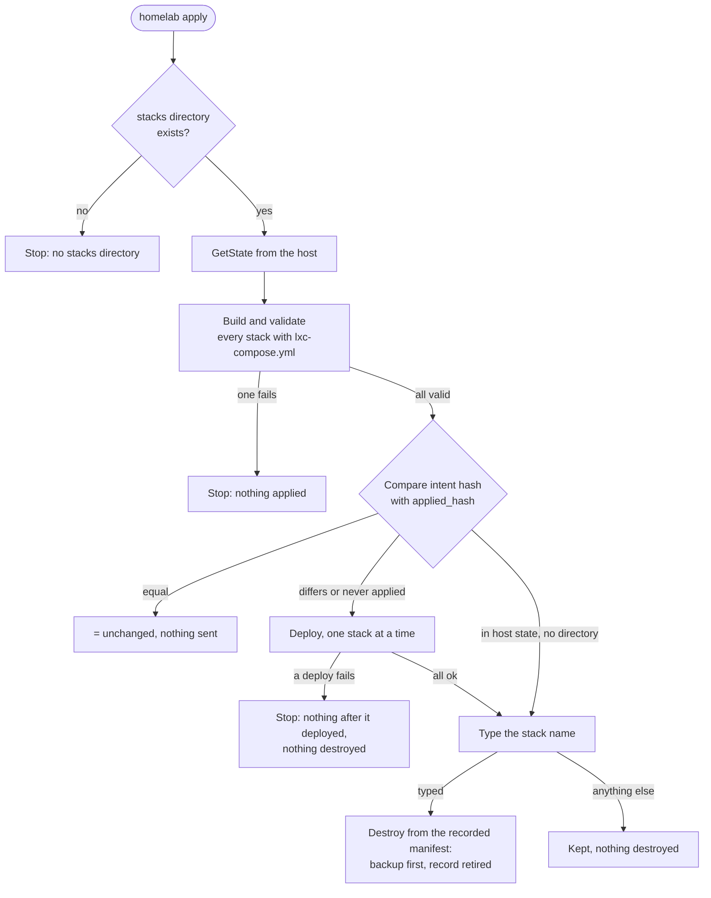

# What a stack registers, and what removes it again

T66 (Kenny, 2026-09-01): adding a stack must register it with every service
that should know; removing one must clean up everywhere; and that
completeness has to be expressed in the system rather than remembered.
step-21 and step-22 (Kenny, 2026-09-27): **what the files declare is added,
what leaves them is removed**, hand-made Uptime Kuma monitors included. Data
is the one exception: backups, `/appdata` and vault copies of anything that
left the files are kept until `homelab wipe` deletes them (ask-8, ask-9 in
[REGISTER.md](REGISTER.md)).

This table is the list a change has to be checked against. Cited at commit
`ad03664` (2026-09-27), after v3.58.10; a host running v3.58.10 or older does
not have the removals marked step-22, `apply` or `wipe`.

"Automatic?" means: happens without a typed name, as part of a deploy, a
destroy or a forget. A destroy itself always needs the stack name typed.

## The surfaces

| Surface | Added by | Removed by, and when | Automatic? | Data? |
|---|---|---|---|---|
| The container (LXC) | deploy, step `provision container` (`core/src/ops/deploy.rs:546`) | destroy, step `destroy container`, `pct destroy --purge` (`core/src/ops/destroy.rs:176-181`); also `homelab apply` for a stack whose directory is gone (`client/src/main.rs:792-827`) | No: the stack name is typed first, and a backup is taken first unless `--no-backup` (`core/src/ops/destroy.rs:58-67`, `:116-159`) | Yes: the container disk goes. Backed up first |
| Host state record (`state.json`, `stacks.<name>`) | deploy, step `record state` (`core/src/ops/deploy.rs:2596-2689`) | destroy and forget, step `update state` (`core/src/ops/destroy.rs:293-321`) | Yes, inside destroy or forget | No. A retired record replaces it (row below) |
| Traefik route `<vmid>-app-<stack>.yml` on the gateway | deploy, step `gateway route` (`core/src/ops/deploy.rs:1914-1935`) | destroy and forget, step `remove gateway route` (`core/src/ops/destroy.rs:264-287`); a deploy, step `retire gateway route`, when the stack dropped `gateway_route:` or moved to another vmid (`core/src/ops/deploy.rs:1937-1986`) | Yes | No |
| Traefik routes under a name of their own (`extra_routes`, fix-91) on the gateway | deploy, step `gateway route`, which records them in host state (`StackState.extra_route_files`) | destroy and forget, step `remove gateway route`, for the recorded files; a deploy, step `retire gateway route`, for a recorded file the stack no longer declares. A file no deploy recorded is never removed | Yes | No |
| Prometheus target file for the stack | deploy, step `metrics discovery` (`core/src/ops/deploy.rs:521-544`) | destroy and forget, step `remove metrics discovery` (`core/src/ops/destroy.rs:218-228`) | Yes | No |
| Grafana dashboard for the stack | deploy, step `grafana dashboard` (`core/src/ops/deploy.rs:1994-2046`) | destroy and forget, step `remove grafana dashboard`, run inside the gateway (`core/src/ops/destroy.rs:233-262`) | Yes | No |
| Homepage tile (`services.yaml`, rendered from all route files) | deploy, step `homepage services` (`core/src/ops/deploy.rs:2056-2060`, `core/src/ops/fleetfiles.rs:32-175`) | rewritten without the stack after destroy and forget, step `fleet files` (`core/src/ops/destroy.rs:325-330`, `core/src/ops/fleetfiles.rs:236-251`), and by every deploy once the route file is gone | Yes; a failure to write only warns (`core/src/ops/fleetfiles.rs:241-249`) | No |
| Uptime Kuma host monitor `host · <stack>` | deploy, step `uptime monitors`, writes `host-monitors.json` (`core/src/ops/deploy.rs:2076-2086`, `core/src/ops/fleetfiles.rs:183-229`); the seeder adds the monitor (`stacks/uptime/kuma-seeder/seed.py:295-302`) | destroy and forget rewrite the file (`core/src/ops/fleetfiles.rs:252-265`); the seeder removes the monitor on its next run, every `SEED_INTERVAL_SECONDS=3600` (`stacks/uptime/kuma-seeder/docker-compose.yml`, `seed.py:313-331`) | Yes, unless more than a quarter of all monitors would go at once (next section) | No |
| Uptime Kuma application monitor (`APPLICATION_MONITORS`, the `kyu` hub monitor included) | the seeder, from the list in `stacks/uptime/kuma-seeder/seed.py:57-95` | the seeder, once the entry is gone from that list; a changed address is corrected in place (`seed.py:250-256`, `:321-326`). The list is a module constant, read when the seeder process starts (`seed.py:377-399`); a deploy that changes `seed.py` restarts the seeder app (`core/src/ops/deploy.rs:1688-1714`) | Yes, same cap | No |
| Manual checks (`manual:` lines of `checks.yml`) | deploy, at its end (`core/src/ops/deploy.rs:2939-2952`, `core/src/ops/manualchecks.rs:51-74`) | a deploy drops the stack's questions that left its files (`core/src/ops/manualchecks.rs:69-74`), but only when at least one question remains, because `register` is called only then (`core/src/ops/deploy.rs:2944`); destroy and forget drop all of the stack's (`core/src/ops/destroy.rs:298`) | Yes | No |
| Intent-repo copy `/var/lib/homelab/repo/stacks/<stack>/` | deploy, step `commit intent` (`core/src/ops/deploy.rs:1192-1260`) | a file the stack dropped is removed from the copy and committed, so `git log` shows it (`core/src/ops/deploy.rs:1195-1220`). Destroy leaves the copy and its history | Yes | No |
| Files under `/opt/<stack>/` in the container | deploy, step `push files` (`core/src/ops/deploy.rs:1319`) | deploy, step `orphan files`: every file the stack no longer declares, one `rm -f` each, never a directory; `.env` files, the gateway's generated dashboard and route directories, and the files of an app that is leaving are not touched (`core/src/ops/deploy.rs:133-199`, `:2104-2143`). `homelab prune-orphans` still exists and does the same after a typed name (`client/src/main.rs:1031-1063`) | Yes (reverses D84's report-only rule) | No |
| A compose app (its containers and `/opt/<stack>/<app>/`) | deploy, step `start apps` (`core/src/ops/deploy.rs:1520`) | deploy, step `garbage collect`: `docker compose down --remove-orphans`, then `rm -rf /opt/<stack>/<app>` (`core/src/ops/deploy.rs:2145-2182`) | Yes | Its `/appdata`, repository and vault copy are kept and recorded as retired `<stack>/<app>` (`core/src/ops/deploy.rs:2630-2644`, `core/src/ops/retired.rs:106-143`) |
| `rootfs/` files: units, timers, scripts on PATH | deploy, step `push files` | deploy, step `retire dropped`: a `.service`, `.timer`, `.socket` or `.path` unit is `systemctl disable --now` first, then every dropped file is removed and systemd reloads (`core/src/ops/deploy.rs:1044-1106`, `:1181-1183`) | Yes | No |
| A native unit named in `natives:` | deploy, step `native units` (`core/src/ops/deploy.rs:2333`), or `homelab adopt` | deploy, step `retire dropped`, when the previous stack file listed it and this one does not: `systemctl disable --now`, unit file and program removed, registration dropped from state (`core/src/ops/deploy.rs:285-297`, `:1107-1180`, `:2611-2629`). A unit only `homelab adopt` registered is never retired this way (test `an_adopted_unit_the_stack_never_declared_is_not_retired`) | Yes | Its data directories in the container, its `<unit>-config` repository and its vault copies are kept, recorded as retired `<stack>/<unit>` (`core/src/ops/deploy.rs:2645-2654`, `core/src/ops/retired.rs:147-172`) |
| Mount points `mpN` | deploy, step `provision container` (`core/src/ops/deploy.rs:782-866`) | the same step detaches an `mpN` the file no longer asks for, when its host directory is one this stack declares now or declared before; a mount no version of the file named is left alone and logged (`core/src/ops/deploy.rs:782-848`) | Yes | The host directory is kept |
| Vault copies under `/var/lib/homelab/secrets/<stack>/` | deploy: each app's `.env` (`core/src/ops/deploy.rs:1443-1449`), native env and credential files (`:2475-2484`, `:2549-2552`) | only `homelab wipe` (`core/src/ops/retired.rs:432-449`) | **No, never** | Yes: secrets |
| `/appdata/<stack>/<owner>-config` directories | deploy, step `host storage` (`core/src/ops/deploy.rs:402-416`) | only `homelab wipe` | **No, never** | Yes |
| restic repositories `<owner>-config` | the first backup (`init_repository` in `core/src/ops/backup.rs`) | only `homelab wipe`, with `rclone purge` (`core/src/ops/retired.rs:408-430`) | **No, never** | Yes |
| Retired record (`state.json`, `retired.<key>`) | destroy and forget (`<stack>`, `core/src/ops/destroy.rs:299-316`); a deploy that dropped an app or unit (`<stack>/<name>`) | `homelab wipe <key>` (`core/src/ops/retired.rs:451-462`); a deploy that brings the stack, app or unit back (`core/src/ops/retired.rs:175-180`, called at `core/src/ops/deploy.rs:2634`) | Yes for a comeback, else never | No; it names data |
| Log shipper (Alloy) inside the container | deploy, step `log shipper` (`core/src/ops/deploy.rs:2202`) | goes with the container | Yes | No |
| Container metrics (cAdvisor) | the runaway guards, every managed docker host (`core/src/ops/guards.rs:36-51`) | goes with the container | Yes | No |

Outside this table, because no deploy writes them: the Prometheus jobs
`kyu` and `almanac` are written by hand in
`stacks/metrics/prometheus/prometheus.yml:21`, `:35`, so they follow that
file, not the kyu or almanac stack (REGISTER step-22 lists them).

## The Uptime Kuma seeder, in detail

Every monitor Uptime Kuma holds is declared in a file: the generated
`host-monitors.json` or `APPLICATION_MONITORS` in `seed.py`. On each run the
seeder (`seed_once`, `stacks/uptime/kuma-seeder/seed.py:274-374`):

1. adds each declared monitor whose name Kuma does not have;
2. tags every declared monitor `homelab-seeder` (`OWNER_TAG`, `seed.py:46`,
   `:317-320`);
3. corrects a monitor whose URL or hostname differs from its file entry;
4. removes every monitor no file declares, hand-made ones included (test
   `step_21_the_seeder_keeps_uptime_kuma_equal_to_the_files`,
   `core/tests/stack_files_tests.rs:538`);
5. writes its verdict to `last-seed.json`, which the fleet check reads.

Two guards stop step 4 (`plan_owned`, `seed.py:241-264`):

- Without a generated host list nothing is removed: a missing file is not an
  empty fleet (F175).
- When more than `max(3, a quarter of all monitors)` would go at once, nothing
  is removed and every undeclared monitor is reported as stale instead
  (`DELETE_CAP_FRACTION = 0.25`, `seed.py:50`, `:260-263`).

Real output of `seed_once` against a stand-in for the Kuma API (a script that
answers `get_monitors` with the 25 application monitors, twelve host monitors
and one `host · drill` no file declares, and one monitor whose address was
changed):

```text
[seed]   ~ gateway · grafana now points at http://the gateway (CT 104):3000/api/health
[seed]   - host · drill (no file declares it)
[seed] 0 added, 37 already existed, 1 corrected, 1 removed, 0 stale
```

The same, with only one host monitor declared, so twelve would go:

```text
[seed] WARN: 12 monitors to remove is more than 9; the desired list looks truncated, so nothing is removed
[seed] WARN: 'host · drill' is declared nowhere and was not removed: 12 monitors to remove is more than 9; the desired list looks truncated, so nothing is removed
...
[seed] 0 added, 26 already existed, 0 corrected, 0 removed, 12 stale
```

The stale list then reaches `homelab check` as a `drift` finding on
`uptime kuma` whose remedy points at `refused` in `last-seed.json`
(`core/src/ops/fleetcheck.rs:1045-1059`).

## What `homelab apply` does

`homelab apply [stacks/] [--no-backup]` holds the whole stacks directory
against the host (`client/src/main.rs:704-827`, plan in
`client/src/apply.rs:30-54`). It never runs by itself: the nightly round
does not destroy anything.



<sub>Source: `client/src/main.rs:704-827`, `client/src/apply.rs:30-54`, `core/src/ops/destroy.rs:414-446`.</sub>

The printed plan (`client/src/main.rs:760-779`) is one line
`▶ apply :: <n> to deploy · <m> unchanged · <k> gone from the files`, then
`  = <stack>` per unchanged stack, `  ↑ <stack>` per stack to deploy, and
`  ✗ <stack> — in host state, no <dir>/<stack>/` per stack to destroy, where
`<dir>` is the stacks directory apply read. Each
destroy asks `Type the stack name '<stack>' to destroy it: `; Enter or any
other text answers `kept <stack> — nothing destroyed`.

A stack counts as gone only when there is no directory of that name under
the stacks directory at all; a directory holding only a `service.yml` (an
adopted native service) is still there (`client/src/apply.rs:24-27`,
`:43-47`). A stack recorded without a manifest (adopted, never deployed)
cannot be destroyed this way; the host answers that there is `nothing to
destroy it from` and names `homelab forget` (`core/src/ops/destroy.rs:432-437`).

## What is kept deliberately, and how `homelab wipe` removes it

Kenny, 2026-09-27 (ask-9): backups, `/appdata` and vault copies of a
destroyed stack, and of an app or unit that left a stack, are **kept until
you decide**. Nothing automatic deletes them: not the nightly round, not a
deploy, not `apply` (`core/src/ops/retired.rs:1-15`). What makes that safe:

- The operation that retires something records what it left, in
  `state.json` under `retired` (`core/src/state.rs:158-204`): the kind
  (stack, app, native unit), vmid, date, repositories, `/appdata` paths and
  vault paths.
- `homelab check` names every entry as `noted`, which does not fail the check
  (`core/src/ops/retired.rs:190-219`, `core/src/ops/fleetcheck.rs:515-517`).
  The nightly check writes it to the daemon log, and sends it in a
  notification only together with some other finding that is not `noted`
  (`host/src/main.rs:2657-2688`).

Real output of `evaluate_retired` for the record a destroy of
`stacks/syncthing` would leave (one `storage` entry owned by `syncthing`),
printed in the format `homelab check` uses (`host/src/main.rs:3198`):

```text
  [noted] syncthing — retired 2026-09-27 (stack, vmid 108) — kept: restic syncthing-config; /appdata /appdata/syncthing/syncthing-config; vault /var/lib/homelab/secrets/syncthing
      remedy: kept on purpose until you decide (ask-9); `homelab wipe syncthing` deletes exactly these after you type the name
```

**Worked example: wipe what a destroyed stack kept.** Workstation, any
directory:

```bash
homelab wipe syncthing       # a whole stack
homelab wipe media/bazarr    # one app or native unit that left a stack
```

1. The client asks the host for the list; nothing is deleted yet
   (`client/src/main.rs:831-848`). Real output of the list for the record
   above (`WipePlan::render`, `core/src/ops/retired.rs:237-255`):

   ```text
   wipe 'syncthing' deletes, permanently:
     restic repository  syncthing-config
     /appdata directory /appdata/syncthing/syncthing-config
     vault copy         /var/lib/homelab/secrets/syncthing
   ```

   A repository or directory a managed stack still uses is listed as
   `KEPT (a managed stack still uses it)` and never deleted
   (`core/src/ops/retired.rs:293-338`). The list is refused for a name that
   is not retired (`nothing retired is recorded as '<name>'`), for a managed
   stack, and for an app or unit that is back in its stack
   (`core/src/ops/retired.rs:260-292`).
2. It asks `Type '<name>' to delete all of the above, permanently: `;
   anything else stops with `name mismatch — nothing deleted`
   (`client/src/main.rs:849-855`).
3. **Point of no return.** The host runs the operation `wipe` under the
   operation lock: steps `confirm`, `plan`, `restic repositories`
   (`rclone purge <remote>/<repo>`; refused when `restic_base` is not an
   `rclone:` remote), `appdata and vault` (`rm -rf --`), `update state`
   (the record goes last) (`core/src/ops/retired.rs:363-468`,
   `host/src/main.rs:3698-3706`). A failure stops the wipe and keeps the
   record, so it can be run again.

What a wipe does not reach: older `host-meta-config` snapshots, which carry
the vault directory as it was on each night (`backup_host_meta` in
`core/src/ops/backup.rs`), until their retention forgets them.

## Where this is enforced

| Behaviour | Test |
|---|---|
| forget unregisters what destroy unregisters | `forget_unregisters_everything_a_destroy_unregisters` (`core/tests/declarative_cleanup_tests.rs:215`) |
| destroy drops manual checks, regenerates the fleet files | `destroy_drops_the_manual_checks_and_regenerates_the_fleet_files` (`:303`) |
| a dropped route, a changed vmid | `a_stack_that_drops_its_gateway_route_loses_the_route_file`, `a_stack_that_moves_to_another_vmid_loses_the_old_route_file` (`:349`, `:372`) |
| intent repo, orphan files, rootfs units | `the_intent_repo_copy_loses_files_the_stack_no_longer_has`, `the_deploy_removes_files_the_stack_no_longer_declares`, `a_dropped_rootfs_unit_is_disabled_then_removed_then_reloaded` (`:403`, `:543`, `:609`) |
| gateway's generated files are never orphans | `generated_dashboards_on_the_gateway_are_never_orphans` (`:576`) |
| native units, mounts | `a_native_unit_dropped_from_the_stack_is_stopped_and_unregistered_with_its_data_kept`, `a_mount_the_stack_no_longer_declares_is_detached_and_its_directory_kept` (`:671`, `:784`) |
| destroy from the record, with every gate | `destroy_works_from_the_manifest_recorded_in_state`, `destroy_from_state_keeps_every_safety_gate` (`:483`, `:503`) |
| retired records, `noted`, wipe | `a_destroyed_stack_is_recorded_with_everything_it_left_behind`, `the_fleet_check_names_what_is_kept_for_every_retired_entry`, `wipe_deletes_the_repositories_directories_and_vault_then_the_record`, `wipe_refuses_without_the_typed_name_or_for_a_live_stack` (`:921`, `:1036`, `:1135`, `:1172`) |
| the apply plan | `apply_deploys_what_changed_and_offers_what_left_for_destruction` (`client/tests/apply_tests.rs:21`) |
| the seeder | `step_21_the_seeder_keeps_uptime_kuma_equal_to_the_files` (`core/tests/stack_files_tests.rs:538`) |

All 24 tests in `declarative_cleanup_tests.rs`, both in `apply_tests.rs` and
the seeder test passed on 2026-09-27 at `ad03664`.
